<div align="center">

# ibn-core

**RFC 9315 Intent-Based Networking — Production Framework**

*Natural-language business intents → network resources, autonomously.*

[](https://github.com/vpnetconsult/ibn-core/releases/tag/v2.2.0)
[](LICENSE)
[](https://github.com/vpnetconsult/ibn-core/actions)
[](https://github.com/vpnetconsult/ibn-core/pkgs/container/business-intent-agent)
[](https://www.rfc-editor.org/rfc/rfc9315)
[](docs/compliance/TMF921_CTK_RESULTS_V2_0_0.md)
[](docs/compliance/ODA_CANVAS_CTK.md)
[](docs/compliance/ODA_CANVAS_CTK.md#3-ai-native-canvas-alignment)

</div>

---

<div align="center">

</div>

---

## Why I Built This

Telecom operators routinely spend days translating a customer's intent ("I need reliable internet for working from home") into a provisioned service order. That pipeline crosses CRM, BSS, OSS, and multiple network domains, each requiring a human handoff.

RFC 9315 (IRTF NMRG, Oct 2022) formalises what IBN should look like at production scale: a *Single Source of Truth*, *One-Touch* onboarding, and *Autonomous* closed-loop lifecycle management. TMForum's TMF921 v5.0.0 gives that a concrete REST API contract.

**ibn-core** is my working implementation of those specifications — deployed on Kubernetes, backed by Redis, validated against the official TMForum Conformance Test Kit (83/83, 100%), and published as an Apache 2.0 open core.

The operator-specific CAMARA adapters (real radio/transport orchestration) live in a separate private repository and are delivered through SI engagements. This repo is the public framework: the interface contracts, the intent lifecycle engine, and the MCP seam.

---

## Architecture

```
                ┌─────────────────────────────────────────────────────────────┐
                │                        ibn-core                             │
                │                                                             │
  Customer ───► │  POST /api/v1/intent              RFC 9315 §5.1.1           │
 (natural lang) │         │                                                   │
                │         ▼                                                   │
                │  IntentHandlingCycleRunner        RFC 9315 §5 (all phases)  │
                │  ├─ INGESTING    §5.1.1  PII mask + customer context        │
                │  ├─ TRANSLATING  §5.1.2  Claude Sonnet NL → requirements    │
                │  ├─ ORCHESTRATING§5.1.3  McpAdapter → BSS offer + quote     │ ◄── private adapter
                │  ├─ MONITORING   §5.2.1  live fulfilment state              │     (CAMARA/operator)
                │  ├─ ASSESSING    §5.2.2  compliance vs intent expectations  │
                │  └─ ACTING       §5.2.3  corrective action + retry          │
                │         │                                                   │
                │         ▼                                                   │
                │  IMF Layer                                                  │
                │  ├─ KnowledgeStore        facts · measurements · decisions  │
                │  ├─ IntentHierarchy       L1 BUSINESS → L4 OPTIMISATION     │
                │  ├─ SharedStatePlane      actuation SSoT + hysteresis 120 s │
                │  └─ ConflictArbiter       propose-arbitrate-execute         │
                │         │                                                   │
                │         ▼                                                   │
                │  RedisIntentStore         SSoT/SVoT  RFC 9315 §4 P1         │
                │  TTL 90 days · AOF persistence                              │
                │         │                                                   │
                │         ▼                                                   │
                │  IntentReport             reportState: fulfilled            │
                │  TMF921 v5.0.0 compliant response                           │
                └─────────────────────────────────────────────────────────────┘
                         │
             ┌───────────┼───────────┐
             ▼           ▼           ▼
          Istio       Kubernetes   Prometheus
        (circuit)      HPA         metrics
        RFC §5.2.3   RFC §4 P3   RFC §5.2.1
```

<table>
<tr>
<td width="33%" valign="top">

**Business Layer**<br>`RFC 9315 §5.1.1`

- NL intent ingestion
- Claude Sonnet translation
- Tag + priority extraction
- Lifecycle state machine

</td>
<td width="33%" valign="top">

**Service Layer**<br>`RFC 9315 §5.1.3`

- MCP adapter orchestration
- Offer recommendation
- Bundle + discount logic
- CAMARA API dispatch

</td>
<td width="33%" valign="top">

**Resource Layer**<br>`RFC 9315 §5.2.x`

- BSS quote generation
- Redis SSoT persistence
- IntentReport creation
- Closed-loop compliance

</td>
</tr>
</table>

---

## Features

<table>
<tr>
<td width="50%" valign="top">

**RFC 9315 §4 Principle Coverage**

| Principle | Status |
|-----------|--------|
| P1 SSoT/SVoT | ✅ Redis — TTL 90 days |
| P2 One Touch | ✅ `POST /api/v1/intent/probe` |
| P3 Autonomy | ✅ Kubernetes HPA + Istio |
| P4 Learning | ✅ Claude Sonnet §5.1.2 |
| P5 Capability | ⚠️ Mock — CAMARA: v3.0 |
| P6 Abstraction | ✅ NL O2C confirmed |

</td>
<td width="50%" valign="top">

**TMF921 v5.0.0 Conformance**

| Resource | Coverage |
|----------|----------|
| Intent | CRUD + patch + filter |
| IntentSpecification | CRUD + filter |
| IntentReport | CRUD + sub-resource |
| Field projection (`?fields=`) | Always-included mandatory attrs |
| CTK score | **83 / 83 (100%)** |

</td>
</tr>
</table>

**AI Agent Layer** *(v2.1.0 — Ericsson paper BCSS-25:024439)*

| Component | Description |
|-----------|-------------|
| `IntentHandlingCycleRunner` | RFC 9315 §5 six-phase cycle executor with §5.2.3 corrective retry |
| `AgentTaxonomyLevel` | 8-level taxonomy from Ericsson paper Figure 1; `TaxonomyPolicy` governance |
| `KnowledgeStore` | Per-domain facts · measurements · decisions for closed control loop |
| `SemanticToolRegistry` | MCP semantic tool abstraction — register, look up, match capabilities |
| `ConflictArbiter` | Propose-arbitrate-execute; prevents competing-thermostats oscillation |
| `SharedStatePlane` | Authoritative actuation state + 120 s hysteresis across all domain agents |
| `IntentHierarchy` | L1 BUSINESS → L4 OPTIMISATION priority registry; business SLA always wins |

**Open Core Seam**

The `McpAdapter` interface in `src/mcp/McpAdapter.ts` is the public/private boundary. Swap in any operator adapter without touching the framework:

```typescript
interface McpAdapter {
  orchestrate(intent: ProcessedIntent): Promise<OrchestrationResult>; // RFC §5.1.3
  getIntentStatus(id: string):          Promise<IntentStatus>;         // RFC §5.2.1
  getCapabilities():                    Promise<CapabilitySet>;         // RFC §4 P5
  cancelIntent(id: string):            Promise<void>;                  // RFC §5.2.3
}
```

---

## Quick Start

### Prerequisites

- [kind](https://kind.sigs.k8s.io/) + [kubectl](https://kubernetes.io/docs/tasks/tools/) + [Helm](https://helm.sh/)
- [Istio CLI (`istioctl`)](https://istio.io/latest/docs/setup/getting-started/)
- Docker

### 1 — Clone and build

```bash
git clone https://github.com/vpnetconsult/ibn-core.git
cd ibn-core

docker build -f src/Dockerfile -t business-intent-agent:v2.1.0 src/
```

### 2 — Create cluster and deploy

```bash
kind create cluster --name local-k8s --config business-intent-agent/k8s/kind-config.yaml
kind load docker-image business-intent-agent:v2.1.0 --name local-k8s

istioctl install --set profile=demo -y
kubectl label namespace default istio-injection=enabled

kubectl apply -f business-intent-agent/k8s/
kubectl apply -f mcp-services-k8s/
```

### 3 — Verify deployment

```bash
kubectl get pods -n intent-platform
# NAME                                    READY   STATUS
# business-intent-agent-...              2/2     Running
# redis-...                              1/1     Running
```

### 4 — Run the O2C test case

```bash
kubectl port-forward -n istio-system svc/istio-ingressgateway 8080:80

curl -sX POST http://localhost:8080/api/v1/intent \
  -H 'Content-Type: application/json' \
  -d '{
    "customerId": "CUST-12345",
    "intent": "I need internet for working from home"
  }' | jq '{lifecycleStatus, reportState}'
# {
#   "lifecycleStatus": "completed",
#   "reportState":     "fulfilled"
# }
```

### 5 — TMF921 endpoint

```bash
# Create an intent via the TMF921 API
curl -sX POST http://localhost:8080/tmf-api/intentManagement/v5/intent \
  -H 'Authorization: Bearer dev-api-key-12345' \
  -H 'Content-Type: application/json' \
  -d '{"name":"Broadband for WFH","description":"Customer requires high-speed home broadband","version":"1.0","priority":"1"}'
```

---

## Standards Compliance

| Standard | Version | Role | Citation |
|----------|---------|------|----------|
| RFC 9315 | Oct 2022 | Primary IBN spec — all §4 principles | `doi:10.17487/RFC9315` |
| TMF921 Intent Management API | v5.0.0 | REST API contract — 83/83 CTK | [tmforum-apis/TMF921](https://github.com/tmforum-apis/TMF921_IntentManagement) |
| Ericsson WP BCSS-25:024439 | Oct 2025 | AI agent taxonomy + IMF closed-loop alignment | `src/imf/`, `src/a2a/` |
| CAMARA Network APIs | v0.x | Capability exposure (P5) — v3.0 target | [camaraproject.org](https://camaraproject.org) |
| MCP Protocol | 2024 | LLM ↔ tool interface seam | [modelcontextprotocol.io](https://modelcontextprotocol.io) |
| Kubernetes + Istio | 1.29 / 1.20 | P3 Autonomy — HPA + circuit breakers | — |

See [`docs/compliance/TMF921_CTK_RESULTS_V2_0_0.md`](docs/compliance/TMF921_CTK_RESULTS_V2_0_0.md) for the full CTK run log and root-cause analysis.

---

## ODA Canvas Compliance

ibn-core ships as a TM Forum ODA Component (Helm chart at `helm/ibn-core/`), targeting both the
[ODA Canvas CTK](https://github.com/tmforum-oda/oda-canvas-ctk) and the
[AI-Native Canvas design](https://github.com/tmforum-oda/oda-canvas/blob/main/AI-Native-Canvas-design.md).

### Canvas CTK Use Cases

| UC | Title | Status | Mechanism |
|----|-------|--------|-----------|
| UC001 | Identity Bootstrap | ✅ Declared | `security.controllerRole: ibn-core-role` |
| UC002 | Expose API | ✅ Declared | `coreFunction.exposedAPIs` → TMF921 at `/tmf-api/intentManagement/v5` |
| UC004/005 | Observability | ✅ Declared | `management.exposedAPIs` → Prometheus at `/metrics` |

### AI-Native Canvas Alignment

ibn-core is an AI-native component by design — MCP tool exposure, Claude Sonnet dependency, A2A agent card, and evaluation dataset are all declared in the ODA Component CRD.

| Concept | Implementation |
|---------|----------------|
| MCP interfaces | `src/mcp/McpAdapter.ts` — 4 orchestration tools |
| `dependentModels` | Claude Sonnet 4 (`src/claude-client.ts`) |
| A2A agent card | `src/a2a/agent.ts` + `src/a2a/taxonomy.ts` |
| Evaluation dataset | [`docs/compliance/O2C_EVALUATION.md`](docs/compliance/O2C_EVALUATION.md) |

### Helm install on a Canvas cluster

```bash
# Canvas deploy (api-operator-istio manages routing)
helm install ibn-core ./helm/ibn-core \
  --namespace components --create-namespace \
  --set secrets.anthropicApiKey="$ANTHROPIC_API_KEY" \
  --set secrets.adminSecret="$ADMIN_SECRET" \
  --set secrets.piiHashSalt="$PII_HASH_SALT" \
  --set istio.enabled=false

# Standalone deploy (own Istio)
helm install ibn-core ./helm/ibn-core \
  --namespace intent-platform --create-namespace \
  --set namespace=intent-platform \
  --set secrets.anthropicApiKey="$ANTHROPIC_API_KEY" \
  --set secrets.adminSecret="$ADMIN_SECRET" \
  --set secrets.piiHashSalt="$PII_HASH_SALT"
```

Full compliance mapping: [`docs/compliance/ODA_CANVAS_CTK.md`](docs/compliance/ODA_CANVAS_CTK.md)

**Published test results (TM Forum ODA Canvas submission-grade):**
[`docs/compliance/ODA_CANVAS_PUBLISHED_RESULTS.md`](docs/compliance/ODA_CANVAS_PUBLISHED_RESULTS.md)

---

## Repository Layout

```
ibn-core/
├── src/
│   ├── imf/                           ← RFC 9315 §5 intent management functions
│   │   ├── IntentHandlingCycle.ts     ← §5 phase enum + trace record
│   │   ├── IntentHandlingCycleRunner.ts ← six-phase cycle executor + retry
│   │   ├── IntentHandlingContext.ts   ← per-phase immutable context
│   │   ├── KnowledgeStore.ts          ← closed-loop knowledge + measurements
│   │   ├── IntentHierarchy.ts         ← L1–L4 priority registry
│   │   ├── SharedStatePlane.ts        ← actuation state + 120 s hysteresis
│   │   └── ConflictArbiter.ts         ← propose-arbitrate-execute
│   ├── a2a/
│   │   └── taxonomy.ts                ← Ericsson paper Figure 1 taxonomy (8 levels)
│   ├── mcp/
│   │   ├── McpAdapter.ts              ← Open Core Seam (Apache 2.0 interface)
│   │   └── SemanticToolRegistry.ts    ← MCP semantic tool abstraction
│   ├── tmf921/routes.ts               ← TMF921 v5 REST routes (83/83 CTK)
│   ├── middleware/                    ← Auth, PII masking, security
│   └── store/                         ← RedisIntentStore — SSoT (RFC §4 P1)
├── business-intent-agent/k8s/         ← Kubernetes + Istio manifests
├── mcp-services-k8s/                  ← MCP sidecar manifests
├── docs/
│   ├── compliance/                    ← CTK results (v1.3 → v2.0.1)
│   ├── architecture/                  ← C4 diagrams, deployment summary
│   └── standards/                     ← RFC 9315 traceability matrix
└── encryption/                        ← Encryption-at-rest utilities
```

---

## Version History

| Tag | Description |
|-----|-------------|
| [`v1.4.0`](https://github.com/vpnetconsult/ibn-core/releases/tag/v1.4.0) | RFC 9315 IBN baseline — Paper 1 empirical start. 47/83 CTK. |
| [`v1.4.1`](https://github.com/vpnetconsult/ibn-core/releases/tag/v1.4.1) | Apache 2.0 open core — operator adapters separated. |
| [`v1.4.2`](https://github.com/vpnetconsult/ibn-core/releases/tag/v1.4.2) | Clean MCP boundary — private repo split. |
| [`v1.4.3`](https://github.com/vpnetconsult/ibn-core/releases/tag/v1.4.3) | O2C verification — MCP auth, TMF921 response shape, Istio TLS egress. *Paper 1 cited release.* |
| [`v2.0.0`](https://github.com/vpnetconsult/ibn-core/releases/tag/v2.0.0) | Redis SSoT + ProbeIntent — RFC §4 P1 + P2 closed. |
| [`v2.0.1`](https://github.com/vpnetconsult/ibn-core/releases/tag/v2.0.1) | **100% TMF921 CTK (83/83)** — IntentReport projection fix + CTK runbook. |
| `v2.1.0` | **Ericsson AI-agent alignment + thermostat arbitration.** RFC 9315 §5 cycle runner, agent taxonomy, IMF knowledge store, semantic tool registry, `ConflictArbiter` + `SharedStatePlane`. |

---

## Citation

If you use this framework in research, please cite:

```bibtex
@misc{pfeifer2026ibncore,
  author       = {Pfeifer, R.},
  title        = {{ibn-core: RFC 9315 Intent-Based Networking Production Implementation}},
  year         = {2026},
  publisher    = {GitHub},
  howpublished = {\url{https://github.com/vpnetconsult/ibn-core}},
  note         = {Version v2.1.0. Apache License 2.0.
                  Implements RFC~9315 (IRTF NMRG) and TMF921 Intent Management API v5.0.0.
                  83/83 TMForum Conformance Test Kit (100\%).}
}
```

---

## Contributing

This is an open-core framework. Contributions to the public layer (interface definitions, RFC traceability, test tooling, docs) are welcome via pull request.

Operator-specific CAMARA adapters are out of scope for this repository.

See [`CLAUDE.md`](CLAUDE.md) for architecture constraints and licensing rules before contributing.

---

<div align="center">

**Vpnet Cloud Solutions Sdn. Bhd.** · Apache 2.0 · 2026

*Implements [RFC 9315](https://www.rfc-editor.org/rfc/rfc9315) · [TMF921 v5.0.0](https://github.com/tmforum-apis/TMF921_IntentManagement) · [CAMARA](https://camaraproject.org)*

</div>
