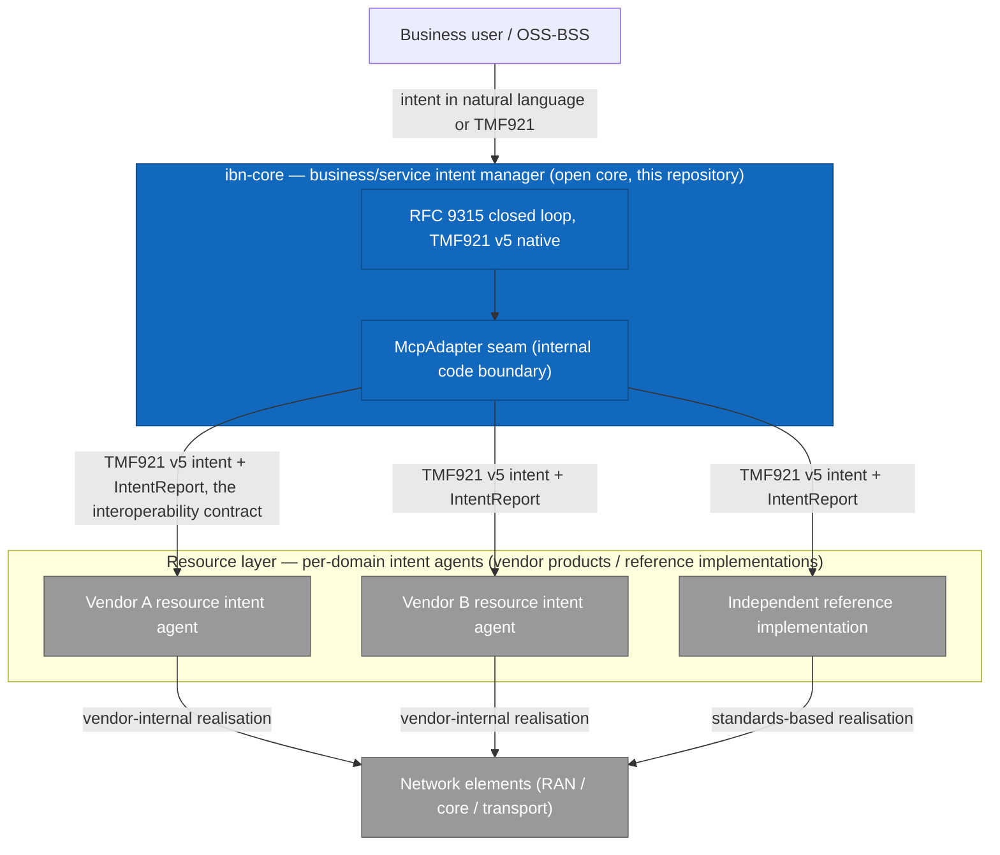

# Intent Layering and Resource-Domain Interoperability

**Status**: Draft for publication · **Audience**: operators, network vendors, integrators evaluating ibn-core
**Scope**: how ibn-core fits into a multi-layer, multi-vendor intent-based networking architecture, and the interfaces a resource-domain intent agent uses to interoperate with it.

---

## 1. One loop, instantiated per layer

RFC 9315 (IRTF NMRG) defines intent-based networking as a **closed control loop** — ingest → translate → orchestrate → monitor → assess → act — that applies **recursively across abstraction levels**: intents decompose downward, fulfilment reports aggregate upward. TM Forum's Autonomous Networks work structures the same idea as a **hierarchy of intent managers** — business, service, and resource — connected by standardised intent interfaces (TM Forum IG1253, *Intent in Autonomous Networks*; cited by reference).

ibn-core implements this loop at the **business/service layer**:

- Natural-language or API intent in, **TMF921 v5.0.0** intent objects throughout (100% CTK conformance, 83/83).
- Translation, orchestration, and assessment for business/service-level outcomes.
- `IntentReport` generation with RFC 9315-conformant lifecycle and `reportState` semantics.

The **resource layer** — where intents become network-element configuration — is instantiated **per domain, typically inside each network vendor's own product**. This is by design, and it is what the standards anticipate: 3GPP TS 28.312 expresses resource-level intent through the vendor's management system, and the TM Forum hierarchy assumes intent managers from different suppliers interoperating through the intent interface, not through shared internals.

## 2. Three kinds of interoperability — don't conflate them

| Boundary | Standard | What it guarantees | Who implements it |
|----------|----------|--------------------|-------------------|
| **Semantic** | TMF921 v5 (service→resource intent interface); 3GPP TS 28.312 within the 3GPP management domain | What an intent, its lifecycle, and its report *mean* between intent managers from different suppliers | Every intent manager in the hierarchy |
| **Runtime** | TM Forum ODA (component model + Canvas) | That components are uniformly deployable, discoverable, secured, and observable in a shared Canvas | Every ODA component, ibn-core included |
| **Code seam** | `src/mcp/McpAdapter.ts` (MCP protocol, MIT; interface Apache-2.0) | ibn-core's internal binding to whatever sits southbound — adapter implementations are pluggable | ibn-core adapters only |

The practical consequence: **a vendor never implements ibn-core's `McpAdapter`** — that is our internal seam. A vendor's resource agent interoperates by **accepting TMF921 v5 intents and returning IntentReports** (and, in 3GPP domains, by consuming TS 28.312 expectations through its own management services). ODA then ensures the vendor's component and ibn-core can share a Canvas without bespoke integration. A useful shorthand: **inter-agent = TMF921; agent-to-system = MCP.**

## 3. The boundary contract in detail

A resource-domain intent agent interoperating with ibn-core supports:

### 3.1 Intent submission (TMF921 v5)

- `POST /intent` with a TMF921 v5 intent whose expectations target resource-domain outcomes.
- Synchronous acknowledgement with `lifecycleStatus: acknowledged`; the intent identifier is the correlation key for the entire exchange.
- Machine-to-machine only at this boundary — no natural-language payloads cross it (NL intake is a business-layer concern handled by ibn-core).

### 3.2 Lifecycle and reporting

- Lifecycle progression per TMF921 (`acknowledged → inProgress → completed | failed`), queryable via `GET /intent/{id}`.
- **IntentReports** carrying RFC 9315 §5.2.2 compliance-assessment semantics: `reportState: fulfilled` only when observed state satisfies the expectation — not when configuration was merely pushed. Degradation after fulfilment produces updated reports (the loop stays closed).
- `DELETE /intent/{id}` withdraws the intent; the agent is responsible for safe de-realisation in its domain.

### 3.3 Capability exposure (RFC 9315 Principle 5)

Before delegating, an upstream intent manager must be able to ask *what the agent can accept intents about*. The agent exposes its capability set — supported expectation types, target object classes, and value ranges — so that decomposition is negotiated, not guessed. ibn-core treats absent or stale capability data as "do not delegate".

### 3.4 Conformance expectations

- TMF921 v5 CTK conformance on the intent interface (ibn-core publishes its own 83/83 CTK results; we recommend vendors do likewise for the resource side of the boundary).
- ODA component conformance for Canvas deployment (identity, API exposure, observability per ODA Canvas use cases).

For integration testing against ibn-core without a real resource agent, the repository ships mock adapters (see `src/mcp/McpAdapter.ts` and its mock implementation) that exercise this contract end to end.

## 4. How the resource layer works (in brief)

A resource-domain intent agent receives TMF921 intents at the service→resource boundary, translates them into 3GPP TS 28.312 intent expectations (or equivalent domain models), realises them against the vendor's management plane, continuously observes the resulting state, and reports fulfilment upward — **the same RFC 9315 loop, instantiated for the resource domain**. Implementations differ in their internal knowledge representation, southbound protocols, and assurance methods; those internals are deliberately *not* part of the interoperability contract, which is exactly what allows each vendor to embed its own agent. The architecture is designed to interoperate with emerging IETF work on knowledge-graph-based representations of YANG-modelled network state (IETF NMOP working group direction).

A **reference implementation** of a resource-domain intent agent — covering TMF921→TS 28.312 translation, standards-based realisation, and closed-loop assessment — is available through Vpnet Cloud Solutions system-integration engagements, for estates where a vendor-native agent is not (yet) available and as the multi-vendor assurance layer above vendor-native agents.

## 5. References

| Reference | Role | Licence/citation |
|-----------|------|------------------|
| RFC 9315 (IRTF NMRG) | IBN concepts and the per-layer loop | DOI 10.17487/RFC9315 |
| RFC 7575, RFC 8309 | Autonomic networking; service vs network models | IETF |
| TMF921 v5.0.0 Intent Management API | The semantic interoperability contract | Apache 2.0 (tmforum-apis) |
| TM Forum IG1253 / IG1251 / IG1230 | Intent-manager hierarchy; AN reference architecture | TM Forum proprietary — cited by reference only |
| 3GPP TS 28.312 | Resource-layer intent expression in the 3GPP domain | 3GPP |
| TM Forum ODA / Canvas | Runtime interoperability | TM Forum |
| MCP protocol | ibn-core's internal adapter seam | MIT |

---

*Copyright 2026 Vpnet Cloud Solutions Sdn. Bhd. — Licensed under the Apache License, Version 2.0. This document describes interfaces and architecture concepts; it does not describe any specific resource-agent implementation.*
