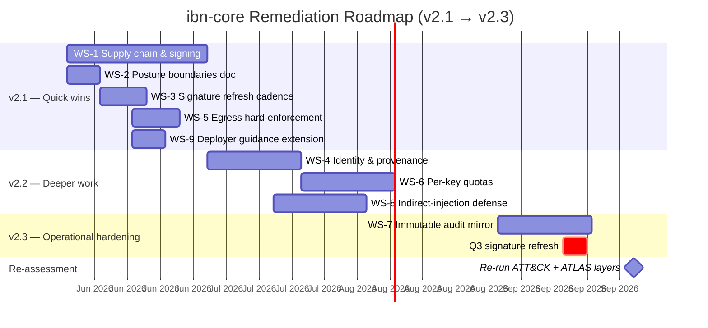

# ibn-core — ATT&CK / ATLAS Remediation Plan

| Field | Value |
|-------|-------|
| Document | `docs/security/REMEDIATION_PLAN.md` |
| Subject | ibn-core v2.0.1 (Helm chart 2.2.0) — Apache 2.0 open core |
| Version | 1.0 |
| Date | 2026-05-28 |
| Owner | Vpnet Cloud Solutions Sdn. Bhd. — Security working group |
| Source assessments | `ibn-core_attack_assessment.docx` · `ibn-core_atlas_assessment.docx` |
| Re-assessment cadence | Quarterly, and on any change to the AI Gateway, McpAdapter, auth surface, OTel pipeline or Helm chart |

This plan closes every `Open` finding from the MITRE ATT&CK Enterprise and MITRE ATLAS assessments, and folds in the high-value `PartiallyMitigated` improvements named in the recommendation sections of those assessments. It is a living document: status checkboxes are updated as workstreams ship.

---

## 1 · Executive summary

Eleven techniques were scored `Open` across the two assessments — four in ATT&CK Enterprise and seven in ATLAS. The grouping by root cause is much tighter than the count suggests:

| Root cause | Open count | Closes by |
|------------|-----------|-----------|
| **A.** Supply chain integrity (no signed images, no SBOM) | 4 | Single engineering initiative — **WS-1** |
| **B.** Architectural N/A — needs formal declaration | 6 | Single documentation deliverable — **WS-2** |
| **C.** Adversary-side, requires continuous defense | 1 | Operational cadence — **WS-3** |
| **Total** | **11** | **3 workstreams** |

Closing those three workstreams takes the residual-risk picture to zero `Open` items across both frameworks. The remainder of the plan (WS-4 through WS-9) addresses the high-value `PartiallyMitigated` items identified in the prior assessments' recommendation sections — these are not mandatory to close `Open`, but they materially improve the posture against indirect prompt injection, exfiltration over web service, denial of wallet, and audit-trail tamper.

**After full execution, expected posture:**

| Framework | Today | After plan |
|-----------|-------|-----------|
| ATT&CK Enterprise (50 techniques) | 8 / 38 / 4 (M / P / O) | ~13 / ~37 / 0 |
| MITRE ATLAS (39 techniques) | 11 / 21 / 7 (M / P / O) | ~16 / ~17 / 0 (incl. 6 documented N/A) |

---

## 2 · Consolidated findings (all Open + load-bearing Partial)

### 2.1 Open — must close

| ID | Framework | Name | Root cause | Closed by |
|----|-----------|------|------------|-----------|
| T1195 | ATT&CK | Supply Chain Compromise | No SBOM; npm/Anthropic SDK chain unverified | **WS-1** |
| T1525 | ATT&CK | Implant Internal Image | No image signing or admission verification | **WS-1** |
| T1204.003 | ATT&CK | Malicious Image | Same as T1525 | **WS-1** |
| AML.T0010.001 | ATLAS | AI Software (supply chain) | Same as T1195 | **WS-1** |
| T1648 | ATT&CK | Serverless Execution | N/A — k8s deployment, not FaaS | **WS-2** |
| AML.T0020 | ATLAS | Poison Training Data | N/A — ibn-core does not train | **WS-2** |
| AML.T0024.002 | ATLAS | Extract AI Model | N/A — model hosted by Anthropic | **WS-2** |
| AML.T0011 | ATLAS | User Execution | N/A — no user-supplied AI artefacts | **WS-2** |
| AML.T0048.004 | ATLAS | AI Intellectual Property Theft | Out of scope — open-source by design | **WS-2** |
| AML.T0000.002 | ATLAS | Technical Blogs | Out of scope — public architecture intentional | **WS-2** |
| AML.T0017.000 | ATLAS | Adversarial AI Attacks | Adversary-side; defence is continuous | **WS-3** |

### 2.2 Partially Mitigated — high-value improvements

| ID | Framework | Name | Improved by |
|----|-----------|------|-------------|
| T1041, T1071.001, T1567 | ATT&CK | Exfiltration Over Web Service & C2 | **WS-5** |
| AML.T0025 | ATLAS | Exfiltration via Cyber Means | **WS-5** |
| T1499 | ATT&CK | Endpoint Denial of Service | **WS-6** |
| AML.T0029, T0034, T0046 | ATLAS | DoS / Cost Harvesting / Chaff | **WS-6** |
| T1562.008 | ATT&CK | Disable or Modify Cloud Logs | **WS-7** |
| T1036, T1199 | ATT&CK | Masquerading / Trusted Relationship | **WS-4** |
| AML.T0051 (residual) | ATLAS | LLM Prompt Injection (signature drift) | **WS-3** |
| AML.T0051.001 | ATLAS | Indirect LLM Prompt Injection | **WS-8** |
| AML.T0068 | ATLAS | LLM Prompt Obfuscation | **WS-3** |
| AML.T0066 | ATLAS | LLM Trusted Output Manipulation | **WS-9** |

---

## 3 · Workstreams

Status legend: `⬜ planned` · `🟨 in progress` · `🟩 shipped` · `⬛ deferred`

### WS-1 — Supply Chain & Image Provenance ⬜

> **Closes:** T1195, T1525, T1204.003, AML.T0010.001 (4 Open) · **Effort:** L · **Target release:** v2.1

**Why this matters.** Today the chart and the container image are distributed without cryptographic provenance. An attacker who pushes a tampered image to the operator's registry — or who compromises an npm dependency — can land inside the trust boundary with no signal.

**Deliverables.**

1. **CycloneDX SBOM** generated by CI for every image build and every Helm release; published as a release asset and referenced from `NOTICE`.
2. **Image signing** via Sigstore cosign: every container image we publish is signed with a key whose public half is committed to the repo (transparency log via Rekor; key managed via Sigstore Fulcio for keyless mode where the operator permits).
3. **Helm chart signing** via `helm package --sign` (or cosign for OCI charts), with the public key shipped in `helm/ibn-core/KEYS`.
4. **Admission policy template** (Kyverno or Sigstore policy-controller) shipped in `helm/ibn-core/templates/admission/` that the operator can opt into to enforce signature verification at admission time.
5. **CI gates** that block release if SBOM generation fails, if any dependency has an open CVSS ≥ 7 vulnerability without a documented mitigation, or if signing fails.
6. **Public attestation document** at `docs/security/SUPPLY_CHAIN.md` describing the trust chain, the verification commands an operator runs, and the response procedure if a key is lost or rotated.

**Acceptance criteria.**

- `docker pull` followed by `cosign verify` against the published key succeeds for every released image tag.
- `helm verify ibn-core-X.Y.Z.tgz` succeeds against the published key.
- The CycloneDX SBOM for the latest release is downloadable from the GitHub release page; it lists every direct and transitive npm dependency with version and licence.
- The admission policy template, when applied to a Canvas cluster, blocks an unsigned ibn-core image from running.
- ATT&CK assessment is re-scored: T1195, T1525, T1204.003 move from `Open` to at least `PartiallyMitigated` (likely `Mitigated`).
- ATLAS assessment is re-scored: AML.T0010.001 moves from `Open` to at least `PartiallyMitigated`.

**Dependencies.** None. Can ship independently.

---

### WS-2 — Posture Boundaries Document ⬜

> **Closes:** T1648; AML.T0020, T0024.002, T0011, T0048.004, T0000.002 (6 Open, all N/A) · **Effort:** S · **Target release:** v2.1

**Why this matters.** Six of the eleven Open findings are not actually gaps — they are techniques in the published catalogues that do not apply to ibn-core's architecture (we don't train models, we don't load user artefacts, the model is hosted by a third party, the architecture is open source by design). Until that "intentional N/A" is recorded as a formal posture statement, every future auditor will re-flag these items.

**Deliverable.** A single document, `docs/security/POSTURE_BOUNDARIES.md`, that declares each architectural boundary explicitly and cites the source assessment. The document covers:

1. **Training-data boundary.** ibn-core does not train, fine-tune, or otherwise modify the underlying model. Claude is invoked as a hosted inference endpoint. Training-data integrity, model extraction risk, and model weights confidentiality are Anthropic's responsibilities. *Closes AML.T0020, AML.T0024.002.*
2. **Artefact boundary.** ibn-core does not accept user-supplied model artefacts, datasets, embeddings, or RAG indexes. There is no upload surface. *Closes AML.T0011.*
3. **Runtime boundary.** ibn-core targets Kubernetes via the published Helm chart. It is not designed for, tested on, or supported in serverless / FaaS runtimes. An operator who containerises ibn-core into a FaaS environment is outside the supported configuration and must perform their own assessment. *Closes T1648.*
4. **Open-source disclosure boundary.** The framework, the AI Gateway controls, the LLM scaffold patterns and the architecture are all published under Apache 2.0. Knowledge of the controls is not a defence; the controls remain effective when their design is public. The choice to publish is intentional and reflects the regulatory and transparency posture (EU AI Act Art. 50 / Art. 13). *Closes AML.T0048.004, AML.T0000.002.*

**Acceptance criteria.**

- File exists at `docs/security/POSTURE_BOUNDARIES.md` and is linked from `SECURITY.md`.
- Every Open finding listed above is cited in the document with the technique ID and the rationale.
- The Navigator layer JSONs are updated to mark these techniques with a `score: -1` (Navigator "out of scope") and an explanation in the comment field, OR retained at score 20 with the comment explicitly pointing to this document — both representations are acceptable.

**Dependencies.** None.

---

### WS-3 — Signature & Threat-Intel Refresh Cadence ⬜

> **Closes:** AML.T0017.000 (1 Open) · **Improves:** AML.T0051, AML.T0068 (Partial) · **Effort:** S initial + ongoing · **Target release:** v2.1 + quarterly thereafter

**Why this matters.** Adversaries develop new prompt-injection and jailbreak payloads continuously. The regex signature engine that backs the AI Gateway's prompt-injection control is only as good as its last refresh. AML.T0017.000 (Adversarial AI Attacks) is not closable as a one-shot — the only sensible response is an operational cadence.

**Deliverables.**

1. **Quarterly refresh SOP** at `docs/security/PROMPT_INJECTION_REFRESH.md` describing: which corpora are reviewed (OWASP LLM01 reference set, new ATLAS case studies via case_study_lookup once the MCP server's v1.1.x ships, prompt-injection research publications), who runs the review, where the change ticket lives, the test method (replay the four-scenario harness plus the new payloads against the gateway).
2. **Versioned signature pack** at `src/ai-gateway/signatures/v202604.json` (and onwards), so the engine version is traceable in trace attributes (`ai_gateway.signature_version`).
3. **First refresh** executed against the 2026-Q2 OWASP LLM01 corpus and the published ATLAS case studies, producing `v202604.json` as the baseline.

**Acceptance criteria.**

- SOP document exists and names an owner.
- A signature pack version is emitted as a span attribute on every gateway event.
- The first quarterly refresh is committed to the repo with a release note.
- ATLAS assessment is re-scored: AML.T0017.000 moves to `Mitigated` (operational cadence is the realised mitigation); AML.T0051 and T0068 move from `PartiallyMitigated` toward `Mitigated` as the corpus broadens.

**Dependencies.** None for the first cadence cycle; benefits from WS-8 if it ships first.

---

### WS-4 — End-to-End Identity & Provenance ⬜

> **Improves:** T1036, T1199 (Partial) · **Effort:** M · **Target release:** v2.2

**Why this matters.** Today the requester `SessionContext` is not threaded through MCP calls — gateway decisions and provenance attribution are tied to a service-account identity rather than to the specific principal that made the request. This is a known follow-up flagged in the UC006 Phase-1 trace caveats. It also blocks WS-6 (per-key quotas need accurate attribution).

**Deliverables.**

1. Extend `McpAdapter.orchestrate()` (and the three peers) to accept a `SessionContext` parameter that carries the resolved principal (api-key name → role, or JWT subject).
2. Thread the context through every back-end call so that MCP servers see it in the request headers (or in a context-bag standardised across our adapters).
3. Add `ai_gateway.principal` and `mcp.principal` to span attributes; remove the service-account fallback.
4. Update the four-scenario harness to assert principal attribution on every span.

**Acceptance criteria.**

- Scenario C (tool-policy deny) trace shows the offending principal in `ai_gateway.principal`.
- A unit test fails if `McpAdapter.orchestrate` is called without a `SessionContext`.
- ATT&CK assessment is re-scored: T1036 and T1199 move toward `Mitigated`.

**Dependencies.** None.

---

### WS-5 — Egress Hard-Enforcement ⬜

> **Improves:** T1041, T1071.001, T1567, AML.T0025 (Partial) · **Effort:** S · **Target release:** v2.1

**Why this matters.** The current chart ships Istio egress templates but does not hard-enforce them — an operator who skips the optional NetworkPolicy or AuthorizationPolicy leaves a wide egress surface. For an LLM-using system, the egress surface is the exfiltration surface.

**Deliverables.**

1. Promote the Istio Sidecar + AuthorizationPolicy templates from `optional` to `default-on` in `values.yaml`.
2. Hard-restrict pod egress at install time to the allowlist: `api.anthropic.com:443`, the configured OTLP backend hostname, the configured Keycloak issuer hostname, and the in-cluster MCP back-end services. Anything else is denied.
3. Document the opt-out (operator can disable, but must explicitly set `egress.hardEnforce: false` with a values comment recording the operator's reason).

**Acceptance criteria.**

- A fresh chart install produces a `Sidecar` and `AuthorizationPolicy` that deny egress to any hostname not on the allowlist.
- A smoke test that attempts to call `https://example.com/` from inside the pod fails.
- The operator deployer guide names this default and the opt-out procedure.

**Dependencies.** None.

---

### WS-6 — Per-Key Quotas & Budgets ⬜

> **Improves:** T1499 (Partial); AML.T0029, T0034, T0046 (Partial) · **Effort:** M · **Target release:** v2.2

**Why this matters.** A legitimate-but-abusive caller (compromised api-key, runaway client) can pass the AI Gateway and burn LLM tokens. The architectural cost protection (max_tokens cap, AI-Gateway short-circuit on refusal) is good but does not bound a high-rate flood from an authorised principal.

**Deliverables.**

1. Add a `quota` field to the api-key / role registry: `requestsPerMinute`, `tokensPerDay`, `concurrentRequests`. Defaults shipped per role.
2. Enforce in the AI Gateway: reject with HTTP 429 when a quota is exceeded; emit `ai_gateway.quota.exceeded` events.
3. Surface quota state as Prometheus metrics (`ai_gateway_quota_tokens_remaining{principal=…}` and similar).
4. Document operator-side override pattern (per-tenant or per-key custom quotas).

**Acceptance criteria.**

- A load test that exceeds a key's `requestsPerMinute` produces 429 responses with `ai_gateway.quota.exceeded` events.
- A token-budget exhaustion test stops LLM invocations until the next day's reset.
- Prometheus scrape shows per-key quota remaining.
- ATT&CK assessment is re-scored: T1499 moves toward `Mitigated`. ATLAS assessment: AML.T0029, T0034, T0046 move toward `Mitigated`.

**Dependencies.** WS-4 (needs accurate principal attribution to bill quotas correctly).

---

### WS-7 — Immutable Audit-Log Mirror ⬜

> **Improves:** T1562.008 (Partial) · **Effort:** M · **Target release:** v2.3

**Why this matters.** Today OTel traces export to one backend (LangSmith EU by default). A compromise of that backend, or a network partition during an attack, could lose the audit record of the attack itself.

**Deliverables.**

1. Add an optional second OTLP exporter that targets a WORM-capable sink: S3-style object storage with object-lock, or an append-only ledger.
2. Ship a reference exporter for S3 with object-lock in `src/telemetry/`.
3. Default disabled (operator opt-in); document in the deployer guide.

**Acceptance criteria.**

- Operator can enable the mirror via `values.yaml`.
- Spans written to the mirror cannot be deleted by the writing service account (object-lock or equivalent).
- ATT&CK assessment: T1562.008 moves to `Mitigated` for operators who enable the mirror.

**Dependencies.** None. Can ship after v2.2 to benefit from any v2.2 trace-attribute changes.

---

### WS-8 — Indirect-Prompt-Injection Defense ⬜

> **Improves:** AML.T0051.001 (Partial) · **Effort:** M · **Target release:** v2.2

**Why this matters.** AML.T0051.001 (Indirect LLM Prompt Injection) is the highest-residual LLM-specific technique. A malicious MCP back-end response could embed instructions inside an allowlisted field that DLP does not flag. The prompt builder concatenates the response into the LLM context without distinguishing trusted scaffold from attacker-controllable content.

**Deliverables.**

1. Add explicit content-type tagging on MCP response fields: trusted / untrusted / mixed.
2. Wrap untrusted content in an untrusted-content sentinel pattern (e.g., `<<UNTRUSTED:start>>…<<UNTRUSTED:end>>`) before adding it to the prompt.
3. Augment the analyzeIntent and generateOffer scaffolds with an instruction not to follow instructions inside `UNTRUSTED` sections.
4. Add a scenario to the harness — Scenario E — that injects a prompt-injection payload inside an allowlisted MCP field and asserts the model does not act on it.

**Acceptance criteria.**

- Scenario E passes: model output is the expected JSON regardless of the embedded injection.
- ATLAS assessment: AML.T0051.001 moves from `PartiallyMitigated` toward `Mitigated`.

**Dependencies.** Benefits from WS-4 (principal attribution helps decide trust at the MCP-tool level).

---

### WS-9 — Operator (Deployer) Guidance Extension ⬜

> **Improves:** AML.T0066 (Partial) · **Effort:** S · **Target release:** v2.1

**Why this matters.** AML.T0066 (LLM Trusted Output Manipulation) is bounded by the strict JSON schema, but the actual harm — e.g., a model coerced into inflating a discount — is caught only by operator-side BSS pricing guardrails. That responsibility must be documented in the deployer guide so an operator does not assume ibn-core catches it.

**Deliverables.**

1. Extend `docs/whitepapers/ibn-core_whitepaper.docx` Part C (deployer guidance) with an "output-validation responsibilities" section.
2. Add example pricing-sanity-check pseudocode for a BSS integration.
3. Cross-reference from `docs/security/SECURITY.md`.

**Acceptance criteria.**

- Whitepaper Section 16 names the operator-side responsibility explicitly, with examples.
- SECURITY.md links to the section.
- ATLAS assessment: AML.T0066 moves toward `Mitigated` for operators who follow the guidance.

**Dependencies.** None.

---

## 4 · Sequencing

Release alignment:

| Release | Workstreams | Open findings closed | Posture target |
|---------|-------------|---------------------|---------------|
| **v2.1** | WS-1, WS-2, WS-3, WS-5, WS-9 | All 11 Open | ATT&CK: 0 Open · ATLAS: 0 Open (6 documented N/A) |
| **v2.2** | WS-4, WS-6, WS-8 | — | Reduces Partial count by ~6 |
| **v2.3** | WS-7 + Q3 signature refresh | — | Reduces Partial count by ~2; first re-assessment cycle |

---

## 5 · Re-assessment

A re-assessment is triggered by any of:

- A workstream landing on `main` (re-score affected techniques).
- A new ATT&CK or ATLAS release (re-run against the new catalogue).
- A change to the AI Gateway, McpAdapter interface, auth surface, OTel pipeline, or Helm chart.
- Every quarter (calendar gate, independent of changes), aligned with the signature refresh cadence in WS-3.

The re-assessment artefacts to regenerate:

- `docs/security/ibn-core_attack_layer.json` and `ibn-core_attack_heatmap.html`
- `docs/security/ibn-core_atlas_layer.json` and `ibn-core_atlas_heatmap.html`
- `docs/security/ibn-core_attack_assessment.docx` and `ibn-core_atlas_assessment.docx`
- A row appended to the document-control table in `ibn-core_whitepaper.docx`

---

## 6 · Cross-references

- `docs/security/ibn-core_attack_assessment.docx` — ATT&CK Enterprise assessment v1.0.
- `docs/security/ibn-core_atlas_assessment.docx` — MITRE ATLAS assessment v1.0.
- `docs/security/SECURITY.md` — top-level security posture.
- `docs/security/DPIA.md` — data-protection impact assessment.
- `docs/security/INCIDENT_RESPONSE.md` — incident response runbook.
- `docs/whitepapers/ibn-core_whitepaper.docx` — solution + EU AI Act compliance whitepaper.
- `docs/compliance/UC006_ODA_CANVAS_IMPLEMENTATION.html` — ODA Canvas implementation view (names the controls cited above).
- `CLAUDE.md` — project intelligence; commit-message convention for traceability.

---

## 7 · Document history

| Version | Date | Author | Changes |
|---------|------|--------|---------|
| 1.0 | 2026-05-28 | Vpnet Cloud Solutions | Initial plan covering ATT&CK + ATLAS assessment v1.0 findings. |
