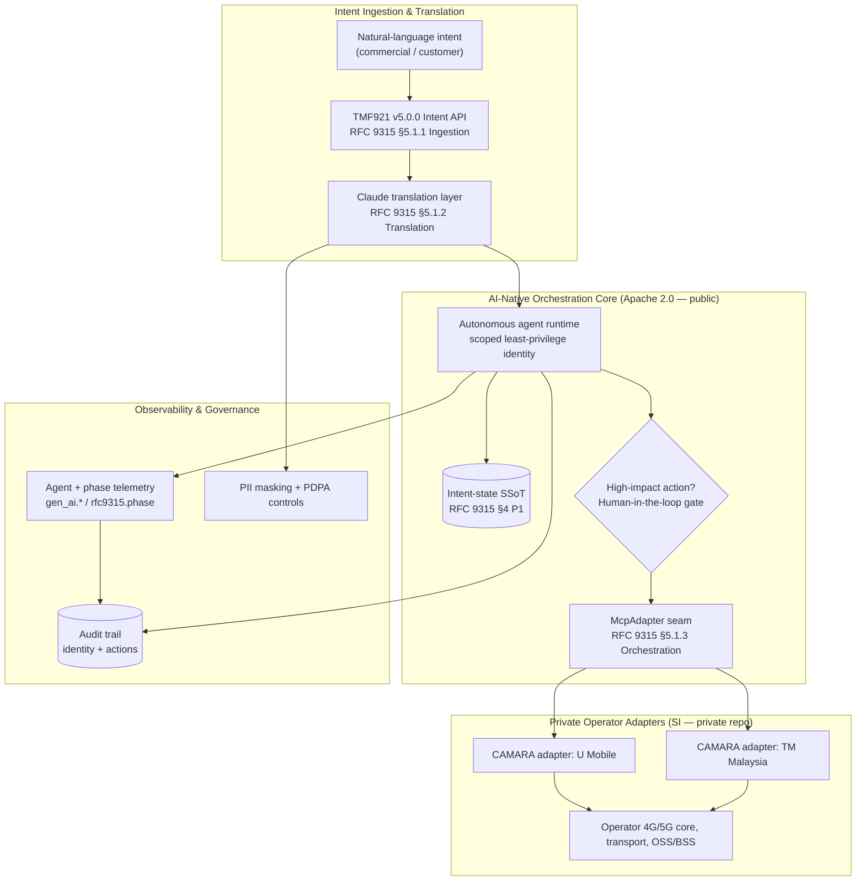
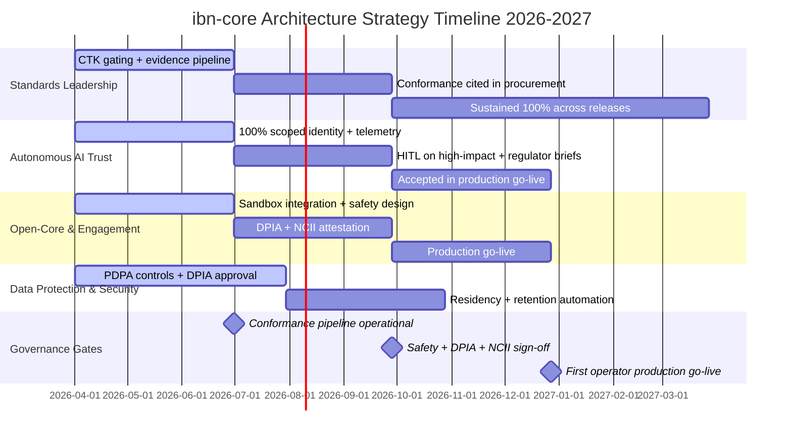

# Architecture Strategy: ibn-core (RFC 9315 / TMF921 Intent-Based Networking)

> **Template Origin**: Official | **ArcKit Version**: 5.11.0 | **Command**: `/arckit:strategy`

## Document Control

| Field | Value |
|-------|-------|
| **Document ID** | ARC-000-STRAT-v1.0 |
| **Document Type** | Architecture Strategy |
| **Project** | ibn-core-my (Project 001) |
| **Classification** | PUBLIC |
| **Status** | DRAFT |
| **Version** | 1.0 |
| **Created Date** | 2026-06-05 |
| **Last Modified** | 2026-06-05 |
| **Review Cycle** | Quarterly |
| **Next Review Date** | 2026-07-05 |
| **Owner** | Roland Pfeifer, Lead Architect / CTO (Vpnet Cloud Solutions Sdn. Bhd.) |
| **Reviewed By** | PENDING |
| **Approved By** | PENDING |
| **Distribution** | ibn-core engineering, Vpnet SI delivery teams, operator integration partners (U Mobile, TM Malaysia), Vpnet Commercial & Security |

## Revision History

| Version | Date | Author | Changes | Approved By | Approval Date |
|---------|------|--------|---------|-------------|---------------|
| 1.0 | 2026-06-05 | ArcKit AI | Initial creation from `/arckit:strategy` command | PENDING | PENDING |

---

## Executive Summary

### Strategic Vision

**ibn-core** is the reference production implementation of RFC 9315 Intent-Based Networking, targeting the TM Forum TMF921 Intent Management API v5.0.0, developed by Vpnet Cloud Solutions Sdn. Bhd. and delivered — with private operator CAMARA adapters — to Malaysian telecommunications operators (U Mobile, TM Malaysia) through a commercial open-core product and Systems Integration (SI) engagements. Our strategic ambition is to make ibn-core the standards-conformant, AI-native intent platform that Malaysian operators procure on the basis of *verifiable* interoperability, and that the research community cites as a reproducible empirical artefact.

The transformation we enable is the shift from manual and scripted network operations to **intent-driven, autonomously-fulfilled connectivity services**. A Claude-based translation layer converts natural-language commercial and customer intent into structured TMF921 Intent resources; an autonomous agent runtime then orchestrates fulfilment across operator 4G/5G core, transport, and OSS/BSS systems — under a scoped, least-privilege agent identity, with full GenAI and RFC 9315 phase telemetry, and human-in-the-loop gating on high-impact actions. The differentiator is not "AI in telco" in the abstract; it is autonomous operation that operators and regulators can *trust on live national infrastructure* because every action is scoped, observable, and reversible.

Success over the strategic horizon (2026–2027) is defined by four convergent achievements: sustained 100% TMF921 Conformance Test Kit (CTK) conformance with versioned evidence; at least one Malaysian operator running ibn-core in production with signed safety, PDPA 2010, and NACSA NCII assurance; trusted autonomous AI operation accepted by operator network teams and demonstrable to MCMC, JPDP, and NACSA; and a credible, genuinely contributable open core that protects the proprietary adapter seam without "open-washing". As a locally-developed, standards-conformant deep-tech IP asset, ibn-core also contributes to Malaysia's MyDIGITAL national digital-economy outcomes — as a commercial enabler, not a Government deliverable.

### Strategic Context

| Aspect | Summary |
|--------|---------|
| **Business Challenge** | Malaysian operators need standards-based, low-lock-in intent automation; autonomous AI on live national infrastructure must be provably safe before network teams and regulators accept it |
| **Strategic Opportunity** | Establish ibn-core as the reference RFC 9315 / TMF921 production implementation and win operator procurement on verifiable conformance plus a trustworthy AI-native differentiator |
| **Investment Horizon** | 2 years (2026–2027); investment envelope maintained in the SOBC (not yet produced — see Gaps) |
| **Expected Return** | First recognised SI revenue on a referenceable production engagement by Q4 2026; pipeline acceleration thereafter (quantified in SOBC) |
| **Risk Appetite** | MEDIUM — bold on standards leadership and AI-native operation; conservative on autonomy blast-radius, the open-core seam, and regulated-data handling (security and seam integrity are non-negotiable) |

### Key Strategic Decisions

| Decision | Choice | Rationale |
|----------|--------|-----------|
| Build vs Buy | **Hybrid (Build core, Partner on operator adapters)** | The RFC 9315 / TMF921 framework and AI runtime are core differentiating IP and are built; operator CAMARA adapters are delivered as private, contracted SI components |
| Open / Proprietary Model | **Open Core (Apache 2.0 public framework + private adapters)** | Public credibility and community reach drive adoption and citation; the private adapter seam protects commercial revenue (Principle 9, NON-NEGOTIABLE) |
| Cloud Strategy | **Cloud-Native (Kubernetes / Istio), operator-residency-driven placement** | Horizontal scalability and IaC; cloud placement follows operator and MCMC data-residency reasoning, not a fixed topology |
| Vendor Strategy | **Standards-first, multi-supplier** | TMF921 / RFC 9315 / CAMARA / MCP are open standards; no hard dependence on a single proprietary vendor, minimising operator lock-in |
| Integration Approach | **API-first (TMF921) + MCP seam + async orchestration** | Loose coupling via published interfaces is the structural precondition for the open-core seam and independent adapter delivery |
| AI Autonomy Approach | **Phased by blast radius, identity-scoped, HITL-gated** | Earn expanded autonomy with evidenced safety, not assertion — the path to operator and regulator acceptance |

### Strategic Outcomes

1. **Verifiable standards leadership**: Sustain 100% TMF921 CTK conformance (83/83) across all 2026 releases with run-ID-stamped evidence within 24 hours of each release, used as a procurement qualifier by at least one operator.
2. **Referenceable production engagement**: One Malaysian operator (U Mobile or TM Malaysia) live in production by Q4 2026 with O2C intent fulfilment ≥ 99% in steady state.
3. **Trusted autonomous AI operation**: 100% of autonomous agent actions executed under a scoped least-privilege identity with complete audit trails and human-in-the-loop on high-impact actions, accepted by operator network teams and demonstrable to MCMC / JPDP / NACSA.
4. **Credible, contributable open core**: Zero operator credentials or proprietary adapter logic in the public repo across all releases, 100% Apache-2.0-compatible dependencies, and a backward-compatible `McpAdapter` seam.
5. **Demonstrable PDPA 2010 and data-sovereignty compliance**: A current, approved DPIA, enforced PII masking, Malaysia-resident subscriber data handling, and automated retention/deletion verified before first production go-live.

---

## Strategic Drivers

> *Synthesised from: ARC-001-STKE-v1.0.md, ARC-001-MYDIG-v1.0.md*

### Business Drivers

| Driver ID | Driver | Stakeholder | Intensity | Strategic Goal |
|-----------|--------|-------------|-----------|----------------|
| SD-1 | Establish ibn-core as the reference RFC 9315 / TMF921 production implementation — verifiable, citable, commercially credible | Lead Architect / CTO | CRITICAL | G-1 Sustain TMF921 CTK 100% |
| SD-4 | Adopt intent automation only if autonomous AI on live infrastructure is provably safe, scoped, reversible, and observable | Operator Network Engineering (U Mobile, TM) | CRITICAL | G-3 Safe, observable agents |
| SD-7 | Maintain zero-trust, defence-in-depth posture and demonstrable PDPA 2010 compliance, including for agent actions | Vpnet Security / Compliance | CRITICAL | G-3 / G-5 |
| SD-2 | Land at least one Malaysian operator engagement in production, on time and within margin | SI Delivery Lead | HIGH | G-2 First operator in production |
| SD-3 | Grow SI and product revenue while protecting proprietary value embedded in operator adapters | Vpnet Commercial / Sales | HIGH | G-4 Seam integrity |
| SD-5 | Procure an interoperable, standards-conformant, low-lock-in, value-for-money intent platform | Operator IT / Procurement | HIGH | G-1 / G-2 |
| SD-8 | Engage with a genuinely open, well-documented, agent-native framework — not a hollowed-out public shell | Open-Source Community & Contributors | MEDIUM | G-4 Seam integrity |

### External Drivers

| Driver | Source | Impact | Strategic Response |
|--------|--------|--------|-------------------|
| Telecom regulatory accountability for autonomous network operation | MCMC (Malaysian Communications and Multimedia Commission) | Autonomous AI changes to licensed infrastructure are a novel regulatory surface | Complete, attributable audit trails; human accountability and override on regulated operations (Theme 2) |
| PDPA 2010 personal-data protection of subscriber data in intent flows | JPDP (Jabatan Perlindungan Data Peribadi) | Intent payloads can contain PII; cross-border transfer governed | PII masking, residency controls, retention automation, maintained DPIA (Theme 4) |
| NCII cyber assurance for systems touching national telecom infrastructure | NACSA (National Cyber Security Agency) | Compromise would impact national connectivity | Defence-in-depth, dependency/code scanning, constrained agent privilege, incident response (Theme 2 / Theme 4) |
| Operator standardisation on TM Forum Open APIs to avoid lock-in | TM Forum / operator procurement | Verifiable conformance is a procurement gate | Sustained TMF921 CTK conformance as a published sales asset (Theme 1) |
| National 5G rollout and digital-economy competitiveness | MyDIGITAL Blueprint (EPU / JDN) — Thrusts 2, 3, 4 | Faster, cheaper, auditable service provisioning amplifies national 5G investment | Position ibn-core as a commercial enabler contributing to national outcomes (Theme 1 / Theme 3) |
| Upstream standard / dependency evolution (RFC 9315, TMF921, CAMARA, MCP) | IRTF NMRG, TM Forum, Linux Foundation, Anthropic | Divergence erodes interoperability and citation integrity | Track upstream releases and licence terms; cite by reference; CTK-gate every release |

### Stakeholder Alignment

```text
                          INTEREST
              Low                         High
        +-----------------------+-----------------------------+
        |                       |                             |
        |   KEEP SATISFIED      |   MANAGE CLOSELY            |
   High |                       |                             |
        |   MCMC                |   Lead Architect / CTO     |
        |   JPDP                |   SI Delivery Lead         |
        |   NACSA               |   Operator Network Eng     |
        |   Vpnet Security      |   Operator IT / Procurement|
        |   Vpnet Commercial    |                             |
 P      +-----------------------+-----------------------------+
 O      |                       |                             |
 W      |      MONITOR          |    KEEP INFORMED            |
 E      |                       |                             |
 R Low  |   Academic / Standards|   OSS Community             |
        |   Tech suppliers      |   ibn-core Engineering     |
        |   (Anthropic/CAMARA)  |   End-Customer Enterprises |
        |                       |   Private Adapter Eng      |
        +-----------------------+-----------------------------+
```

Overall stakeholder alignment is assessed **MEDIUM**: strategic alignment is high around standards conformance and product quality, but two structural conflicts — open transparency vs. commercial seam, and AI autonomy vs. regulator/operator risk appetite — require active, ongoing management rather than one-off resolution.

---

## Guiding Principles

> *Synthesised from: ARC-000-PRIN-v1.0.md*

The following architecture principles govern all strategic and design decisions. Three are explicitly **NON-NEGOTIABLE** (Standards Conformance, Security by Design, Open-Core / Proprietary Seam Integrity) and shape the strategy's hard constraints.

### Foundational Principles

| ID | Principle | Statement | Strategic Implication |
|----|-----------|-----------|----------------------|
| P-03 | Standards Conformance (NON-NEGOTIABLE) | All intent capabilities conform to RFC 9315 and expose management via TMF921 v5.0.0; public contracts must not diverge without approved exception | Conformance is the product's core value proposition and the shared currency across operators, regulators, and academia — it anchors Theme 1 |
| P-04 | Security by Design (NON-NEGOTIABLE) | Defence-in-depth with zero-trust; security is foundational, not added later; agent actions run under constrained identity | Defines the autonomy and compliance themes; no exceptions waive the principle, only vary implementation |
| P-02 | Resilience and Fault Tolerance | Systems degrade gracefully and recover automatically; circuit breakers, timeouts, bulkheads across operator/MCP/AI dependencies | Underpins operator trust in autonomous operation (degraded-mode, rollback) — Theme 2 |
| P-08 | Single Source of Truth | Each data domain has one authoritative source; intent state SSoT per RFC 9315 §4 P1 | Integrity guarantee when intents mutate live network config |

### Technology Principles

| ID | Principle | Statement | Strategic Implication |
|----|-----------|-----------|----------------------|
| P-01 | Scalability and Elasticity | Horizontal scale, externalised state, demand-driven autoscaling | Handles bursty, tenant-dependent telco intent traffic without architectural change |
| P-05 | Observability and Operational Excellence | Structured telemetry incl. agent reasoning, tool calls, RFC 9315 phase tags; AI behaviour is a measurable signal | Converts the AI-native differentiator into evidence operators and regulators accept — Theme 2 |
| P-10 | Loose Coupling | Communicate via published APIs (TMF921), MCP, or async events; no shared databases across boundaries | Structural precondition for the open-core seam and independent adapter delivery — Theme 3 / Theme 4 |
| P-11 | Asynchronous Communication | Async for non-real-time orchestration and fulfilment | Resilience against slow operator and AI endpoints |

### Governance Principles

| ID | Principle | Statement | Strategic Implication |
|----|-----------|-----------|----------------------|
| P-09 | Open-Core / Proprietary Seam Integrity (NON-NEGOTIABLE) | Clean published interface between public Apache-2.0 framework and private operator adapters; no credentials or proprietary logic in public repo | Protects both the open-source posture and commercial value — anchors Theme 4 |
| P-06 | Data Sovereignty and Governance | Classification, residency, retention, access comply with PDPA 2010 and operator obligations | Defines data-handling guardrails for regulated subscriber data — Theme 4 |
| P-17 | CI/CD and Traceability | Quality-gated pipelines; every non-trivial commit cites the RFC / TMF / Paper reference it touches | Makes `git log` a reasoning trail and enforces conformance evidence discipline |

### Principles Compliance Summary

| Principle Category | Current Compliance | Target Compliance | Gap |
|-------------------|-------------------|-------------------|-----|
| Foundational | 80% | 100% | 20% |
| Technology | 75% | 100% | 25% |
| Governance | 85% | 100% | 15% |
| **Overall** | **80%** | **100%** | **20%** |

> Compliance figures are an indicative baseline derived from current project state (v2.0.1, clean seam, partial agent telemetry, DPIA review pending). A formal `/arckit:principles-compliance` assessment should replace these estimates.

---

## Current State Assessment

### Technology Landscape

ibn-core is at **v2.0.1**: 100% TMF921 CTK conformance (83/83) achieved, RFC 9315 §4 Principles 1 and 2 closed (Redis SSoT + ProbeIntent), a clean open-core seam (operator services separated to a private repo at v1.4.2), and an AI-native runtime with the autonomous intent cycle recently moved to run under a dedicated agent role identity. Telemetry (GenAI semantic conventions, RFC 9315 phase tags) is partially in place. No operator is yet in production; the programme is at pilot/sandbox stage.

**Key Systems / Components**:

| Component | Purpose | Technology | Maturity | Technical Debt | Strategic Fit |
|--------|---------|------------|-----|----------------|---------------|
| Intent API (TMF921 v5.0.0) | Intent CRUD, IntentReport projection | TypeScript, Express | Conformant (CTK 83/83) | LOW | RETAIN |
| Intent processor / Claude client | NL → TMF921 translation (RFC 9315 §5.1.2) | TypeScript, Anthropic Claude | Functional | MEDIUM | RETAIN |
| `McpAdapter` seam | Open-core boundary to operator adapters | TypeScript interface + mock | Stable, published | LOW | RETAIN — protect |
| Autonomous agent runtime | Intent cycle orchestration under agent role | TypeScript, MCP | Emerging (HITL/telemetry maturing) | MEDIUM | RETAIN — harden |
| Telemetry bootstrap (`telemetry.ts`) | OTLP spans, agent + phase tags | OpenTelemetry → LangSmith/Canvas | Partial coverage | MEDIUM | RETAIN — complete |
| Private operator (CAMARA) adapters | U Mobile / TM integration | Private repo (out of public scope) | Pre-production | N/A (private) | PARTNER / SI |

### Capability Maturity Baseline

| Capability Domain | Current Maturity | Assessment |
|-------------------|------------------|------------|
| Standards Conformance (RFC 9315 / TMF921) | Level 4 (Managed) | 100% CTK with versioned evidence; CI gating constrained by Actions billing |
| AI-Native Autonomous Operation | Level 2 (Repeatable) | Agent-role identity adopted; telemetry partial; HITL workflow maturing |
| Security & Identity (zero-trust, agent scoping) | Level 3 (Defined) | mTLS, vaulted secrets, agent identity; continuous verification expanding |
| Data Protection & Sovereignty (PDPA 2010) | Level 2 (Repeatable) | PII masking present; DPIA exists, review pending; residency controls per engagement |
| Open-Core Seam & Delivery | Level 3 (Defined) | Clean seam; secret-scanning and licence checks to be CI-enforced |

**Maturity Levels**: L1 (Initial), L2 (Repeatable), L3 (Defined), L4 (Managed), L5 (Optimised)

### Technical Debt Summary

- **CI / conformance gating**: GitHub Actions billing is constrained; CTK and secret-scanning gates are not yet continuously enforced in CI. Highest-priority debt — it directly threatens G-1 and G-4.
- **Agent telemetry coverage**: Partial; full GenAI + RFC 9315 phase coverage and HITL gating on high-impact actions are required before production go-live (G-3).
- **DPIA / data-protection evidence**: DPIA exists in `docs/security/` but review/approval is pending (G-5).
- **Impact on delivery**: Until CI gating and telemetry are complete, conformance and safety claims rely on manual verification, slowing release confidence and operator/regulator assurance.

### Strengths, Weaknesses, Opportunities, Threats (SWOT)

| Strengths | Weaknesses |
|-----------|------------|
| 100% TMF921 CTK conformance with citable, immutable tagged evidence | CI/CD gating constrained (Actions billing); manual verification overhead |
| Clean, published open-core seam protecting commercial value | Partial agent telemetry; HITL not yet enforced on high-impact actions |
| AI-native differentiator (autonomous intent agents, MCP seam) | No operator yet in production — commercial model not end-to-end proven |
| Agent-native, context-first codebase (fast onboarding) | DPIA approval and residency controls pending verification |

| Opportunities | Threats |
|---------------|---------|
| First-mover reference RFC 9315 / TMF921 production implementation in Malaysia | Operator network teams / regulators reject autonomous operation as too risky |
| MyDIGITAL-aligned deep-tech IP and academic citation (Paper 1) | Accidental leak of operator credentials / proprietary logic into public repo |
| Standards conformance as a low-cost, high-trust sales asset | Silent TMF921 CTK conformance regression eroding differentiation and citations |
| Community reach amplifying lead generation and code scrutiny | PDPA / data-sovereignty breach via PII leakage in logs or telemetry |

---

## Target State Vision

### Future Architecture

The target state is a cloud-native, standards-conformant, AI-native intent platform where natural-language intent is reliably translated to TMF921 resources and autonomously fulfilled across operator networks — with every autonomous action scoped, observable, reversible, and human-gated where it matters. The public Apache-2.0 framework remains substantive and contributable; production operator integrations remain private behind a stable `McpAdapter` seam.

**Target State Characteristics**:

- Standards-conformant by construction: every intent capability mapped to an RFC 9315 phase and gated against the TMF921 v5.0.0 CTK in CI.
- AI-native autonomous operation under a dedicated least-privilege agent identity, never human/admin credentials.
- Full agent observability: GenAI semantic conventions, RFC 9315 phase tags, AI-gateway events — no black box.
- Human-in-the-loop on high-impact actions; phased autonomy by blast radius; circuit breakers, degraded-mode, and rollback throughout.
- Clean open-core seam: published `McpAdapter` interface and mock public; production adapters and credentials private; 100% Apache-2.0-compatible dependencies.
- PDPA-2010-compliant data handling: PII masking, Malaysia-resident subscriber data, automated retention/deletion, maintained DPIA.
- Cloud-native on Kubernetes/Istio with operator-residency-driven placement and Infrastructure-as-Code.

### Capability Maturity Targets

| Capability Domain | Current | Target | Gap | Priority |
|-------------------|---------|--------|-----|----------|
| Standards Conformance (RFC 9315 / TMF921) | L4 | L5 | +1 | HIGH |
| AI-Native Autonomous Operation | L2 | L4 | +2 | HIGH |
| Security & Identity (zero-trust, agent scoping) | L3 | L4 | +1 | HIGH |
| Data Protection & Sovereignty (PDPA 2010) | L2 | L4 | +2 | HIGH |
| Open-Core Seam & Delivery | L3 | L4 | +1 | MEDIUM |

### Architecture Vision Diagram



---

## Technology Evolution Strategy

> *No Wardley Map (ARC-001-WARD-*.md) exists yet. The positioning below is an interim build-vs-buy view derived from the principles and project context; running `/arckit:wardley` would strengthen these decisions with explicit evolution mapping.*

### Strategic Positioning

| Component | Current Position | Target Position | Evolution Strategy |
|-----------|------------------|-----------------|-------------------|
| RFC 9315 / TMF921 intent framework | Custom Build | Product (open core) | Innovate in-house; harden as the citable reference implementation |
| AI translation + autonomous agent runtime | Genesis / Custom Build | Custom Build | Keep in-house — the core differentiator; mature safety and observability |
| Operator CAMARA adapters | Custom Build (private) | Product (SI-delivered) | Deliver as repeatable private adapters behind the stable seam |
| LLM inference (Claude) | Product | Product / Utility | Consume as a service; treat AI-inference cost-per-intent as a first-class efficiency metric |
| Cloud runtime (Kubernetes / Istio) | Commodity | Utility | Consume; operator-residency-driven placement |
| Identity (Keycloak realm) | Product | Product | Integrate; agent-role identity scoping consumed from operator realm |
| Observability backend (OTLP collector) | Product | Product / Utility | Default LangSmith, overridable to any Canvas collector |

### Build vs Buy Decisions

| Capability | Decision | Rationale | Timeline |
|------------|----------|-----------|----------|
| RFC 9315 / TMF921 framework + AI runtime | **BUILD** | Core differentiating IP; no suitable conformant product exists; cited in Paper 1 | 2026 (ongoing) |
| Operator CAMARA adapters | **PARTNER / SI (private build)** | Operator-specific, revenue-critical; delivered via contracted SI in the private repo | 2026 per engagement |
| LLM inference | **CONSUME** | Mature managed capability (Anthropic Claude, MIT-licensed MCP); no need to build | Now |
| Cloud orchestration & service mesh | **CONSUME (open standards)** | Kubernetes / Istio are commodity utilities; Apache-2.0-compatible | Now |
| Identity provider | **BUY / INTEGRATE** | Keycloak realm provided per operator engagement (ODA Canvas UC007) | 2026 per engagement |
| Observability tooling | **CONSUME (pluggable)** | OpenTelemetry standard; backend overridable to operator Canvas collector | Now |

### Technology Radar Summary

| Ring | Technologies |
|------|--------------|
| **Adopt** (Use now) | RFC 9315, TMF921 v5.0.0, MCP, Kubernetes, Istio, OpenTelemetry, Apache-2.0 dependency posture |
| **Trial** (Evaluate) | Autonomous agent runtime with HITL gating, GenAI semantic-convention telemetry, CAMARA operator adapters |
| **Assess** (Watch) | ERC-8004 agent discovery, MyDigital-ID interoperability, broader Canvas observability collectors |
| **Hold** (Avoid) | GPL-licensed dependencies (prohibited); individual-submission I-D vocabulary (e.g. I2NSF terms) in public module names; real operator credentials in the public repo |

---

## Strategic Themes & Investment Areas

> Investment is expressed as proportional emphasis pending a SOBC. Absolute figures (RM) belong in the Strategic Outline Business Case.

### Theme 1: Standards Leadership & Conformance Assurance

**Strategic Objective**: Make verifiable RFC 9315 / TMF921 conformance the product's defensible market position and the shared currency that satisfies operator procurement, the academic audience, and Vpnet's commercial differentiation simultaneously.

**Investment**: Largest emphasis (~30% of effort) over 2 years.

**Key Initiatives**:

1. CTK gating in CI with run-ID-stamped evidence committed under `docs/compliance/` within 24 hours of each release.
2. Maintain RFC 9315 phase mapping in code and commit traceability; cite standards by correct identifiers (e.g. DOI 10.17487/RFC9315).
3. Preserve citation integrity — never rewrite or force-push cited tags (e.g. v2.0.1).

**Success Criteria**:

- [ ] 100% TMF921 CTK pass (83/83) on every 2026 release; zero post-release conformance regressions
- [ ] Time-to-evidence < 24 hours after each release
- [ ] Conformance cited as a qualifier in at least one operator procurement

**Principles Alignment**: P-03, P-08, P-17

---

### Theme 2: Trusted Autonomous AI Operation

**Strategic Objective**: Convert the AI-native differentiator from a perceived risk into a trust asset by making every autonomous agent action scoped, observable, reversible, and human-gated where it matters — winning operator network-team and regulator confidence.

**Investment**: High emphasis (~30% of effort) over 2 years.

**Key Initiatives**:

1. Execute 100% of autonomous actions under a dedicated least-privilege agent identity, never human/admin credentials.
2. Complete agent telemetry (GenAI semantic conventions, RFC 9315 phase tags, AI-gateway events) and end-to-end audit trails.
3. Route high-impact actions through human-in-the-loop; phase autonomy by blast radius with circuit breakers, degraded-mode, and rollback.

**Success Criteria**:

- [ ] 100% agent actions under the scoped agent role identity
- [ ] 100% high-impact actions HITL-gated; 100% action auditability
- [ ] Regulator briefings (MCMC / NACSA) accepted; zero autonomous-action security incidents

**Principles Alignment**: P-04, P-05, P-02

---

### Theme 3: Open-Core Integrity & Reference Engagement Delivery

**Strategic Objective**: Land the first Malaysian operator in production behind a stable open-core seam, proving the open-core-plus-private-adapter model end-to-end while keeping the public framework substantive and genuinely contributable.

**Investment**: Moderate emphasis (~25% of effort) over 2 years.

**Key Initiatives**:

1. Keep zero operator credentials and zero proprietary adapter logic in the public repo; extend `McpAdapter` only in backward-compatible ways; enforce secret-scanning and licence checks in CI.
2. Deliver reusable deployment manifests and operational runbooks so adapters drop in cleanly.
3. Publish CONTRIBUTING and a transparent rationale for the open-core boundary to avoid "open-washing".

**Success Criteria**:

- [ ] One operator (U Mobile or TM) live in production by Q4 2026 with O2C fulfilment ≥ 99%
- [ ] Zero credential/proprietary-logic leaks; 100% licence-compatible dependencies; seam backward-compatible all releases
- [ ] Demonstrated external contributions / adoption signals on the public repo

**Principles Alignment**: P-09, P-10, P-01

---

### Theme 4: Data Protection, Security & Regulatory Assurance

**Strategic Objective**: Maintain a defensible zero-trust, PDPA-2010-compliant, NCII-resilient posture — including for autonomous agent actions — as a precondition for operator trust and regulator acceptance.

**Investment**: Sustained emphasis (~15% of effort) over 2 years.

**Key Initiatives**:

1. Achieve and maintain a current, approved DPIA; enforce PII masking; ensure Malaysia-resident subscriber data handling and automated retention/deletion.
2. Sustain mTLS, vaulted secrets, validated identity tokens, structured audit logging, dependency/code scanning, and incident-response runbooks.
3. Deliver evidence-backed regulatory briefings and attestations to MCMC, JPDP, and NACSA.

**Success Criteria**:

- [ ] Approved DPIA before first go-live; zero PII-in-logs incidents; 100% residency-conformant data stores
- [ ] NCII cyber-posture attestation signed for the first production engagement
- [ ] No unpatched critical vulnerabilities in deployed components

**Principles Alignment**: P-04, P-06, P-17

---

## Delivery Roadmap Summary

> *No standalone roadmap (ARC-001-ROAD-v1.0.md) exists yet. The timeline below is derived from the stakeholder goal/outcome phasing (Q2–Q4 2026, sustainment 2027+); running `/arckit:roadmap` would expand it with detailed initiatives.*

### Strategic Timeline



### Phase Summary

| Phase | Timeline | Focus | Investment Emphasis | Key Deliverables |
|-------|----------|-------|------------|------------------|
| Foundation | 2026 Q2 | CTK gating, scoped identity + telemetry, sandbox integration, PDPA controls | Standards + Security setup | Conformance pipeline; scoped agent identity; safety design |
| Evidence & Assurance | 2026 Q3 | Procurement citation, HITL + regulator briefings, DPIA + NCII attestation | AI trust + Data protection | Approved DPIA; NCII attestation; regulator acceptance |
| Production & Sustainment | 2026 Q4 – 2027 | Production go-live; sustained conformance; second-operator pattern | Engagement delivery | Operator live (O2C ≥ 99%); referenceable case study |

### Key Milestones

| Milestone | Date | Theme | Gate |
|-----------|------|-------|------|
| Conformance pipeline operational | 2026 Q2 | Theme 1 | Standards Gate |
| 100% scoped agent identity + telemetry coverage | 2026 Q2 | Theme 2 | Safety Design Gate |
| Approved DPIA + NACSA NCII attestation | 2026 Q3 | Theme 4 | Compliance Gate |
| Safety sign-off (operator network team) | 2026 Q3 | Theme 2 | Safety Gate |
| First operator production go-live | 2026 Q4 | Theme 3 | Go-Live Gate |
| Steady-state O2C fulfilment ≥ 99% + case study | 2027 Q1 | All | Closeout / Reference |

---

## Investment Summary

> *For detailed financial analysis, see: ARC-001-SOBC-v*.md (not yet produced — run `/arckit:sobc`).*

| Item | Value |
|------|-------|
| **Total Investment Envelope** | To be quantified in the SOBC (RM, 2-year horizon) |
| **Investment Horizon** | 2026 – 2027 |
| **CAPEX / OPEX Split** | To be determined in the SOBC |

> No Strategic Outline Business Case exists yet, so this strategy deliberately does **not** assert NPV, IRR, BCR, payback, or year-by-year figures. These belong in the SOBC. The commercial logic is qualitatively clear: the first referenceable production engagement anchors SI revenue and accelerates the pipeline, while standards conformance acts as a low-cost, high-trust sales asset. Run `/arckit:sobc` to produce the costed financial case.

---

## Strategic Risks & Mitigations

> *Synthesised from the stakeholder-related risk register in ARC-001-STKE-v1.0.md. A dedicated risk register (ARC-001-RISK-v1.0.md) is not yet produced — running `/arckit:risk` (HM Treasury Orange Book) would formalise scoring and residual-risk tracking.*

### Top Strategic Risks

| Risk ID | Risk Description | Impact | Probability | Mitigation Strategy | Owner |
|---------|------------------|--------|-------------|---------------------|-------|
| R-001 | Operator network teams / regulators reject autonomous operation on live national infrastructure | HIGH | MEDIUM | Phase autonomy by blast radius; scoped identity; full telemetry; HITL on high-impact actions; reversibility and circuit breakers; ship assist/advisory mode if needed (Theme 2) | Lead Architect / CTO |
| R-002 | Proprietary logic or operator credentials leak into the public Apache-2.0 repo | HIGH | LOW | Secret scanning in CI; pre-commit hooks; strict cross-seam PR review; private-repo isolation; immediate credential rotation + history scrub on exposure (Theme 3) | Lead Architect / CTO |
| R-003 | Silent TMF921 CTK conformance regression erodes differentiation and citation integrity | HIGH | MEDIUM | CTK gating in CI; evidence within 24h; block release on regression; never rewrite cited tags (Theme 1) | Lead Architect / CTO |
| R-004 | PDPA / data-sovereignty breach via PII leakage in logs/telemetry or undocumented cross-border transfer | HIGH | LOW | PII masking; residency-conformant stores; automated retention/deletion; maintained DPIA; PII log scans; PDPA breach-response process (Theme 4) | Vpnet Security / Compliance |
| R-005 | "Open-washing" perception — public core seen as a thin shell — damages community credibility and citation | MEDIUM | MEDIUM | Keep public framework substantive; publish transparent seam-boundary rationale; welcome contributions (Theme 3) | Lead Architect / CTO |
| R-006 | CI/CD availability constrained (GitHub Actions billing) blocks automated conformance/secret gating | MEDIUM | MEDIUM | Establish reliable CI capacity; interim manual verification with documented evidence; prioritise gating restoration | SI Delivery Lead |
| R-007 | Seam churn forces operator-adapter rework, delaying the first production engagement | MEDIUM | MEDIUM | Extend `McpAdapter` only backward-compatibly; interface diff review each release; stabilise before adapter delivery (Theme 3) | SI Delivery Lead |

### Risk Heat Map

```text
                    PROBABILITY
              Low         Medium        High
        +------------+------------+------------+
        |            |            |            |
   High |   R-002    |   R-001    |            |
        |   R-004    |   R-003    |            |
 I      +------------+------------+------------+
 M      |            |   R-005    |            |
 P Med  |            |   R-006    |            |
 A      |            |   R-007    |            |
 C      +------------+------------+------------+
 T      |            |            |            |
   Low  |            |            |            |
        |            |            |            |
        +------------+------------+------------+
```

### Assumptions & Constraints

**Critical Assumptions**:

1. At least one Malaysian operator (U Mobile or TM) provides sandbox access and engages toward a production go-live in 2026.
2. Reliable CI capacity can be established to gate conformance and secret-scanning (resolving the Actions billing constraint).
3. Operator and regulator (MCMC / JPDP / NACSA) sign-offs are achievable within the 2026 timeline given evidence-backed engagement.
4. Executive sponsorship (Lead Architect / CTO) and the open-core commercial model are sustained.

**Constraints**:

1. Standards Conformance (P-03), Security by Design (P-04), and Open-Core Seam Integrity (P-09) are NON-NEGOTIABLE — no exception waives the principle, only varies implementation with compensating controls.
2. No real operator CAMARA credentials, API keys, or proprietary adapter logic may enter the public repo.
3. Malaysian subscriber personal data must reside in PDPA-2010-compliant jurisdictions per operator residency terms; cross-border transfer requires a documented legal basis.
4. All public dependencies must be Apache-2.0-compatible (Apache, MIT, BSD, ISC); GPL prohibited, LGPL requires review.
5. Cited version tags (e.g. v2.0.1) must never be rewritten or force-pushed.

---

## Success Metrics & KPIs

### Strategic KPIs

| KPI | Baseline | 2026 Target | 2027 Target | Measurement |
|-----|----------|-------------|-------------|-------------|
| TMF921 CTK pass rate per release | 100% (83/83 at v2.0.1) | 100% maintained, zero post-release regressions | 100% as standards evolve | Automated CTK in CI; evidence under `docs/compliance/` |
| Operators live in production | 0 | 1 (U Mobile or TM) | 2 (second from reference pattern) | Engagement gate records; production IntentReport metrics |
| Agent actions under scoped identity | Partial (cycle moved to agent role) | 100% scoped + audited | 100% sustained | Authorization logs; OTel agent traces (`gen_ai.*`, `rfc9315.phase`) |
| Credential / proprietary-logic leaks into public repo | 0 known | 0 | 0 | Secret scanning in CI; cross-seam PR review |
| O2C intent fulfilment rate (steady state) | N/A (pre-production) | ≥ 99% at go-live | ≥ 99% sustained | Production IntentReport metrics |
| DPIA approval status | Exists, review pending | Approved before go-live | Maintained (quarterly review) | DPIA sign-off record; PII log scans |

### Leading Indicators

| Indicator | Frequency | Target | Escalation Threshold |
|-----------|-----------|--------|---------------------|
| Time-to-conformance-evidence after release | Per release | < 24 hours | > 24 hours |
| Agent telemetry coverage of reasoning / tool calls | Monthly | 100% | < 95% |
| High-impact actions HITL-gated | Monthly | 100% | Any ungated high-impact action |
| Dependency licence-compliance rate | Per release | 100% Apache-2.0-compatible | Any incompatible dependency |

### Lagging Indicators

| Indicator | Frequency | Target | Review Forum |
|-----------|-----------|--------|--------------|
| Operator procurement won citing conformance | Quarterly | ≥ 1 by Q4 2026 | Strategy Board |
| Autonomous-action security incidents | Quarterly | 0 | Vpnet Architecture Review Board |
| Regulator acceptance recorded (MCMC / JPDP / NACSA) | Quarterly | Accepted before go-live | Strategy Board |
| External contributions / adoption signals on public repo | Quarterly | Sustained, growing | Architecture Review Board |

---

## Governance Model

### Governance Structure

| Forum | Frequency | Purpose | Participants |
|-------|-----------|---------|--------------|
| **Strategy Board** | Quarterly | Strategic direction, investment, regulatory posture | Lead Architect / CTO, SI Delivery Lead, Commercial Lead, Finance |
| **Vpnet Architecture Review Board** | Monthly | Architecture decisions, standards scope, autonomy level, compliance gates, exceptions | Lead Architect / CTO, Engineering Lead, Security / Compliance |
| **Delivery / Engagement Review** | Weekly | Delivery progress, seam discipline, risk escalation | SI Delivery Lead, Engineering Lead, Private Adapter Eng |
| **Joint Operator Technical Reviews** | Bi-weekly (during delivery) | Safety design, autonomy sign-off, telemetry walkthrough | SI Delivery, Operator Network Eng, Security |

### Decision Rights

| Decision Type | Authority | Escalation |
|---------------|-----------|------------|
| Standards / conformance scope (RFC 9315 / TMF921) | Engineering Lead (R) / CTO (A) | Strategy Board |
| Open-core / private seam boundary | Lead Architect (R) / CTO (A) | Strategy Board |
| Agent autonomy level (blast-radius gating) | Security / Compliance (R) / CTO (A) | Strategy Board |
| Operator go-live (production sign-off) | SI Delivery Lead (R) / CTO (A) | Strategy Board |
| Data-protection / PDPA decisions | Security / Compliance (R) / CTO (A) | Strategy Board |
| Dependency / licence approval | Engineering Lead (R) / CTO (A) | Architecture Review Board |
| NON-NEGOTIABLE principle exceptions (P-03 / P-04 / P-09) | Lead Architect / CTO | (No waiver — implementation variance only) |

### Review Cadence

| Review Type | Frequency | Purpose | Output |
|-------------|-----------|---------|--------|
| Strategy Review | Quarterly | Validate strategic direction | Strategy refresh |
| Conformance Review | Per release | Confirm CTK pass + evidence | Conformance evidence under `docs/compliance/` |
| Autonomy / Safety Review | Monthly | Agent identity, telemetry, HITL coverage | Safety status report |
| Compliance Review | Quarterly | PDPA / NCII posture, DPIA currency | Compliance report / attestation |
| Architecture Exception Review | Quarterly | Review time-bound exceptions | Updated exception register |

---

## Traceability

### Source Documents

This strategy synthesises insights from the following architecture artifacts:

| Document | Document ID | Key Contributions |
|----------|-------------|-------------------|
| Architecture Principles | ARC-000-PRIN-v1.0.md | Guiding principles, NON-NEGOTIABLE constraints, decision framework |
| Stakeholder Analysis | ARC-001-STKE-v1.0.md | Drivers (SD-1..SD-12), goals (G-1..G-5), outcomes (O-1..O-4), conflicts, risks |
| MyDIGITAL Alignment | ARC-001-MYDIG-v1.0.md | National digital-economy positioning (Thrusts 2/3/4), regulatory triad, gaps |
| Requirements | ARC-001-REQ-v1.0.md | Referenced for FR/NFR context (FR-002/003/007/011, NFR-C-001) |
| Strategic Outline Business Case | ARC-001-SOBC-v*.md | NOT YET PRODUCED — investment, NPV, benefits (gap) |
| Architecture Roadmap | ARC-001-ROAD-v*.md | NOT YET PRODUCED — detailed timeline (gap) |
| Wardley Maps | ARC-001-WARD-*.md | NOT YET PRODUCED — evolution mapping, build vs buy (gap) |
| Risk Register | ARC-001-RISK-v*.md | NOT YET PRODUCED — Orange Book scoring, residual risk (gap) |

### Traceability Matrix

| Strategic Driver | Goal | Outcome | Theme | Principle | KPI |
|------------------|------|---------|-------|-----------|-----|
| SD-1 (standards as differentiator) | G-1 | O-1 | Theme 1 | P-03 | TMF921 CTK pass rate |
| SD-5 (low-lock-in, VfM procurement) | G-1 | O-1 | Theme 1 | P-03 | Procurement won citing conformance |
| SD-4 (safe autonomous operation) | G-3 | O-3 | Theme 2 | P-04, P-05 | Agent actions under scoped identity |
| SD-7 (defensible security posture) | G-3 | O-3 | Theme 2 | P-04 | Autonomous-action security incidents |
| SD-2 (reference engagement to prod) | G-2 | O-2 | Theme 3 | P-10 | Operators live in production |
| SD-3 (protect adapter value) | G-4 | O-4 | Theme 3 | P-09 | Credential/logic leaks into public repo |
| SD-8 (genuinely open framework) | G-4 | O-4 | Theme 3 | P-09 | External contribution signals |
| SD-11 (PDPA 2010 compliance) | G-5 | O-2 | Theme 4 | P-06 | DPIA approval status |
| SD-12 (NCII cyber assurance) | G-3 | O-3 | Theme 4 | P-04 | NCII attestation signed |

---

## Next Steps & Recommendations

### Immediate Actions (Next 30 Days)

1. **Restore conformance & secret-scanning CI gating**: Establish reliable CI capacity and enable CTK + secret scanning in the pipeline — Owner: SI Delivery Lead.
2. **Close agent telemetry coverage**: Complete GenAI + RFC 9315 phase telemetry and confirm 100% of autonomous actions run under the scoped agent role — Owner: Engineering Lead / Security.
3. **Approve the DPIA**: Drive the pending DPIA review to sign-off ahead of any operator engagement — Owner: Vpnet Security / Compliance.

### Short-Term Actions (Next 90 Days)

4. **Produce the SOBC**: Quantify the investment envelope, benefits, and return so this strategy's financial placeholders are replaced — Owner: Lead Architect / CTO with Finance.
5. **Stand up HITL gating + first regulator briefings**: Enforce human-in-the-loop on high-impact actions and brief MCMC / NACSA with evidence — Owner: Security / Compliance with SI Delivery.
6. **Secure operator sandbox + safety design sign-off**: Confirm U Mobile or TM sandbox access and obtain joint safety design sign-off — Owner: SI Delivery Lead.

### Recommended Follow-On Artifacts

| Artifact | Command | Purpose | Priority |
|----------|---------|---------|----------|
| Strategic Outline Business Case | `/arckit:sobc` | Quantify investment, benefits, and return (fills the financial gap) | HIGH |
| Risk Register (Orange Book) | `/arckit:risk` | Formalise scoring and residual-risk tracking | HIGH |
| Architecture Roadmap | `/arckit:roadmap` | Expand the timeline with detailed initiatives and dependencies | HIGH |
| Wardley Map | `/arckit:wardley` | Strengthen build-vs-buy with explicit evolution mapping | MEDIUM |
| Principles Compliance | `/arckit:principles-compliance` | Replace estimated compliance figures with an evidenced scorecard | MEDIUM |
| Architecture Diagrams | `/arckit:diagram` | Visualise target architecture (C4) for design teams | MEDIUM |

---

## Gaps Identified

The following recommended/optional artifacts are absent and would materially strengthen this strategy:

- **SOBC** — no costed business case exists, so the strategy holds no NPV/IRR/BCR/payback figures. This is the highest-value gap to close.
- **Risk Register** — strategic risks here are synthesised from the stakeholder document; a dedicated Orange Book register would add scoring, owners with dates, and residual-risk assessment.
- **Roadmap** — the timeline is inferred from stakeholder goal phasing; a dedicated roadmap would add initiative-level detail and dependency mapping.
- **Wardley Map** — build-vs-buy positioning is an interim view; an explicit evolution map would harden these decisions.

---

## Appendices

### Appendix A: Glossary

| Term | Definition |
|------|------------|
| Intent | A declarative statement of desired network/service outcome, translated to a TMF921 Intent resource |
| Open Core | Commercial model: a public open-source framework plus private, revenue-generating extensions (here, operator adapters) |
| Order-to-Cash (O2C) | The canonical use case: natural-language connectivity request through to provisioned, fulfilled service |
| Seam | The published `McpAdapter` interface boundary between the public framework and private operator adapters |
| Human-in-the-Loop (HITL) | A control requiring human approval before a high-impact autonomous action executes |

### Appendix B: Acronyms

| Acronym | Expansion |
|---------|-----------|
| CTK | Conformance Test Kit (TMF921) |
| CAMARA | Linux Foundation telco network API project |
| MCP | Model Context Protocol (Anthropic) |
| MCMC | Malaysian Communications and Multimedia Commission |
| JPDP | Jabatan Perlindungan Data Peribadi (Personal Data Protection Department) |
| NACSA | National Cyber Security Agency |
| NCII | National Critical Information Infrastructure |
| PDPA | Personal Data Protection Act 2010 (Malaysia) |
| SI | Systems Integration |
| SSoT | Single Source of Truth |

### Appendix C: Related Documents

| Document | Purpose | Location |
|----------|---------|----------|
| ARC-000-PRIN-v1.0 | Enterprise Architecture Principles | projects/000-global/ |
| ARC-001-STKE-v1.0 | Stakeholder Drivers & Goals Analysis | projects/001-ibn-core-my/ |
| ARC-001-MYDIG-v1.0 | MyDIGITAL National Priorities Alignment | projects/001-ibn-core-my/ |
| ARC-001-REQ-v1.0 | Business and Technical Requirements | projects/001-ibn-core-my/ |

## External References

> This section provides traceability from generated content back to source documents.
> Follow citation instructions in the project's citation reference guide.

### Document Register

| Doc ID | Filename | Type | Source Location | Description |
|--------|----------|------|-----------------|-------------|
| PRIN | ARC-000-PRIN-v1.0.md | Architecture Principles | 000-global/ | Guiding principles and NON-NEGOTIABLE constraints |
| STKE | ARC-001-STKE-v1.0.md | Stakeholder Analysis | 001-ibn-core-my/ | Drivers, goals, outcomes, conflicts, stakeholder risks |
| MYDIG | ARC-001-MYDIG-v1.0.md | MyDIGITAL Alignment | 001-ibn-core-my/ | National digital-economy positioning and regulatory triad |

### Citations

| Citation ID | Doc ID | Page/Section | Category | Quoted Passage |
|-------------|--------|--------------|----------|----------------|
| [PRIN-C1] | PRIN | §I.3 Standards Conformance | Compliance Constraint | "All intent-handling capabilities MUST conform to RFC 9315 Intent-Based Networking concepts and expose management functionality through the TMF921 Intent Management API v5.0.0." |
| [PRIN-C2] | PRIN | §III.9 Open-Core Seam | Design Decision | "Operator-specific logic, credentials, and proprietary implementations MUST NOT enter the public repository." |
| [STKE-C1] | STKE | Goal-to-Outcome / O-2 | Stakeholder Need | "One Malaysian operator runs ibn-core in production with evidenced safety, PDPA, and NCII alignment, producing a referenceable case study that de-risks the SI sales pipeline." |
| [STKE-C2] | STKE | SD-4 Operator Network Eng | Risk Factor | "Adopt intent-based automation only if autonomous AI agents acting on live national network configuration are provably safe, scoped, reversible, and fully observable — never a black box." |
| [MYDIG-C1] | MYDIG | Thrust Alignment (2 & 3) | Business Requirement | "ibn-core cuts operator cost and time-to-service for launching 5G-enabled digital services ... directly improving the competitiveness of Malaysian telcos." |

### Unreferenced Documents

| Filename | Source Location | Reason |
|----------|-----------------|--------|
| ARC-001-REQ-v1.0.md | 001-ibn-core-my/ | Referenced for FR/NFR context only; not a primary strategic synthesis source |

---

**Generated by**: ArcKit `/arckit:strategy` command
**Generated on**: 2026-06-05 14:30 GMT
**ArcKit Version**: 5.11.0
**Project**: ibn-core-my (Project 001)
**AI Model**: claude-opus-4-8[1m]
**Generation Context**: Synthesised from ARC-000-PRIN-v1.0 (principles), ARC-001-STKE-v1.0 (stakeholders), and ARC-001-MYDIG-v1.0 (MyDIGITAL alignment). SOBC, ROAD, WARD, and RISK artifacts not yet produced — gaps noted; no financial figures asserted pending SOBC.
