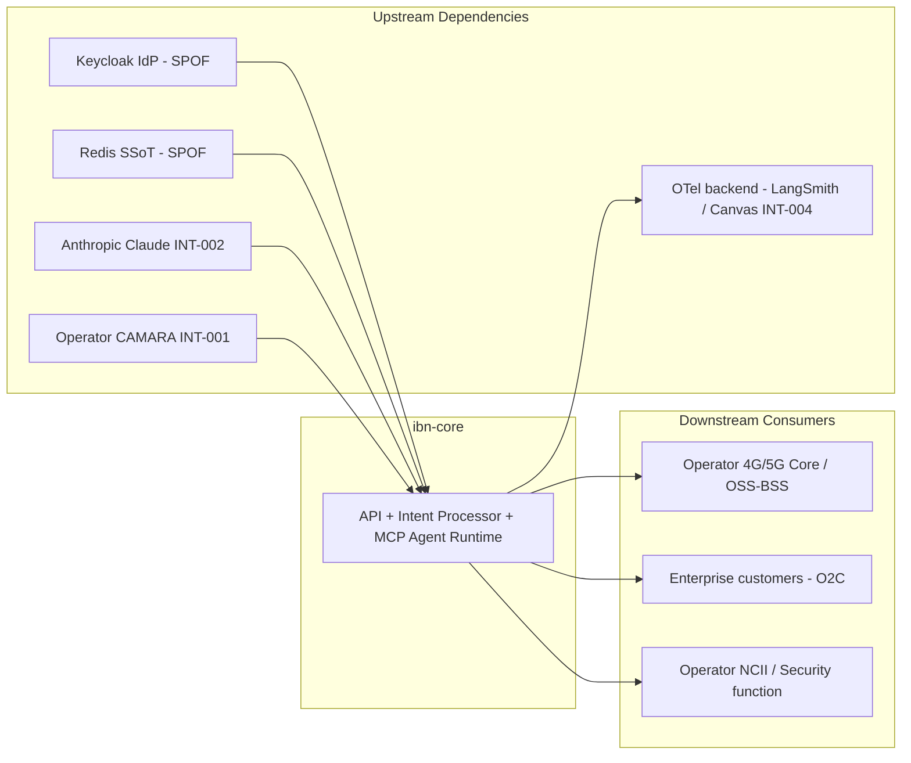
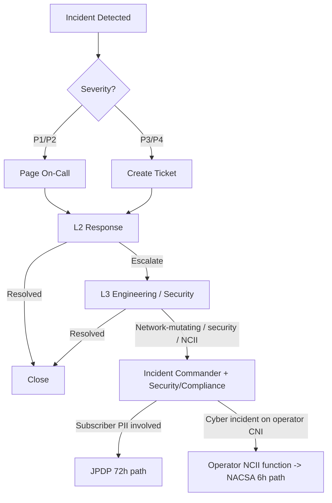
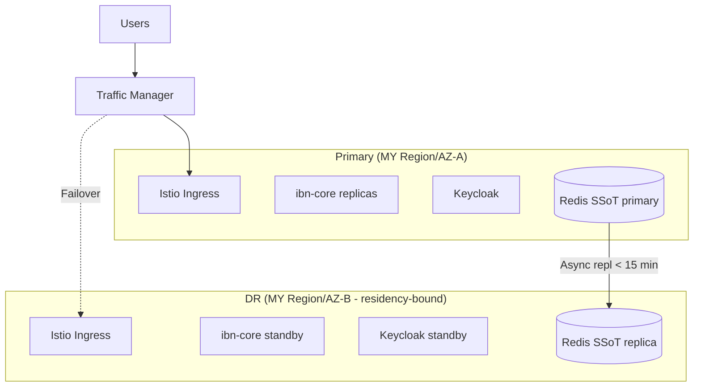

# Operational Readiness Pack

> **Template Origin**: Official | **ArcKit Version**: 5.11.0 | **Command**: `/arckit:operationalize`

> **Subject-type note**: ibn-core is a **commercial** open-core (Apache 2.0) RFC 9315 / TMF921 v5.0.0 AI-native Intent-Based Networking framework delivered by **Vpnet Cloud Solutions Sdn. Bhd.** under Systems Integration (SI) engagements to Malaysian operators (U Mobile, TM Malaysia). This is **commercial telco operations**, not UK / Malaysian public-sector. The UK Government considerations (Section 16) and NCSC VMS items are therefore retained only as a control-discipline reference and are explicitly marked **N/A — Malaysian-equivalent applies** (NACSA NCII / Cyber Security Act 2024, PDPA 2010 / JPDP, MCMC). The regulator triad for incident handling is **NACSA (NCII), JPDP (PDPA), MCMC (telecom)**.

## Document Control

| Field | Value |
|-------|-------|
| **Document ID** | ARC-001-OPS-v1.0 |
| **Document Type** | Operational Readiness Pack |
| **Project** | ibn-core-my (Project 001) |
| **Classification** | PUBLIC |
| **Status** | DRAFT |
| **Version** | 1.0 |
| **Created Date** | 2026-06-05 |
| **Last Modified** | 2026-06-05 |
| **Review Cycle** | Per-gate (alpha); quarterly runbook review post-go-live |
| **Next Review Date** | 2026-07-05 |
| **Owner** | Roland Pfeifer, Lead Architect / CTO (Vpnet Cloud Solutions Sdn. Bhd.) — accountable; SRE Lead — operational owner |
| **Reviewed By** | [PENDING] |
| **Approved By** | [PENDING] |
| **Distribution** | ibn-core engineering, Vpnet SI delivery + SRE, Security/Compliance, operator network + NCII/security teams (U Mobile, TM Malaysia), operator-side NACSA/JPDP liaison |

## Revision History

| Version | Date | Author | Changes | Approved By | Approval Date |
|---------|------|--------|---------|-------------|---------------|
| 1.0 | 2026-06-05 | ArcKit AI | Initial creation from `/arckit:operationalize` (arckit-build wave 9, retry after prior network error — clean build) | PENDING | PENDING |

### Interactive Q&A Choices (recorded for auditability)

No `(Recommended)` defaults were pre-marked in the artefact set, so the standard option set was applied to match the recorded project state (`.arckit/state.json`, recipe `my-operator`) and the HLD review parameters (`ARC-001-HLDR-v1.0` §1.5):

- **Scope**: Full system (entire ibn-core framework + hybrid landing-zone topology).
- **Phase**: Alpha (consistent with `ARC-001-REQ-v1.0` "alpha phase, full-system scope" and NFR-A-001 alpha ≥ 99.0%).
- **Risk profile**: Medium (commercial-telco Medium appetite per `ARC-001-RISK-v1.0` §G, tightened to ≤ 6 for COMPLIANCE/data-protection and ≤ 9 for safety-of-live-network).
- **Service tier**: **Important** at alpha (≥ 99.0% internal target), rising to **Critical** at SI/production go-live (operator-contracted 99.9%/99.95% on national critical infrastructure). See §1 justification.
- **Support model**: Business-hours + on-call for alpha; **24/7 follow-the-sun** required at operator production go-live (NCII 6-hour clock makes round-the-clock detection mandatory).

---

## 1. Service Overview

### Service Description

| Attribute | Value |
|-----------|-------|
| **Service Name** | ibn-core (Intent-Based Networking framework) |
| **Description** | AI-native RFC 9315 / TMF921 v5.0.0 framework translating natural-language customer intent into orchestrated changes against a Malaysian operator's live 4G/5G core, OSS/BSS and network configuration |
| **Service Tier** | **Important** (alpha) → **Critical** (operator production) |
| **Business Criticality** | High — orchestrates national telecommunications critical infrastructure (NCII Communications sector) |
| **Service Owner** | Lead Architect / CTO, Vpnet Cloud Solutions [PENDING named] |
| **Technical Lead** | ibn-core Engineering Lead [PENDING named] |
| **Operations Lead** | SRE Lead [PENDING named] |

### Service Tier Justification

At **alpha** the internal availability target is **≥ 99.0%** (NFR-A-001), with RPO ≤ 15 min / RTO ≤ 4 h (NFR-A-002) — an **Important**-tier profile. At **operator production go-live** the service mutates live national infrastructure under the operator's NCII obligations (Cyber Security Act 2024 [Act 854]); the operator-contracted SLA is 99.9%/99.95%, RTO/RPO per contract, and the **NACSA 6-hour incident-notification clock** applies. That elevates the production posture to **Critical**: 24/7 on-call, immediate paging, and a tested HA/DR design for the two acknowledged SPOFs (Keycloak IdP, Redis SSoT — HLD BLOCKING-02). This pack specifies the Important-tier alpha baseline and the Critical-tier production uplift as go-live conditions.

### Dependencies



| Direction | Service | Impact if Unavailable | Fallback |
|-----------|---------|----------------------|----------|
| Upstream | Keycloak IdP (INT-003) | **SPOF** — blocks authenticated human/service/agent traffic; intent processing halts | JWKS cache (bounded staleness), fail-closed-for-privileged; HA/DR ADR pending (R-011, HLD BLOCKING-02) |
| Upstream | Redis SSoT (FR-005) | **SPOF** — intent-state authority lost; cannot read/write lifecycle state | Replication/failover + RPO ≤ 15 min backups (NFR-A-002); topology pending (R-014, HLD BLOCKING-02) |
| Upstream | Anthropic Claude (INT-002) | NL→Intent translation + agent reasoning unavailable | Timeout + retry/backoff + graceful degradation; no invalid Intent persisted (R-009) |
| Upstream | Operator CAMARA (INT-001) | Orchestration to operator network blocked | Per-adapter bulkhead + circuit breaker; mock adapter in alpha |
| Downstream | Operator 4G/5G core / OSS-BSS | N/A (consumer) | Reversible-by-default orchestration; per-adapter rollback (R-001) |
| Downstream | OTel backend (INT-004) | Telemetry/observability degraded (non-critical) | Buffer/drop; in-region collector default; metrics exporter hard-disabled (R-009) |

---

## 2. Service Level Objectives (SLOs)

### SLI Definitions

| SLI | Definition | Measurement | Source |
|-----|------------|-------------|--------|
| Availability | % of successful intent API requests (HTTP 2xx/3xx) | (successful / total) × 100 | Uptime monitoring + OTel |
| Intent-retrieval latency | `GET /api/v1/intent/{id}` response time p95 | 95th percentile request duration | OpenTelemetry latency histograms |
| Time-to-intent (translation) | NL submission → accepted TMF921 Intent p95 (incl. AI translation) | 95th percentile, high-confidence fast path | OTel `gen_ai.*` / `rfc9315.phase` spans |
| Error rate | % of failed requests (HTTP 5xx) | (5xx / total) × 100 | OTel / logs |
| Throughput | Intents accepted per second | count / time | Prometheus metrics |
| AI cost-per-intent | Inference USD per accepted intent | cost meter / intent count | OTel `gen_ai.*` cost attribute |

### SLO Targets

| SLO | Target | Error Budget (30 days) | Measurement Window | Source NFR |
|-----|--------|----------------------|-------------------|------------|
| Availability (alpha) | **99.0%** | **7 h 18 min** downtime | Rolling 30 days | NFR-A-001 |
| Availability (production) | **99.9%** (operator-contracted; 99.95% where required) | **43.8 min** (99.9%) / **21.9 min** (99.95%) | Rolling 30 days | NFR-A-001 |
| Intent-retrieval latency (p95) | **< 200 ms** | 0.1% of reads may exceed | Rolling 30 days | NFR-P-001 |
| Time-to-intent (p95) | **< 10 s** (high-confidence fast path; Conflict C-1) | 5% of submissions may exceed (p95 by definition) | Rolling 30 days | NFR-P-001 |
| Delete operation (p95) | **< 500 ms** (excl. downstream cancellation) | 5% may exceed | Rolling 30 days | NFR-P-001 |
| Error rate | **< 0.1%** 5xx | 0.1% of requests | Rolling 30 days | derived |
| Throughput | **≥ 5 intents/s** sustained, 3× burst headroom | — (capacity SLO) | Rolling 30 days | NFR-P-002 |

> Error-budget arithmetic: 30 days = 43,200 min. 99.0% → 1.0% × 43,200 = **432 min ≈ 7 h 18 min**. 99.9% → **43.2 min**. 99.95% → **21.6 min**.

### Error Budget Policy

| Error Budget Consumed | Action |
|----------------------|--------|
| < 50% | Normal operations; continue feature work |
| 50–75% | Increased monitoring; prioritise reliability backlog |
| 75–100% | Freeze non-critical changes; reliability focus; **no autonomy-scope expansion** |
| > 100% | All-hands reliability; halt new features; consider reducing agent autonomy to assist/advisory mode (R-003 fallback) until recovered |

### SLO Breach Response

1. **Detection**: automated alert when an SLO approaches breach (burn-rate alerting on availability/latency/error budget).
2. **Notification**: SRE on-call paged (P1/P2) via on-call tool; #ibn-core-ops Slack for P3.
3. **Response**: incident created; relevant runbook (Section 6) executed.
4. **Review**: weekly SLO review with Service Owner; error-budget status reported to operator at production.

---

## 3. Support Model

### Support Tiers

| Tier | Team | Responsibilities | Hours |
|------|------|-----------------|-------|
| L1 | SI Service Desk / operator NOC liaison | Initial triage, known issues, customer O2C queries | 24/7 (production); business hours (alpha) |
| L2 | Application Support (Vpnet SI) | Application troubleshooting, config, runbook execution, scaling | 24/7 (production); business hours + on-call (alpha) |
| L3 | ibn-core Engineering + Security | Code fixes, architecture/seam issues, DR, agent-misbehaviour containment, security incident | On-call |

### Escalation Matrix



| Severity | L1 Response | L2 Response | L3 Response | Management / IC |
|----------|-------------|-------------|-------------|-----------------|
| P1 | 5 min | 15 min | 30 min | 1 hour |
| P2 | 15 min | 1 hour | 2 hours | 4 hours |
| P3 | 1 hour | 4 hours | 8 hours | Next day |
| P4 | 4 hours | 1 day | 3 days | Weekly |

> **Regulatory escalation override**: any incident that is (a) a cyber incident on operator NCII, or (b) a subscriber-PII breach, is treated as **P1 regardless of technical severity** and triggers the dual regulatory clock in Section 8 (NACSA 6 h / JPDP 72 h). The 6-hour clock dominates design.

### On-Call Rotation

| Role | Primary | Secondary | Escalation |
|------|---------|-----------|------------|
| Application / SRE | [PENDING] | [PENDING] | [PENDING] |
| Infrastructure (K8s/Istio/Redis/Keycloak) | [PENDING] | [PENDING] | [PENDING] |
| Security / Compliance (NCII + PDPA) | [PENDING] | [PENDING] | Security Lead |

**Rotation Schedule**: weekly. **Handoff Time**: Monday 09:00 MYT (UTC+8). **On-Call Tool**: PagerDuty / Opsgenie [PENDING selection].

> **Key-person concentration (R-016)**: the Lead Architect / CTO and Security Lead currently own the majority of Critical/High risks. On-call rotas MUST cross-train at least one backup per role before production go-live; agent-native context docs (CLAUDE.md, ADRs) are the standing mitigation.

### Out-of-Hours Procedures

1. All P1/P2 incidents page on-call immediately.
2. P3/P4 wait until next business day unless escalated.
3. On-call has authority to page additional engineers and to **invoke the agent kill-switch** (Section 6.8) without prior approval for an in-progress unsafe network-mutating action.
4. Management/IC escalation for any incident unresolved > 2 hours, or immediately for any NCII/PDPA-triggering event.

---

## 4. Monitoring & Observability

### Health Check Endpoints

| Component | Endpoint | Method | Expected Response | Timeout |
|-----------|----------|--------|------------------|---------|
| API | `/health` | GET | HTTP 200, `{"status":"ok"}` | 5 s |
| API | `/health/ready` | GET | HTTP 200 (deps reachable) | 5 s |
| API | `/health/live` | GET | HTTP 200 | 2 s |
| Redis SSoT | connection + replication-lag check | - | Connected, lag < RPO | 10 s |
| Keycloak IdP | OIDC discovery / JWKS reachable | GET | HTTP 200, JWKS valid | 5 s |

### Key Metrics

| Metric | Description | Warning | Critical |
|--------|-------------|---------|----------|
| `intent_requests_total` | Intent API request count | - | - |
| `intent_request_duration_seconds` | Latency histogram (p50/p95/p99) | retrieval p95 > 200 ms | retrieval p95 > 400 ms |
| `time_to_intent_seconds` | NL→Intent translation latency | p95 > 8 s | p95 > 10 s |
| `intent_requests_errors_total` | 5xx error count | > 0.1% for 5 min | > 1% for 5 min |
| `gen_ai_cost_per_intent_usd` | AI inference cost per intent | > budget | > 2× budget |
| `agent_tool_calls_without_agent_role_total` | Agent calls missing constrained agent identity | ≥ 1 | ≥ 1 (security) |
| `redis_replication_lag_seconds` | SSoT replication lag | > 5 min | > 15 min (RPO breach) |
| `keycloak_jwks_cache_age_seconds` | JWKS cache staleness | > cache bound | fail-closed-for-privileged |
| `cpu_usage_percent` / `memory_usage_percent` | Resource saturation | > 70% / > 80% | > 90% / > 95% |

### Dashboards

| Dashboard | Purpose | URL | Audience |
|-----------|---------|-----|----------|
| Service Overview | Real-time health, replicas, deps | [PENDING] | Operations |
| SLO Dashboard | SLI/SLO + error-budget burn | [PENDING] | Operations, Service Owner |
| Agent Safety | `rfc9315.phase`, `gen_ai.*`, `ai_gateway.*`, HITL gate, agent-identity anomalies | [PENDING] | Security, SRE |
| Intent Pipeline | O2C funnel, translation accuracy, cost-per-intent | [PENDING] | Product, Engineering |
| Infrastructure | K8s/Istio/Redis/Keycloak utilisation, replication lag | [PENDING] | Infrastructure |

### Logging

| Log Type | Location | Retention | Search Tool |
|----------|----------|-----------|-------------|
| Application | In-region collector (default) | 30 days | [PENDING] |
| Access | In-region | 90 days | [PENDING] |
| Audit (who/what/when/where/why/result + acting identity) | In-region, tamper-evident | ≥ 1 year (NFR-C-002) | [PENDING] |
| Security / agent action | In-region; SIEM target (gap C-14/C-16) | ≥ 1 year | [PENDING SIEM] |

> **PII-in-logs control**: fail-closed PII masking (FR-009) runs on ingestion; CI asserts PII-free telemetry spans (R-004). No subscriber PII (`customerId`, raw intent text) may reach logs/telemetry unmasked.

### Distributed Tracing

| Component | Instrumentation | Notes |
|-----------|-----------------|-------|
| API / Intent processor | OpenTelemetry (`src/telemetry.ts`, bootstrap-first import) | `rfc9315.phase` tags on every span |
| Agent runtime / MCP | OpenTelemetry | `gen_ai.*`, `ai_gateway.*` events; acting-identity attribute on every tool call (FR-011) |
| Istio mesh | mesh telemetry | mTLS, circuit-breaker, retry observability |

---

## 5. Alerting Strategy

### Alert Routing

| Alert Type | Channel | Recipients | Hours |
|------------|---------|------------|-------|
| P1 (Critical / NCII / PII) | PagerDuty | On-call Primary + Secondary + Security Lead | 24/7 |
| P2 (High) | PagerDuty | On-call Primary | 24/7 |
| P3 (Medium) | Slack + ticket | #ibn-core-ops, Support Queue | Business hours |
| P4 (Low) | Ticket only | Support Queue | Business hours |

### Alert Definitions

| Alert Name | Condition | Severity | Runbook |
|------------|-----------|----------|---------|
| Service Down | `/health` fails 3× | P1 | 6.2 |
| High Error Rate | error_rate > 1% for 5 min | P1 | 6.3 |
| Elevated Error Rate | error_rate > 0.1% for 10 min | P2 | 6.3 |
| Time-to-Intent Breach | translation p95 > 10 s for 5 min | P2 | 6.4 |
| Retrieval Latency Breach | retrieval p95 > 400 ms for 5 min | P2 | 6.4 |
| Redis Replication Lag | lag > 15 min (RPO breach) | P1 | 6.9 |
| Keycloak Unreachable | JWKS fetch fails / cache stale beyond bound | P1 | 6.10 |
| **Unsafe Agent Action** | high-impact network-mutating action without HITL approval, or agent tool call lacking agent-role identity | P1 | 6.8 |
| Agent Identity Anomaly | tool call under human/admin identity (R-008) | P1 | 6.6 / 6.8 |
| Critical Vulnerability | CVSS ≥ 9.0 affecting deployed component | P1 | 6.7 |
| High CPU / Capacity | cpu > 90% for 5 min | P3 | 6.5 |

### Alert Fatigue Prevention

- **Grouping**: related alerts grouped into a single notification.
- **Deduplication**: identical alerts suppressed for 15 min.
- **Maintenance windows**: alerts suppressed during planned changes (never for the Unsafe Agent Action / NCII / PII alerts).
- **Auto-resolve**: alerts auto-close when the condition clears.

---

## 6. Runbooks

> All runbook commands use placeholders (`[service]`, `[ns]`) for the operator-specific deployment. Components: `business-intent-agent` (main app, K8s + Istio), `mcp-services-k8s` (MCP services), Redis SSoT, Keycloak. Each runbook is to be drilled before production go-live (NFR-M-003; R-005 / C-17 maturity gap).

### 6.1 Service Start/Stop

**Purpose**: Gracefully start or stop ibn-core.

**Prerequisites**: `kubectl` access to the cluster; deployment credentials; awareness of in-flight autonomous cycles.

**Start Procedure**:

```bash
# 1. Verify upstream deps
curl -f https://[keycloak]/realms/[realm]/.well-known/openid-configuration
redis-cli -h [redis-host] PING                       # expect PONG

# 2. Scale up the application
kubectl -n [ns] scale deployment/business-intent-agent --replicas=3

# 3. Verify health + readiness
curl -f https://[service]/health/ready

# 4. Confirm green status on Service Overview dashboard
```

**Stop Procedure**:

```bash
# 1. Quiesce autonomous cycles first (avoid mid-flight network mutation)
#    Set agent runtime to drain (no new cycles); let in-flight cycles complete or gate.
# 2. Graceful drain from mesh
kubectl -n [ns] annotate service business-intent-agent "drain=true" --overwrite
# 3. Scale down
kubectl -n [ns] scale deployment/business-intent-agent --replicas=0
# 4. Verify
kubectl -n [ns] get pods -l app=business-intent-agent
```

**Verification**: health checks 200; no in-flight autonomous cycle abandoned mid-mutation.
**Escalation**: if won't start after 3 attempts → L3. **Rollback**: re-scale to prior replica count.

---

### 6.2 Health Check Failures

**Purpose**: Respond to health-check failures.
**Detection**: "Service Down" alert.

```bash
# 1. Pod status
kubectl -n [ns] get pods -l app=business-intent-agent
# 2. Recent logs
kubectl -n [ns] logs -l app=business-intent-agent --tail=100
# 3. Check deps: Keycloak (6.10) and Redis (6.9)
curl -f https://[keycloak]/realms/[realm]/.well-known/openid-configuration
redis-cli -h [redis-host] PING
# 4. If running-but-unhealthy, restart
kubectl -n [ns] rollout restart deployment/business-intent-agent
```

**Verification**: health 200 for 5 min. **Escalation**: 30 min → L3. **Rollback**: `kubectl rollout undo`.

---

### 6.3 High Error Rate

**Purpose**: Diagnose and mitigate elevated 5xx.
**Detection**: "High/Elevated Error Rate" alert.

```bash
# 1. Error breakdown (logging tool): service:business-intent-agent AND status:5*
# 2. Pattern: endpoint? tenant/operator? post-deployment?
# 3. Recent changes
kubectl -n [ns] rollout history deployment/business-intent-agent
# 4. If caused by a deploy, roll back
kubectl -n [ns] rollout undo deployment/business-intent-agent
# 5. If dependency-caused, see 6.4 / 6.9 / 6.10
# 6. If load-caused, scale (HPA should act; manual override below)
kubectl -n [ns] scale deployment/business-intent-agent --replicas=[N]
```

**Verification**: error rate < 0.1% for 10 min. **Escalation**: cause unknown after 30 min → L3.

---

### 6.4 Performance Degradation

**Purpose**: Respond to latency exceeding SLO (retrieval > 200 ms or time-to-intent > 10 s).
**Detection**: latency-breach alert.

```bash
# 1. Resource usage
kubectl -n [ns] top pods -l app=business-intent-agent
# 2. If time-to-intent breach: check Claude (INT-002) latency + circuit-breaker state.
#    Confirm confidence-gated fast path engaged (Conflict C-1); low-confidence path is slower by design.
# 3. If retrieval breach: check Redis SSoT latency + connection pool.
redis-cli -h [redis-host] --latency
# 4. Check Istio for retries/timeouts amplifying latency.
# 5. Scale if resource-constrained
kubectl -n [ns] scale deployment/business-intent-agent --replicas=[N]
```

**Verification**: p95 within SLO for 15 min. **Escalation**: 1 h → L3.

---

### 6.5 Capacity / Scaling

**Purpose**: Manual + automatic scaling.
**Detection**: HPA saturation or throughput approaching 5 intents/s sustained.

```bash
# Automatic: Istio/K8s HPA scales on CPU > 70% or demand metric (NFR-S-001).
# Verify HPA
kubectl -n [ns] get hpa business-intent-agent
# Manual override (burst headroom = 3x)
kubectl -n [ns] scale deployment/business-intent-agent --replicas=[N]
# Stateless handlers scale horizontally; Redis SSoT is the scaling bottleneck —
# multi-tenant isolation/sharding pending (ADVISORY-03 / NFR-S-002).
```

**Verification**: queue drains; p95 recovers. **Escalation**: if Redis-bound → Infra/Data Architect.

---

### 6.6 Security Incident Response

**Purpose**: Initial response to security events (incl. agent identity anomaly, forged token, seam leak).
**Detection**: security alert or manual report.

```bash
# 1. PRESERVE evidence — do not modify logs/state.
# 2. Assess: data exposed? system compromised? attack ongoing? agent involved?
# 3. Contain (Security approval): revoke credentials, block IP, isolate pods.
#    If an autonomous agent is implicated -> ALSO invoke kill-switch (6.8).
# 4. Notify Security Lead immediately.
# 5. Export logs (audit + agent action) to secure store.
# 6. Timeline every action with timestamps.
# 7. DUAL REGULATORY TRIGGER ASSESSMENT (mandatory, Section 8):
#    - Cyber incident on operator NCII?  -> start NACSA 6h clock (operator notifies).
#    - Subscriber PII affected?          -> start JPDP 72h clock (PDPA).
```

**Escalation**: ALWAYS escalate to Security Lead + Incident Commander. **Rollback**: per containment action.

---

### 6.7 Critical Vulnerability Remediation

**Purpose**: Urgent patching of critical CVEs / scanner findings (CVSS ≥ 9.0) — directly mitigates R-005 (NCII cyber-resilience).
**Prerequisites**: scanner/SBOM access; deployment creds; emergency-change approval (Security Lead + Service Owner).
**Detection**: critical CVE published, Dependabot/CodeQL critical alert, or scan finding CVSS ≥ 9.0.

```bash
# 1. Confirm applicability vs deployed inventory (SBOM / package manifest).
# 2. Assess exposure: internet-facing? actively exploited? agent-reachable?
# 3. Emergency change approval (ref CVE-YYYY-XXXXX).
# 4. Patch in non-prod; run CTK (83/83 must hold) + O2C smoke + automated suite.
# 5. Deploy to prod via Section 12 (emergency window if needed).
# 6. Re-scan; confirm cleared.
# 7. Record remediation time for SLA (Crit 24h / High 7d — Section 11.4).
# 8. If on operator NCII and exploited -> treat as cyber incident (6.6 + Section 8).
```

**Verification**: scanner confirms fix; CTK still 83/83. **Escalation**: no patch available → Security Lead for compensating controls (WAF, network isolation, degrade). **Rollback**: Section 12 + compensating controls.

---

### 6.8 Autonomous-Agent Kill-Switch & HITL Containment (R-001)

**Purpose**: Immediately halt an in-progress or runaway autonomous intent cycle that is mutating, or about to mutate, live operator network state — the headline AI-safety control. Addresses **RISK R-001** (unsafe/unreversible change), C-07 (HITL gate), and the AIGE/AI-Playbook Human-Control condition.
**Prerequisites**: on-call authority (no prior approval needed to stop); access to the agent runtime controls and Keycloak; per-adapter rollback knowledge.
**Detection**: "Unsafe Agent Action" / "Agent Identity Anomaly" alert; operator network-team report of unexpected change; circuit-breaker storm on a CAMARA adapter; HITL gate bypassed on a high-impact action.

**Steps**:

```bash
# 1. HALT new autonomous cycles (drain the agent runtime).
#    Set agent runtime to assist/advisory mode (no autonomous mutation) — R-003 fallback.

# 2. KILL-SWITCH — revoke the agent identity to stop in-flight mutating tool calls.
#    Disable/rotate the constrained agent-role client in Keycloak so new agent
#    tokens cannot be issued and current agent calls fail closed (zero-trust, ADR-001).
#    (Agent runs ONLY under the constrained agent role, never human/admin — FR-007.)

# 3. ENGAGE per-adapter circuit breaker / bulkhead to isolate the affected operator
#    adapter (Istio), preventing further egress to that operator's network.

# 4. ASSESS blast radius from telemetry: rfc9315.phase, gen_ai.*, ai_gateway.*,
#    acting-identity audit — identify exactly which intents/changes were issued.

# 5. ROLL BACK the change(s) via the per-adapter reversible-by-default path; if a
#    change is not cleanly reversible, engage the operator network team immediately.

# 6. NOTIFY: Incident Commander + Security/Compliance + operator network team.
#    If service was degraded on operator CNI -> Section 8 NACSA 6h clock.

# 7. PRESERVE the full agent reasoning trail (telemetry + audit) for post-incident review.
```

**Verification**: no further autonomous mutating actions issued; affected change reverted or operator-confirmed safe; agent runtime in assist mode pending root-cause.
**Escalation**: EARB + operator network-team sign-off is a **release gate** to re-enable autonomy (R-001 treatment). Re-enable only after root cause + HITL-gate fix.
**Rollback**: re-issue the constrained agent-role client and lift assist mode ONLY after EARB approval.

---

### 6.9 Redis SSoT Failover & Recovery (SPOF — R-014, HLD BLOCKING-02)

**Purpose**: Recover intent-state authority on Redis primary loss / replication-lag breach / split-brain risk, within NFR-A-002 (RPO ≤ 15 min / RTO ≤ 4 h alpha).
**Detection**: "Redis Replication Lag" P1 alert; primary connection failures; SSoT read/write errors.

```bash
# 1. Confirm primary state + replication lag
redis-cli -h [redis-primary] INFO replication
redis-cli -h [redis-replica]  INFO replication       # lag must be < RPO (15 min)
# 2. If primary lost: promote replica (Sentinel/cluster-managed; AVOID manual dual-primary -> split-brain)
#    [sentinel failover [master-name]]  OR  cluster-managed promotion
# 3. Point app at the new primary (service/DNS or Sentinel-aware client).
# 4. Verify intent-state integrity: spot-check recent intents vs audit log; no bidirectional sync (PRIN 8).
# 5. If data loss > RPO: restore from latest encrypted in-region backup, then reconcile against audit trail.
redis-cli -h [redis-new-primary] PING
# 6. Resume traffic; confirm SSoT reads/writes healthy.
```

**Verification**: SSoT authoritative, lag within RPO, intent CRUD healthy, no split-brain.
**Escalation**: Enterprise/Solution Architect; if data loss → Lead Architect/CTO. **Rollback**: re-promote per topology guidance.

> **Gap**: replication/failover topology + backup/restore are **not yet documented** (HLD BLOCKING-02). This runbook is a go-live condition, not yet drilled.

---

### 6.10 Keycloak IdP Outage (SPOF — R-011, HLD BLOCKING-02)

**Purpose**: Maintain/restore authenticated traffic on central-IdP outage.
**Detection**: "Keycloak Unreachable" P1 alert; auth failures; JWKS fetch failures.

```bash
# 1. Confirm scope
curl -f https://[keycloak]/realms/[realm]/.well-known/openid-configuration
# 2. Behaviour during outage (ADR-001 accepted trade-off):
#    - JWKS cache serves validation within bounded staleness.
#    - FAIL-CLOSED for privileged / network-mutating ops (no elevated action without fresh validation).
#    - fail-safe degraded READ where acceptable.
# 3. Restart/restore Keycloak (HA replica when topology lands)
kubectl -n [idp-ns] rollout restart deployment/keycloak
# 4. Verify JWKS valid + token issuance restored; agent-role client healthy.
# 5. Confirm no privileged action proceeded on stale keys during the outage (audit check).
```

**Verification**: OIDC discovery 200; tokens issued; privileged ops re-enabled only on fresh validation.
**Escalation**: Enterprise/Solution Architect → Lead Architect/CTO (IdP HA/DR ADR pending). **Rollback**: restore prior Keycloak release/config.

---

## 7. Disaster Recovery (DR)

### DR Strategy

| Attribute | Value |
|-----------|-------|
| **DR Strategy** | Active-Passive, **region-local** (in-Malaysia) backup-restore + replica promotion (alpha); operator-contracted at production |
| **Primary Site** | Malaysian-region public CSP / operator private cloud (per ADR-002 hybrid topology) |
| **DR Site** | Second in-region availability zone / operator DR site (residency-constrained — RESTRICTED PII stays Malaysia-resident, ADR-003) |
| **RTO** | **≤ 4 hours** (alpha, NFR-A-002); per operator contract at production |
| **RPO** | **≤ 15 minutes** (alpha, NFR-A-002); per operator contract at production |
| **Replication** | Redis SSoT async replication, lag < 15 min; Keycloak realm config in IaC/Git |

### DR Architecture



### Failover Procedure

**Trigger Criteria**: primary site unavailable > 30 min, or unrecoverable Redis/Keycloak loss in primary.

1. **Declare DR event**: Incident Commander authorises failover.
2. **Quiesce autonomous cycles** (assist mode) to avoid mutating during failover (R-001).
3. **Verify DR readiness**: replica lag < RPO; Keycloak realm current.
4. **Promote Redis replica** in DR (Section 6.9); prevent split-brain.
5. **Bring up Keycloak** in DR; verify JWKS + agent-role client.
6. **Scale up ibn-core** standby in DR.
7. **Switch traffic** (DNS/Traffic Manager).
8. **Smoke test**: O2C canonical case; CTK spot-check; agent identity present.
9. **Notify** stakeholders + operator; re-enable autonomy only after EARB confirmation.

**Estimated Failover Time**: target < 4 h (RTO).

### Failback Procedure

1. Rebuild/restore primary infrastructure.
2. Replicate DR data back to primary; verify integrity vs audit trail.
3. Test primary (O2C smoke + CTK).
4. Schedule failback maintenance window.
5. Reverse the failover (quiesce → promote → switch).
6. Verify primary serving; lift assist mode on EARB sign-off.

### DR Testing

| Test Type | Frequency | Last Tested | Next Scheduled |
|-----------|-----------|-------------|----------------|
| Tabletop exercise (incl. NACSA-directed scenario) | Quarterly | **Not yet tested** | Before G-2 go-live |
| Failover test (non-prod) | Monthly | **Not yet tested** | Before G-2 go-live |
| Full DR drill + exit-window rehearsal (ADR-002) | Annually / per engagement | **Not yet tested** | Before G-2 go-live |

> **Gap (ADVISORY-02 / C-19 / R-019)**: no DR drill evidence yet; HA/DR topology for the two SPOFs is a HLD blocking item. DR test is a handover condition.

---

## 8. Business Continuity (BCP)

### Business Impact

| Function | Impact of Outage | Max Tolerable Downtime |
|----------|------------------|------------------------|
| Intent ingestion / O2C provisioning | Enterprise customers cannot order/modify connectivity | ≤ 4 h (alpha RTO); per operator SLA at prod |
| Autonomous orchestration to operator network | Network changes paused (read/assess may continue) | Degraded mode acceptable; mutation paused is the safe state |
| Intent-state SSoT (Redis) | Loss of lifecycle authority | ≤ RPO 15 min data loss; ≤ 4 h restore |
| Identity (Keycloak) | All authenticated traffic blocked | Minimise via JWKS cache + HA (pending) |

### Manual Workarounds

| Scenario | Workaround | Instructions |
|----------|------------|--------------|
| ibn-core unavailable | Operator falls back to existing OSS/BSS manual provisioning | Operator runbook (per SI engagement) |
| AI translation down (Claude) | Queue/defer non-urgent intents; no invalid Intent persisted | Runbook 6.4; graceful degradation (R-009) |
| Autonomy suspended (R-001/kill-switch) | Assist/advisory mode — human operator executes vetted changes | Runbook 6.8; R-003 fallback |

### Communication Plan

| Audience | Channel | Trigger | Template |
|----------|---------|---------|----------|
| Internal teams | Slack #ibn-core-ops | P1/P2 | [PENDING] |
| Leadership / IC | Email + call | > 1 h outage or any NCII/PII event | [PENDING] |
| Operator (network + NCII/security) | Agreed SI channel | Any incident affecting operator infra | Per SI contract |
| **NACSA (via operator NCII function)** | Operator's statutory channel | **Cyber incident on NCII** | **Initial ≤ 6 h, full ≤ 14 d** (Act 854) [CSA-2] |
| **JPDP** | PDPA breach-notification channel | **Subscriber personal-data breach** | **≤ 72 h** (PDPA 2010 am. 2024) |
| End customers | Status page | Service-affecting outage | [PENDING] |

> **Dual regulatory clock**: a cyber incident affecting subscriber personal data triggers **both** the NACSA 6-hour clock (operator → NACSA) **and** the PDPA 72-hour clock (→ JPDP), running in parallel. **The 6-hour clock dominates operational design** — ibn-core's detection-to-escalation latency is part of the operator's 6-hour budget (NCII §Incident-Reporting Posture). Detection capability is **◑ Partial**: telemetry + audit are strong by design, but there is **no dedicated SIEM/correlation/alerting layer** and the operator escalation chain is **undrilled** (gap C-14/C-16/C-17, R-005a) — a go-live condition.

### BCP Activation Criteria

Activate on: primary-site loss > 30 min; unrecoverable SPOF loss; confirmed NCII cyber incident; or regulator-directed suspension.

### Recovery Priorities

1. Restore safe state (autonomy → assist mode; mutation paused).
2. Restore identity (Keycloak) and SSoT (Redis) authority.
3. Restore intent ingestion + retrieval (SLO-bearing path).
4. Re-enable autonomy only after EARB + operator sign-off.

---

## 9. Backup & Restore

### Backup Schedule

| Data Type | Frequency | Retention | Location |
|-----------|-----------|-----------|----------|
| Redis SSoT (snapshot/AOF) | ≤ every 15 min (RPO-aligned) | 30 days | In-region, encrypted at rest (NFR-SEC-003), co-located Malaysia (ADR-003) |
| Keycloak realm config | On change | 90 days | Git / Vault (IaC) |
| Audit logs | Continuous | ≥ 1 year (NFR-C-002) | In-region, tamper-evident |
| Application config / manifests | On change | 90 days | Git (declarative IaC, PRIN 15) |

### Restore Procedure

```bash
# 1. Identify restore point (latest within RPO)
[list in-region backup store]
# 2. Stop writes (prevent corruption)
kubectl -n [ns] scale deployment/business-intent-agent --replicas=0
# 3. Restore Redis SSoT from encrypted snapshot/AOF
[redis restore from snapshot/AOF]
# 4. Verify intent-state integrity vs audit trail (no bidirectional sync; PRIN 8)
# 5. Restart application
kubectl -n [ns] scale deployment/business-intent-agent --replicas=3
# 6. Smoke test
curl -f https://[service]/health/ready    # + O2C canonical case
```

### Backup Verification

- **Automated**: daily restore test to non-prod.
- **Manual**: monthly restore-procedure verification.
- **Last Verified**: **Not yet** (go-live condition; ties to NFR-M-003 backup/restore runbook + R-014 DR drill).

---

## 10. Capacity Planning

### Current Baseline (alpha targets)

| Metric | Current | Peak | Capacity |
|--------|---------|------|----------|
| Intents/sec | 5 sustained (target) | 3× burst headroom (NFR-P-002) | HPA-scaled |
| Concurrent submissions | 50 (load-test target, ADVISORY-02) | — | stateless handlers |
| Intent records (SSoT) | ~100k (alpha) | — | Redis; multi-tenant sharding pending (NFR-S-002) |

### Growth Projections

| Timeframe | Operators | Intent volume | Notes |
|-----------|-----------|---------------|-------|
| 6 months | 1 (U Mobile or TM, G-2) | first production load | per-tenant capacity model |
| 12 months | 1–2 | scale on adoption | tenant isolation required (ADVISORY-03) |
| 24 months | multi-operator federation (v4.0.0) | federated | sharding + isolation prerequisite |

### Scaling Triggers

| Metric | Scale Up | Scale Down |
|--------|----------|------------|
| CPU | > 70% for 5 min (HPA) | < 30% for 15 min |
| Memory | > 80% for 5 min | < 40% for 15 min |
| Intent throughput | approaching 5/s sustained | sustained low |

### Capacity Review

- **Frequency**: monthly (per-engagement at production). **Owner**: SRE Lead. **Next Review**: [PENDING].
- **Bottleneck**: Redis SSoT and synchronous Claude translation call (per HLD §7); mitigated by confidence-gated fast path (C-1) and HPA.

---

## 11. Security Operations

### Access Management

| Access Type | Request Process | Approver | Duration |
|-------------|-----------------|----------|----------|
| Read-only (prod) | Ticket | Team Lead | Time-limited |
| Write (prod) | Ticket + justification | Service Owner | Time-limited |
| Admin / privileged | Ticket + approval chain | Security Lead + Service Owner | Time-limited, MFA (NFR-SEC-001) |
| Agent-role (autonomous) | Client-credentials bootstrap; constrained least-privilege realm role; **never human/admin** | ADR-001 / FR-007 | Per cycle, identity-stamped |

### Credential Rotation

| Credential | Rotation | Last Rotated | Process |
|------------|----------|--------------|---------|
| CAMARA egress (vaulted, private) | 90 days / on exposure | [PENDING] | Vault rotation; never in public repo (NFR-SEC-004) |
| Claude / LangSmith API keys (vaulted) | 90 days | [PENDING] | Vault |
| Keycloak agent-role client secret | 90 days / **immediately on kill-switch** (6.8) | [PENDING] | Keycloak + Vault |
| mTLS / TLS certs | before expiry | [PENDING] | Istio cert rotation |

### 11.3 Vulnerability Scanning

| Tool | Scope | Frequency | Owner |
|------|-------|-----------|-------|
| Dependabot | Dependencies (SCA) + licence (Apache/MIT/BSD/ISC only; GPL prohibited) | Continuous | Engineering |
| CodeQL | Application (SAST) | Per PR / scheduled | Engineering |
| Container/image scan | Images | Per build | Engineering |
| Penetration test | Full system | Before SI go-live + periodic | Security Lead |

- [ ] All production components in scanning scope.
- [ ] CI scanning reliably **green-gating** — **currently constrained (Actions billing)** → R-002 / R-005 / C-04 / C-11.

> **NCSC VMS (UK Government)**: **N/A** — ibn-core is commercial Malaysian. Malaysian equivalent: NACSA NCII code-of-practice vulnerability management flowing down from the operator (Section 16).

### 11.4 Vulnerability Remediation SLAs

| Severity | CVSS Range | Remediation SLA | Current Performance |
|----------|-----------|-----------------|---------------------|
| Critical | 9.0–10.0 | 24 hours | [PENDING baseline] |
| High | 7.0–8.9 | 7 days | [PENDING] |
| Medium | 4.0–6.9 | 30 days | [PENDING] |
| Low | 0.1–3.9 | 90 days | [PENDING] |

**Remediation process**: identify (scanner/alert) → triage/classify → assign owner → fix + test non-prod (CTK 83/83 must hold) → deploy (Section 12) → re-scan → close. See runbook 6.7.

**Current status**: Critical open: [0 target] · High open: [0 target at release, NFR-SEC-005] · commit `6791d95` patched open alerts; **CI not reliably green-gating** is the binding gap (R-005).

### 11.5 Patch Management

| Patch Type | Frequency | Window | Approval |
|------------|-----------|--------|----------|
| App dependencies | Continuous via Dependabot | rolling | Auto (passing CI) / Manual on major |
| Base images / OS | Monthly | maintenance window | Manual |
| Emergency (critical CVE) | Within 24 h of publication | emergency window | Security Lead + Service Owner |

**Compliance metrics**: patch compliance rate [PENDING]; avg patch lag [PENDING]; overdue [PENDING].

### Security Contacts

| Role | Name | Contact |
|------|------|---------|
| Security Lead | [PENDING] | [PENDING] |
| Incident Response / IC | [PENDING] | [PENDING] |
| Operator NCII liaison (NACSA path) | [PENDING per engagement] | [PENDING] |
| Data Protection / JPDP path | [PENDING] | [PENDING] |

---

## 12. Deployment & Release

### Deployment Windows

| Environment | Window | Approval |
|-------------|--------|----------|
| Dev | Anytime | None |
| Staging | Business hours | Team lead |
| Production | Agreed operator window | CAB / operator change control |

### Deployment Procedure

1. **Pre-deployment**: CTK 83/83 must pass (NFR-C-003 hard gate, R-006); O2C canonical smoke; CodeQL/Dependabot clean (NFR-SEC-005).
2. **Deployment**: rolling / canary on K8s; Istio traffic shift.
3. **Verification**: automated suite + O2C smoke + agent-identity assertion (no human/admin identity on agent calls, R-008).
4. **Rollback decision**: within [X] min on SLO regression or CTK failure.

### Rollback Procedure

```bash
kubectl -n [ns] rollout history deployment/business-intent-agent
kubectl -n [ns] rollout undo deployment/business-intent-agent
kubectl -n [ns] rollout status deployment/business-intent-agent
curl -f https://[service]/health/ready
# Notify #ibn-core-ops. Never rewrite cited release tags (R-006).
```

> **Note**: rollback capability is to be **tested** (PRIN 17 gate, currently ⚠️). Database/SSoT migrations must be backward-compatible (no bidirectional sync; PRIN 8).

---

## 13. Knowledge Transfer & Training

### Training Requirements

| Audience | Training | Duration | Materials |
|----------|----------|----------|-----------|
| L1 Support / NOC liaison | Service overview, O2C, known issues | 2 h | [PENDING] |
| L2 Support | Architecture, runbooks 6.1–6.5, scaling | 1 day | [PENDING] |
| L3 Engineers | Deep dive, DR, **kill-switch 6.8**, Redis/Keycloak failover | 2 days | [PENDING] |
| On-call | Incident response, escalation, **dual regulatory clock (NACSA 6h / JPDP 72h)** | 4 h | [PENDING] |
| Security/Compliance | Agent-misbehaviour containment, NCII attestation, PDPA breach drill | 1 day | [PENDING] |

### Knowledge Base Articles

| Article | Status | Owner |
|---------|--------|-------|
| Service overview | Draft (CLAUDE.md basis) | Eng Lead |
| Runbook set (6.1–6.10) | Draft (this doc) | SRE Lead |
| Agent kill-switch + HITL containment | Draft | Security Lead |
| Incident → regulator notification flow | Draft | Security/Compliance |

### Subject Matter Experts

| Area | SME | Backup |
|------|-----|--------|
| Architecture / seam | Lead Architect / CTO | [cross-train — R-016] |
| Security / NCII / PDPA | Security Lead | [cross-train — R-016] |
| AI runtime / agent | Engineering Lead | [PENDING] |
| Infrastructure (K8s/Istio/Redis/Keycloak) | Enterprise/Solution Architect | [PENDING] |

> **R-016 key-person concentration** is the standing risk here; documentation currency (PRIN 14) + cross-training are the controls.

---

## 14. Handover Checklist

### Documentation

- [ ] All runbooks (6.1–6.10) written and reviewed
- [ ] Architecture documentation complete (HLD diagram set — BLOCKING-01)
- [ ] API documentation published (TMF921 v5.0.0)
- [ ] Knowledge base articles created

### Monitoring & Alerting

- [ ] Dashboards created and tested (incl. Agent Safety)
- [ ] Alerts configured and tested (incl. Unsafe Agent Action, Redis lag, Keycloak)
- [ ] On-call rotation staffed + cross-trained (R-016)
- [ ] Escalation paths confirmed (incl. operator NCII + JPDP)
- [ ] **Security SIEM / event correlation stood up** (gap C-14/C-16 — needed for 6h clock)

### Operations

- [ ] Support team trained
- [ ] Access provisioned (least-privilege; agent-role distinct from human)
- [ ] Runbooks tested by support team
- [ ] **Agent kill-switch (6.8) drilled** and EARB re-enable path agreed

### DR & Backup

- [ ] DR tested within last 6 months (currently **not tested** — ADVISORY-02)
- [ ] Backup restore tested (Redis SSoT)
- [ ] **RTO ≤ 4 h / RPO ≤ 15 min validated** (NFR-A-002) for both SPOFs (BLOCKING-02)

### Security & Regulatory

- [ ] Penetration test completed (R-005 go-live blocker)
- [ ] **NCII attestation complete** (operator-facing, C-22)
- [ ] **DPIA approved** (R-004) — PDPA legal basis for cross-border AI/telemetry
- [ ] **NACSA 6h / 14d notification chain contracted + drilled** (C-18)
- [ ] **PDPA 72h JPDP breach path documented + drilled**
- [ ] CI security gates reliably green-gating (resolve Actions billing — R-002/R-005/R-006)
- [ ] Critical vulnerability remediation runbook (6.7) tested
- [ ] N/A: NCSC VMS (UK Government) — Malaysian NACSA equivalent applies

### Sign-off

- [ ] Service Owner · [ ] Technical Lead · [ ] Operations/SRE Lead · [ ] Security Lead · [ ] Operator network-team (production)

---

## 15. Operational Metrics & Targets

| Metric | Target | Current | Status |
|--------|--------|---------|--------|
| Availability | 99.0% (alpha) / 99.9%+ (prod) | TBD | - |
| MTTR | < 1 hour | TBD | - |
| MTBF | > 30 days | TBD | - |
| Change Failure Rate | < 5% | TBD | - |
| Deployment Frequency | Weekly (alpha) | TBD | - |
| Toil % | < 50% | TBD | - |
| **NCII incident detect-to-escalate** | well within operator 6 h budget | TBD (SIEM gap) | ⚠️ |
| **HITL coverage on high-impact actions** | 100% before go-live (R-001) | partial | ❌ go-live gate |
| CTK conformance | 83/83 every release | 83/83 (v2.0.1) | ✅ |

---

## 16. UK Government Considerations — N/A (Malaysian commercial equivalents apply)

> ibn-core is **commercial Malaysian**, not UK public-sector. UK GDS / NCSC items below are **N/A**; the binding equivalents are listed alongside.

### GDS Service Standard / NCSC — N/A

| UK item | Status | Malaysian equivalent (binding) |
|---------|--------|--------------------------------|
| GDS Service Standard Pt 14 (reliable service) | N/A | Operator SLA + this OPS pack; SRE/SLO discipline |
| NCSC operational security guidance | N/A | **NACSA NCII** code of practice (Cyber Security Act 2024 [Act 854]); SECD uses NCSC CAF only as discipline |
| NCSC VMS enrolment / 8-day, 32-day benchmarks | N/A | Operator NCII vulnerability-management flow-down; SLAs §11.4 |
| Cross-gov deps (GOV.UK Notify/Pay/One Login) | N/A | None — commercial; operator OSS/BSS + CAMARA |

### Binding Malaysian regulatory operations

| Regime | Operational duty | Clock |
|--------|------------------|-------|
| **NACSA NCII** (Act 854) — operator is duty-holder, ibn-core is in-scope vendor | Detect + escalate cyber incident; supply audit evidence + attestation | **6 h initial / 14 d full** to NACSA |
| **PDPA 2010 (am. 2024)** — JPDP | Subscriber personal-data breach notification | **72 h** to JPDP |
| **MCMC** | Telecom-sector accountability for service disruption | Per operator licence |

---

## 17. Requirements Traceability

| Requirement / Source | Operational Element | Status |
|----------------------|---------------------|--------|
| NFR-A-001 (avail ≥ 99.0% alpha; 99.9%+ prod) | §2 Availability SLO | ✅ defined |
| NFR-A-002 (RPO ≤ 15 min / RTO ≤ 4 h) | §7 DR, §6.9 Redis failover, §9 backups | ⚠️ topology pending (BLOCKING-02) |
| NFR-A-003 (fault tolerance) | §6.4/6.5 runbooks, circuit breakers/bulkheads | ✅ |
| NFR-P-001 (retrieval < 200 ms; NL→Intent < 10 s p95) | §2 latency SLOs, §6.4 | ✅ defined (unvalidated, ADVISORY-02) |
| NFR-P-002 (≥ 5 intents/s, 3× headroom; AI cost/intent) | §2 throughput SLO, §10 capacity | ✅ |
| NFR-S-001/002 (HPA; tenant scaling) | §6.5, §10 | ⚠️ isolation pending (ADVISORY-03) |
| NFR-SEC-001..006 (authn/z, encryption, secrets, vuln, licence) | §11 Security Ops | ✅ / ⚠️ CI gating |
| NFR-C-001 (PDPA residency) | §8/§16 regulatory, §9 in-region backups | ⚠️ DPIA pending (R-004) |
| NFR-C-002 (audit logging) | §4 logging, §6.8 acting-identity | ✅ |
| NFR-C-003 (CTK conformance) | §12 deploy gate, §15 | ✅ 83/83 |
| NFR-M-001/003 (observability / runbooks) | §4 telemetry, §6 runbooks | ⚠️ runbooks undrilled |
| FR-007 (constrained agent identity) | §6.8 kill-switch, §11 access | ✅ |
| FR-009 (PII masking fail-closed) | §4 PII-in-logs control, §8 | ✅ |
| FR-011 (agent + app telemetry) | §4 tracing, §6.8 | ✅ |
| R-001 (unsafe autonomous change) | §6.8 kill-switch + HITL | ❌ HITL not 100% (go-live gate) |
| R-005 / NCII Act 854 (6h/14d) | §3/§5/§8 regulatory escalation, §6.7 | ⚠️ SIEM + attestation pending |
| R-004 / PDPA (72h JPDP) | §8 dual clock, §6.6 | ⚠️ DPIA pending |
| R-011 (Keycloak SPOF) | §6.10, §7 DR | ⚠️ HA/DR pending |
| R-014 (Redis SSoT SPOF) | §6.9, §7 DR, §9 | ⚠️ HA/DR pending |

---

## Approval

| Role | Name | Signature | Date |
|------|------|-----------|------|
| Service Owner | | | |
| Technical Lead | | | |
| Operations / SRE Lead | | | |
| Security Lead | | | |
| Operator network-team (production) | | | |

## External References

> This section provides traceability from generated content back to source documents.

### Document Register

| Doc ID | Filename | Type | Source Location | Description |
|--------|----------|------|-----------------|-------------|
| ARC-001-HLDR | ARC-001-HLDR-v1.0.md | HLD Review | projects/001-ibn-core-my/ | Architecture + SPOF/HA findings (Keycloak, Redis); BLOCKING-01/02/03 |
| ARC-001-RISK | ARC-001-RISK-v1.0.md | Risk Register | projects/001-ibn-core-my/ | R-001 agent safety/HITL, R-005 NCII, R-004 PDPA, R-011/R-014 SPOFs |
| ARC-001-NCII | ARC-001-NCII-v1.0.md | NACSA NCII SoA | projects/001-ibn-core-my/ | Act 854 incident notification 6h/14d; 24 controls |
| ARC-001-REQ | ARC-001-REQ-v1.0.md | Requirements | projects/001-ibn-core-my/ | NFR-A/P/S/SEC/C/M, FR-007/009/011 (read for SLO grounding) |

### Citations

| Citation ID | Doc ID | Page/Section | Category | Quoted Passage |
|-------------|--------|--------------|----------|----------------|
| [HLD-1] | ARC-001-HLDR | §2.3 / §8 / BLOCKING-02 | Finding | Keycloak + Redis SSoT are acknowledged SPOFs lacking HA/DR vs NFR-A-002 (RPO ≤ 15 min / RTO ≤ 4 h). |
| [RISK-1] | ARC-001-RISK | R-001 §Risk Response | Risk | 100% HITL gating on high-impact network-mutating actions + tested per-adapter rollback before go-live; kill-switch. |
| [RISK-2] | ARC-001-RISK | R-011 / R-014 | Risk | Keycloak central-IdP outage + Redis SSoT data loss/split-brain; failover runbooks. |
| [NCII-1] | ARC-001-NCII | Obligations / Incident-Reporting Posture | Obligation | Incident notification to NACSA: initial ≤ 6 h, full ≤ 14 d; 6-hour clock is an architecture constraint. |
| [NCII-2] | ARC-001-NCII | Incident-Reporting Posture | Obligation | PDPA dual trigger: subscriber-PII cyber incident also triggers JPDP 72-hour notification (parallel clock). |
| [REQ-1] | ARC-001-REQ | NFR-A-001/002, NFR-P-001/002 | Requirement | ≥ 99.0% alpha; RPO ≤ 15 min / RTO ≤ 4 h; retrieval < 200 ms, NL→Intent < 10 s p95; ≥ 5 intents/s. |

### Unreferenced Documents

| Filename | Source Location | Reason |
|----------|-----------------|--------|
| — | — | — |

---

**Generated by**: ArcKit `/arckit:operationalize` command
**Generated on**: 2026-06-05
**ArcKit Version**: 5.11.0
**Project**: ibn-core-my (Project 001)
**AI Model**: claude-opus-4-8[1m]
**Generation Context**: Operational readiness pack built in arckit-build wave 9 (retry after a prior network error; clean build, no prior OPS artefact). Grounded in ARC-001-HLDR (SPOF/HA findings), ARC-001-RISK (R-001 agent safety, R-005 NCII, R-004 PDPA, R-011/R-014 SPOFs) and ARC-001-NCII (Act 854 6h/14d). Four key constraints woven in: (1) NACSA NCII 6h/14d incident notification; (2) Keycloak + Redis HA/DR runbooks vs NFR-A-002; (3) autonomous-agent kill-switch + HITL gate (R-001, runbook 6.8); (4) PDPA 72h JPDP breach path alongside the NACSA clock. Interactive choices: Full system / Alpha / Medium risk / Important→Critical tier (recorded in Document Control).
