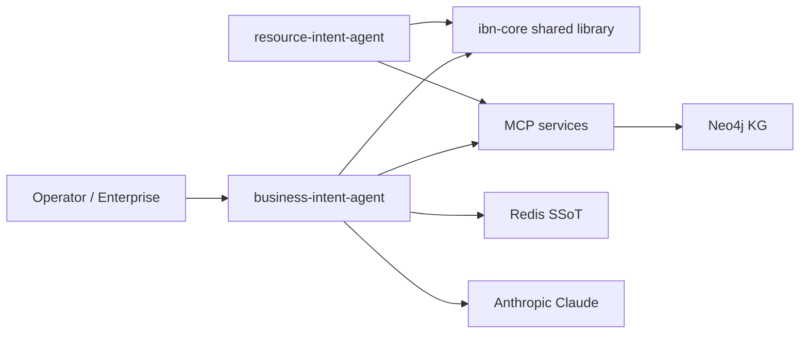
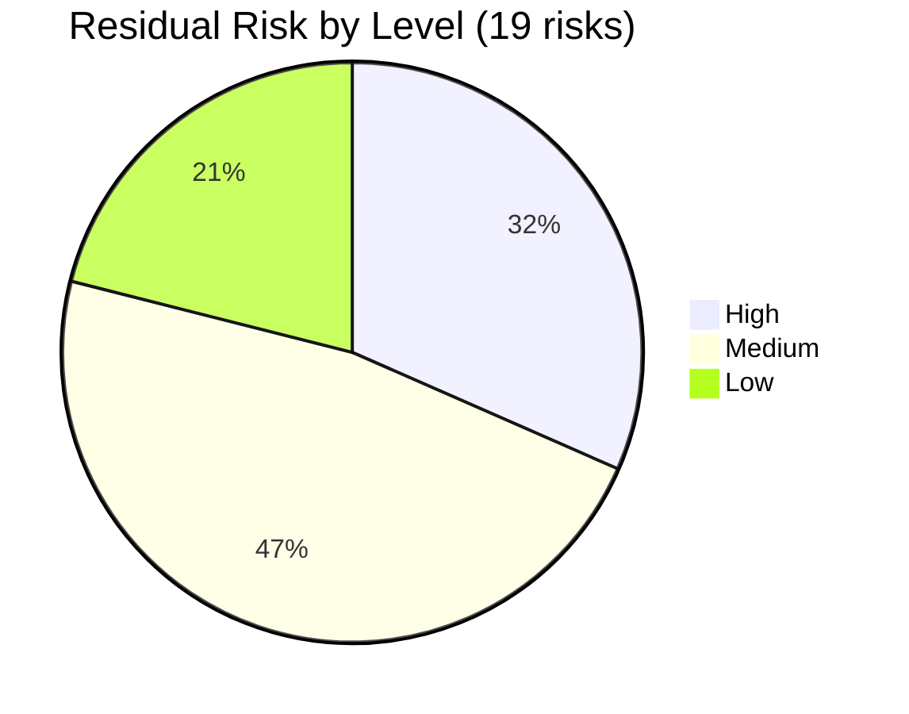
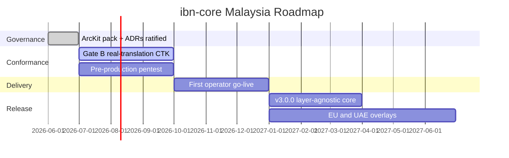

<!-- markdownlint-disable MD003 -->
# ibn-core (Malaysia) — Governance-as-Code Showcase

> **Template Origin**: Official | **ArcKit Version**: 5.11.0 | **Command**: `/arckit:presentation`

## Document Control

| Field | Value |
|-------|-------|
| **Document ID** | ARC-001-PRES-v1.0 |
| **Document Type** | Architecture Presentation (MARP) |
| **Project** | ibn-core-my (Project 001) |
| **Classification** | PUBLIC |
| **Status** | DRAFT |
| **Version** | 1.0 |
| **Created Date** | 2026-06-21 |
| **Last Modified** | 2026-06-21 |
| **Review Cycle** | On material change |
| **Next Review Date** | 2026-09-21 |
| **Owner** | Roland Pfeifer, Lead Architect / CTO (Vpnet Cloud Solutions Sdn. Bhd.) |
| **Reviewed By** | [PENDING] |
| **Approved By** | [PENDING] |
| **Distribution** | ArcKit Malaysian Community, ibn-core engineering, Vpnet SI delivery teams |

## Revision History

| Version | Date | Author | Changes | Approved By | Approval Date |
|---------|------|--------|---------|-------------|---------------|
| 1.0 | 2026-06-21 | ArcKit AI | Initial creation from `/arckit:presentation` command — stakeholder/showcase focus, ArcKit Malaysian Community | [PENDING] | [PENDING] |

---

<!-- MARP presentation begins below -->

---

marp: true
theme: default
paginate: true
header: 'ibn-core (Malaysia) — Governance-as-Code Showcase'
footer: 'ARC-001-PRES-v1.0 | PUBLIC | 2026-06-21'
---

# ibn-core — Malaysia

## Governance-as-Code with ArcKit

**2026-06-21** | **PUBLIC** | **Version 1.0**

Roland Pfeifer, Lead Architect / CTO — Vpnet Cloud Solutions Sdn. Bhd.
*Prepared for the ArcKit Malaysian Community*

---

## Agenda

1. Context & Objectives
2. Stakeholder Landscape — incl. the MY regulator triad
3. Architecture — "two peers, one core"
4. Malaysia Governance & Compliance Pack *(the showcase)*
5. Requirements & Risk Snapshot
6. Roadmap & Next Steps

---

## Context & Objectives

**What it is** — `ibn-core` is a **commercial, open-core (Apache 2.0)** RFC 9315 Intent-Based Networking framework targeting **TMF921 v5** conformance, delivered to Malaysian operators (U Mobile, TM Malaysia) under SI engagements.

**Why this deck** — to show the ArcKit community a **fully dogfooded governance trail**: 23 ArcKit artifacts, 6 ratified ADRs, and a per-market compliance pack — produced *alongside* the code, not after.

**Indicative business case (SOBC, ROM)**

| Metric | Value |
|--------|-------|
| 3-year net contribution | RM +5M – +16M |
| Payback | ~18–30 months from first go-live |
| Recommended option | Balanced (one operator to production by Q4 2026) |

---

## Stakeholder Landscape

A commercial telco programme answerable to a **three-regulator triad** — the defining feature of the Malaysian context.

| Stakeholder | Role | Interest | Influence |
|-------------|------|----------|-----------|
| Lead Architect / CTO (SD-1) | Sponsor / decider | High | High |
| SI Delivery + Operators (SD-2/4/5) | Delivery / users | High | High |
| **MCMC** (SD-10) | Telecom regulator | High | High |
| **JPDP** (SD-11) | PDPA / personal data | High | High |
| **NACSA** (SD-12) | NCII cyber-resilience | High | High |

> The MCMC / JPDP / NACSA triad is why the compliance pack (next slides) is the centre of gravity, not an afterthought.

---

## Architecture — "two peers, one core"

One shared RFC 9315 core; two peer apps instantiate it. Operator adapters stay private (the open-core seam, `McpAdapter`).

Standards: **RFC 9315** (IBN) · **TMF921 v5** (CTK 65/65 stubbed, Gate B) · cloud-agnostic K8s + Istio.

---

## Malaysia Governance & Compliance Pack

The showcase: a complete MY regulatory layer, **owner-ratified 2026-06-21** (management acceptance).

| Domain | Artefacts | Instrument | Status |
|--------|-----------|------------|--------|
| Privacy | PDPA, DPIA | PDPA 2010 (am. 2024) / JPDP | APPROVED* |
| Cyber / NCII | NCII, SECD | Cyber Security Act 2024 / NACSA | APPROVED* |
| AI governance | AIGE, AIPB | MOSTI AIGE / responsible-AI | APPROVED* |
| Residency / classification | MCRES, MYCLAS | PDPA + MCMC residency | APPROVED* |
| National alignment | MYDIG | MyDIGITAL | APPROVED* |

\* *Management acceptance by the accountable owner; qualified MY practitioner / counsel review required before external reliance (per each artefact's preamble).*

**Per-market overlay model**: **001 MY** (full pack) · **002 EU** (RGPD/AI Act/NIS2/CRA) · **003 UAE** (PDPL/AICH/IAS) — same core, market-specific overlays.

---

## Requirements & Risk Snapshot

**Requirements — 46 total**: 6 BR · 13 FR · 23 NFR · 4 INT (100% MUST/CRITICAL covered; traceability refreshed).

**Decisions — 6 ADRs, all EARB-APPROVED**: identity (Keycloak), landing-zone topology, data residency, MCP probe topology, product/image naming, A-lite library packaging.

> 0 residual Critical risks. The 6 appetite-exceeding risks cluster on the NON-NEGOTIABLE boundaries (AI autonomy on live infra, PDPA, NCII, open-core seam, conformance) — managed continuously.

---

## Roadmap & Next Steps

**Immediate actions**

1. Gate-B real-translation CTK 83/83 + live O2C → release `v3.0.0` — *Eng + Lead Architect, Q3 2026*
2. Pre-production penetration test (NFR-SEC-005) — *Security, before go-live*
3. Appoint EU/UAE specialist roles (DPO / CISO / AI-Gov) to unblock 002/003 sign-off — *Vpnet, 2026 H2*

---

## Questions & Discussion

**Contact**: Roland Pfeifer, Lead Architect / CTO — Vpnet Cloud Solutions Sdn. Bhd.
**Document**: `ARC-001-PRES-v1.0.md`
**Project artifacts**: `projects/001-ibn-core-my/` — 23 ArcKit artifacts, all on `main`
**Next Review**: 2026-09-21

*Built with ArcKit — governance-as-code, dogfooded.*

---

<!-- End of MARP presentation -->

## External References

> This section provides traceability from generated content back to source documents.

### Document Register

| Doc ID | Filename | Type | Source Location | Description |
|--------|----------|------|-----------------|-------------|
| ARC-001-SOBC | ARC-001-SOBC-v1.0.md | Business Case | projects/001-ibn-core-my/ | ROM net contribution, payback, recommended option |
| ARC-001-STKE | ARC-001-STKE-v1.0.md | Stakeholder Analysis | projects/001-ibn-core-my/ | Stakeholders incl. MCMC/JPDP/NACSA triad |
| ARC-001-REQ | ARC-001-REQ-v1.0.md | Requirements | projects/001-ibn-core-my/ | 46 requirements (6 BR / 13 FR / 23 NFR / 4 INT) |
| ARC-001-RISK | ARC-001-RISK-v1.0.md | Risk Register | projects/001-ibn-core-my/ | 19 risks; residual level distribution |
| ARC-001-DIAG-001 | ARC-001-DIAG-001-v1.0.md | Architecture Diagram | projects/001-ibn-core-my/diagrams/ | C4 "two peers, one core" |
| ARC-001-ADR-001..006 | decisions/ | ADRs | projects/001-ibn-core-my/decisions/ | 6 EARB-approved decisions |
| ARC-001 MY pack | DPIA/SECD/PDPA/NCII/AIGE/AIPB/MCRES/MYCLAS/MYDIG | Compliance | projects/001-ibn-core-my/ | Malaysia compliance pack (owner-signed) |

### Citations

| Citation ID | Doc ID | Page/Section | Category | Quoted Passage |
|-------------|--------|--------------|----------|----------------|
| [SOBC-1] | ARC-001-SOBC | Executive Summary | Business case | "3-year net contribution (ROM): RM +5M – RM +16M … payback ~18–30 months." |
| [STKE-1] | ARC-001-STKE | Stakeholder register | Stakeholders | MCMC (SD-10), JPDP (SD-11), NACSA (SD-12) regulator triad. |
| [REQ-1] | ARC-001-REQ | BR/FR/NFR/INT | Requirements | 46 requirements; 6 BR, 13 FR, 23 NFR, 4 INT. |
| [RISK-1] | ARC-001-RISK | Executive Summary | Risk | 19 risks; 0 residual Critical; 6 appetite-exceeding. |

### Unreferenced Documents

| Filename | Source Location | Reason |
|----------|-----------------|--------|
| ARC-001-TRAC-v1.0.md | projects/001-ibn-core-my/ | Traceability — summarised, not separately cited |
| ARC-001-OPS-v1.0.md | projects/001-ibn-core-my/ | Operational readiness — not in this showcase scope |
| ARC-001-HLDR-v1.0.md | projects/001-ibn-core-my/ | HLD review — not in this showcase scope |

---

**Generated by**: ArcKit `/arckit:presentation` command
**Generated on**: 2026-06-21
**ArcKit Version**: 5.11.0
**Project**: ibn-core-my (Project 001)
**AI Model**: claude-opus-4-8[1m]
**Generation Context**: Stakeholder/showcase deck (6–8 slides) for the ArcKit Malaysian Community. Synthesised from ARC-001 SOBC (business case), STKE (stakeholders/regulator triad), REQ (46 requirements), RISK (19 risks), DIAG-001 (C4), the 6 EARB-approved ADRs, and the owner-signed MY compliance pack (DPIA/SECD/PDPA/NCII/AIGE/AIPB/MCRES/MYCLAS/MYDIG). Mermaid labels ASCII-only.

<!-- arckit-provenance:start -->

## Build Provenance

_Stamped automatically by the ArcKit plugin's `provenance-stamp.mjs` PostToolUse hook. Complements (does not replace) the human-authored footer above. Carries only fields the model can't authoritatively self-report: build context from `.arckit/state.json` and effort levels derived from command frontmatter + the silent-downgrade matrix._

| Field | Value |
|-------|-------|
| Requested Effort | `high` |
| Effective Effort | _unknown — model not parsed from existing footer_ |
| Stamped at | 2026-06-21T12:44:40.360Z |

<!-- arckit-provenance:end -->
