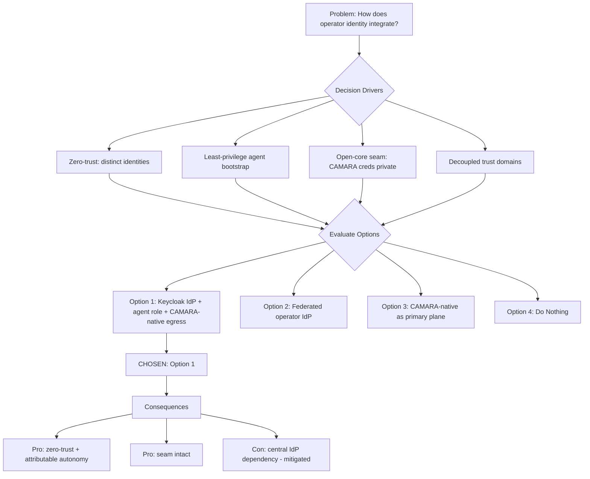

# Architecture Decision Record: Operator Identity via Keycloak as Central IdP with Distinct Constrained Agent Role and CAMARA-Native Egress Authentication

> **Template Origin**: Official | **ArcKit Version**: 5.11.0 | **Command**: `/arckit:adr`

## Document Control

| Field | Value |
|-------|-------|
| **Document ID** | ARC-001-ADR-001-v1.0 |
| **Document Type** | Architecture Decision Record |
| **Project** | ibn-core-my (Project 001) |
| **Classification** | PUBLIC |
| **Status** | DRAFT |
| **Version** | 1.0 |
| **Created Date** | 2026-06-05 |
| **Last Modified** | 2026-06-05 |
| **Review Cycle** | Quarterly |
| **Next Review Date** | 2026-09-05 |
| **Owner** | Roland Pfeifer, Lead Architect (Vpnet Cloud Solutions Sdn. Bhd.) |
| **Reviewed By** | [PENDING] |
| **Approved By** | [PENDING] |
| **Distribution** | ibn-core engineering, Vpnet SI delivery teams, operator integration partners, Security Lead |

## Revision History

| Version | Date | Author | Changes | Approved By | Approval Date |
|---------|------|--------|---------|-------------|---------------|
| 1.0 | 2026-06-05 | ArcKit AI | Initial creation from `/arckit:adr` command | [PENDING] | [PENDING] |

## 1. Decision Title

**Operator Identity via Keycloak as Central IdP with a Distinct Constrained Agent Role and CAMARA-Native Egress Authentication**

This ADR records how operator/commercial identity integrates into ibn-core: the identity provider (IdP) for human, service, and autonomous-agent principals; the assurance level applied to issued JSON Web Tokens (JWTs); how autonomous intent cycles bootstrap and run under a constrained agent-role identity; and how the framework authenticates outbound operator CAMARA API calls without coupling commercial identity to operator-specific auth.

> **Scope note**: This decision concerns **operator/commercial identity** (Keycloak/CAMARA). It is explicitly **not** about Malaysia's national MyDigital ID, which is out of scope for ibn-core's intent-management surface.

---

## 2. Stakeholders

### 2.1 Deciders (RACI: Accountable)

- **Roland Pfeifer, Lead Architect / CTO (Vpnet Cloud Solutions)** — final authority over NON-NEGOTIABLE security principles (PRIN Principle 4); accountable for the open-core seam.
- **Security Lead (Vpnet Cloud Solutions)** — accountable for zero-trust posture, agent identity scoping, and PDPA-adjacent identity controls.

### 2.2 Consulted (RACI: Consulted)

- **Enterprise / Solution Architect (Vpnet)** — authentication topology and Istio mesh integration.
- **Operator Integration Architect (U Mobile, TM Malaysia)** — CAMARA API authentication contracts and any operator-side federation requirements.
- **SI Engineer / Platform Operator (Vpnet)** — Keycloak realm provisioning, agent-role token issuance, secret handling.
- **Operator Compliance Officer** — assurance-level acceptability for privileged operations on live network state.

### 2.3 Informed (RACI: Informed)

- ibn-core engineering team.
- Open-source maintainers / community (interface-level consumers of the public auth modules).
- Auditor / Compliance Reviewer (Persona 5).

### 2.4 UK Government Escalation Context

> **Note**: ibn-core is a Malaysian commercial product, not a UK Government service. The escalation taxonomy below is retained for ArcKit governance consistency; "Department" maps to the Vpnet Enterprise Architecture Review Board.

**Decision Level**: Department

**Escalation Rationale**:

- [ ] **Team**: Local implementation choice (frameworks, libraries, testing)
- [ ] **Cross-team**: Integration patterns, shared services, API standards
- [x] **Department**: Technology standards, cloud providers, **security/identity frameworks** — this decision sets the identity and assurance standard for the whole programme and every SI engagement.
- [ ] **Cross-government**: National infrastructure, cross-department interoperability

**Governance Forum**: Vpnet Cloud Solutions Enterprise Architecture Review Board (EARB)

**Approval Date**: [YYYY-MM-DD] (pending)

---

## 3. Context and Problem Statement

### 3.1 Problem Description

ibn-core authenticates three distinct classes of principal — human operators, internal services, and an **autonomous intent agent** that can mutate live operator network configuration — and it must in turn authenticate **outbound** calls to operator CAMARA APIs. Today the framework validates Keycloak-issued JWTs against an `identityconfig-operator-keycloak` realm (`src/auth-jwt.ts`, `src/auth-router.ts`, ODA Canvas UC007) and runs autonomous cycles under a constrained agent role (FR-007). The open question is the **architecture of operator identity end-to-end**: which IdP is authoritative, what assurance level the JWTs must carry, how the agent role is bootstrapped and bounded, and how CAMARA egress auth relates to the commercial identity plane.

**Problem statement as a question**: How should ibn-core integrate operator identity — IdP choice, JWT assurance level, agent-role bootstrap, and CAMARA egress authentication — so that every privileged and autonomous action is authenticated, least-privileged, attributable, and standards-aligned, without weakening the open-core seam?

### 3.2 Why This Decision Is Needed

ibn-core handles operator subscriber context, identity tokens, and autonomous agent actions that change live network state. Per PRIN Principle 4 (Security by Design, NON-NEGOTIABLE) there is **no network-based trust**; every request — including agent-to-service calls — must be authenticated under a distinct identity. An undecided or ad-hoc identity architecture risks privilege over-reach by the agent, non-attributable autonomous actions, and leakage of operator credentials into the public repo (a PRIN Principle 9 breach). The decision is also a prerequisite for the Pre-Production architecture gate (PRIN §VII) that gates SI go-live.

- **Business context**: BR-004 (operator-grade SI delivery), BR-005 (auditable, trustworthy autonomous behaviour).
- **Technical context**: FR-006 (identity-based authn/authz), FR-007 (constrained agent-role identity), INT-001 (CAMARA via MCP), INT-003 (Keycloak OIDC/JWT), NFR-SEC-001/002/004.
- **Regulatory context**: Malaysia PDPA 2010 (subscriber data accessed under authenticated, least-privilege identities); operator-contractual security obligations; ISO 27001 / SOC 2 control expectations for SI engagements.

### 3.3 Supporting Links

- **Code seam**: `src/auth-jwt.ts`, `src/auth-router.ts` (JWT validation against the configured realm); `src/mcp/McpAdapter.ts` (open-core seam carrying agent-role identity to operator adapters).
- **Requirements**: BR-004, BR-005, FR-006, FR-007, INT-001, INT-003, NFR-SEC-001, NFR-SEC-002, NFR-SEC-004, NFR-C-002.
- **Standards**: RFC 9315 §4 Principle 3 (Autonomy — identity bootstrap consumption); ODA Canvas UC007 (Keycloak JWT validation against `identityconfig-operator-keycloak`); OAuth 2.0 / OIDC; CAMARA API authentication (Apache 2.0).
- **Related ADRs**: None yet (this is ADR-001). Future ADRs on secrets management and mesh mTLS policy will depend on this.

---

## 4. Decision Drivers (Forces)

### 4.1 Technical Drivers

- **Distinct identity per principal class (zero-trust)**: Human, service, and agent principals must be separable and individually authenticated.
  - Requirements: FR-006, FR-007, NFR-SEC-001, NFR-SEC-002.
  - Architecture principles: PRIN Principle 4 (Security by Design — Identity-Based Access, Least Privilege).
- **Least-privilege agent bootstrap**: The autonomous cycle must obtain a token scoped to exactly the operations it needs (orchestrate/cancel intent) — never a human or admin identity.
  - Requirements: FR-007; RFC 9315 §4 P3 (Autonomy).
- **Attributability**: Every privileged/autonomous action must be traceable to the acting identity for audit (NFR-C-002) and agent telemetry (FR-011).
- **Open-core seam integrity**: CAMARA egress credentials and operator-specific auth logic must not enter the public repo; the `McpAdapter` interface carries identity context but not operator secrets.
  - Architecture principles: PRIN Principle 9 (NON-NEGOTIABLE).
- **Loose coupling / decoupled trust domains**: Commercial identity (who may submit/manage intent) must be decoupled from operator egress auth (how ibn-core proves itself to a CAMARA endpoint), so the two evolve independently per engagement.
  - Architecture principles: PRIN Principle 10 (Loose Coupling).

### 4.2 Business Drivers

- **SI deployability**: Operators expect a recognised, self-hostable IdP and clear assurance levels (BR-004). Stakeholder goal: pass the Pre-Production gate.
- **Trustworthy autonomy as a selling point**: BR-005 — operators and regulators must be able to review and bound agent actions; "black-box" autonomy is unsellable.
- **Avoid credential lock-in / leakage liability**: Keeping operator CAMARA credentials out of the public repo protects both licence posture and commercial value (BR-003).

### 4.3 Regulatory & Compliance Drivers

> ibn-core targets Malaysian operators; UK Government frameworks below are mapped for ArcKit governance parity, with the controlling regime in brackets.

- **GDS Service Standard** [parity]: Point 5 (Security) — identity and least privilege; Point 4 (Open standards) — OIDC/OAuth 2.0, TMF921.
- **Technology Code of Practice** [parity]: Point 5 (Cloud first — self-hostable IdP), Point 8 (Reuse — Keycloak rather than bespoke auth), Point 13 (AI — constrained agent identity for autonomous behaviour).
- **NCSC Cyber Security** [parity]: zero-trust identity, secrets in a vault, structured auth logging.
- **Data Protection** [controlling: Malaysia PDPA 2010; UK GDPR Art. 25/35 mapped for parity]: least-privilege access to subscriber data; DPIA covers identity under which AI processes personal data.
- **ISO 27001 / SOC 2 Type II** [controlling for SI]: access control, identity, and audit-logging control families.

### 4.4 Alignment to Architecture Principles

| Principle | Alignment | Impact |
|-----------|-----------|--------|
| 4. Security by Design (NON-NEGOTIABLE) | ✅ Supports | Central IdP + distinct constrained agent role realise Identity-Based Access and Least Privilege directly. |
| 9. Open-Core / Proprietary Seam Integrity (NON-NEGOTIABLE) | ✅ Supports | CAMARA egress credentials stay in the private repo/vault; the public seam carries identity context, not operator secrets. |
| 10. Loose Coupling | ✅ Supports | Commercial identity (Keycloak) decoupled from operator egress auth (CAMARA-native), evolvable per engagement. |
| 5. Observability | ✅ Supports | Acting identity attached to audit logs and agent telemetry spans (FR-011, NFR-C-002). |
| 6. Data Sovereignty | ⚠️ Partial | Self-hosted Keycloak supports residency, but realm placement per operator must be confirmed at design time. |
| 2. Resilience and Fault Tolerance | ⚠️ Partial | A central IdP is a dependency; requires JWKS caching and fail-closed-for-privileged behaviour (INT-003) to avoid a hard SPOF. |

---

## 5. Considered Options

Three options analysed against a "Do Nothing" baseline (option count: 3, the Recommended setting).

### Option 1: Keycloak as central IdP, distinct constrained agent role, CAMARA-native egress auth (RECOMMENDED)

**Description**: Keycloak (self-hosted, `identityconfig-operator-keycloak` realm) is the single authoritative IdP for human and service principals. The autonomous intent agent bootstraps a **distinct OAuth 2.0 client-credentials identity** mapped to a least-privilege `agent` realm role; autonomous cycles run exclusively under that role. JWT assurance is layered: standard-assurance access tokens for read/submit operations, and an **elevated assurance gate** (short token lifetime, re-validation per call, and — for human-initiated privileged actions — MFA upstream) for operations that mutate live network state. Outbound CAMARA API authentication is handled **at the operator-adapter boundary in the private repo** using CAMARA-native auth (e.g. operator OAuth 2.0 client credentials), with credentials held in a vault — never coupled to or derived from the Keycloak commercial identity.

**Implementation approach**: Retain `src/auth-jwt.ts`/`src/auth-router.ts` realm validation (signature, issuer, expiry, role claims; JWKS with caching). Provision an `agent` realm role with least privilege; issue an agent-role token via client-credentials at cycle start and thread it through `McpAdapter.orchestrate()` / `cancelIntent()`. The adapter, in the private repo, exchanges/holds CAMARA credentials independently. Audit logs and telemetry spans carry the acting identity.

**Wardley Evolution Stage**: Product (Keycloak, OIDC, CAMARA auth are off-the-shelf/commodity standards); the agent-role bootstrap pattern is Custom-Built.

#### Good (Pros)

- ✅ **Direct zero-trust realisation**: distinct identities per principal class satisfy FR-006, FR-007, PRIN Principle 4 with no implicit trust.
- ✅ **Open-core seam preserved**: CAMARA credentials stay private/vaulted; the public seam carries only identity context (PRIN Principle 9, BR-003).
- ✅ **Decoupled trust domains**: commercial identity and operator egress auth evolve independently per engagement (PRIN Principle 10, INT-001/INT-003).
- ✅ **Reuse over bespoke**: Keycloak is a mature, self-hostable OIDC provider — no custom auth server to maintain (TCoP Point 8).
- ✅ **Assurance proportionality**: elevated-assurance gate on network-mutating ops aligns control strength to risk without burdening reads.
- ✅ **Attributable autonomy**: every agent tool call is identity-stamped for audit and telemetry (BR-005, NFR-C-002, FR-011).

#### Bad (Cons)

- ❌ **IdP availability dependency**: Keycloak becomes a critical dependency; mitigated by JWKS caching and fail-closed-for-privileged (INT-003), but adds resilience design work (PRIN Principle 2).
- ❌ **Two credential planes to operate**: SI teams manage both Keycloak realm config and per-operator CAMARA credentials in the vault.
- ❌ **Assurance-level definition cost**: the "elevated assurance" gate must be precisely specified (token TTL, re-validation, MFA scope) to avoid ambiguity.

#### Cost Analysis

- **CAPEX**: Low — Keycloak is open-source (Apache 2.0). One-time: realm/role design, agent client-credentials wiring, assurance-gate implementation. Estimated 2–3 engineering weeks.
- **OPEX**: Keycloak hosting + operations; per-engagement realm/credential management; periodic credential rotation (NFR-SEC-004).
- **TCO (3-year)**: Low–Moderate — dominated by operational hosting/rotation effort, not licensing.

#### GDS Service Standard Impact

| Point | Impact | Notes |
|-------|--------|-------|
| 4. Open standards | Positive | OIDC / OAuth 2.0, TMF921, CAMARA — all open. |
| 5. Security | Positive | Zero-trust identity, least-privilege agent role, vaulted egress credentials. |
| 9. Technology | Positive | Self-hostable; supports operator residency and IaC deployment. |

---

### Option 2: Federated operator IdP (Keycloak brokers to operator's IdP)

**Description**: The operator's own IdP is authoritative for human/service identity; Keycloak is deployed as an **identity broker** that federates to the operator IdP (SAML/OIDC), and ibn-core trusts brokered tokens. The agent role is still issued locally.

**Implementation approach**: Configure Keycloak identity brokering per operator; map operator claims into the realm; agent-role bootstrap unchanged.

**Wardley Evolution Stage**: Product (brokering is a standard Keycloak feature) but with Custom-Built per-operator federation config.

#### Good (Pros)

- ✅ **Operator-native SSO**: human operators use their existing corporate identity — attractive for some SI engagements.
- ✅ **Reduced human-credential custody**: ibn-core does not store operator human credentials.

#### Bad (Cons)

- ❌ **Per-operator federation complexity**: every engagement needs bespoke brokering config; raises integration cost and fragility (conflicts with deployment-repeatability goals).
- ❌ **Assurance-level dependency on operator IdP**: ibn-core cannot guarantee the assurance of brokered tokens; complicates the elevated-assurance gate for network-mutating ops.
- ❌ **Slower alpha**: alpha (FR-006) uses a local realm; federation is premature before any operator IdP exists to federate to.
- ❌ **Agent identity unchanged**: solves only the human-identity slice, not the core agent-bootstrap/CAMARA-egress questions.

#### Cost Analysis

- **CAPEX**: Moderate — per-operator federation design and testing.
- **OPEX**: Higher — ongoing maintenance of federation trust per operator.
- **TCO (3-year)**: Moderate–High, scaling with operator count.

#### GDS Service Standard Impact

| Point | Impact | Notes |
|-------|--------|-------|
| 4. Open standards | Positive | SAML/OIDC federation. |
| 5. Security | Neutral | Assurance inherited from operator IdP; harder to guarantee centrally. |
| 9. Technology | Negative | Per-operator config undermines repeatable deployment. |

---

### Option 3: CAMARA-native auth as the primary identity plane (no central commercial IdP)

**Description**: Drop a dedicated commercial IdP and authenticate principals directly with CAMARA-style operator OAuth 2.0 / the operator's API auth, reusing the same credentials for both inbound principal auth and outbound CAMARA calls.

**Implementation approach**: Replace Keycloak realm validation with CAMARA/operator OAuth introspection; the agent reuses operator client credentials.

**Wardley Evolution Stage**: Product (CAMARA auth is standardised) but mis-applied as a general principal-identity plane.

#### Good (Pros)

- ✅ **Single credential plane**: one auth mechanism for inbound and outbound.
- ✅ **No separate IdP to host**: fewer moving parts on paper.

#### Bad (Cons)

- ❌ **Collapses trust-domain separation**: couples "who may manage intent" to "how ibn-core proves itself to the operator" — violates PRIN Principle 10 and weakens least privilege.
- ❌ **Open-core seam breach risk**: pushing CAMARA credentials into the principal-auth path risks operator secrets reaching the public framework (PRIN Principle 9, NON-NEGOTIABLE).
- ❌ **No distinct agent identity**: the agent would reuse operator credentials, defeating FR-007 and BR-005 attributability.
- ❌ **CAMARA auth not designed for human/agent RBAC**: it is an egress API-auth scheme, not an enterprise IdP — no realm roles, MFA, or assurance gating.
- ❌ **Per-operator inbound coupling**: inbound auth would differ per operator, fragmenting the public API contract.

#### Cost Analysis

- **CAPEX**: Low to start, High to remediate once the coupling causes incidents.
- **OPEX**: High hidden cost — credential blast radius and audit gaps.
- **TCO (3-year)**: High once remediation and compliance exposure are counted.

#### GDS Service Standard Impact

| Point | Impact | Notes |
|-------|--------|-------|
| 4. Open standards | Neutral | CAMARA is open but misused as principal IdP. |
| 5. Security | Negative | Collapses trust domains; no distinct agent identity. |
| 9. Technology | Negative | Per-operator inbound auth fragments the public contract. |

---

### Option 4: Do Nothing (Baseline)

**Description**: Leave operator identity as the current implicit state — Keycloak JWT validation exists in code but the agent-role bootstrap, assurance-level policy, and CAMARA-egress trust boundary remain undocumented and unratified.

#### Good

- ✅ **No immediate cost**: no new engineering.
- ✅ **No migration risk**: current code path unchanged.

#### Bad

- ❌ **Technical debt accumulates**: assurance level and agent-bootstrap remain ad-hoc; future agents re-litigate the question (violates the agent-native "decision docs over tribal knowledge" rule).
- ❌ **Opportunity cost**: blocks the Pre-Production gate (PRIN §VII) and SI go-live readiness (BR-004).
- ❌ **Compliance risk**: no ratified least-privilege agent identity or assurance policy → fails BR-005, FR-007, NFR-SEC-002 evidence; weak audit posture (NFR-C-002).

---

## 6. Decision Outcome

### 6.1 Chosen Option

**"Option 1: Keycloak as central IdP, distinct constrained agent role, CAMARA-native egress auth"**

### 6.2 Y-Statement (Structured Justification)

> **In the context of** authenticating human, service, and autonomous-agent principals in ibn-core and authenticating outbound operator CAMARA calls,
> **facing** a zero-trust mandate, the need for attributable and least-privileged autonomous behaviour, and a non-negotiable open-core seam,
> **we decided for** Keycloak as the central commercial IdP with a distinct constrained agent realm role and CAMARA-native egress authentication held privately,
> **to achieve** identity-based access, proportional JWT assurance for network-mutating operations, attributable autonomy, and decoupled trust domains,
> **accepting** a critical IdP dependency (mitigated by JWKS caching and fail-closed-for-privileged) and the operation of two credential planes.

### 6.3 Justification (Why This Option?)

**Key reasons**:

1. **It is the only option that satisfies all NON-NEGOTIABLE principles simultaneously**: Principle 4 (distinct, least-privilege identities), Principle 9 (CAMARA credentials stay private), and Principle 10 (decoupled trust domains). Options 2 and 3 each break at least one.
2. **It maps cleanly to existing requirements and code**: FR-006/FR-007/INT-003 already assume Keycloak realm validation and a constrained agent role; this ADR ratifies and bounds that path rather than re-architecting (`src/auth-jwt.ts`, `src/auth-router.ts`, `src/mcp/McpAdapter.ts`).
3. **Proportional assurance**: a two-tier assurance model (standard for read/submit; elevated — short TTL, per-call re-validation, MFA upstream for human-initiated mutations) aligns control strength to the risk of mutating live network state without slowing routine reads (NFR-SEC-001/002).
4. **Alpha-appropriate, SI-extensible**: a local realm serves alpha now; Option 2 federation can be added later per engagement as a non-conflicting extension if an operator requires SSO — so choosing Option 1 does not foreclose Option 2.

**Stakeholder consensus**: Security Lead and Lead Architect aligned on least-privilege agent identity as a release-gate control. Operator Integration Architect to confirm CAMARA-native egress auth contracts at design time.

**Risk appetite**: Medium. The accepted IdP-dependency risk is within appetite given the resilience mitigations; the alternative (collapsed trust domains in Option 3) exceeds appetite for a system that mutates live operator networks.

---

## 7. Consequences

### 7.1 Positive Consequences

- ✅ **Zero-trust identity realised**: distinct human/service/agent identities, each authenticated (FR-006, FR-007).
- ✅ **Attributable autonomy**: 100% of agent tool calls stamped with the agent-role identity (BR-005 success criterion, NFR-C-002).
- ✅ **Open-core seam intact**: zero operator CAMARA credentials in the public repo (BR-003, PRIN Principle 9).
- ✅ **Pre-Production gate unblocked** for the identity control family (PRIN §VII).

**Measurable outcomes**:

- Agent tool calls under the constrained agent role: ad-hoc → **100%** (target; FR-007/BR-005).
- Operator credentials in public repo: → **0** (verified each release; BR-003).
- Privileged (network-mutating) operations behind the elevated-assurance gate: → **100%** (target).

### 7.2 Negative Consequences (Accepted Trade-offs)

- ❌ **Central IdP dependency**: Keycloak availability gates authenticated traffic.
- ❌ **Two credential planes**: commercial identity (Keycloak) and operator egress (CAMARA/vault) operated separately.
- ❌ **Assurance-gate specification burden**: elevated-assurance parameters must be documented precisely.

**Mitigation strategies**:

- **IdP dependency**: JWKS caching with bounded staleness; fail-closed for privileged operations, fail-safe (degraded read) where acceptable; future ADR on IdP HA/DR.
- **Two credential planes**: vault-managed CAMARA credentials with rotation (NFR-SEC-004); SI runbook for credential lifecycle.
- **Assurance gate**: define token TTLs, re-validation cadence, and MFA scope in the security design / DLD; regression-test the gate.

### 7.3 Neutral Consequences (Changes Needed)

- 🔄 **Realm/role provisioning**: `agent` least-privilege role added to the realm; client-credentials client for the agent.
- 🔄 **Vault integration**: CAMARA credentials provisioned into the secret store per engagement.
- 🔄 **Telemetry**: acting identity added to audit logs and OTel spans (FR-011 alignment).
- 🔄 **Runbooks**: identity provisioning, agent-token issuance, and credential-rotation runbooks (NFR-M-003).

### 7.4 Risks and Mitigations

| Risk | Likelihood | Impact | Mitigation | Owner |
|------|------------|--------|------------|-------|
| Keycloak outage blocks authenticated traffic | M | H | JWKS caching; fail-closed-for-privileged; IdP HA/DR (future ADR) | SI Engineer |
| Agent role over-privileged (scope creep) | M | H | Least-privilege role review at each release; deny-by-default scopes (FR-007) | Security Lead |
| CAMARA credential leakage into public repo | L | H | Vault-only storage; CI secret/credential scanning; seam review (PRIN P9) | Lead Architect |
| Elevated-assurance gate under-specified / inconsistent | M | M | Define TTL/re-validation/MFA in DLD; regression tests on the gate | Security Lead |
| Brokered-federation (future Option 2) weakens assurance | L | M | Treat federation as an explicit later ADR with assurance acceptance criteria | Enterprise Architect |

**Link to risk register**: No `ARC-001-RISK-v*.md` exists yet — run `/arckit:risk`; candidate risks above should be registered as RISK-IDs and back-linked.

---

## 8. Validation & Compliance

### 8.1 How Will Implementation Be Verified?

**Design review**:

- [ ] HLD/DLD document the IdP topology, agent-role scopes, assurance tiers, and CAMARA-egress trust boundary.
- [ ] Architecture/sequence diagrams show token flow for human, agent, and CAMARA-egress paths.

**Code review**:

- [ ] PR checklist confirms agent cycles use the agent-role token (not human/admin) through `McpAdapter`.
- [ ] No operator CAMARA credentials present in public-repo code/config (seam check).
- [ ] `src/auth-jwt.ts` validates signature, issuer, expiry, and role claims against the configured realm.

**Testing strategy**:

- [ ] Unit tests: token validation (valid/expired/forged); role-claim enforcement.
- [ ] Integration tests: O2C cycle runs under the agent role end-to-end (FR-007 acceptance).
- [ ] Security tests: privilege-escalation attempt (human/admin running a cycle) is prevented or flagged.
- [ ] Negative tests: elevated-assurance gate blocks under-assured tokens on network-mutating ops.

### 8.2 Monitoring & Observability

**Success metrics**:

- **% agent tool calls under agent role**: target 100% (telemetry span identity attribute).
- **% privileged ops behind elevated-assurance gate**: target 100%.
- **Auth failure / rejection rate**: monitored for anomalies (forged/expired tokens).

**Alerts and dashboards**:

- Alert on any agent tool call lacking the agent-role identity attribute.
- Alert on IdP/JWKS fetch failures crossing the staleness budget.
- Dashboard of auth outcomes by principal class and assurance tier.

### 8.3 Compliance Verification

**GDS Service Assessment** [parity]:

- [ ] Point 5 (Security): least-privilege identity and assurance gating evidenced.
- [ ] Point 4 (Open standards): OIDC/OAuth 2.0, TMF921, CAMARA.

**Technology Code of Practice** [parity]:

- [ ] Point 8 (Reuse): Keycloak rather than bespoke auth.
- [ ] Point 13 (AI): constrained agent identity for autonomous behaviour.

**Security assurance**:

- [ ] NCSC zero-trust identity principles applied.
- [ ] Secrets in vault; no credentials in public repo (NFR-SEC-004).
- [ ] Penetration test of the identity/authz surface prior to SI go-live (NFR-SEC-005).

**Data protection**:

- [ ] DPIA (`/arckit:dpia`) records the identity under which AI processes subscriber data (PDPA 2010 / Art. 35 parity).
- [ ] Token/identity flows added to data-flow diagrams.

---

## 9. Links to Supporting Documents

### 9.1 Requirements Traceability

**Business Requirements**:

- BR-003: Open-core model integrity — CAMARA credentials remain private.
- BR-004: Operator-grade SI delivery — passes the identity control family at the Pre-Production gate.
- BR-005: Auditable, trustworthy autonomous behaviour — attributable agent-role identity.

**Functional Requirements**:

- FR-006: Identity-based authentication and authorisation (Keycloak JWT).
- FR-007: Constrained agent-role identity for autonomous cycles.

**Non-Functional Requirements**:

- NFR-SEC-001: Authentication (MFA for human/privileged; signed tokens for agent).
- NFR-SEC-002: Authorization (RBAC, least privilege, constrained agent role).
- NFR-SEC-004: Secrets management (vaulted CAMARA credentials, rotation).
- NFR-C-002: Audit logging (acting identity recorded).

**Integration Requirements**:

- INT-001: Operator CAMARA APIs via MCP (egress auth boundary).
- INT-003: Keycloak Identity Provider (OIDC/JWT validation).

### 9.2 Architecture Artifacts

**Architecture principles**: `projects/000-global/ARC-000-PRIN-v1.0.md`

- Principle 4 (Security by Design), Principle 9 (Open-Core Seam), Principle 10 (Loose Coupling), Principle 5 (Observability), Principle 6 (Data Sovereignty), Principle 2 (Resilience).

**Stakeholder drivers**: `projects/001-ibn-core-my/ARC-001-STKE-v1.0.md`

- Security Lead and Operator Compliance Officer goals (zero-trust, auditable autonomy).

**Risk register**: `projects/001-ibn-core-my/ARC-001-RISK-v*.md` — not yet created; run `/arckit:risk`.

**Research findings**: `projects/001-ibn-core-my/ARC-001-RSCH-v*.md` — not yet created.

**Architecture diagrams**: token-flow / identity sequence diagrams — to be produced (`/arckit:diagram`).

### 9.3 Design Documents

**High-Level Design**: pending — must implement the IdP topology and assurance tiers from this ADR.

**Detailed Design**: pending — agent-role scopes, token TTLs, re-validation cadence, MFA scope, CAMARA-egress auth.

**Data model**: identity/token entities — N/A to core data model beyond audit attribution.

### 9.4 External References

**Standards and RFCs**:

- RFC 9315 §4 Principle 3 (Autonomy), DOI 10.17487/RFC9315.
- OAuth 2.0 (RFC 6749), OpenID Connect Core 1.0.
- TMF921 Intent Management API v5.0.0 (Apache 2.0).
- CAMARA API authentication (Linux Foundation, Apache 2.0).

**Vendor / project documentation**:

- Keycloak (OIDC/JWT, realm roles, identity brokering, client credentials).
- ODA Canvas UC007 (identity), UC006 (observability).

**Code references**:

- `src/auth-jwt.ts`, `src/auth-router.ts`, `src/mcp/McpAdapter.ts`.

---

## 10. Implementation Plan

### 10.1 Dependencies

**Prerequisite decisions**: None (ADR-001). Future secrets-management and IdP-HA ADRs depend on this.

**Infrastructure dependencies**: Keycloak instance + `identityconfig-operator-keycloak` realm; secret store (vault) for CAMARA credentials.

**Team dependencies**: Keycloak realm/role administration; vault operations.

### 10.2 Implementation Timeline

| Phase | Activities | Duration | Owner |
|-------|-----------|----------|-------|
| **Phase 1: Preparation** | Define `agent` role scopes, assurance tiers, token TTLs; realm/client setup | 1 week | Security Lead |
| **Phase 2: Implementation** | Agent client-credentials bootstrap; thread identity through `McpAdapter`; vault CAMARA creds | 1–2 weeks | ibn-core engineering |
| **Phase 3: Validation** | Auth unit/integration/security tests; privilege-escalation negative tests | 1 week | Security Lead |
| **Phase 4: Deployment** | Roll into alpha; wire telemetry identity attribute; runbooks | 1 week | SI Engineer |

### 10.3 Rollback Plan

**Rollback trigger**: Agent-role bootstrap causes broad authz failures blocking the O2C journey, or the assurance gate produces false denials on valid privileged ops.

**Rollback procedure**:

1. Revert the agent-role enforcement commit; fall back to the prior (documented) auth path under a time-boxed exception.
2. Keep Keycloak realm validation active (non-regressing).
3. Raise a defect, fix forward, re-enable agent-role enforcement before any SI go-live (it is a release-gate control — rollback is alpha-only and time-boxed).

**Rollback owner**: Security Lead.

---

## 11. Review and Updates

### 11.1 Review Schedule

**Initial review**: 2026-09-05 (quarterly cadence; or on first operator SI engagement, whichever is sooner).

**Periodic review**: Quarterly, aligned to PRIN review cycle.

**Review criteria**:

- Are agent-role and assurance-gate metrics at 100%?
- Has an operator required SSO (triggering an Option-2 federation ADR)?
- Is the IdP-dependency mitigation sufficient in practice?
- Should this ADR be superseded?

### 11.2 Trigger Events for Review

- [ ] An operator mandates federated SSO (evaluate Option 2 as a new ADR).
- [ ] Move from mock to live CAMARA (v3.0.0) — egress auth contracts firm up.
- [ ] Security incident involving identity or agent privilege.
- [ ] Keycloak major version change or IdP replacement.
- [ ] Regulatory change to PDPA 2010 identity/access obligations.

---

## 12. Related Decisions

### 12.1 Decisions This ADR Depends On

- None (ADR-001).

### 12.2 Decisions That Depend On This ADR

- **Future ADR (Secrets management / vault)**: consumes the CAMARA-egress credential boundary defined here.
- **Future ADR (IdP HA/DR)**: addresses the accepted central-IdP dependency.
- **Future ADR (Federated operator SSO)**: only if an operator requires Option 2 federation.

### 12.3 Conflicting Decisions

- None at present.

---

## 13. Appendices

### Appendix A: Options Analysis Details

Assurance model (two-tier) — to be parameterised in the DLD:

- **Standard assurance**: read/submit operations; standard access-token TTL; signature/issuer/expiry/role validation.
- **Elevated assurance**: network-mutating operations (orchestrate/cancel against live state); short token TTL; per-call re-validation; MFA upstream for human-initiated mutations; agent-role token bounded to the cycle.

### Appendix B: Stakeholder Consultation Log

| Date | Stakeholder | Feedback | Action Taken |
|------|-------------|----------|--------------|
| 2026-06-05 | Security Lead (assumed) | Least-privilege agent identity is a release-gate control | Captured as Option 1 core + metric |
| [PENDING] | Operator Integration Architect | Confirm CAMARA-native egress auth contracts | Deferred to design time |

### Appendix C: Alternative Formats

**Mermaid Decision Flow Diagram**:

---

## Document Approval

| Role | Name | Signature | Date |
|------|------|-----------|------|
| **Technical Architect** | [PENDING] | | YYYY-MM-DD |
| **Senior Responsible Owner** | Roland Pfeifer (Lead Architect / CTO) | | YYYY-MM-DD |
| **Security Architect** | [PENDING] | | YYYY-MM-DD |
| **Governance Board** | Vpnet Cloud Solutions EARB | | YYYY-MM-DD |

---

*This ADR follows the MADR v4.0 format enhanced with UK Government requirements and ArcKit governance standards.*

*For more information:*

- *MADR: https://adr.github.io/madr/*
- *UK Gov ADR Framework: https://www.gov.uk/government/publications/architectural-decision-record-framework*
- *ArcKit Documentation: project README*

## External References

> This section provides traceability from generated content back to source documents.
> Follow citation instructions in the project's citation reference guide.

### Document Register

| Doc ID | Filename | Type | Source Location | Description |
|--------|----------|------|-----------------|-------------|
| *None provided* | — | — | — | — |

### Citations

| Citation ID | Doc ID | Page/Section | Category | Quoted Passage |
|-------------|--------|--------------|----------|----------------|
| — | — | — | — | — |

### Unreferenced Documents

| Filename | Source Location | Reason |
|----------|-----------------|--------|
| — | — | — |

---

**Generated by**: ArcKit `/arckit:adr` command
**Generated on**: 2026-06-05
**ArcKit Version**: 5.11.0
**Project**: ibn-core-my (Project 001)
**AI Model**: claude-opus-4-8[1m]
**Generation Context**: Derived from ARC-000-PRIN-v1.0 (Principles 4, 9, 10, 5, 6, 2) and ARC-001-REQ-v1.0 (BR-003/004/005, FR-006/007, INT-001/003, NFR-SEC-001/002/004, NFR-C-002). No external reference documents were provided.
