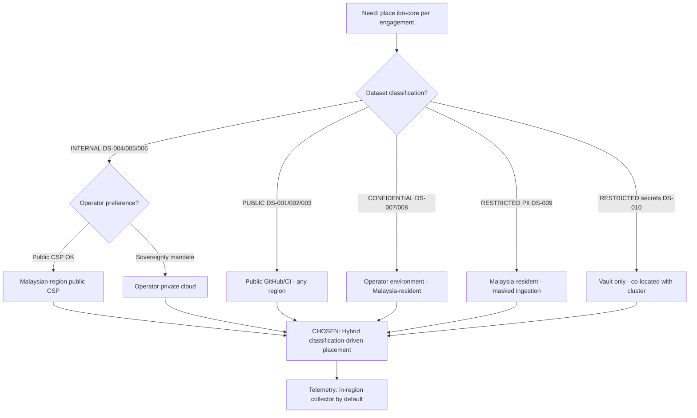

# Architecture Decision Record: Cloud Platform and Data-Centre Placement — Hybrid, Classification-Driven Landing Zones (Operator Private Cloud + Malaysian-Region Public CSP)

> **Template Origin**: Official | **ArcKit Version**: 5.11.0 | **Command**: `/arckit:adr`

## Document Control

| Field | Value |
|-------|-------|
| **Document ID** | ARC-001-ADR-002-v1.0 |
| **Document Type** | Architecture Decision Record |
| **Project** | ibn-core-my (Project 001) |
| **Classification** | PUBLIC |
| **Status** | APPROVED |
| **Version** | 1.0 |
| **Created Date** | 2026-06-05 |
| **Last Modified** | 2026-06-21 |
| **Review Cycle** | Quarterly |
| **Next Review Date** | 2026-09-05 |
| **Owner** | Roland Pfeifer, Lead Architect (Vpnet Cloud Solutions Sdn. Bhd.) |
| **Reviewed By** | Vpnet EA Review Board (EARB) — 2026-06-21 |
| **Approved By** | Roland Pfeifer, Lead Architect / CTO (for Vpnet EARB) — 2026-06-21 |
| **Distribution** | ibn-core engineering, Vpnet SI delivery teams, operator integration partners (U Mobile, TM Malaysia), Security Lead, Operator Compliance Officer |

> **Subject type note**: This ADR uses the **Generic / commercial** document-control header, not the Malaysia Federal "Agensi" header. ibn-core is a **commercial** open-core telecommunications enabler delivered by Vpnet Cloud Solutions Sdn. Bhd. under Systems Integration (SI) engagements — **not** a Malaysian Federal public-sector entity. Cloud-platform placement is therefore reasoned from **MCMC telecommunications-sector data expectations, PDPA 2010 cross-border-transfer rules, operator data-sovereignty preferences, and Malaysian data-centre availability** — **not** from the public-sector Cloud First / MyGovCloud (PDSA) policy, which carries no binding force here. MyGovCloud / PDSA appears below **only as a non-binding comparator** the operator is not bound by; it would apply solely where an operator serves a government customer under a contract that imports the Cloud First policy. Consistent with `ARC-001-MCRES-v1.0`, `ARC-001-MYCLAS-v1.0`, and the PUBLIC posture of `ARC-000-PRIN-v1.0` / `ARC-001-REQ-v1.0`.

## Revision History

| Version | Date | Author | Changes | Approved By | Approval Date |
|---------|------|--------|---------|-------------|---------------|
| 1.0 | 2026-06-05 | ArcKit AI | Initial creation from `/arckit:adr` command | [PENDING] | [PENDING] |
| 1.0 (ratified) | 2026-06-21 | ArcKit AI | EARB ratification — Document-Control Status → APPROVED; Reviewed/Approved By recorded | Roland Pfeifer (Vpnet EARB) | 2026-06-21 |

## 1. Decision Title

**Cloud Platform and Data-Centre Placement — Hybrid, Classification-Driven Landing Zones (Operator Private Cloud + Malaysian-Region Public CSP)**

This ADR records how ibn-core selects its cloud platform(s) and physically places its workloads and datasets across candidate landing zones — **operator private cloud**, **Malaysian-region public CSP** (AWS `ap-southeast-5` Kuala Lumpur/Johor, Microsoft Azure Malaysia West, or Google Cloud Malaysia), or a **hybrid** of the two — given that the runtime is cloud-agnostic Kubernetes + Istio and that placement must align to the commercial residency tiers established in `ARC-001-MCRES-v1.0`.

> **Scope note**: This decision concerns the **cloud platform and data-centre placement** seam. It is the companion to `ARC-001-ADR-003` (data residency per commercial classification) referenced as *Pending* in `ARC-001-MCRES-v1.0`; this ADR fixes the **landing-zone topology**, ADR-003 fixes **per-dataset residency rules** within it. Per-engagement PDPA cross-border legal-basis determinations remain owned by `/arckit:my-pdpa` (`ARC-001-PDPA`) and `/arckit:dpia`.

---

## 2. Stakeholders

### 2.1 Deciders (RACI: Accountable)

- **Roland Pfeifer, Lead Architect / CTO (Vpnet Cloud Solutions)** — accountable for technology-standard and cloud-platform decisions, the open-core seam (PRIN Principle 9), and NON-NEGOTIABLE security/data-sovereignty posture.
- **Operator Compliance Officer (U Mobile, TM Malaysia)** — accountable, per engagement, for sign-off on residency and data-sovereignty placement of CONFIDENTIAL operator data and RESTRICTED subscriber PII.

### 2.2 Consulted (RACI: Consulted)

- **Security Lead (Vpnet Cloud Solutions)** — zero-trust posture, encryption boundaries, secret placement (DS-010), cross-border egress controls.
- **Operator Integration Architect (U Mobile, TM Malaysia)** — operator environment constraints, private-cloud capabilities, CAMARA adapter co-location.
- **SI Engineer / Platform Operator (Vpnet)** — Kubernetes/Istio landing-zone provisioning, IaC, region selection, exit/portability mechanics.
- **Enterprise / Solution Architect (Vpnet)** — cluster topology, availability-zone spread, telemetry-collector placement.

### 2.3 Informed (RACI: Informed)

- ibn-core engineering team.
- Open-source maintainers / community (PUBLIC-tier artefacts carry no residency constraint and are unaffected).
- Auditor / Compliance Reviewer (Persona 5).

### 2.4 UK Government Escalation Context

> **Framing note**: ArcKit's escalation ladder is UK-Government-derived. ibn-core is a Malaysian **commercial** subject, so the level below is mapped to its nearest commercial-governance analogue (Vpnet Enterprise Architecture Review Board + operator joint-architecture forum), not to a UK department.

**Decision Level**: **Department** (commercial analogue: enterprise/programme-wide technology-standard decision)

**Escalation Rationale**:

- [ ] **Team**: Local implementation choice (frameworks, libraries, testing)
- [ ] **Cross-team**: Integration patterns, shared services, API standards
- [x] **Department**: Technology standards, cloud providers, security frameworks — *cloud-platform selection and data-centre placement is a programme-wide standard affecting every SI engagement, the security/residency posture, and operator-contractual obligations.*
- [ ] **Cross-government**: National infrastructure, cross-department interoperability

**Governance Forum**: Vpnet Cloud Solutions Enterprise Architecture Review Board, in joint session with the relevant operator architecture forum for engagement-specific placement.

**Approval Date**: 2026-06-21 (EARB ratified; decision Accepted)

---

## 3. Context and Problem Statement

### 3.1 Problem Description

ibn-core is a commercial, open-core RFC 9315 / TMF921 intent-management framework delivered into Malaysian operator (U Mobile, TM Malaysia) environments under SI engagements. The framework is cloud-agnostic Kubernetes + Istio, but every engagement must answer a concrete question: **on which cloud platform, and in which data centre / region, does each part of the system physically run?** That answer must simultaneously satisfy operator data-sovereignty preferences, PDPA 2010 obligations for subscriber personal data, MCMC sectoral expectations for telco data, and the open-core seam (no operator credentials or operator-specific logic in the public estate).

**Problem statement as a question**: Should ibn-core standardise on a single Malaysian-region public CSP, on operator private cloud, or on a hybrid that places each dataset in the landing zone its commercial classification requires?

### 3.2 Why This Decision Is Needed

This is a programme-defining placement standard rather than a per-PR choice. Without it, each SI engagement re-litigates hosting, residency, and exit posture from scratch, risking inconsistent treatment of subscriber PII and operator-confidential configuration, and weakening the portability that is one of ibn-core's structural advantages.

- **Business context**: BR-004 (operator-grade delivery for Malaysian SI engagements, PDPA 2010), BR-003 (open-core commercial-model integrity).
- **Technical context**: NFR-A-001/A-002 (availability, DR/geographic placement), NFR-S-001 (horizontal scaling on Kubernetes HPA), NFR-SEC-003/SEC-004 (encryption, secret/vault placement), NFR-C-001 (PDPA residency), NFR-I-003 (Infrastructure as Code), FR-005 (Redis SSoT placement), FR-009 (PII masking on the ingestion path).
- **Regulatory context**: PDPA 2010 (subscriber personal-data residency and cross-border transfer); MCMC telecommunications-sector data expectations; operator contractual residency. **MyGovCloud / Cloud First is a non-binding comparator only** — it does not mandate placement for this commercial subject.

### 3.3 Supporting Links

- **Requirements**: BR-003, BR-004; FR-005, FR-009; NFR-A-001, NFR-A-002, NFR-S-001, NFR-SEC-003, NFR-SEC-004, NFR-C-001, NFR-I-003.
- **Residency assessment**: `ARC-001-MCRES-v1.0` (Commercial Cloud Residency & Data-Sovereignty Assessment) — DS-001…DS-010 register, CSP due-diligence pack, exit/portability plan, cross-border analysis. **This ADR is the `ADR-001`/cloud-platform decision referenced as *Pending* in that assessment's Cross-Reference table** (now allocated as ADR-002 by the ArcKit sequence hook).
- **Classification register**: `ARC-001-MYCLAS-v1.0` (commercial four-tier ladder).
- **Related ADRs**: ADR-001 (operator identity via Keycloak — IdP placement follows this decision); ADR-003 (residency per classification — depends on this ADR).

---

## 4. Decision Drivers (Forces)

### 4.1 Technical Drivers

- **Cloud-agnostic portability**: ibn-core is Kubernetes + Istio with no hard dependency on proprietary CSP services. Placement must preserve the structurally-low lock-in that `ARC-001-MCRES-v1.0` records (exit window measured in days, not months).
  - Requirements: NFR-I-003 (IaC), NFR-I-002 (loose coupling).
  - Principles: PRIN 10 (Loose Coupling), PRIN 14 (Maintainability/Evolvability), PRIN 15 (IaC).
- **Availability and DR geography**: HA requires availability-zone / data-centre redundancy and DR placement compliant with operator residency.
  - Requirements: NFR-A-001, NFR-A-002 (RTO/RPO, geographic backup placement), NFR-S-001 (HPA scaling).
  - Principles: PRIN 1 (Scalability), PRIN 2 (Resilience), PRIN 13 (Availability).
- **Encryption and secret boundary**: at-rest encryption for the Redis SSoT and backups; vault/KMS co-located with the cluster; secrets never in the public estate.
  - Requirements: NFR-SEC-003, NFR-SEC-004; DS-010.
  - Principles: PRIN 4 (Security by Design — NON-NEGOTIABLE).
- **SSoT locality**: the Redis SSoT (FR-005) should sit close to the workload for latency and consistency, which couples DS-004/DS-005 placement to the chosen landing zone.

### 4.2 Business Drivers

- **Operator data sovereignty**: operators prefer (and may contractually require) that CONFIDENTIAL 4G/5G-core / OSS-BSS configuration and orchestration payloads (DS-007/008) remain Malaysia-resident and physically confined to their environment.
  - Requirements: BR-004; stakeholder: Operator Compliance Officer, Operator Integration Architect.
- **Open-core seam integrity**: operator-specific adapter logic and credentials live only in the private repo / operator environment; the public PUBLIC-tier estate (DS-001/002/003) is residency-free and CSP-agnostic.
  - Requirements: BR-003; Principle: PRIN 9 (NON-NEGOTIABLE).
- **SI repeatability and commercial flexibility**: a placement standard that flexes per operator (some prefer their own data centres; some accept a Malaysian-region public CSP) wins more engagements than a rigid single-platform mandate.

### 4.3 Regulatory & Compliance Drivers

> Mapped to ibn-core's actual regulatory surface (Malaysian commercial telco). UK GDS / TCoP rows are retained for template traceability but annotated as **not binding** on this commercial Malaysian subject.

- **PDPA 2010 (binding)**: subscriber personal data (DS-009) Malaysia-resident by default; cross-border transfer requires a documented legal basis (owned by `ARC-001-PDPA` / DPIA). Masking on ingestion (FR-009) means de-identified data leaves for AI translation.
- **MCMC sectoral expectation (binding, contractual)**: telecommunications-sector data placement; informs DS-007/008 Malaysia-residency.
- **NACSA NCII (telecommunications)**: pending `/arckit:my-cyber-security` (`NCII`) — placement must not preclude NCII controls.
- **UK GDS Service Standard / Technology Code of Practice**: **NOT binding** — comparator only. TCoP "Point 5: Cloud first" maps loosely to the commercial cloud-residency reasoning but imposes no obligation here.
- **MyGovCloud / Cloud First (public-sector)**: **NOT binding** — non-binding comparator; relevant only for an operator's government-customer engagement that imports the policy.

### 4.4 Alignment to Architecture Principles

| Principle | Alignment | Impact |
|-----------|-----------|--------|
| 1. Scalability and Elasticity | ✅ Supports | Kubernetes HPA available on every candidate landing zone; no fixed-capacity assumption. |
| 2. Resilience and Fault Tolerance | ✅ Supports | AZ/DC redundancy and Istio bulkheads achievable on public CSP and mature private clouds. |
| 4. Security by Design (NON-NEGOTIABLE) | ✅ Supports | Vault/KMS co-located with cluster; encryption at rest; secrets out of public estate (DS-010). |
| 6. Data Sovereignty and Governance | ✅ Supports | Placement explicitly driven by the MCRES residency tiers; operator-mandated residency overrides default placement. |
| 9. Open-Core / Proprietary Seam Integrity (NON-NEGOTIABLE) | ✅ Supports | Operator data/credentials confined to operator environment / private adapter; PUBLIC estate residency-free. |
| 10. Loose Coupling | ✅ Supports | CSP-neutral runtime; managed-service lock-in is opt-in only. |
| 13. Availability and Reliability | ✅ Supports | DR geography per operator contract; RTO/RPO honoured within chosen region. |
| 15. Infrastructure as Code | ✅ Supports | Hybrid landing zones reproduced declaratively; region is a parameter, not a rewrite. |

No principle conflicts. The hybrid model is the most direct expression of PRIN 6 (Data Sovereignty) and PRIN 9 (Open-Core Seam).

---

## 5. Considered Options

**Three options analysed plus a "Do Nothing" baseline.** Cost figures are indicative SI-engagement planning ranges (USD), not procurement quotes.

### Option 1: Single Malaysian-Region Public CSP (standardise on one of AWS / Azure / GCP Malaysia)

**Description**: Standardise every ibn-core engagement on one Malaysian-region public CSP — AWS `ap-southeast-5` (Kuala Lumpur/Johor), Azure Malaysia West, or Google Cloud Malaysia — running managed Kubernetes (EKS/AKS/GKE) + Istio, with managed Redis and the CSP's KMS/secret store. All datasets, including CONFIDENTIAL operator config, land in the public CSP's in-region facilities.

**Implementation approach**: One reference landing-zone IaC blueprint per chosen CSP; operators consume the workload in-region; telemetry to an in-region Canvas collector to avoid LangSmith cross-border egress.

**Wardley Evolution Stage**: Commodity (Utility) — managed Kubernetes and regional cloud are utilities.

#### Good (Pros)

- ✅ **Fastest SI delivery**: one blueprint, one operating model; lowest per-engagement setup effort.
- ✅ **In-region residency available**: all three Malaysian-region CSPs satisfy PDPA default residency and carry ISO 27001/27017/27018 + SOC posture (per MCRES CSP pack).
- ✅ **Mature HA/DR**: multi-AZ redundancy, managed backups, KMS for DS-010 out of the box (NFR-A-001/A-002, NFR-SEC-003).
- ✅ **Elastic scale**: native HPA and burst capacity for campaign-driven load (NFR-S-001).

#### Bad (Cons)

- ❌ **Operator sovereignty friction**: some operators will not place CONFIDENTIAL 4G/5G-core / OSS-BSS config (DS-007/008) in a public CSP, even in-region — blocking engagements that mandate on-premise sovereignty.
- ❌ **Managed-service lock-in creep**: standardising on managed Redis / CSP add-ons erodes the CSP-neutrality MCRES prizes.
- ❌ **Single-CSP commercial rigidity**: an operator already invested in a different CSP (or its own data centres) is poorly served.

#### Cost Analysis

- **CAPEX**: Low — ~USD 15–30k reference landing-zone build (one CSP).
- **OPEX**: Medium — in-region managed K8s + Redis + telemetry, ~USD 4–9k/month per engagement at alpha→pilot scale.
- **TCO (3-year)**: ~USD 0.18–0.35M per engagement (compute-dominated, single platform).

#### GDS Service Standard Impact

| Point | Impact | Notes |
|-------|--------|-------|
| 4. Open standards | Positive | Kubernetes/Istio/TMF921 portable. (GDS not binding — comparator.) |
| 5. Security | Neutral | In-region encryption/KMS; but operator-sovereignty gap for DS-007/008. |
| 9. Technology / hosting | Positive | Mature regional hosting — but single-platform rigidity. |

---

### Option 2: Operator Private Cloud Only (host wholly within operator data centres)

**Description**: Deploy ibn-core entirely inside each operator's own Malaysia-resident data centres / private cloud (e.g. TM is itself a CSP/data-centre operator), running Kubernetes + Istio on operator-provided infrastructure. All ten datasets, including PUBLIC-tier mirrors, run on operator premises.

**Implementation approach**: Per-operator private-cloud IaC; Vpnet assumes the additional Provider-layer responsibilities (per MCRES shared-responsibility matrix); telemetry to an operator-local collector.

**Wardley Evolution Stage**: Product → Custom-Built (operator-managed private cloud is less commoditised than public CSP).

#### Good (Pros)

- ✅ **Maximum data sovereignty**: DS-007/008/009/010 stay wholly on operator premises — the strongest answer to MCMC sectoral expectation and operator sovereignty preference.
- ✅ **No CSP cross-border surface**: removes public-CSP residency questions entirely.
- ✅ **Operator-trusted**: aligns with operators that contractually require on-premise hosting.

#### Bad (Cons)

- ❌ **High per-engagement effort and variance**: every operator data centre differs; Vpnet inherits Provider-layer ops (patching, managed-service equivalents), slowing delivery and raising cost.
- ❌ **Weaker elasticity**: private-cloud burst capacity for bursty campaign load is operator-dependent and often capped (tension with NFR-S-001).
- ❌ **DR/availability dependent on operator maturity**: NFR-A-001/A-002 targets bounded by the operator's own DR posture.
- ❌ **PUBLIC-tier over-confinement**: needlessly hosts residency-free PUBLIC artefacts (DS-001/002/003) on premium operator infrastructure.

#### Cost Analysis

- **CAPEX**: Medium–High — ~USD 30–60k per operator (private-cloud onboarding, Provider-layer setup).
- **OPEX**: High — Vpnet-assumed platform ops, ~USD 8–15k/month per engagement.
- **TCO (3-year)**: ~USD 0.35–0.6M per engagement (ops-labour-dominated).

#### GDS Service Standard Impact

| Point | Impact | Notes |
|-------|--------|-------|
| 5. Security | Positive | Full operator sovereignty for all sensitive tiers. |
| 9. Technology / hosting | Negative | Higher ops burden, weaker elasticity, operator-bounded DR. |

---

### Option 3 (RECOMMENDED): Hybrid, Classification-Driven Landing Zones (operator private cloud + Malaysian-region public CSP)

**Description**: Place each dataset in the landing zone its commercial classification requires, exactly as `ARC-001-MCRES-v1.0` prescribes. **PUBLIC** (DS-001/002/003) — public GitHub/CI, any region, no constraint. **INTERNAL** (DS-004/005 PII-masked Intents/Reports; DS-006 telemetry) — operator-preferred Malaysian-region public CSP **or** private cloud, with telemetry to an in-region Canvas collector by default. **CONFIDENTIAL** (DS-007/008 operator config, capability descriptors) — operator environment / private adapter, Malaysia-resident. **RESTRICTED** — subscriber PII (DS-009) Malaysia-resident on the masked ingestion path; secrets (DS-010) vault-only, co-located with the cluster, never in the public repo. The split between public-CSP region and operator private cloud for the INTERNAL workload is a per-operator commercial/sovereignty choice; the runtime stays cloud-agnostic Kubernetes + Istio either way.

**Implementation approach**: A single CSP-neutral Kubernetes + Istio IaC blueprint parameterised by (a) target landing zone for the INTERNAL workload (public-CSP-MY or operator-private) and (b) telemetry-collector endpoint (in-region collector vs. LangSmith). CONFIDENTIAL operator data and its adapter are deployed only in the operator environment (private repo). Vault/KMS co-located with whichever cluster hosts the workload. ADR-003 fixes the per-dataset residency rules within this topology.

**Wardley Evolution Stage**: Commodity runtime (Kubernetes/Istio) composed over Product/Custom landing zones — deliberately keeping the differentiated, sovereignty-sensitive parts placement-flexible.

#### Good (Pros)

- ✅ **Directly implements MCRES residency tiers**: no reinterpretation — placement = the DS-001…DS-010 table. Satisfies PDPA (DS-009), MCMC/operator contract (DS-007/008), and NFR-SEC-004 (DS-010) simultaneously.
- ✅ **Operator-sovereignty respected without over-confining**: CONFIDENTIAL/RESTRICTED operator data stays on operator premises; residency-free PUBLIC artefacts stay cheap and public; INTERNAL workload flexes to the operator's preference.
- ✅ **Preserves structurally-low lock-in**: CSP-neutral runtime; managed-service lock-in is opt-in; exit window stays days-not-months (MCRES exit plan).
- ✅ **Removes the one structural cross-border path by default**: telemetry defaults to an in-region Canvas collector, closing the DS-006 LangSmith gap (UC006), with LangSmith available as an explicit opt-in.
- ✅ **Per-engagement commercial flexibility wins more SI deals** than a single mandate (BR-004).

#### Bad (Cons)

- ❌ **Higher topology complexity**: two-or-more landing zones per engagement; the team must maintain a parameterised blueprint and verify placement per classification.
- ❌ **Split-estate operational discipline required**: misplacing a dataset (e.g. CONFIDENTIAL config drifting into the public-CSP INTERNAL zone) is a real failure mode requiring guardrails.
- ❌ **Telemetry-collector overhead**: running an in-region collector per engagement is more effort than defaulting to hosted LangSmith.

#### Cost Analysis

- **CAPEX**: Medium — ~USD 25–45k (parameterised blueprint + per-engagement landing-zone wiring; one-time blueprint amortises across engagements).
- **OPEX**: Medium — ~USD 5–11k/month per engagement (INTERNAL workload on chosen zone + in-region collector); CONFIDENTIAL tier ops borne in operator environment.
- **TCO (3-year)**: ~USD 0.22–0.42M per engagement; blueprint reuse lowers marginal cost of each additional engagement.

#### GDS Service Standard Impact

| Point | Impact | Notes |
|-------|--------|-------|
| 4. Open standards | Positive | Kubernetes/Istio/TMF921; CSP-neutral. |
| 5. Security | Positive | Classification-driven placement; secrets vault-only; cross-border telemetry path closed by default. |
| 9. Technology / hosting | Positive | Right-sized hosting per tier; elasticity where it matters; sovereignty where it's required. |

---

### Option 4: Do Nothing (Baseline)

**Description**: Defer the placement standard; let each SI engagement decide hosting and residency ad hoc.

#### Good

- ✅ **No immediate cost**: no blueprint investment.
- ✅ **No commitment**: maximal short-term flexibility.

#### Bad

- ❌ **Residency risk accumulates**: without a standard, subscriber PII (DS-009) or operator config (DS-007/008) could be misplaced, breaching PDPA / operator contract / MCMC expectation (NFR-C-001, BR-004).
- ❌ **Re-litigation per engagement**: every SI deal re-argues hosting from scratch — slow, inconsistent, error-prone.
- ❌ **Erodes portability advantage**: ad hoc managed-service choices accrete lock-in, undermining the days-not-months exit posture.
- ❌ **Leaves MCRES decision *Pending* indefinitely**: the residency assessment explicitly depends on this ADR being landed.

---

## 6. Decision Outcome

### 6.1 Chosen Option

**"Option 3: Hybrid, Classification-Driven Landing Zones (operator private cloud + Malaysian-region public CSP)"**

### 6.2 Y-Statement (Structured Justification)

> **In the context of** deploying the cloud-agnostic ibn-core intent platform into Malaysian operator SI engagements with mixed-sensitivity data,
> **facing** the need to honour PDPA 2010 subscriber-data residency, MCMC and operator data-sovereignty expectations for operator configuration, and secrets-vault confinement — without sacrificing portability or per-operator commercial flexibility,
> **we decided for** a hybrid, classification-driven placement model that maps each dataset to the landing zone its `ARC-001-MCRES-v1.0` tier requires (PUBLIC anywhere; INTERNAL on operator-preferred Malaysian-region public CSP or private cloud; CONFIDENTIAL in the operator environment; RESTRICTED PII Malaysia-resident and secrets vault-only),
> **to achieve** simultaneous PDPA / MCMC / operator-contract compliance, structurally-low CSP lock-in, and SI delivery flexibility,
> **accepting** higher topology and operational-discipline complexity than a single-platform mandate, mitigated by a parameterised IaC blueprint and placement guardrails.

### 6.3 Justification (Why This Option?)

**Key reasons**:

1. **It is the literal implementation of the residency assessment**: `ARC-001-MCRES-v1.0` already concluded that no dataset carries a public-sector on-shore mandate, that the binding drivers are PDPA (DS-009), operator contract + MCMC (DS-007/008), and vault confinement (DS-010), and that any of three Malaysian-region public CSPs or operator private cloud is technically viable. The hybrid model operationalises exactly that, with no reinterpretation.
2. **It avoids the failure modes of both extremes**: Option 1 (single public CSP) is blocked by operators that will not place CONFIDENTIAL core/OSS-BSS config off-premise; Option 2 (private cloud only) over-confines residency-free PUBLIC artefacts, raises ops cost, and weakens elasticity and DR. The hybrid right-sizes each tier.
3. **It protects the open-core seam (PRIN 9, BR-003)**: operator-specific adapter logic and credentials remain in the operator environment / private repo by construction, because CONFIDENTIAL placement is operator-side.
4. **It preserves the portability advantage (MCRES exit plan)**: the runtime stays CSP-neutral; lock-in is opt-in; the default in-region telemetry collector closes the one structural cross-border path (DS-006) while keeping LangSmith as an explicit opt-in.

**Stakeholder consensus**: Aligns the Lead Architect/CTO (open-core + security), the Operator Compliance Officer (sovereignty), and SI delivery (repeatable parameterised blueprint). No dissenting view recorded at proposal stage. The public-CSP-vs-private-cloud choice for the INTERNAL workload is intentionally deferred to per-engagement agreement rather than mandated.

**Risk appetite**: Medium. The accepted complexity is bounded by IaC and placement guardrails; the alternative (Do Nothing) carries an unacceptable PDPA/contract residency risk.

---

## 7. Consequences

### 7.1 Positive Consequences

- ✅ **Compliance by placement**: PDPA (DS-009), MCMC/operator contract (DS-007/008), and vault confinement (DS-010) satisfied structurally, not by manual vigilance.
- ✅ **Cross-border path closed by default**: in-region Canvas collector removes the DS-006 LangSmith egress gap unless explicitly opted into (UC006).
- ✅ **Commercial reach**: serves both public-CSP-comfortable and on-premise-mandating operators.
- ✅ **Portability retained**: CSP-neutral; exit window days-not-months.

**Measurable outcomes**:

- Subscriber PII (DS-009) residency: ad hoc → 100% Malaysia-resident on the masked ingestion path per engagement.
- Structural cross-border telemetry paths: 1 (LangSmith default) → 0 (in-region collector default).
- Secrets in public estate (DS-010): target 0 (verified each release, NFR-SEC-004).
- Marginal landing-zone build effort per additional engagement: full bespoke → parameterised blueprint instantiation.

### 7.2 Negative Consequences (Accepted Trade-offs)

- ❌ **Topology complexity**: multi-zone estate per engagement.
- ❌ **Placement-drift risk**: a dataset could be deployed to the wrong zone.
- ❌ **Collector operational overhead**: per-engagement in-region telemetry collector.

**Mitigation strategies**:

- **Complexity**: single parameterised CSP-neutral IaC blueprint (NFR-I-003); region/zone as parameters, not rewrites.
- **Placement drift**: IaC policy guardrails + release-time verification that CONFIDENTIAL/RESTRICTED data is not in the public estate (ties to BR-003 release check); ADR-003 codifies per-dataset rules.
- **Collector overhead**: collector packaged in the blueprint; LangSmith remains a documented opt-in where an operator accepts the cross-border path.

### 7.3 Neutral Consequences (Changes Needed)

- 🔄 **Skills**: SI engineers maintain CSP-neutral + multi-CSP landing-zone competence (EKS/AKS/GKE + operator private cloud).
- 🔄 **Infrastructure**: parameterised landing-zone IaC; in-region telemetry collector artefact; vault/KMS co-location pattern.
- 🔄 **Process**: per-engagement placement worksheet (which zone for the INTERNAL workload; collector endpoint) feeding ADR-003.
- 🔄 **Vendor relationships**: commercial DPAs with the selected Malaysian-region CSP(s); operator private-cloud onboarding where chosen.

### 7.4 Risks and Mitigations

| Risk | Likelihood | Impact | Mitigation | Owner |
|------|------------|--------|------------|-------|
| CONFIDENTIAL/RESTRICTED data misplaced into public-CSP or public estate | M | H | IaC guardrails; release-time placement verification; ADR-003 per-dataset rules | Security Lead |
| Operator mandates a CSP/region outside the blueprint's tested set | M | M | Blueprint is CSP-neutral; add target as a new parameterised landing zone | SI Engineer / Platform Operator |
| LangSmith opt-in re-introduces cross-border telemetry without PDPA basis | L | M | Default to in-region collector; LangSmith opt-in gated on PDPA/DPIA sign-off | Operator Compliance Officer |
| Private-cloud elasticity caps breach NFR-S-001 under campaign load | M | M | Capacity model per operator tenant; burst path to public-CSP INTERNAL zone where contract permits | Enterprise / Solution Architect |
| Managed-service lock-in creeps in per engagement | L | M | Prefer in-cluster/self-hosted equivalents; track lock-in surface in exit plan | Lead Architect / CTO |

**Link to risk register**: No `ARC-001-RISK-v*.md` present yet — run `/arckit:risk`; the rows above should be migrated when it is created.

---

## 8. Validation & Compliance

### 8.1 How Will Implementation Be Verified?

**Design review**:

- [ ] HLD shows the hybrid landing-zone topology and the placement of DS-001…DS-010.
- [ ] DLD specifies the parameterised IaC blueprint, telemetry-collector wiring, and vault/KMS co-location.
- [ ] Deployment diagrams reflect per-tier placement.

**Code / IaC review**:

- [ ] PR checklist includes "no CONFIDENTIAL/RESTRICTED data or secrets in the public estate" (BR-003, NFR-SEC-004).
- [ ] IaC parameters (target zone, collector endpoint) reviewed per engagement.

**Testing strategy**:

- [ ] Integration test: O2C journey runs identically across public-CSP-MY and operator-private landing zones (CSP-neutrality).
- [ ] DR test: backup/restore of Redis SSoT within the chosen region meets NFR-A-002 RTO/RPO.
- [ ] Security test: secret store reachable only from the cluster; no DS-010 leakage.

### 8.2 Monitoring & Observability

**Success metrics**:

- DS-009 residency conformance: 100% per engagement (placement audit).
- Structural cross-border paths: 0 by default (collector-endpoint check).
- Exit-window rehearsal: redeploy + restore measured in days (periodic DR drill).

**Alerts and dashboards**:

- Placement-drift alert if CONFIDENTIAL/RESTRICTED data is detected outside the operator environment.
- Telemetry-egress dashboard showing collector endpoint (in-region vs. LangSmith) per engagement.

### 8.3 Compliance Verification

**GDS / TCoP**: NOT binding (comparator). TCoP Point 5 "Cloud first" satisfied in spirit by the commercial cloud-residency reasoning.

**Security assurance** (PRIN 4):

- [ ] Vault/KMS co-located; encryption at rest for SSoT + backups (NFR-SEC-003).
- [ ] Secrets out of public repo verified each release (NFR-SEC-004).
- [ ] NACSA NCII controls cross-checked once `/arckit:my-cyber-security` lands.

**Data protection**:

- [ ] PDPA cross-border legal basis confirmed (or N/A under masking) via `ARC-001-PDPA` / DPIA before any DS-009 egress.
- [ ] Data-flow diagrams updated to show per-tier placement and the masked ingestion path (FR-009).

---

## 9. Links to Supporting Documents

### 9.1 Requirements Traceability

**Business Requirements**:

- BR-003: Open-Core Commercial Model Integrity — CONFIDENTIAL placement keeps operator logic/credentials operator-side.
- BR-004: Operator-Grade Delivery for Malaysian SI Engagements — PDPA residency, availability, sovereignty satisfied per engagement.

**Functional Requirements**:

- FR-005: Intent-State Single Source of Truth — SSoT placement co-located with the INTERNAL workload.
- FR-009: PII Masking — masked ingestion path keeps DS-009 de-identified before egress.

**Non-Functional Requirements**:

- NFR-A-001, NFR-A-002: Availability, DR geography (RTO/RPO, encrypted backups in-region).
- NFR-S-001: Horizontal scaling (HPA on the chosen landing zone).
- NFR-SEC-003, NFR-SEC-004: Encryption at rest / in transit; vault-only secrets.
- NFR-C-001: PDPA data-residency compliance.
- NFR-I-003: Infrastructure as Code (parameterised blueprint).

### 9.2 Architecture Artifacts

**Architecture principles**: `projects/000-global/ARC-000-PRIN-v1.0.md` — Principles 1, 2, 4, 6, 9, 10, 13, 15.

**Residency assessment**: `projects/001-ibn-core-my/ARC-001-MCRES-v1.0.md` — DS-001…DS-010 register, CSP due-diligence pack, shared-responsibility matrix, exit/portability plan, cross-border analysis. *This ADR lands the cloud-platform decision that assessment marks Pending.*

**Classification register**: `projects/001-ibn-core-my/ARC-001-MYCLAS-v1.0.md`.

**Stakeholder drivers**: No `ARC-001-STKE-v*.md` for placement-specific goals — run `/arckit:stakeholders` to formalise RACI.

**Risk register**: No `ARC-001-RISK-v*.md` yet — run `/arckit:risk`.

### 9.3 Design Documents

- High-Level Design: [PENDING] — to show hybrid landing-zone topology.
- Detailed Design: [PENDING] — parameterised IaC blueprint specification.
- Data model: `ARC-001-REQ-v1.0` Data Requirements (Intent, IntentReport entities).

### 9.4 External References

**Standards and frameworks**:

- PDPA 2010 (Malaysia) — <https://www.pdp.gov.my/>
- MCMC sectoral expectations — <https://www.mcmc.gov.my/>
- RFC 9315 Intent-Based Networking (DOI 10.17487/RFC9315); TMF921 Intent Management API v5.0.0.
- ISO 27001/27017/27018, SOC 1/2/3 (CSP certification posture per MCRES CSP pack).

**Vendor / CSP**:

- AWS Asia Pacific (Malaysia) `ap-southeast-5`; Microsoft Azure Malaysia West; Google Cloud Malaysia region.

**Comparator (NOT binding)**:

- MyGovCloud / Cloud First (PDSA, Jabatan Digital Negara) — <https://www.malaysia.gov.my/portal/content/31183> — comparator only.

---

## 10. Implementation Plan

### 10.1 Dependencies

**Prerequisite decisions**:

- ADR-001 (operator identity / Keycloak) — IdP placement follows this landing-zone decision.

**Infrastructure dependencies**:

- Selected Malaysian-region CSP account(s) and/or operator private-cloud access; vault/KMS; in-region telemetry collector image.

**Team dependencies**:

- Multi-CSP + private-cloud Kubernetes/Istio competence; IaC pipeline (NFR-I-003).

### 10.2 Implementation Timeline

| Phase | Activities | Duration | Owner |
|-------|-----------|----------|-------|
| **Phase 1: Blueprint** | Build CSP-neutral parameterised landing-zone IaC + in-region collector | 3–4 weeks | SI Engineer / Platform Operator |
| **Phase 2: Placement rules** | Land ADR-003 (per-dataset residency) + IaC guardrails | 2 weeks | Security Lead |
| **Phase 3: Validation** | CSP-neutrality + DR + secret-confinement tests | 2 weeks | Enterprise / Solution Architect |
| **Phase 4: Per-engagement** | Instantiate landing zone per operator (zone + collector parameters) | Per engagement | SI Delivery Lead |

### 10.3 Rollback Plan

**Rollback trigger**: A landing zone fails residency/sovereignty validation, a CSP certification lapse, or a PDPA cross-border determination forces relocation.

**Rollback procedure**:

1. Redeploy the cluster to the compliant destination region/zone from IaC.
2. Restore the Redis SSoT; re-issue DS-010 secrets into the destination vault.
3. Repoint OTLP egress to the destination in-region collector.
4. Communicate to operator stakeholders; confirm placement audit passes.

**Rollback owner**: SI Engineer / Platform Operator (with Security Lead sign-off).

---

## 11. Review and Updates

### 11.1 Review Schedule

**Initial review**: 2026-09-05 (first quarterly cycle, aligned to MCRES/PRIN).

**Periodic review**: Quarterly, or on trigger.

**Review criteria**:

- Are residency/sovereignty metrics being met across engagements?
- Has any CSP's Malaysian-region posture, MCMC expectation, or PDPA rule changed?
- Is the hybrid model still the right default, or has an operator pattern shifted?

### 11.2 Trigger Events for Review

- [ ] New Malaysian-region CSP availability or certification change.
- [ ] MCMC sectoral or PDPA cross-border-transfer rule change.
- [ ] Operator contract change forcing a different placement.
- [ ] Security incident touching placement or cross-border egress.
- [ ] A managed-service lock-in materially raising the exit window.

---

## 12. Related Decisions

### 12.1 Decisions This ADR Depends On

- **ADR-001**: Operator identity via Keycloak — the IdP and agent-role token issuance are placed within the landing zone this ADR selects.

### 12.2 Decisions That Depend On This ADR

- **ADR-003** (Pending): Data residency per commercial classification — codifies the per-dataset rules within this topology.

### 12.3 Conflicting Decisions

- None. This ADR is the consolidating placement standard the MCRES assessment anticipated.

---

## 13. Appendices

### Appendix A: Options Analysis Details

Cost figures are indicative SI-engagement planning ranges (USD), not procurement quotes; intended for relative comparison. Public-CSP certification posture and Malaysian-region footprint are taken from the `ARC-001-MCRES-v1.0` CSP due-diligence pack. The public-CSP-vs-private-cloud choice for the INTERNAL workload under Option 3 is deliberately left as a per-engagement parameter rather than a fixed selection.

### Appendix B: Stakeholder Consultation Log

| Date | Stakeholder | Feedback | Action Taken |
|------|-------------|----------|--------------|
| 2026-06-05 | (Proposal stage) | ADR drafted from MCRES residency tiers; no consultation log entries yet | Pending stakeholder review |

### Appendix C: Alternative Formats

**Mermaid Decision Flow Diagram**:

---

## Document Approval

| Role | Name | Signature | Date |
|------|------|-----------|------|
| **Technical Architect** | [PENDING] | | YYYY-MM-DD |
| **Senior Responsible Owner** | Roland Pfeifer (Lead Architect / CTO) | | YYYY-MM-DD |
| **Security Architect** | [PENDING] | | YYYY-MM-DD |
| **Governance Board** | Vpnet EA Review Board (joint with operator forum) | | YYYY-MM-DD |

---

*This ADR follows the MADR v4.0 format enhanced with UK Government requirements and ArcKit governance standards. UK GDS / TCoP references are retained for template traceability but are NOT binding on this commercial Malaysian subject; placement is reasoned from PDPA 2010, MCMC sectoral expectation, and operator contract.*

## External References

> This section provides traceability from generated content back to source documents.

### Document Register

| Doc ID | Filename | Type | Source Location | Description |
|--------|----------|------|-----------------|-------------|
| ARC-001-MCRES | ARC-001-MCRES-v1.0.md | Cloud Residency Assessment | projects/001-ibn-core-my/ | DS-001…DS-010 residency register; CSP pack; exit plan; cross-border analysis |
| ARC-001-MYCLAS | ARC-001-MYCLAS-v1.0.md | Classification Register | projects/001-ibn-core-my/ | Commercial four-tier ladder; dataset register |
| ARC-001-REQ | ARC-001-REQ-v1.0.md | Requirements | projects/001-ibn-core-my/ | BR/FR/NFR baseline |
| ARC-000-PRIN | ARC-000-PRIN-v1.0.md | Principles | projects/000-global/ | Enterprise architecture principles |

### Citations

| Citation ID | Doc ID | Page/Section | Category | Quoted Passage |
|-------------|--------|--------------|----------|----------------|
| [MCRES-1] | ARC-001-MCRES | Per-Dataset Residency Assessment | Residency | "No dataset carries a public-sector on-shore mandate… binding drivers are (a) PDPA 2010 for DS-009… (b) operator contract + MCMC… (c) NFR-SEC-004 / BR-003 for DS-010 secrets." |
| [MCRES-2] | ARC-001-MCRES | CSP Due-Diligence Pack | Placement | "any of the three Malaysian public-CSP regions or the operator's private cloud is technically viable; the choice is a per-operator commercial/sovereignty decision recorded in `ADR-001` and `ADR-003`." |
| [MCRES-3] | ARC-001-MCRES | Cross-Border | Telemetry | "DS-006 observability telemetry… overridable to an in-region Canvas-local collector, which removes the cross-border path entirely." |
| [REQ-1] | ARC-001-REQ | BR-004, NFR-C-001, NFR-SEC-003/004, NFR-I-003 | Requirements | Operator-grade delivery, PDPA residency, encryption, vault secrets, IaC. |
| [PRIN-1] | ARC-000-PRIN | Principles 4, 6, 9 | Principles | Security by Design; Data Sovereignty; Open-Core Seam Integrity. |

### Unreferenced Documents

| Filename | Source Location | Reason |
|----------|-----------------|--------|
| — | — | — |

---

**Generated by**: ArcKit `/arckit:adr` command
**Generated on**: 2026-06-05
**ArcKit Version**: 5.11.0
**Project**: ibn-core-my (Project 001)
**Model**: Claude Opus 4.8 (1M context)
**Generation Context**: Synthesised from ARC-001-MCRES-v1.0 (residency tiers), ARC-001-REQ-v1.0 (requirements), and ARC-000-PRIN-v1.0 (principles); commercial framing per the my-operator recipe — MyGovCloud/PDSA treated as a non-binding comparator only.

<!-- arckit-provenance:start -->

## Build Provenance

_Stamped automatically by the ArcKit plugin's `provenance-stamp.mjs` PostToolUse hook. Complements (does not replace) the human-authored footer above. Carries only fields the model can't authoritatively self-report: build context from `.arckit/state.json` and effort levels derived from command frontmatter + the silent-downgrade matrix._

| Field | Value |
|-------|-------|
| Requested Effort | `high` |
| Effective Effort | _unknown — model not parsed from existing footer_ |
| Stamped at | 2026-06-21T12:06:40.322Z |

<!-- arckit-provenance:end -->
