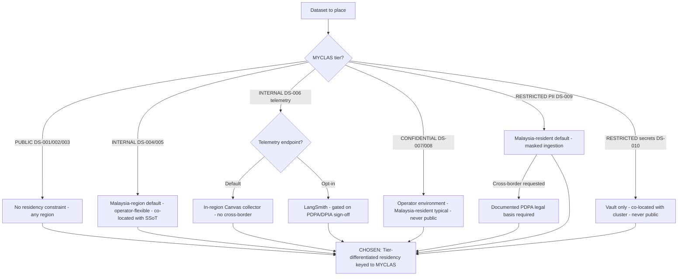

# Architecture Decision Record: Data Residency per Commercial Data-Sensitivity Classification — Tier-Differentiated Residency Keyed to the MYCLAS Ladder

> **Template Origin**: Official | **ArcKit Version**: 5.11.0 | **Command**: `/arckit:adr`

## Document Control

| Field | Value |
|-------|-------|
| **Document ID** | ARC-001-ADR-003-v1.0 |
| **Document Type** | Architecture Decision Record |
| **Project** | ibn-core-my (Project 001) |
| **Classification** | PUBLIC |
| **Status** | APPROVED |
| **Version** | 1.0 |
| **Created Date** | 2026-06-05 |
| **Last Modified** | 2026-06-21 |
| **Review Cycle** | Quarterly |
| **Next Review Date** | 2026-09-05 |
| **Owner** | Roland Pfeifer, Lead Architect (Vpnet Cloud Solutions Sdn. Bhd.) |
| **Reviewed By** | Vpnet EA Review Board (EARB) — 2026-06-21 |
| **Approved By** | Roland Pfeifer, Lead Architect / CTO (for Vpnet EARB) — 2026-06-21 |
| **Distribution** | ibn-core engineering, Vpnet SI delivery teams, operator integration partners (U Mobile, TM Malaysia), Security Lead, Operator Compliance Officer |

> **Subject type note**: This ADR uses the **Generic / commercial** document-control header, not the Malaysia Federal "Agensi" header. ibn-core is a **commercial** open-core telecommunications enabler delivered by Vpnet Cloud Solutions Sdn. Bhd. under Systems Integration (SI) engagements — **not** a Malaysian Federal public-sector entity. Data residency is therefore keyed to the **commercial four-tier MYCLAS ladder** (PUBLIC / INTERNAL / CONFIDENTIAL / RESTRICTED) and reasoned from **PDPA 2010 cross-border-transfer rules, MCMC telecommunications-sector data expectations, and operator contractual residency** — **not** from the government Arahan Keselamatan scheme (Terbuka / Terhad / Sulit / Rahsia / Rahsia Besar) and **not** from the public-sector Cloud First / MyGovCloud (PDSA) on-shore mandate. The Arahan Keselamatan ladder and MyGovCloud appear below **only as non-binding comparators**. Consistent with `ARC-001-ADR-002-v1.0`, `ARC-001-MCRES-v1.0`, `ARC-001-MYCLAS-v1.0`, and the PUBLIC posture of `ARC-000-PRIN-v1.0` / `ARC-001-REQ-v1.0`.

## Revision History

| Version | Date | Author | Changes | Approved By | Approval Date |
|---------|------|--------|---------|-------------|---------------|
| 1.0 | 2026-06-05 | ArcKit AI | Initial creation from `/arckit:adr` command | [PENDING] | [PENDING] |
| 1.0 (ratified) | 2026-06-21 | ArcKit AI | EARB ratification — Document-Control Status → APPROVED; Reviewed/Approved By recorded | Roland Pfeifer (Vpnet EARB) | 2026-06-21 |

## 1. Decision Title

**Data Residency per Commercial Data-Sensitivity Classification — Tier-Differentiated Residency Keyed to the MYCLAS Ladder**

This ADR records the **per-dataset residency rules** that govern where each of the ten ibn-core datasets (DS-001…DS-010) may physically reside, keyed to the commercial four-tier MYCLAS classification (PUBLIC / INTERNAL / CONFIDENTIAL / RESTRICTED). It is the companion to `ARC-001-ADR-002-v1.0` (cloud platform and data-centre placement — hybrid, classification-driven landing zones): ADR-002 fixes the **landing-zone topology**; this ADR-003 fixes the **residency rule each dataset must satisfy within that topology**.

> **Scope note**: This decision concerns **data-residency rules per classification tier**, not the cloud-platform/landing-zone selection (owned by `ARC-001-ADR-002-v1.0`) and not the per-engagement PDPA cross-border legal-basis determination (owned by `/arckit:my-pdpa` / `ARC-001-PDPA` and `/arckit:dpia`). This ADR is the `ADR-003` referenced as *Pending* across `ARC-001-MYCLAS-v1.0`, `ARC-001-MCRES-v1.0`, and `ARC-001-ADR-002-v1.0`.

---

## 2. Stakeholders

### 2.1 Deciders (RACI: Accountable)

- **Roland Pfeifer, Lead Architect / CTO (Vpnet Cloud Solutions)** — accountable for the data-sovereignty/residency posture (NON-NEGOTIABLE security and open-core seam principles), and for the residency standard applied across every SI engagement.
- **Operator Compliance Officer (U Mobile, TM Malaysia)** — accountable, per engagement, for sign-off on residency of CONFIDENTIAL operator data (DS-007/008) and RESTRICTED subscriber PII (DS-009).

### 2.2 Consulted (RACI: Consulted)

- **Security Lead (Vpnet Cloud Solutions)** — encryption boundaries, vault confinement of secrets (DS-010), cross-border egress controls, masking enforcement (FR-009).
- **Operator Integration Architect (U Mobile, TM Malaysia)** — operator environment residency, CAMARA adapter co-location, capability-descriptor handling.
- **SI Engineer / Platform Operator (Vpnet)** — IaC residency parameterisation, SSoT/backup placement, telemetry-collector endpoint selection.
- **Enterprise / Solution Architect (Vpnet)** — SSoT locality, telemetry placement, DR geography.

### 2.3 Informed (RACI: Informed)

- ibn-core engineering team.
- Open-source maintainers / community (PUBLIC-tier artefacts carry no residency constraint and are unaffected).
- Auditor / Compliance Reviewer (Persona 5).

### 2.4 UK Government Escalation Context

> **Framing note**: ArcKit's escalation ladder is UK-Government-derived. ibn-core is a Malaysian **commercial** subject, so the level below is mapped to its nearest commercial-governance analogue (Vpnet Enterprise Architecture Review Board + operator joint-architecture forum), not to a UK department.

**Decision Level**: **Department** (commercial analogue: enterprise/programme-wide technology-standard decision)

**Escalation Rationale**:

- [ ] **Team**: Local implementation choice (frameworks, libraries, testing)
- [ ] **Cross-team**: Integration patterns, shared services, API standards
- [x] **Department**: Technology standards, cloud providers, security frameworks — *a per-classification residency standard binds every SI engagement, the security/data-sovereignty posture, PDPA compliance, and operator-contractual obligations; it is a programme-wide standard, not a per-PR choice.*
- [ ] **Cross-government**: National infrastructure, cross-department interoperability

**Governance Forum**: Vpnet Cloud Solutions Enterprise Architecture Review Board, in joint session with the relevant operator architecture forum for engagement-specific residency sign-off.

**Approval Date**: 2026-06-21 (EARB ratified; decision Accepted)

---

## 3. Context and Problem Statement

### 3.1 Problem Description

ibn-core handles ten datasets spanning four commercial sensitivity tiers (DS-001…DS-010 in `ARC-001-MYCLAS-v1.0`), from the residency-free Apache 2.0 open core to PDPA-governed subscriber personal data and vault-only secrets. `ARC-001-ADR-002-v1.0` has fixed the **topology** — hybrid, classification-driven landing zones (operator private cloud + Malaysian-region public CSP). What remains undecided is the concrete, binding rule for **each dataset**: must it be Malaysia-resident, may it be region-flexible, and under what controls may it cross a border? Without per-dataset rules, the hybrid topology has placeholders where it needs guardrails.

**Problem statement as a question**: Should ibn-core require **all** data to be Malaysia-resident, apply **tier-differentiated** residency rules keyed to the MYCLAS ladder, or permit **region-flexible** placement constrained only by generic controls?

### 3.2 Why This Decision Is Needed

This is the per-dataset residency standard that the topology decision (ADR-002) and the residency assessment (MCRES) both depend on and mark *Pending*. Without it, each SI engagement re-litigates residency dataset-by-dataset, risking inconsistent treatment of RESTRICTED subscriber PII (DS-009), accidental egress of CONFIDENTIAL operator configuration (DS-007/008), or — at the other extreme — needless on-shore confinement of residency-free PUBLIC artefacts that raises cost and erodes the portability advantage.

- **Business context**: BR-004 (operator-grade delivery for Malaysian SI engagements, PDPA 2010), BR-003 (open-core commercial-model integrity).
- **Technical context**: NFR-C-001 (PDPA residency), NFR-SEC-003/SEC-004 (encryption, vault secrets), FR-005 (Redis SSoT placement), FR-009 (PII masking on the ingestion path), NFR-A-002 (DR geographic placement), INT-004 (telemetry egress path).
- **Regulatory context**: PDPA 2010 cross-border transfer rules for RESTRICTED subscriber PII (DS-009); MCMC sectoral expectations for CONFIDENTIAL operator data (DS-007/008); NFR-SEC-004 / BR-003 vault-only confinement for secrets (DS-010). **MyGovCloud / Cloud First and Arahan Keselamatan are non-binding comparators only.**

### 3.3 Supporting Links

- **User story/Epic**: O2C journey (UC-1) data path; classification handling per MYCLAS register.
- **Requirements**: BR-003, BR-004; FR-005, FR-009; NFR-C-001, NFR-SEC-003, NFR-SEC-004, NFR-A-002.
- **Classification register**: `ARC-001-MYCLAS-v1.0` — DS-001…DS-010, four-tier commercial ladder, per-tier handling rules.
- **Residency assessment**: `ARC-001-MCRES-v1.0` — per-dataset residency table, cross-border analysis, CSP due-diligence pack. This ADR codifies the rules that assessment recommends.
- **Related ADRs**: `ARC-001-ADR-002-v1.0` (cloud platform / landing-zone topology — this ADR fixes residency rules **within** it); ADR-001 (operator identity via Keycloak — IdP placement follows the residency of the realm).

---

## 4. Decision Drivers (Forces)

These forces influence the decision and are often in tension (sovereignty vs portability; compliance certainty vs cost).

### 4.1 Technical Drivers

- **SSoT and backup locality**: the Redis SSoT (FR-005) and its encrypted backups (NFR-A-002) hold INTERNAL DS-004/005; their residency must be a deterministic rule, not ad hoc, and should default close to the workload for latency/consistency.
  - Requirements: FR-005, NFR-A-002, NFR-SEC-003.
  - Principles: PRIN 8 (Single Source of Truth), PRIN 13 (Availability).
- **Cross-border telemetry path**: DS-006 observability telemetry egresses cross-border when the default LangSmith OTLP/HTTP backend is used (INT-004, UC006); the residency rule must close or explicitly gate this path.
  - Requirements: INT-004, NFR-M-001, FR-009 (no unmasked PII in spans).
  - Principles: PRIN 5 (Observability), PRIN 6 (Data Sovereignty).
- **Masking-on-ingestion as a residency control**: subscriber PII (DS-009) is masked before AI invocation (FR-009), so what leaves for Claude translation (INT-002) is de-identified; the residency rule depends on masking holding (fail-closed).
- **Vault/secret confinement**: secrets (DS-010) are vault-only, co-located with the cluster, never in the public estate (NFR-SEC-004); residency here is "wherever the cluster is, inside the vault — never public."
  - Principles: PRIN 4 (Security by Design — NON-NEGOTIABLE).
- **Cloud-agnostic portability**: per-dataset rules must not introduce CSP-proprietary residency dependencies that erode the days-not-months exit window MCRES records.
  - Principles: PRIN 10 (Loose Coupling), PRIN 15 (IaC).

### 4.2 Business Drivers

- **Operator data sovereignty**: operators may contractually require CONFIDENTIAL 4G/5G-core / OSS-BSS config (DS-007/008) to remain Malaysia-resident and physically on-premise; the residency rule must encode "operator-contracted, Malaysia-resident typical."
  - Requirements: BR-004; stakeholders: Operator Compliance Officer, Operator Integration Architect.
- **Open-core seam integrity**: PUBLIC-tier artefacts (DS-001/002/003) carry no residency constraint; CONFIDENTIAL operator logic and RESTRICTED credentials never enter the public estate — the residency rule is itself a seam control.
  - Requirements: BR-003; Principle: PRIN 9 (NON-NEGOTIABLE).
- **SI repeatability without over-confinement**: a tier-differentiated rule that confines only what genuinely needs confining (RESTRICTED/CONFIDENTIAL) while leaving PUBLIC/INTERNAL flexible wins more engagements than a blanket on-shore mandate and keeps cost proportionate.

### 4.3 Regulatory & Compliance Drivers

> Mapped to ibn-core's actual regulatory surface (Malaysian commercial telco). UK GDS / TCoP rows are retained for template traceability but annotated as **not binding** on this commercial Malaysian subject.

- **PDPA 2010 (binding)**: RESTRICTED subscriber personal data (DS-009) Malaysia-resident by default; any cross-border transfer requires a documented legal basis (owned by `ARC-001-PDPA` / DPIA). This is the single hardest residency constraint and the reason a blanket-flexible rule is unacceptable.
- **MCMC sectoral expectation (binding, contractual)**: telecommunications-sector data placement informs DS-007/008 Malaysia-residency.
- **NFR-SEC-004 / BR-003 (binding, internal)**: secrets (DS-010) never in the public repo; vault-only.
- **NACSA NCII (telecommunications)**: pending `/arckit:my-cyber-security` (`NCII`) — residency rules must not preclude NCII controls.
- **UK GDS Service Standard / Technology Code of Practice**: **NOT binding** — comparator only. TCoP "Point 5: Cloud first" maps loosely to commercial cloud-residency reasoning but imposes no obligation here.
- **MyGovCloud / Cloud First & Arahan Keselamatan (public-sector)**: **NOT binding** — non-binding comparators; relevant only where an operator serves a government customer whose contract imports the policy.

### 4.4 Alignment to Architecture Principles

| Principle | Alignment | Impact |
|-----------|-----------|--------|
| 4. Security by Design (NON-NEGOTIABLE) | ✅ Supports | RESTRICTED secrets vault-only; encryption at rest/in transit; PII masked before any egress. |
| 5. Observability | ✅ Supports | DS-006 telemetry residency rule closes the structural cross-border path by default (in-region collector). |
| 6. Data Sovereignty and Governance | ✅ Supports | Residency rules are the literal expression of PRIN 6: classification-driven residency; operator-mandated residency overrides default placement. |
| 8. Single Source of Truth | ✅ Supports | Deterministic SSoT residency rule (DS-004/005) co-located with the INTERNAL workload. |
| 9. Open-Core / Proprietary Seam Integrity (NON-NEGOTIABLE) | ✅ Supports | PUBLIC residency-free; CONFIDENTIAL/RESTRICTED never in the public estate by rule. |
| 10. Loose Coupling | ✅ Supports | Rules are CSP-neutral; no proprietary residency lock-in. |
| 13. Availability and Reliability | ✅ Supports | DR/backup geography bounded by the same per-tier residency rule. |
| 15. Infrastructure as Code | ✅ Supports | Per-dataset residency expressed as IaC parameters + guardrails, not manual vigilance. |

No principle conflicts. The tier-differentiated rule is the most direct expression of PRIN 6 (Data Sovereignty) within the PRIN 9 (Open-Core Seam) topology that ADR-002 established.

---

## 5. Considered Options

**Three options analysed plus a "Do Nothing" baseline.** All options assume the hybrid landing-zone topology already fixed by `ARC-001-ADR-002-v1.0`; they differ only in the residency rule applied per dataset. Cost figures are indicative SI-engagement planning ranges (USD), not procurement quotes.

### Option 1: Strict Malaysia-Resident-All (single on-shore residency rule for every dataset)

**Description**: Apply one uniform rule — **all ten datasets (DS-001…DS-010) must be Malaysia-resident** — regardless of MYCLAS tier. PUBLIC artefacts, INTERNAL masked Intents, telemetry, operator config, subscriber PII, and secrets all confined to a Malaysian region or operator premises. No cross-border processing path is permitted, including the default LangSmith telemetry egress and (strictly read) the Claude translation call.

**Implementation approach**: Force every workload and store into a Malaysian-region landing zone; mandate the in-region Canvas telemetry collector (never LangSmith); require an in-region or PDPA-based legal basis even for masked/de-identified flows.

**Wardley Evolution Stage**: Product → Custom-Built (a uniform on-shore mandate behaves like a bespoke sovereignty regime rather than a commoditised, right-sized placement).

#### Good (Pros)

- ✅ **Maximum compliance certainty**: trivially satisfies PDPA residency for DS-009 and MCMC expectation for DS-007/008 — no edge cases.
- ✅ **Simple to state and audit**: one rule, one answer; placement audit is binary.
- ✅ **Strongest sovereignty story**: the most reassuring posture for an operator with an absolute on-premise mandate.

#### Bad (Cons)

- ❌ **Over-confines residency-free PUBLIC data**: DS-001/002/003 (Apache 2.0 source, CTK evidence, published interfaces) are intended for public GitHub/CI and academic citation (BR-006); on-shore confinement is contradictory and needlessly costly.
- ❌ **Breaks the default observability backend**: prohibiting LangSmith entirely removes a working default (UC006) even where telemetry is masked and the operator accepts it (INT-004); reduces flexibility for no compliance gain.
- ❌ **Tension with the AI translation path**: strictly read, even the masked Claude call (INT-002, FR-009) becomes suspect, despite the data being de-identified before egress — an over-reach beyond what PDPA requires.
- ❌ **Higher cost, weaker portability**: confining everything on-shore raises OPEX and erodes the CSP-neutral, days-not-months exit posture MCRES prizes.

#### Cost Analysis

- **CAPEX**: Medium — ~USD 20–35k (on-shore-only landing-zone wiring; mirror PUBLIC artefacts in-region).
- **OPEX**: High — ~USD 7–13k/month per engagement (all tiers on-shore incl. residency-free PUBLIC; mandatory in-region collector).
- **TCO (3-year)**: ~USD 0.3–0.5M per engagement (on-shore confinement premium across all tiers).

#### GDS Service Standard Impact

| Point | Impact | Notes |
|-------|--------|-------|
| 4. Open standards | Neutral | CSP-neutral runtime, but PUBLIC artefacts needlessly confined. (GDS not binding — comparator.) |
| 5. Security | Positive | Strongest sovereignty; no cross-border surface. |
| 9. Technology / hosting | Negative | Over-confinement raises cost, weakens portability and elasticity. |

---

### Option 2 (RECOMMENDED): Tier-Differentiated Residency Keyed to the MYCLAS Ladder

**Description**: Apply a **distinct residency rule per MYCLAS tier**, exactly as `ARC-001-MCRES-v1.0` prescribes — confining only what genuinely needs confining:

- **PUBLIC (DS-001/002/003)** — **no residency constraint**; public GitHub/CI, any region.
- **INTERNAL (DS-004/005 PII-masked Intents/Reports; DS-006 telemetry)** — **Malaysia-region by default but flexible**; SSoT/backups co-located with the workload in the operator-preferred Malaysian region; DS-006 telemetry defaults to an **in-region Canvas collector** (closing the cross-border path), with LangSmith available as an explicit, PDPA/DPIA-gated opt-in.
- **CONFIDENTIAL (DS-007/008 operator config, capability descriptors)** — **operator-contracted, Malaysia-resident (typical)**; physically confined to the operator environment / private adapter; never in the public estate.
- **RESTRICTED — subscriber PII (DS-009)** — **Malaysia-resident by default (PDPA 2010)**; cross-border transfer requires a documented PDPA legal basis; masked on the ingestion path before AI invocation (FR-009), so de-identified data leaves for translation; masking failure fails closed.
- **RESTRICTED — secrets (DS-010)** — **vault-only, co-located with the cluster, never in the public repo** (NFR-SEC-004, BR-003); residency = "with the cluster, inside the vault."

**Implementation approach**: Encode the per-dataset rule table as IaC residency parameters + policy guardrails on the ADR-002 parameterised blueprint; release-time verification that CONFIDENTIAL/RESTRICTED data and secrets are not in the public estate; per-engagement placement worksheet records the operator's INTERNAL-tier region choice and telemetry endpoint.

**Wardley Evolution Stage**: Commodity (rules expressed as IaC parameters over a CSP-neutral runtime) — right-sizing each tier rather than over- or under-confining.

#### Good (Pros)

- ✅ **Literal implementation of the residency assessment**: the rule table *is* the `ARC-001-MCRES-v1.0` DS-001…DS-010 row set; no reinterpretation. Satisfies PDPA (DS-009), MCMC/operator contract (DS-007/008), and NFR-SEC-004 (DS-010) simultaneously and exactly.
- ✅ **Sits cleanly inside ADR-002's topology**: ADR-002 fixed the hybrid landing zones and named ADR-003 as the per-dataset rule layer; this option is precisely that layer — fully consistent, no conflict.
- ✅ **Right-sized cost and portability**: PUBLIC stays cheap and public; INTERNAL flexes to operator preference; only CONFIDENTIAL/RESTRICTED are confined — preserving the days-not-months exit window.
- ✅ **Closes the one structural cross-border path by default**: DS-006 telemetry defaults to an in-region collector (UC006), with LangSmith a gated opt-in — no compliance gap unless explicitly and lawfully accepted.
- ✅ **Masking-as-control retained**: DS-009 leaves de-identified for Claude translation (FR-009), so the AI path is not a residency breach.

#### Bad (Cons)

- ❌ **More rules to maintain than a single mandate**: four tier-rules plus the PII/secrets split must be encoded and verified, versus Option 1's one rule.
- ❌ **Placement-drift is a real failure mode**: a CONFIDENTIAL dataset drifting into the public-CSP INTERNAL zone, or unmasked PII reaching telemetry, must be actively guarded.
- ❌ **Depends on masking integrity**: the DS-009 rule's "de-identified egress is acceptable" leg relies on FR-009 masking holding (mitigated by fail-closed behaviour).

#### Cost Analysis

- **CAPEX**: Low–Medium — ~USD 12–22k (residency-rule guardrails + per-engagement worksheet wiring on the existing ADR-002 blueprint; amortises across engagements).
- **OPEX**: Medium — ~USD 4–9k/month per engagement (INTERNAL workload in chosen region + in-region collector; CONFIDENTIAL ops borne operator-side).
- **TCO (3-year)**: ~USD 0.18–0.35M per engagement; marginal cost of each added engagement is low (rule reuse).

#### GDS Service Standard Impact

| Point | Impact | Notes |
|-------|--------|-------|
| 4. Open standards | Positive | CSP-neutral; PUBLIC artefacts unconfined and reusable. (GDS not binding — comparator.) |
| 5. Security | Positive | Classification-driven residency; secrets vault-only; cross-border telemetry path closed by default. |
| 9. Technology / hosting | Positive | Right-sized residency per tier; sovereignty where required, flexibility where permitted. |

---

### Option 3: Region-Flexible-with-Controls (residency-agnostic; rely on encryption/masking, not on-shore placement)

**Description**: Impose **no per-tier on-shore residency rule**; permit any dataset to reside in any region, relying instead on a generic control set — encryption at rest/in transit, PII masking, and contractual DPAs — to protect data wherever it lands. Residency becomes an operator-by-operator commercial preference rather than a binding classification rule.

**Implementation approach**: One residency-agnostic blueprint; controls (encryption, masking, DPA) applied uniformly; region is purely a commercial/latency choice with no compliance gate.

**Wardley Evolution Stage**: Commodity (treats data protection as a pure controls problem, residency as a free variable).

#### Good (Pros)

- ✅ **Maximum placement flexibility**: lowest friction; any region, including non-Malaysian CSP regions, for cost or latency.
- ✅ **Simplest topology**: no per-tier residency branching; controls are uniform.
- ✅ **Leverages masking and encryption**: for genuinely de-identified flows, controls do carry real protective weight.

#### Bad (Cons)

- ❌ **Fails PDPA residency for DS-009**: PDPA 2010 cross-border transfer of subscriber personal data requires a documented legal basis; "encryption everywhere" does not substitute for that basis — this option leaves DS-009 exposed to a compliance breach (NFR-C-001).
- ❌ **Ignores MCMC/operator sovereignty for DS-007/008**: operators that contractually require on-premise CONFIDENTIAL config are not served; controls do not satisfy a residency clause.
- ❌ **Weakens the open-core seam guarantee**: without a residency rule pinning RESTRICTED secrets vault-only and off the public estate, NFR-SEC-004 / BR-003 rely solely on vigilance.
- ❌ **Contradicts ADR-002's classification-driven intent**: ADR-002 chose placement *because of* classification; a residency-agnostic rule layer undercuts the topology it sits inside.

#### Cost Analysis

- **CAPEX**: Low — ~USD 8–15k (single residency-agnostic blueprint; uniform controls).
- **OPEX**: Low–Medium — ~USD 3–7k/month per engagement (cheapest region available).
- **TCO (3-year)**: ~USD 0.14–0.28M per engagement — lowest nominal cost, but excludes the cost of a PDPA breach / lost operator contract (a material, unpriced tail risk).

#### GDS Service Standard Impact

| Point | Impact | Notes |
|-------|--------|-------|
| 4. Open standards | Positive | CSP-neutral, region-flexible. |
| 5. Security | Negative | No residency gate for DS-009 PII or DS-010 secrets; relies on controls alone. |
| 9. Technology / hosting | Neutral | Flexible hosting, but compliance-risky for regulated tiers. |

---

### Option 4: Do Nothing (Baseline)

**Description**: Leave residency rules unspecified; let each SI engagement decide per-dataset residency ad hoc within ADR-002's topology.

#### Good

- ✅ **No immediate cost**: no rule-encoding investment.
- ✅ **No commitment**: maximal short-term flexibility.

#### Bad

- ❌ **Leaves ADR-002 and MCRES *Pending* indefinitely**: both explicitly depend on this ADR to codify the per-dataset rules; without it, the topology has placeholders, not guardrails.
- ❌ **Residency risk accumulates**: subscriber PII (DS-009) or operator config (DS-007/008) could be misplaced per engagement, breaching PDPA / operator contract / MCMC expectation (NFR-C-001, BR-004).
- ❌ **Re-litigation per engagement**: every SI deal re-argues residency dataset-by-dataset — slow, inconsistent, error-prone.
- ❌ **No release-time guardrail**: nothing systematically prevents CONFIDENTIAL/RESTRICTED data or secrets reaching the public estate (BR-003, NFR-SEC-004).

---

## 6. Decision Outcome

### 6.1 Chosen Option

**"Option 2: Tier-Differentiated Residency Keyed to the MYCLAS Ladder"**

### 6.2 Y-Statement (Structured Justification)

> **In the context of** deploying the cloud-agnostic ibn-core intent platform into Malaysian operator SI engagements with ten datasets spanning four commercial sensitivity tiers, within the hybrid classification-driven landing-zone topology fixed by `ARC-001-ADR-002-v1.0`,
> **facing** the need to honour PDPA 2010 subscriber-data residency (DS-009), MCMC and operator data-sovereignty expectations for operator configuration (DS-007/008), and vault-only secret confinement (DS-010) — without over-confining residency-free PUBLIC artefacts or sacrificing portability and per-operator commercial flexibility,
> **we decided for** a tier-differentiated residency rule keyed to the MYCLAS ladder that maps each dataset to the residency its tier requires (PUBLIC unconstrained; INTERNAL Malaysia-region-default-but-flexible with in-region telemetry by default; CONFIDENTIAL operator-contracted Malaysia-resident; RESTRICTED PII Malaysia-resident with PDPA-gated cross-border, secrets vault-only),
> **to achieve** simultaneous PDPA / MCMC / operator-contract compliance, a closed-by-default cross-border telemetry path, structurally-low CSP lock-in, and proportionate cost,
> **accepting** more residency rules to encode and verify than a single blanket mandate, mitigated by IaC guardrails, release-time placement verification, and fail-closed PII masking.

### 6.3 Justification (Why This Option?)

**Key reasons**:

1. **It is the literal implementation of the residency assessment**: `ARC-001-MCRES-v1.0` already concluded that no dataset carries a public-sector on-shore mandate, and that the binding drivers are PDPA (DS-009), operator contract + MCMC (DS-007/008), and vault confinement (DS-010). Option 2 encodes exactly that per-dataset table — no reinterpretation, full traceability.
2. **It is consistent with ADR-002 by construction**: ADR-002 fixed the hybrid landing-zone topology *because* classification drives placement, and named ADR-003 as the per-dataset rule layer "within this topology." A tier-differentiated residency rule is precisely that layer; the two ADRs compose cleanly with no conflict. (Option 1 would over-confine the topology's PUBLIC tier; Option 3 would undercut the topology's classification-driven rationale.)
3. **It avoids the failure modes of both extremes**: Option 1 (Malaysia-resident-all) over-confines residency-free PUBLIC artefacts, breaks the LangSmith default needlessly, and raises cost; Option 3 (region-flexible-with-controls) fails PDPA residency for DS-009 and ignores operator sovereignty for DS-007/008. Option 2 right-sizes each tier.
4. **It protects the open-core seam (PRIN 9, BR-003) as a residency rule**: PUBLIC residency-free; CONFIDENTIAL operator data and RESTRICTED secrets confined off the public estate by rule, not by vigilance.
5. **It closes the one structural cross-border path by default**: DS-006 telemetry defaults to an in-region collector (UC006), with LangSmith a gated, PDPA/DPIA-sign-off opt-in.

**Stakeholder consensus**: Aligns the Lead Architect/CTO (open-core + security), the Operator Compliance Officer (PDPA/sovereignty), and SI delivery (rule reuse on the existing blueprint). No dissenting view recorded at proposal stage. The INTERNAL-tier region choice and the telemetry-endpoint decision are intentionally left to per-engagement agreement, recorded on the placement worksheet.

**Risk appetite**: Medium. The accepted complexity (more rules than a blanket mandate) is bounded by IaC guardrails and release-time verification; the alternatives carry either an unacceptable PDPA/contract residency risk (Options 3 and Do Nothing) or an unacceptable cost/over-confinement penalty (Option 1).

---

## 7. Consequences

### 7.1 Positive Consequences

- ✅ **Compliance by residency rule**: PDPA (DS-009), MCMC/operator contract (DS-007/008), and vault confinement (DS-010) satisfied structurally per tier, not by manual vigilance.
- ✅ **Cross-border path closed by default**: in-region collector for DS-006 telemetry unless LangSmith is explicitly, lawfully opted into (UC006).
- ✅ **PUBLIC stays public and cheap**: DS-001/002/003 unconfined — academic citation (BR-006) and open distribution unaffected.
- ✅ **Portability retained**: CSP-neutral residency rules; exit window stays days-not-months (MCRES exit plan).
- ✅ **ADR-002 and MCRES unblocked**: the *Pending* per-dataset rule layer is now landed.

**Measurable outcomes**:

- Subscriber PII (DS-009) residency: ad hoc → 100% Malaysia-resident on the masked ingestion path per engagement.
- Structural cross-border telemetry paths: 1 (LangSmith default) → 0 (in-region collector default).
- Secrets in public estate (DS-010): target 0 (verified each release, NFR-SEC-004).
- Per-engagement residency-decision effort: bespoke per-dataset argument → worksheet instantiation of the tier-rule table.

### 7.2 Negative Consequences (Accepted Trade-offs)

- ❌ **More residency rules to encode/verify**: four tier-rules plus the RESTRICTED PII/secrets split, versus one blanket rule.
- ❌ **Placement-drift risk**: a dataset could land in the wrong residency zone, or unmasked PII could reach telemetry.
- ❌ **Masking dependency**: the DS-009 "de-identified egress acceptable" rule depends on FR-009 masking integrity.

**Mitigation strategies**:

- **Rule complexity**: encode the residency table as IaC parameters + policy guardrails on the existing ADR-002 blueprint (NFR-I-003); the table is the single source of the rules.
- **Placement drift**: release-time verification that CONFIDENTIAL/RESTRICTED data and secrets are not in the public estate (ties to the BR-003 release check); placement-drift alert if CONFIDENTIAL/RESTRICTED data is detected outside the operator environment.
- **Masking dependency**: FR-009 masking is fail-closed (masking failure blocks processing); telemetry spans asserted PII-free; DPIA confirms the masked-egress basis.

### 7.3 Neutral Consequences (Changes Needed)

- 🔄 **Skills**: SI engineers maintain the residency-rule guardrails and the per-engagement placement worksheet alongside the multi-CSP landing-zone competence.
- 🔄 **Infrastructure**: residency-rule IaC parameters; in-region telemetry collector artefact (reused from ADR-002); vault/KMS co-location pattern for DS-010.
- 🔄 **Process**: per-engagement placement worksheet records INTERNAL-tier region choice and telemetry endpoint, and feeds the PDPA/DPIA sign-off when LangSmith opt-in is requested.
- 🔄 **Vendor relationships**: PDPA-aligned DPAs with the selected Malaysian-region CSP(s); operator private-cloud residency terms where CONFIDENTIAL data is on-premise.

### 7.4 Risks and Mitigations

| Risk | Likelihood | Impact | Mitigation | Owner |
|------|------------|--------|------------|-------|
| CONFIDENTIAL/RESTRICTED data or secrets reach the public estate or a non-Malaysian region | M | H | IaC guardrails; release-time placement verification; residency-rule table as single source | Security Lead |
| Unmasked subscriber PII (DS-009) egresses via telemetry or AI path | L | H | FR-009 fail-closed masking; PII-free telemetry assertion; DPIA confirmation | Security Lead |
| LangSmith opt-in re-introduces cross-border telemetry without a PDPA basis | L | M | Default in-region collector; LangSmith opt-in gated on PDPA/DPIA sign-off | Operator Compliance Officer |
| Operator mandates absolute on-shore for INTERNAL/PUBLIC beyond the tier rule | M | M | Tier rule permits stricter operator override; worksheet records the deviation | SI Delivery Lead |
| Cross-border PDPA legal basis for a permitted DS-009 transfer is not obtained in time | L | H | `ARC-001-PDPA` / DPIA gate before any DS-009 cross-border transfer; default Malaysia-resident | Operator Compliance Officer |

**Link to risk register**: No `ARC-001-RISK-v*.md` present yet — run `/arckit:risk`; the rows above (and the consistent ADR-002 rows) should be migrated when it is created.

---

## 8. Validation & Compliance

### 8.1 How Will Implementation Be Verified?

**Design review**:

- [ ] HLD shows the per-dataset residency rule applied to DS-001…DS-010 within the ADR-002 hybrid topology.
- [ ] DLD specifies the residency IaC parameters, guardrails, and the masked ingestion path (FR-009).
- [ ] Data-flow diagrams reflect per-tier residency and the masked egress for DS-009.

**Code / IaC review**:

- [ ] PR checklist includes "no CONFIDENTIAL/RESTRICTED data or secrets in the public estate, and no non-Malaysian residency for DS-009 without a PDPA basis" (BR-003, NFR-SEC-004, NFR-C-001).
- [ ] Residency parameters (per-dataset region/zone, telemetry endpoint) reviewed per engagement against the tier-rule table.

**Testing strategy**:

- [ ] Integration test: DS-009 PII is masked before any egress; masking failure blocks processing (FR-009 fail-closed).
- [ ] Placement test: CONFIDENTIAL DS-007/008 resolvable only within the operator environment; secrets (DS-010) reachable only from the cluster vault.
- [ ] Telemetry test: default collector endpoint is in-region; no DS-006 LangSmith egress unless explicitly opted in.

### 8.2 Monitoring & Observability

**Success metrics**:

- DS-009 residency conformance: 100% Malaysia-resident on the masked ingestion path per engagement (placement audit).
- Structural cross-border telemetry paths: 0 by default (collector-endpoint check).
- Secrets in public estate (DS-010): 0 (release-time scan).

**Alerts and dashboards**:

- Placement-drift alert if CONFIDENTIAL/RESTRICTED data is detected outside its permitted residency zone.
- Telemetry-egress dashboard showing the collector endpoint (in-region vs. LangSmith) per engagement.

### 8.3 Compliance Verification

**GDS / TCoP**: NOT binding (comparator). TCoP Point 5 "Cloud first" satisfied in spirit by the commercial cloud-residency reasoning.

**Security assurance** (PRIN 4):

- [ ] Encryption at rest/in transit for DS-004/005 SSoT + backups (NFR-SEC-003).
- [ ] Secrets vault-only and out of the public repo, verified each release (NFR-SEC-004).
- [ ] NACSA NCII controls cross-checked once `/arckit:my-cyber-security` lands.

**Data protection**:

- [ ] PDPA cross-border legal basis confirmed (or N/A under masking) via `ARC-001-PDPA` / DPIA before any DS-009 egress.
- [ ] Data-flow diagrams updated to show per-tier residency and the masked ingestion path (FR-009).

---

## 9. Links to Supporting Documents

### 9.1 Requirements Traceability

**Business Requirements**:

- BR-003: Open-Core Commercial Model Integrity — residency rules keep CONFIDENTIAL operator data and RESTRICTED secrets off the public estate.
- BR-004: Operator-Grade Delivery for Malaysian SI Engagements — PDPA residency and operator sovereignty satisfied per tier, per engagement.

**Functional Requirements**:

- FR-005: Intent-State Single Source of Truth — deterministic SSoT residency rule (DS-004/005).
- FR-009: PII Masking — masked ingestion path makes de-identified DS-009 egress acceptable (fail-closed).

**Non-Functional Requirements**:

- NFR-C-001: PDPA data-residency compliance (DS-009).
- NFR-SEC-003: Encryption at rest/in transit (DS-004/005 SSoT + backups).
- NFR-SEC-004: Vault-only secrets (DS-010).
- NFR-A-002: DR/backup geographic placement bounded by the residency rule.

### 9.2 Architecture Artifacts

**Architecture principles**: `projects/000-global/ARC-000-PRIN-v1.0.md` — Principles 4, 5, 6, 8, 9, 10, 13, 15.

**Classification register**: `projects/001-ibn-core-my/ARC-001-MYCLAS-v1.0.md` — DS-001…DS-010, four-tier ladder, per-tier handling rules (the residency rules codify these).

**Residency assessment**: `projects/001-ibn-core-my/ARC-001-MCRES-v1.0.md` — per-dataset residency table, cross-border analysis, CSP pack. *This ADR lands the per-dataset rules that assessment marks Pending.*

**Cloud-platform ADR**: `projects/001-ibn-core-my/decisions/ARC-001-ADR-002-v1.0.md` — hybrid classification-driven landing-zone topology. *This ADR fixes the residency rules within that topology; the two are mutually consistent.*

**Stakeholder drivers**: No `ARC-001-STKE-v*.md` for residency-specific goals — run `/arckit:stakeholders` to formalise RACI.

**Risk register**: No `ARC-001-RISK-v*.md` yet — run `/arckit:risk`.

### 9.3 Design Documents

- High-Level Design: [PENDING] — to show per-tier residency within the hybrid topology.
- Detailed Design: [PENDING] — residency IaC parameters and guardrail specification.
- Data model: `ARC-001-REQ-v1.0` Data Requirements (Intent, IntentReport entities).

### 9.4 External References

**Standards and frameworks**:

- PDPA 2010 (Malaysia) — <https://www.pdp.gov.my/> — binding for DS-009 subscriber personal-data residency and cross-border transfer.
- MCMC sectoral expectations — <https://www.mcmc.gov.my/> — binding (contractual) for DS-007/008.
- RFC 9315 Intent-Based Networking (DOI 10.17487/RFC9315); TMF921 Intent Management API v5.0.0.
- ISO 27001/27017/27018, SOC 1/2/3 (CSP certification posture per MCRES CSP pack).

**Comparator (NOT binding)**:

- MyGovCloud / Cloud First (PDSA, Jabatan Digital Negara) — <https://www.malaysia.gov.my/portal/content/31183> — comparator only.
- Arahan Keselamatan (Chief Government Security Office) — <https://www.cgso.gov.my/> — comparator only; ibn-core is a commercial subject not bound by it.

---

## 10. Implementation Plan

### 10.1 Dependencies

**Prerequisite decisions**:

- `ARC-001-ADR-002-v1.0` (cloud platform / landing-zone topology) — the residency rules in this ADR are applied **within** that hybrid topology; it must be in place first.
- ADR-001 (operator identity / Keycloak) — IdP/realm residency follows the residency of the tier hosting it.

**Infrastructure dependencies**:

- The ADR-002 parameterised landing-zone blueprint; in-region telemetry collector image; vault/KMS co-located with the cluster.

**Team dependencies**:

- IaC competence to encode residency parameters + guardrails (NFR-I-003); placement-audit tooling.

### 10.2 Implementation Timeline

| Phase | Activities | Duration | Owner |
|-------|-----------|----------|-------|
| **Phase 1: Encode rules** | Express the DS-001…DS-010 residency table as IaC parameters + policy guardrails on the ADR-002 blueprint | 2 weeks | Security Lead |
| **Phase 2: Verification** | Release-time placement-audit check (no CONFIDENTIAL/RESTRICTED in public estate; DS-009 Malaysia-resident); masking fail-closed test | 2 weeks | Enterprise / Solution Architect |
| **Phase 3: Worksheet** | Per-engagement placement worksheet (INTERNAL region choice, telemetry endpoint, PDPA opt-in gate) | 1 week | SI Delivery Lead |
| **Phase 4: Per-engagement** | Instantiate residency rules per operator; obtain PDPA/DPIA sign-off where cross-border opt-in requested | Per engagement | SI Delivery Lead |

### 10.3 Rollback Plan

**Rollback trigger**: A residency rule is found non-compliant (e.g. a PDPA determination forces a previously-permitted DS-009 cross-border transfer back on-shore), or a placement audit fails.

**Rollback procedure**:

1. Re-pin the affected dataset's residency parameter to the compliant zone and redeploy from IaC.
2. For DS-009: revoke the cross-border path; confirm Malaysia-resident ingestion; restore masked-only egress.
3. For telemetry: repoint OTLP egress from LangSmith to the in-region collector.
4. Re-run the placement audit; communicate to operator stakeholders and confirm sign-off.

**Rollback owner**: SI Engineer / Platform Operator (with Security Lead and Operator Compliance Officer sign-off).

---

## 11. Review and Updates

### 11.1 Review Schedule

**Initial review**: 2026-09-05 (first quarterly cycle, aligned to MCRES / ADR-002 / PRIN).

**Periodic review**: Quarterly, or on trigger.

**Review criteria**:

- Are per-tier residency metrics being met across engagements (DS-009 100% Malaysia-resident; 0 default cross-border telemetry paths; 0 secrets in public estate)?
- Has any PDPA cross-border rule, MCMC sectoral expectation, or operator residency clause changed?
- Are the tier rules still correctly mapped to the MYCLAS register, or has the dataset register changed?

### 11.2 Trigger Events for Review

- [ ] PDPA 2010 cross-border-transfer rule change affecting DS-009.
- [ ] MCMC sectoral expectation change affecting DS-007/008 residency.
- [ ] A change to the `ARC-001-MYCLAS-v1.0` dataset register (new dataset, re-tiering).
- [ ] A change to the `ARC-001-ADR-002-v1.0` landing-zone topology this ADR sits inside.
- [ ] Security incident touching residency, masking, or cross-border egress.
- [ ] Operator contract change forcing a stricter or different residency than the tier rule.

---

## 12. Related Decisions

### 12.1 Decisions This ADR Depends On

- **`ARC-001-ADR-002-v1.0`** (Cloud Platform and Data-Centre Placement — Hybrid, Classification-Driven Landing Zones): fixes the landing-zone topology; this ADR codifies the per-dataset residency rules **within** that topology.
- **ADR-001** (Operator identity via Keycloak): realm/IdP residency follows the residency of the tier hosting it.

### 12.2 Decisions That Depend On This ADR

- Future per-engagement placement worksheets and any HLD/DLD that must encode residency.
- `/arckit:my-pdpa` (`ARC-001-PDPA`) and `/arckit:dpia`: consume the DS-009 residency rule and gate any cross-border opt-in.

### 12.3 Conflicting Decisions

- None. This ADR is the per-dataset residency rule layer that `ARC-001-ADR-002-v1.0` and `ARC-001-MCRES-v1.0` both anticipated and marked *Pending*; it is mutually consistent with the hybrid topology rather than in conflict with it.

---

## 13. Appendices

### Appendix A: Per-Dataset Residency Rule Table (the chosen Option 2, codified)

> This table is the operative output of the decision. Residency rules are keyed to the `ARC-001-MYCLAS-v1.0` tier and reasoned from PDPA 2010, MCMC sectoral expectation, and operator contract — **not** from Arahan Keselamatan or MyGovCloud.

| Dataset ID | MYCLAS tier | Residency rule | Cross-border condition |
|------------|-------------|----------------|------------------------|
| DS-001 (open-core source, `McpAdapter` interface, `MockMcpAdapter`) | PUBLIC | No constraint — public GitHub/CI, any region | N/A (public artefact) |
| DS-002 (TMF921 CTK conformance evidence, RFC 9315 traceability) | PUBLIC | No constraint | N/A |
| DS-003 (published API & adapter contract surface) | PUBLIC | No constraint | N/A |
| DS-004 (TMF921 Intent, PII-masked — Redis SSoT) | INTERNAL | Malaysia-region default, operator-flexible; co-located with workload | Flexible; masked, no personal data at rest |
| DS-005 (IntentReport / `reportState`) | INTERNAL | Follows DS-004 SSoT residency | Flexible; masked |
| DS-006 (observability telemetry) | INTERNAL | In-region Canvas collector by **default** | LangSmith opt-in **only** with PDPA/DPIA sign-off; spans PII-free (FR-009) |
| DS-007 (operator 4G-5G core / OSS-BSS config & orchestration payloads) | CONFIDENTIAL | Operator-contracted, Malaysia-resident (typical); operator environment / private adapter | Operator contract governs; never in public estate |
| DS-008 (adapter capability descriptors) | CONFIDENTIAL | Operator-contracted; mock set is PUBLIC | As DS-007; mock unconstrained |
| DS-009 (subscriber personal data — `customerId`, raw intent text) | RESTRICTED | **Malaysia-resident by default (PDPA 2010)**; masked before AI invocation; not persisted unmasked | Cross-border transfer requires documented PDPA legal basis (`ARC-001-PDPA` / DPIA); de-identified masked egress permitted |
| DS-010 (secrets / credentials) | RESTRICTED | **Vault-only**, co-located with the cluster; never in public repo (NFR-SEC-004, BR-003) | Never crosses into the public estate; re-issued, not migrated |

### Appendix B: Stakeholder Consultation Log

| Date | Stakeholder | Feedback | Action Taken |
|------|-------------|----------|--------------|
| 2026-06-05 | (Proposal stage) | ADR drafted from the MCRES residency table and the ADR-002 topology; no consultation log entries yet | Pending stakeholder review |

### Appendix C: Alternative Formats

**Mermaid Decision Flow Diagram**:

---

## Document Approval

| Role | Name | Signature | Date |
|------|------|-----------|------|
| **Technical Architect** | [PENDING] | | 2026-09-05 |
| **Senior Responsible Owner** | Roland Pfeifer (Lead Architect / CTO) | | 2026-09-05 |
| **Security Architect** | [PENDING] | | 2026-09-05 |
| **Governance Board** | Vpnet EA Review Board (joint with operator forum) | | 2026-09-05 |

---

*This ADR follows the MADR v4.0 format enhanced with UK Government requirements and ArcKit governance standards. UK GDS / TCoP references are retained for template traceability but are NOT binding on this commercial Malaysian subject; residency is reasoned from PDPA 2010, MCMC sectoral expectation, and operator contract.*

## External References

> This section provides traceability from generated content back to source documents.

### Document Register

| Doc ID | Filename | Type | Source Location | Description |
|--------|----------|------|-----------------|-------------|
| ARC-001-ADR-002 | ARC-001-ADR-002-v1.0.md | Architecture Decision Record | projects/001-ibn-core-my/decisions/ | Hybrid classification-driven landing-zone topology (this ADR fixes residency within it) |
| ARC-001-MCRES | ARC-001-MCRES-v1.0.md | Cloud Residency Assessment | projects/001-ibn-core-my/ | DS-001…DS-010 residency table; cross-border analysis; CSP pack |
| ARC-001-MYCLAS | ARC-001-MYCLAS-v1.0.md | Classification Register | projects/001-ibn-core-my/ | Commercial four-tier ladder; dataset register |
| ARC-001-REQ | ARC-001-REQ-v1.0.md | Requirements | projects/001-ibn-core-my/ | BR/FR/NFR baseline |
| ARC-000-PRIN | ARC-000-PRIN-v1.0.md | Principles | projects/000-global/ | Enterprise architecture principles |

### Citations

| Citation ID | Doc ID | Page/Section | Category | Quoted Passage |
|-------------|--------|--------------|----------|----------------|
| [ADR2-1] | ARC-001-ADR-002 | Scope note / Related Decisions | Consistency | "this ADR fixes the **landing-zone topology**, ADR-003 fixes **per-dataset residency rules** within it." |
| [MCRES-1] | ARC-001-MCRES | Per-Dataset Residency Assessment | Residency | "the **binding** residency drivers are (a) PDPA 2010 for DS-009 subscriber personal data, (b) operator contract + MCMC sectoral expectation for DS-007/008 CONFIDENTIAL operator data, and (c) NFR-SEC-004 / BR-003 for DS-010 secrets. PUBLIC and INTERNAL tiers are residency-flexible." |
| [MCRES-2] | ARC-001-MCRES | Cross-Border | Telemetry | "DS-006 observability telemetry… overridable to an in-region Canvas-local collector, which removes the cross-border path entirely." |
| [CLAS-1] | ARC-001-MYCLAS | Handling Rules per Tier; Dataset Register | Classification | "RESTRICTED-tier… subscriber personal data (DS-009)… Malaysia-resident… secrets (DS-010)… never in the public repository." |
| [REQ-1] | ARC-001-REQ | BR-003, BR-004, NFR-C-001, NFR-SEC-003/004, FR-005, FR-009 | Requirements | Open-core integrity; operator-grade delivery; PDPA residency; encryption; vault secrets; SSoT; PII masking. |
| [PRIN-1] | ARC-000-PRIN | Principles 4, 6, 9 | Principles | Security by Design; Data Sovereignty and Governance; Open-Core Seam Integrity. |

### Unreferenced Documents

| Filename | Source Location | Reason |
|----------|-----------------|--------|
| — | — | — |

---

**Generated by**: ArcKit `/arckit:adr` command
**Generated on**: 2026-06-05 14:00 GMT
**ArcKit Version**: 5.11.0
**Project**: ibn-core-my (Project 001)
**AI Model**: claude-opus-4-8[1m]
**Generation Context**: Synthesised from ARC-001-ADR-002-v1.0 (landing-zone topology), ARC-001-MCRES-v1.0 (residency tiers), ARC-001-MYCLAS-v1.0 (four-tier classification), ARC-001-REQ-v1.0 (requirements), and ARC-000-PRIN-v1.0 (principles); commercial framing per the my-operator recipe — MyGovCloud/PDSA and Arahan Keselamatan treated as non-binding comparators only.

<!-- arckit-provenance:start -->

## Build Provenance

_Stamped automatically by the ArcKit plugin's `provenance-stamp.mjs` PostToolUse hook. Complements (does not replace) the human-authored footer above. Carries only fields the model can't authoritatively self-report: build context from `.arckit/state.json` and effort levels derived from command frontmatter + the silent-downgrade matrix._

| Field | Value |
|-------|-------|
| Requested Effort | `high` |
| Effective Effort | _unknown — model not parsed from existing footer_ |
| Stamped at | 2026-06-21T12:07:07.253Z |

<!-- arckit-provenance:end -->
