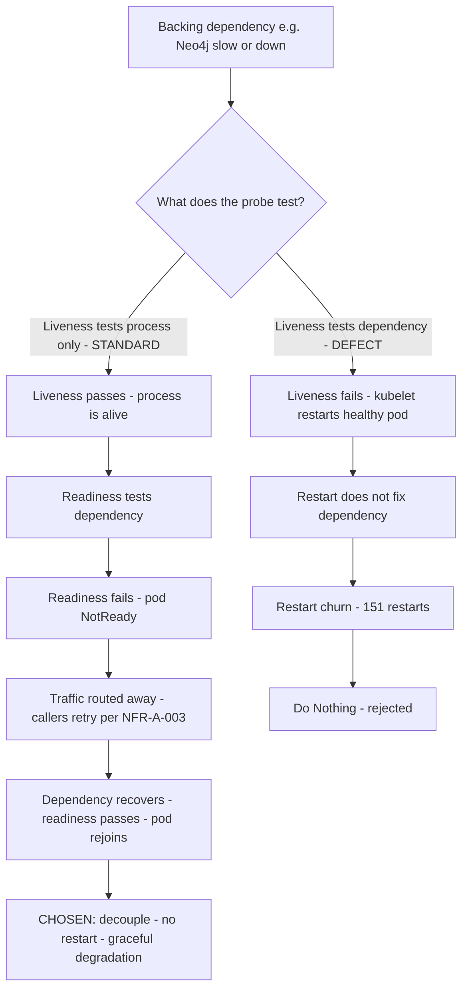

# Architecture Decision Record: Decouple Liveness from Dependency Health for MCP Services — Liveness Probes Test Process Liveness, Readiness Probes Test Dependency-Backed Serving

> **Template Origin**: Official | **ArcKit Version**: 5.11.0 | **Command**: `/arckit:adr`

## Document Control

| Field | Value |
|-------|-------|
| **Document ID** | ARC-001-ADR-004-v1.0 |
| **Document Type** | Architecture Decision Record |
| **Project** | ibn-core-my (Project 001) |
| **Classification** | PUBLIC |
| **Status** | APPROVED |
| **Version** | 1.0 |
| **Created Date** | 2026-06-20 |
| **Last Modified** | 2026-06-21 |
| **Review Cycle** | Quarterly |
| **Next Review Date** | 2026-09-20 |
| **Owner** | Roland Pfeifer, Lead Architect / CTO (Vpnet Cloud Solutions Sdn. Bhd.) |
| **Reviewed By** | Vpnet EA Review Board (EARB) — 2026-06-21 |
| **Approved By** | Roland Pfeifer, Lead Architect / CTO (for Vpnet EARB) — 2026-06-21 |
| **Distribution** | ibn-core engineering, Vpnet SI delivery teams, Platform/SRE, operator integration partners (U Mobile, TM Malaysia), Security Lead |

> **Decision status note**: The ADR **decision status is Accepted** — the chosen option was implemented and verified in `ibn-core` PR #62 (`knowledge-graph-mcp-probe-patch.yaml`), which took the `knowledge-graph-mcp` pod from **151 restarts to 0** and is recorded as evidence in `docs/compliance/TMF921-CTK-v5-GateB-stubbed-2026-06-19.md` (PR #63). The **document-control Status is APPROVED** — this ADR is a **retrospective ratification** of an already-merged operational fix, elevating it from a one-off PR to a programme-wide reliability standard, **ratified by the Vpnet EARB on 2026-06-21**. This is the "existing in-flight branches may be retro-fitted" path that `CLAUDE.md` (ArcKit-governs-all-new-work rule) explicitly permits.

> **Subject type note**: This ADR uses the **Generic / commercial** document-control header, consistent with `ARC-001-ADR-001/002/003-v1.0`. ibn-core is a **commercial** open-core telecommunications enabler delivered by Vpnet Cloud Solutions Sdn. Bhd. under SI engagements — not a Malaysian Federal public-sector entity. UK GDS / Technology Code of Practice references below are retained for template traceability but are **non-binding comparators**. This decision is classification-neutral: a Kubernetes probe topology carries no PDPA/MYCLAS residency dimension (cf. `ARC-001-ADR-003-v1.0`), so the MYCLAS ladder is not engaged here.

## Revision History

| Version | Date | Author | Changes | Approved By | Approval Date |
|---------|------|--------|---------|-------------|---------------|
| 1.0 | 2026-06-20 | ArcKit AI | Initial creation from `/arckit:adr` command — retrospective ratification of PR #62 probe fix as a programme-wide standard | [PENDING] | [PENDING] |
| 1.0 (ratified) | 2026-06-21 | ArcKit AI | EARB ratification — Document-Control Status IN_REVIEW → APPROVED; Reviewed/Approved By recorded | Roland Pfeifer (Vpnet EARB) | 2026-06-21 |

## 1. Decision Title

**Decouple Liveness from Dependency Health for MCP Services — Liveness Probes Test Process Liveness, Readiness Probes Test Dependency-Backed Serving**

This ADR records the decision to adopt, as a **programme-wide reliability standard**, the Kubernetes probe topology first implemented for `knowledge-graph-mcp` in `ibn-core` PR #62: a container's **liveness** probe MUST test only that the process is alive (an in-process, dependency-free signal — here a `tcpSocket` accept on the service port), and its **readiness** probe MUST test dependency-backed serving capacity (here `httpGet /health`, which exercises the Neo4j backend). A backing-dependency outage MUST move a pod to **NotReady** (removed from Service endpoints), **never** trigger a kubelet restart.

> **Scope note**: This decision concerns the **probe-topology standard** for ibn-core's containerised services — the MCP services in `mcp-services-k8s/` (starting with `knowledge-graph-mcp`) and, by extension, the `business-intent-agent` and peer `resource-intent-agent` workloads. It does **not** redefine the MCP wire contract (the `McpAdapter` seam — `src/mcp/McpAdapter.ts`), the autonomous-cycle behaviour (FR-003), or the deeper resilience patterns owned by NFR-A-003 (Istio circuit breakers, retries, bulkheads); it complements them at the pod-lifecycle layer.

---

## 2. Stakeholders

### 2.1 Deciders (RACI: Accountable)

- **Roland Pfeifer, Lead Architect / CTO (Vpnet Cloud Solutions)** — accountable for platform reliability standards and for the resilience posture (PRIN 2, PRIN 13) applied across every SI engagement.
- **Platform / SRE Lead (Vpnet Cloud Solutions)** — accountable for the Kubernetes manifests in `mcp-services-k8s/` and `business-intent-agent/k8s/`, and for the kubelet/probe behaviour in each operator and alpha cluster.

### 2.2 Consulted (RACI: Consulted)

- **SI Engineer / Platform Operator (Vpnet)** — applies the probe topology as IaC across landing zones (NFR-I-003); owns rollout per engagement.
- **Backend / MCP Service Engineer (Vpnet)** — owns the `/health` endpoint semantics of each MCP service and the dependency calls it makes (e.g. the Neo4j `RETURN 1` in `knowledge-graph-mcp`).
- **Enterprise / Solution Architect (Vpnet)** — orchestration-path stability (FR-003), O2C reliability, and the interaction with Istio resilience (NFR-A-003).
- **Operator Integration Architect (U Mobile, TM Malaysia)** — operator-cluster probe conventions and any operator platform constraints.

### 2.3 Informed (RACI: Informed)

- ibn-core engineering team.
- Open-source maintainers / community (the probe manifests are PUBLIC artefacts in the Apache 2.0 repo).
- Auditor / Compliance Reviewer (the Gate-B evidence doc cites this fix as an O2C-reliability control).

### 2.4 UK Government Escalation Context

> **Framing note**: ArcKit's escalation ladder is UK-Government-derived. ibn-core is a Malaysian **commercial** subject, so the level below maps to its nearest commercial-governance analogue (Vpnet Enterprise Architecture Review Board), not a UK department.

**Decision Level**: **Department** (commercial analogue: enterprise/programme-wide technology-standard decision)

**Escalation Rationale**:

- [ ] **Team**: Local implementation choice (frameworks, libraries, testing)
- [ ] **Cross-team**: Integration patterns, shared services, API standards
- [x] **Department**: Technology standards, cloud providers, security frameworks — *this is a probe-topology **standard** that binds every containerised ibn-core service across every SI engagement and the alpha cluster. It is not a one-pod tweak: it codifies "liveness ≠ dependency readiness" as a reusable reliability rule applied through IaC (NFR-I-003), and it became a release-cited reliability control in the Gate-B evidence. A programme-wide standard, not a per-PR choice.*
- [ ] **Cross-government**: National infrastructure, cross-department interoperability

**Governance Forum**: Vpnet Cloud Solutions Enterprise Architecture Review Board (EARB).

**Approval Date**: 2026-06-21 (EARB ratified; decision implemented per PR #62).

---

## 3. Context and Problem Statement

### 3.1 Problem Description

`knowledge-graph-mcp` is one of the MCP services (`mcp-services-k8s/`) that the `business-intent-agent` calls on the intent-fulfilment path (FR-003, orchestration via the MCP seam). Its Kubernetes **liveness** probe was configured as `httpGet /health` with `timeoutSeconds: 1`. The `/health` handler, however, executes a **Neo4j round-trip** (`session.run('RETURN 1')`) — so `/health` latency is bound to the latency of a *backing dependency*, not to the health of the process itself. Whenever Neo4j was cold, busy, or briefly slow, `/health` exceeded the 1-second liveness timeout; the kubelet concluded the container was dead and **restarted the pod**. Because restarting the pod does nothing to make Neo4j faster, the condition re-occurred immediately — producing **151 restarts** of churn for a process that was, throughout, perfectly alive.

This is the textbook Kubernetes probe anti-pattern: **coupling liveness to dependency health**. A liveness failure is the one signal that authorises the kubelet to *kill and recreate* the container; it must therefore answer only "is this process wedged?" A dependency being slow is a *readiness* concern (route traffic away) not a *liveness* concern (kill the process).

**Problem statement as a question**: Should an ibn-core service's liveness probe be allowed to depend on the health of a backing dependency (Neo4j, Redis, an operator endpoint), or must liveness test only in-process aliveness while readiness carries the dependency-backed serving check?

### 3.2 Why This Decision Is Needed

The restart churn is not cosmetic. Each restart drops in-flight connections, re-runs container start-up, re-establishes the Neo4j driver pool, and removes the pod from Service endpoints during the crash-loop back-off — directly destabilising the orchestration path the O2C journey (UC-1) depends on, and polluting the very telemetry (NFR-M-001) used to assess fulfilment. Left unstandardised, the same `httpGet`-on-a-dependency-call pattern would recur in every MCP service and in any operator-cluster deployment, because the manifests are reused via IaC. A one-pod fix solves one pod; a **standard** solves the class. This decision exists to convert the PR #62 fix into that standard.

- **Business context**: BR-001 (standards-conformant, reliably operating intent platform), BR-004 (operator-grade delivery — operators will not accept a service that crash-loops under normal dependency jitter).
- **Technical context**: NFR-A-003 (Fault Tolerance, CRITICAL — *graceful* degradation when MCP/dependencies are slow, not self-inflicted restarts), NFR-A-001 (Availability), NFR-M-001 (Observability — restart churn corrupts the signal), NFR-M-003 (Operational Runbooks), FR-003 (orchestration via MCP), FR-013 (status monitoring), NFR-I-003 (IaC — the standard is expressed declaratively).
- **Regulatory context**: None binding. The probe topology carries no PDPA/MYCLAS residency or personal-data dimension. (GDS/TCoP non-binding comparators only.)

### 3.3 Supporting Links

- **Implementation**: `mcp-services-k8s/knowledge-graph-mcp-probe-patch.yaml` (`ibn-core` PR #62) — strategic-merge patch that decouples the probes.
- **Evidence**: `docs/compliance/TMF921-CTK-v5-GateB-stubbed-2026-06-19.md` (PR #63) — "O2C reliability — knowledge-graph-mcp liveness fix" section; records 151 → 0 restarts.
- **Requirements**: BR-001, BR-004; FR-003, FR-008, FR-013; NFR-A-001, NFR-A-003, NFR-M-001, NFR-M-003, NFR-I-003.
- **Related ADRs**: `ARC-001-ADR-001-v1.0` (operator identity / agent runtime that drives the orchestration calls into MCP services); ADR-002 (landing-zone topology these pods deploy into).
- **External**: Kubernetes "Configure Liveness, Readiness and Startup Probes"; RFC 9315 §5.2.3 (Compliance Actions / graceful degradation).

---

## 4. Decision Drivers (Forces)

These forces are in tension (kill-and-recover speed vs. avoiding self-inflicted churn; simplicity of one probe vs. correctness of two).

### 4.1 Technical Drivers

- **Liveness must be dependency-free**: the only correct trigger for a kubelet restart is a wedged process (deadlock, event-loop stall, unrecoverable state) — never a slow backend.
  - Requirements: NFR-A-003 (CRITICAL), NFR-A-001.
  - Principles: PRIN 2 (Resilience and Fault Tolerance), PRIN 13 (Availability and Reliability).
- **Readiness is the correct lever for dependency outages**: when Neo4j is slow, the pod should leave the Service endpoint set (stop receiving traffic) and rejoin automatically when the dependency recovers — degradation, not destruction.
  - Requirements: NFR-A-003 ("degrade gracefully"), FR-003 (orchestration callers see NotReady, route/retry), FR-013.
- **Restart churn corrupts observability**: 151 spurious restarts flood logs/metrics/traces and make the orchestration path unreadable, defeating the assessment signal IntentReport relies on.
  - Requirements: NFR-M-001, FR-008.
  - Principles: PRIN 5 (Observability).
- **The standard must be expressible as IaC**: probe topology is a declarative manifest concern, reused across engagements without manual vigilance.
  - Requirements: NFR-I-003. Principle: PRIN 15 (Infrastructure as Code).
- **Composes with, does not replace, Istio resilience**: circuit breakers/retries/bulkheads (NFR-A-003) operate at the mesh/request layer; probe topology operates at the pod-lifecycle layer. Both are needed.

### 4.2 Business Drivers

- **Operator-grade reliability (BR-004)**: an MCP service that crash-loops under ordinary dependency jitter fails operator acceptance and erodes the "operator-grade delivery" promise. The standard removes a whole class of self-inflicted instability before operator go-live.
- **Reliable O2C demonstrator (BR-001)**: the canonical O2C journey (`lifecycleStatus: completed`, `reportState: fulfilled`) must run without the orchestration path flapping; this is also the Paper 1 cited use case.
- **Reuse economics**: encoding the rule once and applying it via IaC means every future MCP service and every operator cluster inherits the correct topology at zero marginal design cost.

### 4.3 Regulatory & Compliance Drivers

- **Binding**: None. A probe topology has no PDPA/MYCLAS/MCMC dimension.
- **NACSA NCII (telecommunications)**: not engaged by this decision directly, but a non-churning, observable service posture is consistent with the resilience expectations NCII will assess (`ARC-001-NCII-v1.0`).
- **UK GDS Service Standard / Technology Code of Practice**: **NOT binding** — comparators. TCoP "Point 9: hosting/operations" and the GDS "operate a reliable service" expectation map loosely to this reliability standard but impose no obligation on this commercial subject.

### 4.4 Alignment to Architecture Principles

| Principle | Alignment | Impact |
|-----------|-----------|--------|
| 2. Resilience and Fault Tolerance | ✅ Supports | Direct expression of "gracefully degrade when dependencies fail and recover automatically without manual intervention" — a slow Neo4j now yields NotReady + auto-recovery, not a restart loop. |
| 5. Observability and Operational Excellence | ✅ Supports | Removes 151 spurious restarts that polluted logs/metrics/traces; the orchestration signal becomes legible (NFR-M-001). |
| 12. Performance and Efficiency | ✅ Supports | Eliminates wasted restart/cold-start cycles and connection-pool churn. |
| 13. Availability and Reliability | ✅ Supports | Automated health checks and self-healing recovery behave correctly; availability is no longer undermined by self-inflicted kills. |
| 15. Infrastructure as Code | ✅ Supports | Probe topology codified as a declarative manifest/patch, version-controlled, reused across engagements. |
| 10. Loose Coupling | ✅ Supports | Pod lifecycle is decoupled from backing-store latency. |

No principle conflicts. The decision is the most direct pod-lifecycle expression of PRIN 2 within the IaC discipline of PRIN 15.

---

## 5. Considered Options

**Three options analysed plus a "Do Nothing" baseline.** All concern how `knowledge-graph-mcp` (and, as a standard, every ibn-core service) should configure its probes against a backing dependency.

### Option 1 (RECOMMENDED): Decouple — liveness = in-process (`tcpSocket`), readiness = dependency-backed (`/health`)

**Description**: Make liveness a dependency-free signal and move the dependency check to readiness, then adopt this as the standard for all ibn-core services. Concretely, as implemented in PR #62 for `knowledge-graph-mcp`:

- **livenessProbe** → `tcpSocket: { port: 8080 }`, `initialDelaySeconds: 15`, `periodSeconds: 20`, `timeoutSeconds: 3`, `failureThreshold: 6` (httpGet removed). "Is the process accepting connections?" — true whenever the event loop is alive, regardless of Neo4j.
- **readinessProbe** → `httpGet: /health`, `timeoutSeconds: 5`. "Can it serve dependency-backed traffic?" — exercises the Neo4j `RETURN 1`; on failure the pod goes NotReady and leaves the Service endpoints, then rejoins when Neo4j recovers.

**Implementation approach**: Strategic-merge patch in `mcp-services-k8s/`; generalise the pattern into the standard manifest shape for every MCP service and the agent workloads; verify via IaC review and a restart-count check at release.

**Wardley Evolution Stage**: Commodity (probe topology is a standardised, well-understood Kubernetes practice expressed as declarative config).

#### Good (Pros)

- ✅ **Eliminates the churn at the root**: a slow dependency can no longer trigger a restart — verified **151 → 0 restarts** on `knowledge-graph-mcp` (PR #62 / Gate-B evidence).
- ✅ **Correct failure semantics**: dependency outage → NotReady (traffic routed away, callers retry per NFR-A-003) → auto-recovery on dependency return. Exactly PRIN 2.
- ✅ **Restores observability**: orchestration logs/metrics/traces stop being drowned in restart noise (NFR-M-001, FR-008).
- ✅ **Reusable standard**: applied via IaC to every service at zero marginal design cost (NFR-I-003); operators inherit correct behaviour.
- ✅ **Liveness still catches real wedges**: a genuinely dead/deadlocked process stops accepting TCP connections → `tcpSocket` fails → kubelet restarts, as intended.

#### Bad (Cons)

- ❌ **A real but rare failure mode is slower to self-heal**: if the process is alive-but-permanently-broken in a way that still accepts TCP (e.g. a logic deadlock that doesn't close the listener), `tcpSocket` liveness won't catch it; it surfaces only as persistent NotReady. Mitigated by alerting on long-NotReady and by the deeper resilience layer.
- ❌ **Two probes to reason about**: engineers must understand the liveness/readiness split rather than "one health check". Mitigated by the standard + runbook making the rule explicit.

#### Cost Analysis

- **CAPEX**: Negligible — ~USD 0.5–1.5k (manifest change + generalising the standard + runbook note). Already largely sunk via PR #62.
- **OPEX**: Negative (a saving) — eliminates restart/cold-start waste and reduces alert/triage load.
- **TCO (3-year)**: Net saving; marginal per-service application cost ≈ 0 (manifest reuse).

#### GDS Service Standard Impact

| Point | Impact | Notes |
|-------|--------|-------|
| 9. Operate a reliable service | Positive | Self-healing without self-inflicted kills. (GDS not binding — comparator.) |
| 14. Operate / iterate | Positive | Cleaner telemetry, lower operational toil. |

---

### Option 2: Keep coupled probes, loosen liveness thresholds

**Description**: Leave liveness as `httpGet /health` (still hitting Neo4j) but raise `timeoutSeconds` and `failureThreshold` enough that ordinary dependency jitter doesn't trip it.

**Implementation approach**: Tune numbers only (e.g. `timeoutSeconds: 5`, `failureThreshold: 6`); no structural change.

**Wardley Evolution Stage**: Product (a tuned version of the wrong shape).

#### Good (Pros)

- ✅ **Smallest change**: one or two numbers; no new concept to teach.
- ✅ **Reduces churn frequency**: a wider window tolerates more jitter.

#### Bad (Cons)

- ❌ **Doesn't fix the category error**: liveness still depends on Neo4j, so a *sustained* Neo4j outage (longer than the widened window) still kills a healthy process — the churn returns under exactly the conditions where killing helps least.
- ❌ **Trades one failure for another**: a window wide enough to tolerate Neo4j outages is also slow to detect a genuinely wedged process — weakening true liveness detection.
- ❌ **Not a standard, a guess**: the "right" thresholds vary per dependency and per cluster; it institutionalises tuning roulette rather than a rule.

#### Cost Analysis

- **CAPEX**: ~USD 0.3–0.8k (tuning + re-tuning per environment).
- **OPEX**: Low but recurring (re-tuning, residual churn triage).
- **TCO (3-year)**: Higher than Option 1 once recurring re-tuning and residual incidents are counted.

#### GDS Service Standard Impact

| Point | Impact | Notes |
|-------|--------|-------|
| 9. Operate a reliable service | Neutral/Negative | Masks symptoms; sustained outages still cause churn. |

---

### Option 3: Make `/health` itself dependency-light (split deep vs. shallow health in the app)

**Description**: Change the application so `/health` (used by liveness) returns 200 on pure process health and a *separate* endpoint (e.g. `/ready`) performs the Neo4j check for readiness — i.e. fix the coupling in code rather than in the manifest.

**Implementation approach**: Add a shallow `/health` and a deep `/ready` to each MCP service; point liveness at `/health`, readiness at `/ready`.

**Wardley Evolution Stage**: Custom-Built (per-service application code).

#### Good (Pros)

- ✅ **Conceptually clean at the app layer**: each service explicitly owns its shallow/deep distinction.
- ✅ **HTTP liveness retains payload-level checks**: can assert in-process invariants beyond "TCP accepts".

#### Bad (Cons)

- ❌ **Requires code change in every MCP service**: more surface, more review, more release coordination than a manifest patch — and must be repeated for each new service.
- ❌ **Achieves the same outcome as Option 1 at higher cost**: `tcpSocket` liveness already gives a dependency-free signal without touching application code; Option 3's extra power (payload checks) is rarely needed for these services.
- ❌ **Inconsistent rollout risk**: until every service ships the split, the standard is partial; the manifest standard (Option 1) applies uniformly and immediately.

#### Cost Analysis

- **CAPEX**: ~USD 4–9k (per-service endpoint work + tests across the MCP fleet).
- **OPEX**: Low once shipped, but higher carrying cost per new service.
- **TCO (3-year)**: Higher than Option 1 for equivalent benefit; can be adopted later for any service that genuinely needs payload-level liveness.

#### GDS Service Standard Impact

| Point | Impact | Notes |
|-------|--------|-------|
| 9. Operate a reliable service | Positive | Correct, but more expensive route to it. |

---

### Option 4: Do Nothing (Baseline)

**Description**: Leave `knowledge-graph-mcp` (and other services) with `httpGet /health` liveness at `timeoutSeconds: 1`.

#### Good

- ✅ **No change cost**: nothing to do.

#### Bad

- ❌ **151-restart churn persists**: the orchestration path keeps flapping under ordinary Neo4j jitter; O2C reliability (BR-001, UC-1) stays compromised.
- ❌ **Self-inflicted unavailability**: violates NFR-A-003 (CRITICAL) and PRIN 2 — the system destroys healthy processes instead of degrading gracefully.
- ❌ **Observability stays polluted**: restart noise masks real signals (NFR-M-001).
- ❌ **Fails operator acceptance (BR-004)**: a crash-looping MCP service is not operator-grade; the defect propagates to every reused deployment.

---

## 6. Decision Outcome

### 6.1 Chosen Option

**"Option 1: Decouple — liveness = in-process (`tcpSocket`), readiness = dependency-backed (`/health`)"** — adopted as the programme-wide probe-topology standard for all ibn-core containerised services.

### 6.2 Y-Statement (Structured Justification)

> **In the context of** operating ibn-core's MCP services (and the peer agent workloads) on Kubernetes, where service health checks must distinguish a wedged process from a slow backing dependency,
> **facing** restart churn (151 restarts on `knowledge-graph-mcp`) caused by a liveness probe (`httpGet /health`, `timeoutSeconds: 1`) whose `/health` handler performs a Neo4j round-trip — so ordinary dependency latency killed a healthy process,
> **we decided for** decoupling the probes — liveness tests only in-process aliveness (`tcpSocket` accept) while readiness carries the dependency-backed `/health` check — and adopting this split as the standard manifest shape across all services,
> **to achieve** graceful degradation (dependency outage → NotReady + auto-recovery, never a restart), legible observability, and operator-grade reliability expressed once as reusable IaC,
> **accepting** that a rare alive-but-broken-yet-still-listening failure mode is caught only as sustained NotReady (mitigated by alerting and the deeper Istio resilience layer), and that engineers must understand a two-probe split rather than a single health check.

### 6.3 Justification (Why This Option?)

**Key reasons**:

1. **It fixes the category error, not the symptom**: liveness is the signal that authorises killing a container; coupling it to Neo4j made the platform kill healthy processes precisely when Neo4j needed them to keep their warm connection pools. Option 1 removes that coupling at the root; Option 2 only widens the window before the same wrong behaviour resumes.
2. **It is verified, not theoretical**: implemented in PR #62, it took `knowledge-graph-mcp` from **151 restarts to 0** and is cited as an O2C-reliability control in the Gate-B evidence (PR #63). The decision ratifies a measured result.
3. **It is the cheapest correct option**: `tcpSocket` liveness delivers a dependency-free signal with a manifest change alone. Option 3 reaches the same correctness but requires per-service application code; it remains available later for any service that genuinely needs payload-level liveness checks.
4. **It composes with existing resilience**: probe topology (pod lifecycle) sits beneath the Istio circuit-breaker/retry/bulkhead layer (NFR-A-003, request lifecycle). Both are required; this closes the pod-lifecycle gap the mesh layer cannot.
5. **A standard beats a fix**: because manifests are reused via IaC across MCP services and operator clusters, encoding the rule once prevents the same defect re-shipping in every future service (BR-004 reuse economics, NFR-I-003).

**Stakeholder consensus**: Aligns the Lead Architect/CTO (resilience posture), Platform/SRE (manifest ownership), and MCP service engineering (`/health` semantics). No dissenting view recorded; the result was demonstrated before this ADR was raised.

**Risk appetite**: Low–Medium. The accepted residual (a rare still-listening-but-broken mode caught only as NotReady) is bounded by alerting and the mesh resilience layer; the alternatives carry either persistent self-inflicted unavailability (Do Nothing), masked-but-recurring churn (Option 2), or higher cost for equal benefit (Option 3).

---

## 7. Consequences

### 7.1 Positive Consequences

- ✅ **Churn eliminated at source**: a slow/absent dependency can no longer restart a healthy pod.
- ✅ **Correct degradation**: dependency outage → NotReady → automatic rejoin on recovery (PRIN 2, NFR-A-003).
- ✅ **Clean observability**: orchestration telemetry is legible again (NFR-M-001, FR-008).
- ✅ **Reusable reliability standard**: every MCP service and agent workload inherits the topology via IaC (NFR-I-003).
- ✅ **Operator-grade posture**: no crash-loop under ordinary jitter (BR-004); the O2C demonstrator runs stable (BR-001, UC-1).

**Measurable outcomes**:

- `knowledge-graph-mcp` restarts under dependency jitter: **151 → 0** (PR #62, Gate-B evidence).
- Spurious restart-driven log/metric noise on the orchestration path: high → ~0.
- Mean time to recover from a transient Neo4j slowdown: container restart + cold start → readiness-probe interval (no restart).
- MCP services conforming to the liveness/readiness split: 1 (`knowledge-graph-mcp`) → target 100% of `mcp-services-k8s/` services + agent workloads.

### 7.2 Negative Consequences (Accepted Trade-offs)

- ❌ **Alive-but-broken-yet-listening mode not caught by liveness**: a process that deadlocks logically while still accepting TCP surfaces only as persistent NotReady, not an automatic restart.
- ❌ **Two-probe cognitive cost**: engineers must apply the liveness/readiness distinction correctly per service.

**Mitigation strategies**:

- **Still-listening-but-broken**: alert on pods NotReady beyond a threshold; rely on the Istio resilience layer (NFR-A-003) to route around them; adopt Option 3 (deep app health) selectively for any service where payload-level liveness is genuinely warranted.
- **Cognitive cost**: encode the rule in the standard manifest shape and an operational runbook (NFR-M-003) so the split is the default, not a per-engineer judgement.

### 7.3 Neutral Consequences (Changes Needed)

- 🔄 **Skills**: engineers and SI operators internalise "liveness = process, readiness = dependency" as the house rule.
- 🔄 **Infrastructure**: the probe topology becomes the standard manifest shape in `mcp-services-k8s/` and `business-intent-agent/k8s/`; applied to new services by default.
- 🔄 **Process**: IaC review checks the split; a release-time restart-count sanity check guards against regressions; runbook updated for the NotReady-on-dependency-outage behaviour.

### 7.4 Risks and Mitigations

| Risk | Likelihood | Impact | Mitigation | Owner |
|------|------------|--------|------------|-------|
| A process deadlocks but keeps the TCP listener open → not restarted, only NotReady | L | M | Alert on sustained NotReady; periodic deeper health review; Option 3 for services needing payload liveness | Platform / SRE Lead |
| Readiness `/health` too aggressive → pod flaps in/out of endpoints under mild jitter | L | M | `timeoutSeconds: 5` + sane `failureThreshold`; readiness flap monitoring | Platform / SRE Lead |
| Standard not applied to a new MCP service → coupled-probe defect re-ships | M | M | Standard manifest shape + IaC review check + release restart-count check | SI Engineer / Platform Operator |
| `tcpSocket` masks a startup-stuck process that never serves | L | L | `startupProbe` (or `initialDelaySeconds`) where slow start is expected; readiness gates traffic regardless | Backend / MCP Engineer |

**Link to risk register**: `projects/001-ibn-core-my/ARC-001-RISK-v1.0.md`. This decision is a control that *reduces* the operational-reliability surface around **R-001** (autonomous agent acting on an unstable orchestration path) by stabilising the MCP services the agent drives. The four rows above are **candidate risks** to register at the next `/arckit:risk` revision (none currently has a dedicated R-ID).

---

## 8. Validation & Compliance

### 8.1 How Will Implementation Be Verified?

**Design review**:

- [x] The probe topology is captured in `mcp-services-k8s/knowledge-graph-mcp-probe-patch.yaml` (PR #62).
- [ ] The standard manifest shape (liveness `tcpSocket` / readiness `/health`) is documented for all MCP services and agent workloads.
- [ ] Deployment manifests in `business-intent-agent/k8s/` reviewed for conformance.

**Code / IaC review**:

- [ ] PR checklist item: "liveness probe is dependency-free (in-process); any dependency check lives in readiness" for every new or modified service manifest.
- [ ] No `httpGet` liveness probe whose handler performs a backing-store/dependency round-trip.

**Testing strategy**:

- [x] Restart-count check: `knowledge-graph-mcp` restarts under dependency jitter = 0 (verified, PR #62).
- [ ] Fault-injection: induce Neo4j slowness → assert pod goes NotReady (not Restarting) and auto-recovers (PRIN 2 validation gate: fault-injection testing).
- [ ] Liveness sanity: a deliberately wedged process (listener closed) is restarted by `tcpSocket` liveness.

### 8.2 Monitoring & Observability

**Success metrics**:

- Pod restart count attributable to dependency latency: 0 per service.
- Time-in-NotReady per dependency-slowdown event (should bound recovery without restart).
- % of `mcp-services-k8s/` services + agent workloads conforming to the split: target 100%.

**Alerts and dashboards**:

- Alert: pod NotReady beyond threshold (the new failure mode that replaces the old restart loop).
- Alert: any pod restart on the orchestration path (should now be rare and meaningful).
- Dashboard: restart-count and readiness-state per MCP service.

### 8.3 Compliance Verification

**GDS / TCoP**: NOT binding (comparator). GDS "operate a reliable service" satisfied in spirit.

**Security assurance** (PRIN 4): No change to the security posture — probe endpoints expose no new surface; `tcpSocket` reveals only that the port accepts connections.

**Data protection**: Not engaged — no personal data, no residency dimension.

**Standards**: RFC 9315 §5.2.3 (Compliance Actions) — graceful degradation under dependency failure is the intended behaviour; this decision makes the pod-lifecycle layer conform.

---

## 9. Links to Supporting Documents

### 9.1 Requirements Traceability

**Business Requirements**:

- BR-001: Standards-Conformant Intent Platform — a reliably operating O2C path (no orchestration flapping).
- BR-004: Operator-Grade Delivery — no crash-loop under ordinary dependency jitter; operator-acceptable reliability.

**Functional Requirements**:

- FR-003: Autonomous Agent Orchestration via MCP — the orchestration path is stabilised; callers see NotReady and retry rather than hitting a restarting pod.
- FR-008: IntentReport Generation — assessment signal no longer corrupted by restart noise.
- FR-013: Intent Status Monitoring — status path served by stable, ready pods.

**Non-Functional Requirements**:

- NFR-A-003 (CRITICAL): Fault Tolerance — graceful degradation instead of self-inflicted restarts.
- NFR-A-001: Availability — self-inflicted unavailability removed.
- NFR-M-001: Observability — restart-noise eliminated from telemetry.
- NFR-M-003: Operational Runbooks — NotReady-on-dependency-outage behaviour documented.
- NFR-I-003: Infrastructure as Code — standard expressed declaratively, reused across engagements.

### 9.2 Architecture Artifacts

**Architecture principles**: `projects/000-global/ARC-000-PRIN-v1.0.md` — Principles 2, 5, 10, 12, 13, 15.

**Risk register**: `projects/001-ibn-core-my/ARC-001-RISK-v1.0.md` — reduces operational surface around R-001; four candidate rows to register at next revision.

**Operational readiness**: `projects/001-ibn-core-my/ARC-001-OPS-v1.0.md` — the probe standard and the NotReady failure mode belong in the runbook set (NFR-M-003).

**Stakeholder drivers**: `projects/001-ibn-core-my/ARC-001-STKE-v1.0.md` — operator-grade reliability supports the operator-acceptance and go-live goals.

### 9.3 Design Documents

- High-Level Design: [PENDING] — to show the standard probe topology across the MCP fleet.
- Detailed Design: `mcp-services-k8s/knowledge-graph-mcp-probe-patch.yaml` is the concrete specification for `knowledge-graph-mcp`.
- Deployment manifests: `mcp-services-k8s/`, `business-intent-agent/k8s/`.

### 9.4 External References

**Standards and guidance**:

- Kubernetes — "Configure Liveness, Readiness and Startup Probes" — <https://kubernetes.io/docs/tasks/configure-pod-container/configure-liveness-readiness-startup-probes/> — the liveness-vs-readiness distinction this decision applies.
- RFC 9315 Intent-Based Networking, §5.2.3 Compliance Actions (DOI 10.17487/RFC9315) — graceful degradation under dependency failure.

**Implementation / evidence**:

- `ibn-core` PR #62 — `mcp-services-k8s/knowledge-graph-mcp-probe-patch.yaml` (the implementation).
- `ibn-core` PR #63 — `docs/compliance/TMF921-CTK-v5-GateB-stubbed-2026-06-19.md` (the evidence; 151 → 0 restarts).

**Comparator (NOT binding)**:

- UK GDS Service Standard Point 9 / Point 14; Technology Code of Practice Point 9 — comparators only.

---

## 10. Implementation Plan

### 10.1 Dependencies

**Prerequisite decisions**:

- `ARC-001-ADR-002-v1.0` (landing-zone topology) — the pods governed by this probe standard deploy into that topology.
- `ARC-001-ADR-001-v1.0` (operator identity / agent runtime) — the runtime whose orchestration calls (FR-003) the stabilised MCP services serve.

**Infrastructure dependencies**:

- Kubernetes clusters (alpha `local-k8s` and operator landing zones); the `mcp-services-k8s/` manifests; Istio (for the complementary NFR-A-003 resilience layer).

**Team dependencies**:

- Platform/SRE manifest ownership; MCP service engineers for `/health` semantics.

### 10.2 Implementation Timeline

| Phase | Activities | Duration | Owner |
|-------|-----------|----------|-------|
| **Phase 1: Fix (done)** | Decouple `knowledge-graph-mcp` probes; verify 151 → 0 restarts | Complete (PR #62) | Platform / SRE Lead |
| **Phase 2: Evidence (done)** | Record fix in Gate-B compliance doc | Complete (PR #63) | Enterprise / Solution Architect |
| **Phase 3: Standardise** | Document the standard manifest shape; apply to remaining `mcp-services-k8s/` services + `business-intent-agent/k8s/` | 1–2 weeks | SI Engineer / Platform Operator |
| **Phase 4: Guardrail** | IaC-review checklist item + release restart-count check; runbook update (NFR-M-003) | 1 week | Platform / SRE Lead |
| **Phase 5: Ratify** | EARB sign-off; move document Status DRAFT/IN_REVIEW → APPROVED | By 2026-09-20 | EARB |

### 10.3 Rollback Plan

**Rollback trigger**: The decoupled topology causes a worse failure mode in some service (e.g. a critical wedge that `tcpSocket` cannot detect and the mesh cannot route around).

**Rollback procedure**:

1. For the affected service, reinstate an `httpGet` liveness — but pointed at a **shallow** (dependency-free) endpoint, not at the dependency-backed `/health` (i.e. move toward Option 3 for that service, not back to the coupled anti-pattern).
2. Keep readiness on the dependency-backed check.
3. Re-run fault-injection and restart-count verification.

> Note: rollback does **not** mean reverting to dependency-coupled liveness — that is the defect this ADR removes. Rollback means substituting a safer dependency-free liveness signal.

**Rollback owner**: Platform / SRE Lead (with Lead Architect sign-off).

---

## 11. Review and Updates

### 11.1 Review Schedule

**Initial review**: 2026-09-20 (first quarterly cycle; EARB ratification).

**Periodic review**: Quarterly, or on trigger.

**Review criteria**:

- Are all `mcp-services-k8s/` services + agent workloads conforming to the split?
- Have any dependency-coupled liveness probes re-appeared (regression)?
- Has the new NotReady failure mode produced any unhandled incident?

### 11.2 Trigger Events for Review

- [ ] A new MCP service is added (must inherit the standard).
- [ ] A service-mesh / Kubernetes platform change alters probe semantics.
- [ ] An incident where `tcpSocket` liveness failed to catch a genuinely wedged process.
- [ ] Adoption of `resource-intent-agent` workloads needing the same standard.

---

## 12. Related Decisions

### 12.1 Decisions This ADR Depends On

- **`ARC-001-ADR-002-v1.0`** (landing-zone topology): the pods this standard governs deploy into that topology.
- **`ARC-001-ADR-001-v1.0`** (operator identity / agent runtime): the runtime whose FR-003 orchestration calls the stabilised MCP services serve.

### 12.2 Decisions That Depend On This ADR

- Future HLD/DLD for the MCP fleet and the `business-intent-agent` / `resource-intent-agent` deployment manifests.
- Any operational-readiness (`ARC-001-OPS`) runbook revision documenting the NotReady-on-dependency-outage behaviour.

### 12.3 Conflicting Decisions

- None. This decision complements the NFR-A-003 / PRIN 2 resilience patterns (Istio circuit breakers, retries, bulkheads) at the pod-lifecycle layer rather than conflicting with them.

---

## 13. Appendices

### Appendix A: Probe Topology (the chosen Option 1, codified)

> The operative output of the decision, as implemented for `knowledge-graph-mcp` in `mcp-services-k8s/knowledge-graph-mcp-probe-patch.yaml` (PR #62) and adopted as the standard manifest shape for all ibn-core services.

| Probe | Before (coupled — defective) | After (decoupled — standard) | Rationale |
|-------|------------------------------|------------------------------|-----------|
| **liveness** | `httpGet: /health`, `timeoutSeconds: 1` (runs Neo4j `RETURN 1`) | `tcpSocket: { port: 8080 }`, `initialDelaySeconds: 15`, `periodSeconds: 20`, `timeoutSeconds: 3`, `failureThreshold: 6` | Liveness = "is the process alive?" — dependency-free. Restart only a genuinely wedged process. |
| **readiness** | (effectively the same dependency-backed check, conflated) | `httpGet: /health`, `timeoutSeconds: 5` | Readiness = "can it serve dependency-backed traffic?" — dependency outage → NotReady, not restart. |

**The house rule (department standard)**: *A liveness probe MUST test only in-process aliveness (dependency-free — `tcpSocket`, or a shallow dependency-free `httpGet`). A readiness probe carries any dependency-backed check. A backing-dependency outage MUST move a pod to NotReady, never trigger a restart.* Applies to every service in `mcp-services-k8s/`, `business-intent-agent/k8s/`, and future `resource-intent-agent` workloads.

### Appendix B: Stakeholder Consultation Log

| Date | Stakeholder | Feedback | Action Taken |
|------|-------------|----------|--------------|
| 2026-06-19 | Platform / SRE (PR #62 review) | Decoupled topology confirmed; 151 → 0 restarts observed | Merged PR #62 |
| 2026-06-19 | Enterprise / Solution Architect (PR #63) | Fix recorded as an O2C-reliability control | Merged Gate-B evidence update |
| 2026-06-20 | (ADR ratification stage) | Elevate the one-pod fix to a programme-wide standard | This ADR raised for EARB sign-off |

### Appendix C: Alternative Formats

**Mermaid Decision Flow Diagram**:

---

## Document Approval

| Role | Name | Signature | Date |
|------|------|-----------|------|
| **Technical Architect** | [PENDING] | | 2026-09-20 |
| **Senior Responsible Owner** | Roland Pfeifer (Lead Architect / CTO) | | 2026-09-20 |
| **Platform / SRE Lead** | [PENDING] | | 2026-09-20 |
| **Governance Board** | Vpnet EA Review Board (EARB) | | 2026-09-20 |

---

*This ADR follows the MADR v4.0 format enhanced with UK Government requirements and ArcKit governance standards. UK GDS / TCoP references are retained for template traceability but are NOT binding on this commercial Malaysian subject.*

## External References

> This section provides traceability from generated content back to source documents.

### Document Register

| Doc ID | Filename | Type | Source Location | Description |
|--------|----------|------|-----------------|-------------|
| PR-62 | knowledge-graph-mcp-probe-patch.yaml | Kubernetes manifest patch | mcp-services-k8s/ | Strategic-merge patch decoupling KG-MCP liveness from Neo4j (the implementation) |
| PR-63 | TMF921-CTK-v5-GateB-stubbed-2026-06-19.md | Compliance evidence | docs/compliance/ | Gate-B doc; "O2C reliability — knowledge-graph-mcp liveness fix" (151 → 0 restarts) |
| ARC-001-REQ | ARC-001-REQ-v1.0.md | Requirements | projects/001-ibn-core-my/ | BR/FR/NFR baseline |
| ARC-001-RISK | ARC-001-RISK-v1.0.md | Risk Register | projects/001-ibn-core-my/ | R-001 operational-reliability surface |
| ARC-001-OPS | ARC-001-OPS-v1.0.md | Operational Readiness | projects/001-ibn-core-my/ | Runbook home for the probe standard |
| ARC-000-PRIN | ARC-000-PRIN-v1.0.md | Principles | projects/000-global/ | Enterprise architecture principles |
| ARC-001-ADR-001 | ARC-001-ADR-001-v1.0.md | ADR | projects/001-ibn-core-my/decisions/ | Operator identity / agent runtime |
| ARC-001-ADR-002 | ARC-001-ADR-002-v1.0.md | ADR | projects/001-ibn-core-my/decisions/ | Landing-zone topology |

### Citations

| Citation ID | Doc ID | Page/Section | Category | Quoted Passage |
|-------------|--------|--------------|----------|----------------|
| [PR62-1] | PR-62 | livenessProbe / readinessProbe | Implementation | Liveness → `tcpSocket: {port: 8080}`; readiness → `httpGet /health, timeoutSeconds: 5` (httpGet removed from liveness). |
| [PR63-1] | PR-63 | O2C reliability section | Evidence | "knowledge-graph-mcp liveness fix" — restart churn 151 → 0; recorded as an O2C-reliability control. |
| [REQ-1] | ARC-001-REQ | NFR-A-003 | Requirement | "The system must degrade gracefully when external operator, MCP, AI-inference, or identity dependencies fail, and recover automatically." (Priority: CRITICAL) |
| [REQ-2] | ARC-001-REQ | FR-003 | Requirement | "orchestrate intent fulfilment by invoking `McpAdapter.orchestrate()` through the MCP adapter seam… a failing adapter call triggers retry-with-backoff and circuit-breaker behaviour (see NFR-A-003)." |
| [REQ-3] | ARC-001-REQ | NFR-M-001 | Requirement | "Comprehensive instrumentation for monitoring, troubleshooting, and capacity planning… distributed trace context across intent processing and MCP calls." |
| [PRIN-1] | ARC-000-PRIN | Principle 2 | Principle | "All systems MUST gracefully degrade when dependencies fail and recover automatically without data loss or manual intervention… Provide automated health checks and self-healing recovery." |
| [PRIN-2] | ARC-000-PRIN | Principle 13 | Principle | "All systems MUST meet defined availability targets with automated recovery and minimal data loss." |

### Unreferenced Documents

| Filename | Source Location | Reason |
|----------|-----------------|--------|
| — | — | — |

---

**Generated by**: ArcKit `/arckit:adr` command
**Generated on**: 2026-06-20 21:00 GMT
**ArcKit Version**: 5.11.0
**Project**: ibn-core-my (Project 001)
**AI Model**: claude-opus-4-8[1m]
**Generation Context**: Retrospective ratification of `ibn-core` PR #62 (knowledge-graph-mcp probe decoupling) and PR #63 (Gate-B evidence) as a programme-wide reliability standard. Synthesised from ARC-001-REQ-v1.0 (FR-003, NFR-A-001/A-003, NFR-M-001/M-003, NFR-I-003, BR-001/004), ARC-000-PRIN-v1.0 (Principles 2, 5, 10, 12, 13, 15), ARC-001-RISK-v1.0 (R-001), and the ADR-001/002/003 house style. The probe-patch YAML and Gate-B doc are on `main` (PRs #62/#63), not the current `work/baseline-post-49` branch.

<!-- arckit-provenance:start -->

## Build Provenance

_Stamped automatically by the ArcKit plugin's `provenance-stamp.mjs` PostToolUse hook. Complements (does not replace) the human-authored footer above. Carries only fields the model can't authoritatively self-report: build context from `.arckit/state.json` and effort levels derived from command frontmatter + the silent-downgrade matrix._

| Field | Value |
|-------|-------|
| Requested Effort | `high` |
| Effective Effort | _unknown — model not parsed from existing footer_ |
| Stamped at | 2026-06-21T12:07:54.280Z |

<!-- arckit-provenance:end -->
