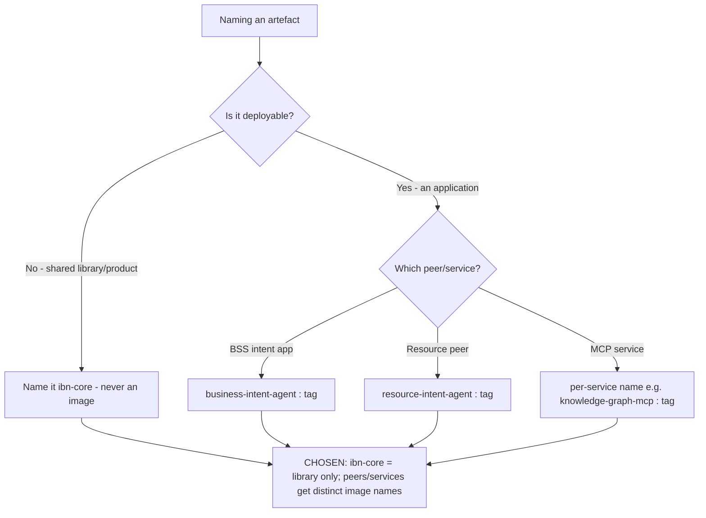

# Architecture Decision Record: Product & Container-Image Naming Convention — `ibn-core` is the Shared Library/Product, Peer Applications Ship as `business-intent-agent` and `resource-intent-agent` Images

> **Template Origin**: Official | **ArcKit Version**: 5.11.0 | **Command**: `/arckit:adr`

## Document Control

| Field | Value |
|-------|-------|
| **Document ID** | ARC-001-ADR-005-v1.0 |
| **Document Type** | Architecture Decision Record |
| **Project** | ibn-core-my (Project 001) |
| **Classification** | PUBLIC |
| **Status** | IN_REVIEW |
| **Version** | 1.0 |
| **Created Date** | 2026-06-20 |
| **Last Modified** | 2026-06-20 |
| **Review Cycle** | Quarterly |
| **Next Review Date** | 2026-09-20 |
| **Owner** | Roland Pfeifer, Lead Architect / CTO (Vpnet Cloud Solutions Sdn. Bhd.) |
| **Reviewed By** | [PENDING] |
| **Approved By** | [PENDING] |
| **Distribution** | ibn-core engineering, Vpnet SI delivery teams, Platform/SRE, operator integration partners (U Mobile, TM Malaysia) |

> **Decision status note**: The **decision status is Accepted** — the convention was implemented and codified in `ibn-core` PR #64 (the `## Product & Image Naming` section of `CLAUDE.md`), and the mislabelled live image `ibn-core:ctk-fixes` was retagged to `business-intent-agent:ctk-fixes` with the canonical O2C journey re-verified. The **document-control Status is IN_REVIEW** because this ADR is a **retrospective ratification** of that change, elevating a CLAUDE.md convention into a governed, programme-wide naming standard — pending EARB sign-off. This is the "existing in-flight branches may be retro-fitted" path that `CLAUDE.md` (ArcKit-governs-all-new-work rule) permits.

> **Subject type note**: Generic / commercial document-control header, consistent with `ARC-001-ADR-001/002/003/004`. ibn-core is a commercial open-core telecommunications enabler delivered by Vpnet Cloud Solutions Sdn. Bhd. under SI engagements. UK GDS / TCoP references are non-binding comparators. This decision is classification-neutral (a naming convention carries no PDPA/MYCLAS residency dimension).

## Revision History

| Version | Date | Author | Changes | Approved By | Approval Date |
|---------|------|--------|---------|-------------|---------------|
| 1.0 | 2026-06-20 | ArcKit AI | Initial creation from `/arckit:adr` command — retrospective ratification of the PR #64 naming convention | [PENDING] | [PENDING] |

## 1. Decision Title

**Product & Container-Image Naming Convention — `ibn-core` is the Shared Library/Product, Peer Applications Ship as `business-intent-agent` and `resource-intent-agent` Images**

This ADR records the decision that **`ibn-core` names the shared open-core library/product/repository and MUST NEVER be used as a runtime container-image name**. The two peer applications that consume the core ship under their own image identities: **`business-intent-agent:<tag>`** (the BSS-layer intent application — the workload running in the `intent-platform` namespace) and **`resource-intent-agent:<tag>`** (the resource-layer peer). This is the "two peers, one core" model made legible in the artefact naming: one shared core, two independently-named deployable peers.

> **Scope note**: This decision governs **naming** — the product/library name vs. runtime image names, as codified in `CLAUDE.md` `## Product & Image Naming`. It does not change what the core *contains* (the RFC 9315 reuse surface — see the companion library-packaging ADR), nor the open-core/private-adapter seam itself (`src/mcp/McpAdapter.ts`, PRIN 9), nor the deployment topology (ADR-002). It removes a category confusion between "the shared thing" and "the deployable things that use it".

---

## 2. Stakeholders

### 2.1 Deciders (RACI: Accountable)

- **Roland Pfeifer, Lead Architect / CTO (Vpnet Cloud Solutions)** — accountable for product identity, the open-core seam (PRIN 9, NON-NEGOTIABLE), and naming standards applied across repos, images, and SI engagements.
- **Platform / SRE Lead (Vpnet Cloud Solutions)** — accountable for the container registry, image tags, and the deployment manifests that reference them.

### 2.2 Consulted (RACI: Consulted)

- **Release / CI Engineer (Vpnet)** — image build/tag/push pipeline; tag traceability to commits/releases (PRIN 17).
- **SI Engineer / Platform Operator (Vpnet)** — manifest image references across operator landing zones (NFR-I-003).
- **Enterprise / Solution Architect (Vpnet)** — the "two peers, one core" decomposition and the resource-intent-agent peer relationship.

### 2.3 Informed (RACI: Informed)

- ibn-core engineering team and open-source maintainers / community (the names are public, in the Apache 2.0 repo and CLAUDE.md).
- resource-intent-agent maintainers (private repo, Project 004) — the peer whose image name this standard fixes.
- Operator integration partners (U Mobile, TM Malaysia).

### 2.4 UK Government Escalation Context

> **Framing note**: ArcKit's escalation ladder is UK-Government-derived; ibn-core is a Malaysian commercial subject, mapped to its EARB analogue.

**Decision Level**: **Department** (commercial analogue: enterprise/programme-wide technology-standard decision)

**Escalation Rationale**:

- [ ] **Team**: Local implementation choice (frameworks, libraries, testing)
- [ ] **Cross-team**: Integration patterns, shared services, API standards
- [x] **Department**: Technology standards — *a naming convention that binds every repository, container image, deployment manifest, and CI pipeline across both peer applications and every SI engagement. It is a programme-wide identity standard, not a per-PR choice, and it protects the legibility of the open-core seam (PRIN 9).*
- [ ] **Cross-government**: National infrastructure, cross-department interoperability

**Governance Forum**: Vpnet Cloud Solutions Enterprise Architecture Review Board (EARB).

**Approval Date**: 2026-09-20 (target ratification; decision already implemented per PR #64).

---

## 3. Context and Problem Statement

### 3.1 Problem Description

ibn-core is the shared open-core framework consumed by two peer applications — the **business-intent-agent** (BSS layer; the running O2C workload) and the **resource-intent-agent** (resource layer; Project 004, private repo). A live container image was found tagged **`ibn-core:ctk-fixes`** — but its contents were the *business-intent-agent* application, not "the core". Naming a deployable image after the shared library conflates two distinct concepts: the **product/library** (`ibn-core`, a thing you *import* or build *from*) and the **applications** (things you *deploy*). The conflation is not cosmetic — it implies the core is itself a single deployable app, erases the identity of the second peer (`resource-intent-agent`), and muddies the open-core seam that the whole commercial model depends on (PRIN 9, BR-003).

**Problem statement as a question**: Should the shared open-core name `ibn-core` double as a runtime container-image name for the BSS application, or must runtime images carry distinct per-application names while `ibn-core` is reserved for the shared library/product?

### 3.2 Why This Decision Is Needed

Image and product names propagate into manifests (NFR-I-003), CI pipelines (PRIN 17), runbooks, dashboards, and — critically for an agent-native codebase — the context a fresh Claude Code session reads to orient itself (PRIN 14, NFR-M-002). An ambiguous name compounds: every manifest, alert, and doc that references `ibn-core` as-if-it-were-an-app entrenches the confusion and makes the "two peers, one core" architecture harder to reason about, for humans and agents alike. Left unstandardised, the second peer (`resource-intent-agent`) has no clean image identity and the open-core boundary blurs at exactly the layer (deployment) where operators first encounter it.

- **Business context**: BR-003 (open-core commercial model integrity — the core/app boundary must be unambiguous), BR-002 (the AI-native platform is realised as two peer apps over one core), BR-006 (citable, traceable release/image baseline).
- **Technical context**: NFR-M-002 (agent-readable context), NFR-I-002 (loose coupling / published-interface integration), NFR-I-003 (IaC image references).
- **Regulatory context**: None binding (naming convention).

### 3.3 Supporting Links

- **Implementation**: `CLAUDE.md` `## Product & Image Naming` section (PR #64); retag `ibn-core:ctk-fixes` → `business-intent-agent:ctk-fixes` (O2C re-verified).
- **Requirements**: BR-002, BR-003, BR-006; NFR-M-002, NFR-I-002, NFR-I-003.
- **Related ADRs**: ADR-002 (deployment topology these images run in); ADR-004 (probe standard for these same workloads); the companion library-packaging ADR (what `ibn-core`-the-library exposes).

---

## 4. Decision Drivers (Forces)

### 4.1 Technical Drivers

- **Name = concept**: a deployable image must name an application; a library/product name must not be reused for a runtime artefact, or every downstream reference inherits the ambiguity.
  - Requirements: NFR-M-002, NFR-I-003. Principles: PRIN 14 (Maintainability / agent-readable context).
- **Two distinct deployables need two distinct identities**: `business-intent-agent` and `resource-intent-agent` are independently built, versioned, and deployed; shared names defeat that.
  - Requirements: NFR-I-002. Principle: PRIN 10 (Loose Coupling).
- **Traceability**: image tags must trace to commits/releases unambiguously (PRIN 17, BR-006); a name that means two things breaks the trace.

### 4.2 Business Drivers

- **Open-core seam legibility (BR-003, PRIN 9)**: the commercial model rests on a clean public-core / consuming-app boundary; the naming makes that boundary visible at the artefact layer, not just in source.
- **Two-peer product story (BR-002)**: "one core, two peers" is the architecture; the naming convention is its most basic expression.

### 4.3 Regulatory & Compliance Drivers

- **Binding**: None.
- **UK GDS / TCoP**: NOT binding — comparators. (TCoP "Point 8: share and reuse" maps loosely: a clearly-named shared core is easier to reuse.)

### 4.4 Alignment to Architecture Principles

| Principle | Alignment | Impact |
|-----------|-----------|--------|
| 9. Open-Core / Proprietary Seam Integrity (NON-NEGOTIABLE) | ✅ Supports | The name reserves `ibn-core` for the public shared core, keeping the core/consuming-app boundary unambiguous at the artefact layer. |
| 10. Loose Coupling | ✅ Supports | Each peer app has an independent image identity; deploying one does not implicate the other or "the core". |
| 14. Maintainability and Evolvability | ✅ Supports | Agent-readable context: a fresh session reads unambiguous names and grasps "two peers, one core" without tribal knowledge. |
| 17. CI/CD and Traceability | ✅ Supports | Image tags trace cleanly to the application they build; no two-meanings ambiguity in the registry. |

No principle conflicts.

---

## 5. Considered Options

**Three options analysed plus a "Do Nothing" baseline.**

### Option 1 (RECOMMENDED): Distinct names — `ibn-core` = library/product only; peer images `business-intent-agent` / `resource-intent-agent`

**Description**: Reserve `ibn-core` for the shared library/product/repo. Build and tag each peer application under its own image name: `business-intent-agent:<tag>`, `resource-intent-agent:<tag>`. Codify the rule in `CLAUDE.md`; retag the mislabelled `ibn-core:ctk-fixes` image to `business-intent-agent:ctk-fixes`.

**Implementation approach**: CLAUDE.md `## Product & Image Naming` section (PR #64); registry retag with O2C re-verification; manifests/pipelines reference the per-app names going forward.

**Wardley Evolution Stage**: Commodity (naming conventions are a standardised, well-understood practice).

#### Good (Pros)

- ✅ **Removes the category confusion at the root**: the core is a library/product, the apps are deployables — names now match concepts.
- ✅ **Gives the second peer a clean identity**: `resource-intent-agent` is a first-class named deployable, not an afterthought.
- ✅ **Protects open-core seam legibility (PRIN 9, BR-003)**: `ibn-core` unambiguously means "the shared public core".
- ✅ **Agent-readable (PRIN 14, NFR-M-002)**: a fresh agent session reads names that encode the architecture.
- ✅ **Near-zero cost**: a convention + one retag; verified by re-running the canonical O2C journey.

#### Bad (Cons)

- ❌ **Requires retagging an existing image and updating references**: the mislabelled `ibn-core:ctk-fixes` and any manifests pointing at it must move to the new name.
- ❌ **A convention only holds if enforced**: future builds could re-introduce `ibn-core` as an image name without a guardrail.

#### Cost Analysis

- **CAPEX**: Negligible — ~USD 0.3–0.8k (CLAUDE.md section + retag + reference updates). Largely sunk via PR #64.
- **OPEX**: Negative (a saving) — less confusion, fewer mis-deployments, cheaper onboarding.
- **TCO (3-year)**: Net saving.

#### GDS Service Standard Impact

| Point | Impact | Notes |
|-------|--------|-------|
| 8. Share and reuse | Positive | A clearly-named shared core is easier to reuse. (GDS not binding — comparator.) |

---

### Option 2: Keep `ibn-core` as the umbrella runtime image for the BSS app (status quo ante)

**Description**: Continue using `ibn-core:<tag>` as the deployable image for the business-intent-agent.

**Wardley Evolution Stage**: Product (an entrenched but ambiguous convention).

#### Good (Pros)

- ✅ **No change**: existing manifests/images untouched.
- ✅ **Single recognisable brand name** on the running workload.

#### Bad (Cons)

- ❌ **Perpetuates the conflation**: "the core" and "the BSS app" remain the same name; the second peer has no clean identity.
- ❌ **Erodes the open-core seam legibility (PRIN 9)** at the deployment layer.
- ❌ **Hostile to agents and newcomers (PRIN 14)**: the most basic architectural fact ("core ≠ app") is obscured by the name.

#### Cost Analysis

- **CAPEX**: 0. **OPEX**: recurring confusion cost. **TCO**: higher once mis-deployments/onboarding friction are counted.

#### GDS Service Standard Impact

| Point | Impact | Notes |
|-------|--------|-------|
| 8. Share and reuse | Negative | Ambiguous shared-thing name impedes reuse clarity. |

---

### Option 3: Registry-path namespacing (e.g. `ibn-core/business-intent-agent`)

**Description**: Keep `ibn-core` as a registry namespace/prefix and place each app under it: `ibn-core/business-intent-agent:<tag>`, `ibn-core/resource-intent-agent:<tag>`.

**Wardley Evolution Stage**: Product.

#### Good (Pros)

- ✅ **Groups the peers under a recognisable org/product prefix**.
- ✅ **Each app still has a distinct leaf name**.

#### Bad (Cons)

- ❌ **Still implies `ibn-core` is a deployable namespace rather than a library**: softer than Option 2 but the "core looks like a deployable surface" ambiguity lingers.
- ❌ **Registry-coupling**: bakes a specific registry-path scheme into manifests; more to rework across operator registries than a plain per-app name.
- ❌ **Marginal benefit over Option 1**: the org/product grouping can be carried by the registry/account, not by re-purposing the core's name.

#### Cost Analysis

- **CAPEX**: ~USD 0.5–1.5k (path scheme + manifest rewrites). **OPEX**: low. **TCO**: higher than Option 1 for no clarity gain.

#### GDS Service Standard Impact

| Point | Impact | Notes |
|-------|--------|-------|
| 8. Share and reuse | Neutral | Grouping helps; residual core-as-namespace ambiguity remains. |

---

### Option 4: Do Nothing (Baseline)

**Description**: Leave the `ibn-core:ctk-fixes` image and any ambiguous references as-is; no convention.

#### Good

- ✅ **No effort**.

#### Bad

- ❌ **Conflation entrenches**: every new manifest/dashboard/doc that treats `ibn-core` as an app deepens the confusion.
- ❌ **Second peer stays nameless** at the image layer.
- ❌ **Open-core boundary stays blurred at deployment (PRIN 9, BR-003)**.
- ❌ **Agent-native context degrades (PRIN 14, NFR-M-002)**.

---

## 6. Decision Outcome

### 6.1 Chosen Option

**"Option 1: Distinct names — `ibn-core` = library/product only; peer images `business-intent-agent` / `resource-intent-agent`."**

### 6.2 Y-Statement (Structured Justification)

> **In the context of** a "two peers, one core" architecture where the shared open-core (`ibn-core`) is consumed by two independently-deployable peer applications (business-intent-agent, resource-intent-agent),
> **facing** a live image mislabelled `ibn-core:ctk-fixes` that was actually the BSS application — conflating the shared library/product with one consuming app and leaving the second peer without a clean identity,
> **we decided for** reserving `ibn-core` exclusively for the shared library/product and naming each runtime image after its application (`business-intent-agent:<tag>`, `resource-intent-agent:<tag>`), codified in CLAUDE.md and applied by retagging the mislabelled image,
> **to achieve** an unambiguous open-core/consuming-app boundary at the artefact layer, two clean peer identities, and agent-readable architectural context,
> **accepting** a one-time retag + reference update and the need for a guardrail so the convention is not silently re-broken.

### 6.3 Justification (Why This Option?)

**Key reasons**:

1. **Names should match concepts**: `ibn-core` is a thing you import/build-from; an app is a thing you deploy. Option 1 is the only option that fully separates the two; Options 2 and 3 leave residual "core looks deployable" ambiguity.
2. **It protects the seam the business depends on**: the open-core model (BR-003, PRIN 9) is only as legible as its boundary; making that boundary visible in image names is the cheapest reinforcement available.
3. **It is already implemented and verified**: PR #64 codified the convention and retagged the image; the canonical O2C journey was re-verified under the new name — so the decision ratifies a working state.
4. **It serves the agent-native methodology**: a fresh Claude Code session reading `business-intent-agent` / `resource-intent-agent` / `ibn-core` immediately grasps "two peers, one core" (PRIN 14, NFR-M-002).

**Stakeholder consensus**: Lead Architect/CTO (product identity, seam), Platform/SRE (registry/manifests), and architecture (two-peer decomposition) aligned; no dissent.

**Risk appetite**: Low. The only residual is convention drift, bounded by a CI/registry guardrail and the CLAUDE.md rule.

---

## 7. Consequences

### 7.1 Positive Consequences

- ✅ **Unambiguous core/app boundary** at the artefact layer (PRIN 9, BR-003).
- ✅ **Two clean peer identities** — `business-intent-agent`, `resource-intent-agent`.
- ✅ **Agent-readable context** improved (PRIN 14, NFR-M-002).
- ✅ **Clean tag traceability** to the application built (PRIN 17, BR-006).

**Measurable outcomes**:

- Runtime images named `ibn-core`: 1 (`ibn-core:ctk-fixes`) → 0.
- Peer applications with a distinct image identity: 1 → 2.
- O2C journey under the renamed image: re-verified (`lifecycleStatus: completed`, `reportState: fulfilled`).

### 7.2 Negative Consequences (Accepted Trade-offs)

- ❌ **One-time retag + reference churn**: the old image name and references must move.
- ❌ **Convention needs enforcement**: nothing structurally prevents a future `ibn-core`-named image without a guardrail.

**Mitigation strategies**:

- **Reference churn**: complete the manifest/dashboard sweep; the old tag remains pullable for any pinned reference until migrated.
- **Drift**: add a CI/registry guardrail (reject pushing an image literally named `ibn-core`); the CLAUDE.md rule is the authoritative source.

### 7.3 Neutral Consequences (Changes Needed)

- 🔄 **Process**: CI image-name lint; manifests reference per-app names.
- 🔄 **Docs**: CLAUDE.md `## Product & Image Naming` is the canonical statement; runbooks/dashboards updated.
- 🔄 **Skills**: team and SI operators adopt "core = library, apps = peer images" as the house rule.

### 7.4 Risks and Mitigations

| Risk | Likelihood | Impact | Mitigation | Owner |
|------|------------|--------|------------|-------|
| A future build re-introduces an `ibn-core`-named runtime image | M | M | CI/registry guardrail rejecting the name; CLAUDE.md rule | Platform / SRE Lead |
| Stale manifests/dashboards still reference `ibn-core:<tag>` as an app | M | L | Reference sweep; keep old tag pullable until migrated | SI Engineer / Platform Operator |
| resource-intent-agent (private repo) diverges from the naming standard | L | M | Cross-repo standard reference; align at next peer release | Enterprise / Solution Architect |

**Link to risk register**: `projects/001-ibn-core-my/ARC-001-RISK-v1.0.md` — reinforces the open-core-seam control around **R-002** (operator/proprietary leakage) by keeping the public-core boundary legible. Candidate row above to register at next `/arckit:risk` revision.

---

## 8. Validation & Compliance

### 8.1 How Will Implementation Be Verified?

**Design review**:

- [x] `CLAUDE.md` `## Product & Image Naming` section present (PR #64).
- [ ] Deployment manifests reference per-app image names.

**Code / IaC review**:

- [ ] PR checklist: no runtime image named `ibn-core`; peer images use `business-intent-agent` / `resource-intent-agent`.
- [ ] CI image-name lint/guardrail in place.

**Testing strategy**:

- [x] O2C re-verified under `business-intent-agent:ctk-fixes` (`reportState: fulfilled`).
- [ ] Registry audit: zero images named `ibn-core`.

### 8.2 Monitoring & Observability

**Success metrics**: 0 runtime images named `ibn-core`; 2 named peer apps; O2C green under the renamed image.

**Alerts and dashboards**: CI alert on an attempted `ibn-core` image push; registry inventory dashboard.

### 8.3 Compliance Verification

**GDS / TCoP**: NOT binding (comparator). **Security**: no posture change. **Data protection**: not engaged.

---

## 9. Links to Supporting Documents

### 9.1 Requirements Traceability

**Business Requirements**:

- BR-003: Open-Core Commercial Model Integrity — names keep the core/consuming-app boundary unambiguous.
- BR-002: AI-Native Platform (two peers over one core) — the naming is the basic expression of the architecture.
- BR-006: Citable/Traceable Baseline — image tags trace cleanly to the application built.

**Non-Functional Requirements**:

- NFR-M-002: Documentation and Agent-Readable Context — names encode the architecture for human and AI consumers.
- NFR-I-002: Integration via Published Interfaces / Loose Coupling — independent peer identities.
- NFR-I-003: Infrastructure as Code — manifest image references.

### 9.2 Architecture Artifacts

**Architecture principles**: `projects/000-global/ARC-000-PRIN-v1.0.md` — Principles 9, 10, 14, 17.

**Risk register**: `projects/001-ibn-core-my/ARC-001-RISK-v1.0.md` — R-002 (open-core seam).

**Stakeholder drivers**: `projects/001-ibn-core-my/ARC-001-STKE-v1.0.md`.

### 9.3 Design Documents

- Canonical statement: `CLAUDE.md` `## Product & Image Naming`.
- Deployment manifests: `business-intent-agent/k8s/`, `mcp-services-k8s/`.

### 9.4 External References

**Standards / guidance**:

- OCI Image / container naming conventions (industry practice).
- RFC 9315 Intent-Based Networking (DOI 10.17487/RFC9315) — the core's standards basis.

**Implementation / evidence**:

- `ibn-core` PR #64 — `CLAUDE.md` `## Product & Image Naming`; retag `ibn-core:ctk-fixes` → `business-intent-agent:ctk-fixes`.

**Comparator (NOT binding)**:

- UK GDS Service Standard Point 8 (share and reuse) — comparator only.

---

## 10. Implementation Plan

### 10.1 Dependencies

**Prerequisite decisions**: ADR-002 (deployment topology the images run in).

**Infrastructure dependencies**: container registry; CI image build/tag/push pipeline; deployment manifests.

**Team dependencies**: Platform/SRE registry ownership; release engineering.

### 10.2 Implementation Timeline

| Phase | Activities | Duration | Owner |
|-------|-----------|----------|-------|
| **Phase 1: Codify (done)** | CLAUDE.md `## Product & Image Naming`; retag mislabelled image; re-verify O2C | Complete (PR #64) | Lead Architect / CTO |
| **Phase 2: Sweep** | Update manifests/dashboards/docs to per-app names | 1 week | SI Engineer / Platform Operator |
| **Phase 3: Guardrail** | CI image-name lint; registry audit | 1 week | Platform / SRE Lead |
| **Phase 4: Ratify** | EARB sign-off; Status → APPROVED | By 2026-09-20 | EARB |

### 10.3 Rollback Plan

**Rollback trigger**: The per-app naming causes an operational break (e.g. an operator registry mandates a single repository name).

**Rollback procedure**: For the affected engagement only, use a registry-path namespace (Option 3) under that registry — never revert `ibn-core` to a bare app-image name. Document the deviation on the engagement worksheet.

**Rollback owner**: Platform / SRE Lead (with Lead Architect sign-off).

---

## 11. Review and Updates

### 11.1 Review Schedule

**Initial review**: 2026-09-20 (EARB ratification). **Periodic**: Quarterly or on trigger.

**Review criteria**: Zero `ibn-core`-named images; both peers cleanly named; guardrail effective.

### 11.2 Trigger Events for Review

- [ ] A new peer application or service is added (must get a distinct image name).
- [ ] An operator registry imposes a naming constraint.
- [ ] resource-intent-agent (private repo) release that must align to the standard.

---

## 12. Related Decisions

### 12.1 Decisions This ADR Depends On

- **`ARC-001-ADR-002-v1.0`** (deployment topology) — the images named here deploy into that topology.

### 12.2 Decisions That Depend On This ADR

- The companion library-packaging ADR (what `ibn-core`-the-library exposes) assumes this name reservation.
- `ARC-001-ADR-004-v1.0` (probe standard) applies to the `business-intent-agent` / MCP-service images named here.
- Future HLD/DLD and deployment manifests for both peers.

### 12.3 Conflicting Decisions

- None.

---

## 13. Appendices

### Appendix A: Naming Convention (the chosen Option 1, codified)

> The operative output, mirroring `CLAUDE.md` `## Product & Image Naming` (PR #64).

| Concept | Name | Is it a runtime image? |
|---------|------|------------------------|
| Shared open-core framework / library / repository / product | `ibn-core` | **No — never.** Imported / built-from only. |
| BSS-layer intent application (the O2C workload) | `business-intent-agent:<tag>` | **Yes** — the peer image in `intent-platform`. |
| Resource-layer peer application (Project 004, private repo) | `resource-intent-agent:<tag>` | **Yes** — the second peer image. |
| MCP services (e.g. knowledge-graph) | per-service names (e.g. `knowledge-graph-mcp:<tag>`) | **Yes** — distinct per service. |

**The house rule (department standard)**: *`ibn-core` is the shared library/product name and MUST NEVER be a runtime container-image name. Every deployable ships under its own application name.*

### Appendix B: Stakeholder Consultation Log

| Date | Stakeholder | Feedback | Action Taken |
|------|-------------|----------|--------------|
| 2026-06-20 | Platform / SRE (PR #64) | Mislabelled image confirmed; retag + O2C re-verify accepted | Merged PR #64 |
| 2026-06-20 | (ADR ratification stage) | Elevate CLAUDE.md convention to a governed standard | This ADR raised for EARB |

### Appendix C: Alternative Formats

**Mermaid Decision Flow Diagram**:

---

## Document Approval

| Role | Name | Signature | Date |
|------|------|-----------|------|
| **Technical Architect** | [PENDING] | | 2026-09-20 |
| **Senior Responsible Owner** | Roland Pfeifer (Lead Architect / CTO) | | 2026-09-20 |
| **Platform / SRE Lead** | [PENDING] | | 2026-09-20 |
| **Governance Board** | Vpnet EA Review Board (EARB) | | 2026-09-20 |

---

*This ADR follows the MADR v4.0 format enhanced with UK Government requirements and ArcKit governance standards. UK GDS / TCoP references are retained for template traceability but are NOT binding on this commercial Malaysian subject.*

## External References

> This section provides traceability from generated content back to source documents.

### Document Register

| Doc ID | Filename | Type | Source Location | Description |
|--------|----------|------|-----------------|-------------|
| PR-64 | CLAUDE.md (`## Product & Image Naming`) | Project context / convention | repo root | Naming standard + retag of mislabelled image (the implementation) |
| ARC-001-REQ | ARC-001-REQ-v1.0.md | Requirements | projects/001-ibn-core-my/ | BR/FR/NFR baseline |
| ARC-001-RISK | ARC-001-RISK-v1.0.md | Risk Register | projects/001-ibn-core-my/ | R-002 open-core seam surface |
| ARC-000-PRIN | ARC-000-PRIN-v1.0.md | Principles | projects/000-global/ | Enterprise architecture principles |
| ARC-001-ADR-002 | ARC-001-ADR-002-v1.0.md | ADR | projects/001-ibn-core-my/decisions/ | Deployment topology |

### Citations

| Citation ID | Doc ID | Page/Section | Category | Quoted Passage |
|-------------|--------|--------------|----------|----------------|
| [PR64-1] | PR-64 | `## Product & Image Naming` | Convention | `ibn-core` = shared library (never a runtime image name); `business-intent-agent:<tag>` and `resource-intent-agent:<tag>` are peer-app images. |
| [REQ-1] | ARC-001-REQ | BR-003 | Requirement | "Maintain a clean separation between the public Apache 2.0 framework and private operator adapters…" |
| [REQ-2] | ARC-001-REQ | NFR-M-002 | Requirement | "Maintain current architecture and context documentation for human and AI-agent consumers." |
| [PRIN-1] | ARC-000-PRIN | Principle 9 | Principle | "The boundary between the public open-core framework (Apache 2.0) and private operator adapters MUST be maintained as a clean, published interface." |
| [PRIN-2] | ARC-000-PRIN | Principle 14 | Principle | "an agent-native codebase… a fresh agent session must become productive without tribal knowledge." |

### Unreferenced Documents

| Filename | Source Location | Reason |
|----------|-----------------|--------|
| — | — | — |

---

**Generated by**: ArcKit `/arckit:adr` command
**Generated on**: 2026-06-20 21:10 GMT
**ArcKit Version**: 5.11.0
**Project**: ibn-core-my (Project 001)
**AI Model**: claude-opus-4-8[1m]
**Generation Context**: Retrospective ratification of `ibn-core` PR #64 (Product & Image Naming convention + retag of `ibn-core:ctk-fixes` → `business-intent-agent:ctk-fixes`). Synthesised from ARC-001-REQ-v1.0 (BR-002/003/006, NFR-M-002, NFR-I-002/003), ARC-000-PRIN-v1.0 (Principles 9, 10, 14, 17), ARC-001-RISK-v1.0 (R-002), and the ADR-001–004 house style. The CLAUDE.md naming section is on `main` (PR #64), not the current `work/baseline-post-49` branch.

<!-- arckit-provenance:start -->

## Build Provenance

_Stamped automatically by the ArcKit plugin's `provenance-stamp.mjs` PostToolUse hook. Complements (does not replace) the human-authored footer above. Carries only fields the model can't authoritatively self-report: build context from `.arckit/state.json` and effort levels derived from command frontmatter + the silent-downgrade matrix._

| Field | Value |
|-------|-------|
| Requested Effort | `high` |
| Effective Effort | _unknown — model not parsed from existing footer_ |
| Stamped at | 2026-06-20T21:02:32.291Z |

<!-- arckit-provenance:end -->
