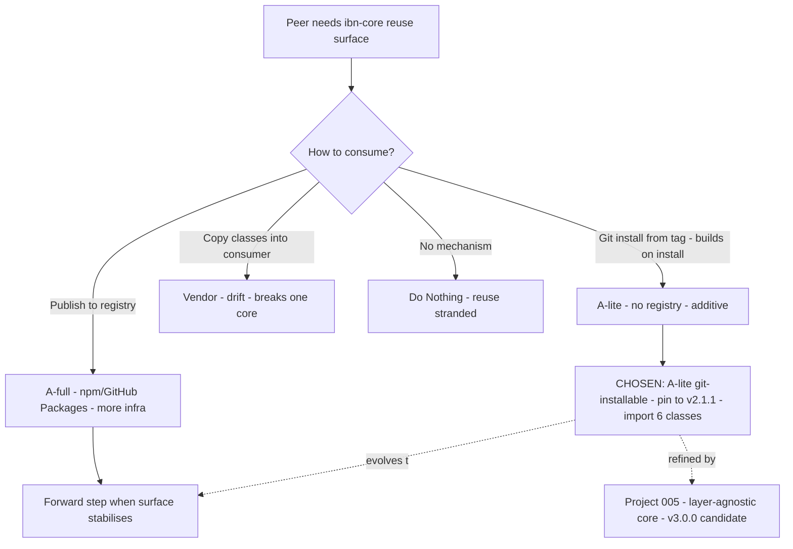

# Architecture Decision Record: Package ibn-core as a Git-Installable Library (A-lite, Additive) — Reuse Surface Consumed by Peer Apps Without a Package Registry

> **Template Origin**: Official | **ArcKit Version**: 5.11.0 | **Command**: `/arckit:adr`

## Document Control

| Field | Value |
|-------|-------|
| **Document ID** | ARC-001-ADR-006-v1.0 |
| **Document Type** | Architecture Decision Record |
| **Project** | ibn-core-my (Project 001) |
| **Classification** | PUBLIC |
| **Status** | APPROVED |
| **Version** | 1.0 |
| **Created Date** | 2026-06-20 |
| **Last Modified** | 2026-06-21 |
| **Review Cycle** | Quarterly |
| **Next Review Date** | 2026-09-20 |
| **Owner** | Roland Pfeifer, Lead Architect / CTO (Vpnet Cloud Solutions Sdn. Bhd.) |
| **Reviewed By** | Vpnet EA Review Board (EARB) — 2026-06-21 |
| **Approved By** | Roland Pfeifer, Lead Architect / CTO (for Vpnet EARB) — 2026-06-21 |
| **Distribution** | ibn-core engineering, Vpnet SI delivery teams, resource-intent-agent maintainers (Project 004), Security Lead, open-source maintainers |

> **Decision status note**: The **decision status is Accepted** — implemented in `ibn-core` PR #51 (`feat(packaging): make ibn-core git-installable as a library (A-lite, additive)`, commit `fcc6422`) and released as the annotated tag **`v2.1.1`**. The **document-control Status is APPROVED** — this ADR is a **retrospective ratification** of that already-shipped packaging decision, elevating it to a governed consumption standard for the "two peers, one core" model, **ratified by the Vpnet EARB on 2026-06-21**. Permitted by `CLAUDE.md` (ArcKit-governs-all-new-work; in-flight work may be retro-fitted).

> **Subject type note**: Generic / commercial document-control header, consistent with `ARC-001-ADR-001…005`. UK GDS / TCoP references are non-binding comparators. The packaged library is a **PUBLIC** Apache 2.0 artefact (DS-001/002/003 tier in `ARC-001-MYCLAS-v1.0`); it carries no residency dimension, but its **dependency licence footprint is in scope** (NFR-SEC-006, PRIN 9).

## Revision History

| Version | Date | Author | Changes | Approved By | Approval Date |
|---------|------|--------|---------|-------------|---------------|
| 1.0 | 2026-06-20 | ArcKit AI | Initial creation from `/arckit:adr` command — retrospective ratification of PR #51 / tag v2.1.1 library packaging | [PENDING] | [PENDING] |
| 1.0 (ratified) | 2026-06-21 | ArcKit AI | EARB ratification — Document-Control Status IN_REVIEW → APPROVED; Reviewed/Approved By recorded | Roland Pfeifer (Vpnet EARB) | 2026-06-21 |

## 1. Decision Title

**Package ibn-core as a Git-Installable Library (A-lite, Additive) — Reuse Surface Consumed by Peer Apps Without a Package Registry**

This ADR records the decision to make `ibn-core` consumable **as a library** via **direct git installation from a tag** (the "A-lite" approach): a consumer adds the repository at an immutable tag (from `v2.1.1`) as a dependency, the package **builds on install** (a `prepare` step compiles TypeScript), and **no package registry** (npm / GitHub Packages) is involved. The packaging is **additive** — it adds a library entry point and build hook without changing how the `business-intent-agent` application itself is built or run. It exposes the **RFC 9315 reuse surface** introduced at `v2.1.0` (the "Ericsson IMF layer") as a small set of classes importable from `'ibn-core'`: the RFC 9315 §5 cycle runner, the 8-level agent taxonomy, the IMF KnowledgeStore + closed control loop, the SemanticToolRegistry, and the ConflictArbiter / SharedStatePlane / IntentHierarchy.

> **Scope note**: This decision is about the **consumption mechanism** (how peers obtain and import the core), not about *what* the reuse surface should ultimately be — that refinement is the subject of the planned **Project 005** (extract a layer-agnostic RFC 9315 core; v3.0.0 candidate). A-lite is the **interim** mechanism that makes today's surface reusable now; Project 005 may later re-shape the surface and/or the packaging. It also does not alter the open-core/private-adapter seam (PRIN 9) — operator adapters remain private regardless of how the public core is packaged.

---

## 2. Stakeholders

### 2.1 Deciders (RACI: Accountable)

- **Roland Pfeifer, Lead Architect / CTO (Vpnet Cloud Solutions)** — accountable for the open-core surface (PRIN 9), the public dependency-licence posture (NFR-SEC-006), and the reuse strategy across the two peers.
- **Lead Engineer (ibn-core)** — accountable for the package entry point, the build-on-install hook, and the exported reuse classes.

### 2.2 Consulted (RACI: Consulted)

- **resource-intent-agent maintainers (Project 004, private repo)** — the primary consumer of the reuse surface (ADR-004 / ADR-009 in that repo).
- **Security Lead (Vpnet)** — transitive dependency footprint, vulnerability surface (NFR-SEC-005), licence compatibility (NFR-SEC-006).
- **Release / CI Engineer (Vpnet)** — tagging discipline, build reproducibility, the immutable-tag baseline (BR-006, PRIN 17).

### 2.3 Informed (RACI: Informed)

- ibn-core engineering team; open-source maintainers / community (the package is public).
- SI delivery teams (the reuse surface underpins peer-app delivery).

### 2.4 UK Government Escalation Context

> **Framing note**: ArcKit's UK-derived ladder, mapped to the EARB analogue.

**Decision Level**: **Department** (commercial analogue: enterprise/programme-wide technology-standard decision)

**Escalation Rationale**:

- [ ] **Team**: Local implementation choice (frameworks, libraries, testing)
- [ ] **Cross-team**: Integration patterns, shared services, API standards
- [x] **Department**: Technology standards — *how the shared core is packaged and consumed binds every peer application and SI engagement, governs the public dependency-licence footprint (PRIN 9, NFR-SEC-006), and defines the reuse contract for the "two peers, one core" architecture. A programme-wide standard.*
- [ ] **Cross-government**: National infrastructure, cross-department interoperability

**Governance Forum**: Vpnet Cloud Solutions Enterprise Architecture Review Board (EARB).

**Approval Date**: 2026-06-21 (EARB ratified; decision implemented per PR #51 / tag v2.1.1).

---

## 3. Context and Problem Statement

### 3.1 Problem Description

At `v2.1.0`, ibn-core gained a substantial RFC 9315 reuse surface (the Ericsson IMF layer: cycle runner, agent taxonomy, IMF KnowledgeStore + closed control loop, SemanticToolRegistry, ConflictArbiter, SharedStatePlane, IntentHierarchy). The peer application `resource-intent-agent` (Project 004, private repo) needs to **consume** this surface rather than reimplement it — that is the whole point of "two peers, one core". But ibn-core was, until then, structured as an **application**, not a consumable **library**: there was no library entry point, no built artefact a consumer could import, and no published package. The question was how to make the core importable by peers.

**Problem statement as a question**: How should the `ibn-core` reuse surface be made consumable by peer applications — a git-installable library that builds on install, a package published to a registry, or vendored/copied code — given the constraints of a small open-core team, an Apache 2.0 licence posture, and the need to avoid divergence between the peers?

### 3.2 Why This Decision Is Needed

Without a sanctioned consumption mechanism, peers either copy the IMF classes (guaranteeing drift and breaking "one core") or block on reuse entirely. The mechanism chosen also has standing consequences: it determines the **public dependency-licence footprint** consumers inherit (NFR-SEC-006, PRIN 9 — Apache-compatible only), the **vulnerability surface** they pull in (NFR-SEC-005), and the **version-pinning discipline** (BR-006 — immutable tags). Getting this right once, as a standard, lets every current and future peer consume the core consistently.

- **Business context**: BR-002 (the AI-native orchestration capability — the reuse surface IS that capability), BR-003 (open-core integrity — the packaged library is the public seam), BR-006 (citable/immutable tag baseline).
- **Technical context**: NFR-I-002 (integration via published interfaces / loose coupling), NFR-M-002 (agent-readable context), NFR-SEC-006 (dependency licence compatibility — CRITICAL), NFR-SEC-005 (vulnerability management), FR-010 (published seam surface).
- **Regulatory context**: None binding; the package is PUBLIC-tier.

### 3.3 Supporting Links

- **Implementation**: `ibn-core` PR #51 / commit `fcc6422` (`feat(packaging): make ibn-core git-installable as a library (A-lite, additive)`); annotated tag `v2.1.1`.
- **Reuse surface origin**: tag `v2.1.0` (`3cb103b`) — Ericsson IMF layer (CLAUDE.md Version Tags).
- **Primary consumer**: resource-intent-agent (Project 004, private repo; ADR-004 / ADR-009 there).
- **Future evolution**: Project 005 — layer-agnostic RFC 9315 core (v3.0.0 candidate).
- **Requirements**: BR-002, BR-003, BR-006; FR-010; NFR-I-002, NFR-M-002, NFR-SEC-005, NFR-SEC-006.
- **Related ADRs**: ADR-005 (naming — `ibn-core` reserved as the library name this package uses); the OTel-upgrade ADR (Project 005) touched the same dependency footprint.

---

## 4. Decision Drivers (Forces)

### 4.1 Technical Drivers

- **Reuse without divergence**: peers must import the *same* IMF classes, not copies, so "one core" holds.
  - Requirements: NFR-I-002, BR-002. Principle: PRIN 10 (Loose Coupling via published interface), PRIN 14 (Maintainability).
- **Low ceremony for a small team**: a registry publish pipeline (versioning, auth, release cadence) is overhead a small open-core team can defer.
- **Apache-2.0 licence footprint is inherited by consumers**: whatever the package pulls transitively becomes the consumer's footprint — must stay Apache-compatible (NFR-SEC-006, CRITICAL; PRIN 9).
- **Heavy transitive footprint is the cost**: the core depends on `@anthropic-ai/sdk`, OpenTelemetry, MCP SDK, etc.; git-install drags the whole tree into every consumer.
- **Immutable, citable pinning**: consumers pin to a tag (`v2.1.1`); tags are never rewritten (BR-006), giving reproducible builds.

### 4.2 Business Drivers

- **"Two peers, one core" delivery (BR-002, BR-003)**: the reuse surface is the shared value; a sanctioned consumption path is what makes the model real.
- **Time-to-reuse**: A-lite unblocks resource-intent-agent immediately with near-zero packaging infrastructure.
- **Open-core posture (BR-003, PRIN 9)**: the package is the public Apache 2.0 surface; private adapters stay private regardless.

### 4.3 Regulatory & Compliance Drivers

- **Binding**: NFR-SEC-006 (Apache-2.0-compatible dependency licences — CRITICAL) governs the package's transitive tree; no GPL.
- **UK GDS / TCoP**: NOT binding — comparators. (TCoP "Point 8: share and reuse" maps loosely.)

### 4.4 Alignment to Architecture Principles

| Principle | Alignment | Impact |
|-----------|-----------|--------|
| 9. Open-Core / Proprietary Seam Integrity (NON-NEGOTIABLE) | ✅ Supports | The published library is the public Apache 2.0 surface; adapters stay private; dependency tree must be Apache-compatible. |
| 10. Loose Coupling | ✅ Supports | Peers consume via a published library interface (import from `'ibn-core'`), not shared source/db. |
| 14. Maintainability and Evolvability | ✅ Supports | One core, imported by all peers — refactors propagate; no copy-drift. Agent-readable import surface. |
| 16–17. Testing / CI & Traceability | ✅ Supports | Consumption pinned to immutable, tested tags (`v2.1.1`); build-on-install reproducible. |
| 12. Performance and Efficiency | ⚠️ Partial | Heavy transitive footprint (`@anthropic-ai/sdk` etc.) inflates consumer install size/time. |

One partial tension (footprint weight) — accepted and mitigated, not a conflict.

---

## 5. Considered Options

**Three options analysed plus a "Do Nothing" baseline.** Cost figures are indicative planning ranges (USD).

### Option 1 (RECOMMENDED): A-lite — git-installable from tag, builds on install, no registry, additive

**Description**: Add a library entry point exporting the reuse classes; add a `prepare` build hook so the package compiles on install; consumers depend on the git repo at a tag (from `v2.1.1`). No registry; additive to the existing app build.

**Implementation approach**: `package.json` `main`/`types` + `prepare` (tsc); export the 6 reuse classes from `'ibn-core'`; tag `v2.1.1`; consumer adds `"ibn-core": "github:vpnetconsult/ibn-core#v2.1.1"` (or equivalent).

**Wardley Evolution Stage**: Custom-Built → Product (git-install is a pragmatic, lightly-evolved consumption path).

#### Good (Pros)

- ✅ **Unblocks reuse immediately with ~zero packaging infra**: no registry, no publish pipeline, no auth setup.
- ✅ **One core, no copies**: peers import the same classes; "two peers, one core" holds (BR-002, PRIN 10/14).
- ✅ **Additive — no app regression**: the application build/run path is unchanged; the library surface is layered on top.
- ✅ **Reproducible, citable pinning**: consumers pin to an immutable tag (`v2.1.1`); never rewritten (BR-006).
- ✅ **Public-seam-clean (PRIN 9)**: only the Apache 2.0 public surface is exported; adapters stay private.

#### Bad (Cons)

- ❌ **Heavy transitive footprint inherited by consumers**: `@anthropic-ai/sdk`, OpenTelemetry, MCP SDK, etc. pulled into every consumer (size, install time, vuln surface — NFR-SEC-005).
- ❌ **Build-on-install requires a toolchain at install time**: the consumer environment must run `tsc` (Node/TS present); no prebuilt artefact.
- ❌ **Pinning is by tag/commit, not semver range**: less ergonomic dependency resolution than a registry package; upgrades are manual tag bumps.
- ❌ **No registry metadata/discovery**: not listed on npm; discovery is via the repo.

#### Cost Analysis

- **CAPEX**: Low — ~USD 1–3k (entry point + build hook + tag). Largely sunk (PR #51).
- **OPEX**: Low — manual tag bumps; no registry maintenance.
- **TCO (3-year)**: Low; marginal cost per new consumer ≈ adding a git dependency.

#### GDS Service Standard Impact

| Point | Impact | Notes |
|-------|--------|-------|
| 8. Share and reuse | Positive | Shared core consumed, not copied. (GDS not binding — comparator.) |

---

### Option 2: A-full — publish to a package registry (npm / GitHub Packages)

**Description**: Build and publish a versioned package to a registry; consumers depend on a semver range.

**Wardley Evolution Stage**: Product/Commodity (registry distribution is commoditised).

#### Good (Pros)

- ✅ **Ergonomic consumption**: semver ranges, lockfile resolution, prebuilt artefact (no build-on-install).
- ✅ **Discovery + metadata**: listed, documented, versioned in the standard way.
- ✅ **Smaller install** if `dependencies` are pruned and a built artefact is shipped.

#### Bad (Cons)

- ❌ **Publish infrastructure + cadence overhead**: registry auth, release pipeline, versioning ceremony — real cost for a small team for a currently single-primary-consumer surface.
- ❌ **Premature for an unstable surface**: the reuse surface is expected to be re-shaped by Project 005; publishing semver-stable packages now invites churn/yanks.
- ❌ **Wider exposure of the public surface as a "product"**: raises support/expectation burden before the surface settles.

#### Cost Analysis

- **CAPEX**: Medium — ~USD 5–12k (publish pipeline, auth, versioning policy, docs). **OPEX**: Medium (release cadence). **TCO**: higher than A-lite while the surface is still moving.

#### GDS Service Standard Impact

| Point | Impact | Notes |
|-------|--------|-------|
| 8. Share and reuse | Positive | Strong reuse ergonomics, at higher cost/commitment. |

---

### Option 3: Vendor / copy the reuse classes into each consumer

**Description**: Copy the IMF classes into each peer's source tree.

**Wardley Evolution Stage**: Genesis/Custom (ad hoc duplication).

#### Good (Pros)

- ✅ **No packaging at all**: each consumer is self-contained; no transitive-footprint inheritance beyond what it copies.
- ✅ **Trivially fast to start**.

#### Bad (Cons)

- ❌ **Guarantees drift — breaks "one core" (BR-002/003)**: copies diverge; a fix in the core does not reach consumers.
- ❌ **Violates loose-coupling-via-published-interface (PRIN 10, NFR-I-002)**: shared source, not a published boundary.
- ❌ **Licence-header / provenance burden multiplies**: copied Apache 2.0 source must carry headers and provenance per consumer (PRIN 9).
- ❌ **Untestable as one surface**: no single tested artefact (PRIN 16/17).

#### Cost Analysis

- **CAPEX**: Low per copy. **OPEX**: High and compounding (manual re-sync, drift triage). **TCO**: highest once divergence is priced in.

#### GDS Service Standard Impact

| Point | Impact | Notes |
|-------|--------|-------|
| 8. Share and reuse | Negative | Copying is the opposite of reuse. |

---

### Option 4: Do Nothing (Baseline)

**Description**: Leave ibn-core as an application only; provide no consumption mechanism.

#### Good

- ✅ **No effort**.

#### Bad

- ❌ **Peers cannot reuse the IMF surface**: resource-intent-agent reimplements it → divergence, breaks "one core" (BR-002/003).
- ❌ **The v2.1.0 reuse investment is stranded**: built but not consumable.
- ❌ **No published-interface boundary** for the shared capability (PRIN 10, NFR-I-002).

---

## 6. Decision Outcome

### 6.1 Chosen Option

**"Option 1: A-lite — git-installable from tag, builds on install, no registry, additive."**

### 6.2 Y-Statement (Structured Justification)

> **In the context of** a "two peers, one core" architecture where the `resource-intent-agent` peer (and future peers) must consume ibn-core's RFC 9315 / IMF reuse surface introduced at v2.1.0, maintained by a small open-core team under an Apache 2.0 posture,
> **facing** the need to make the core importable as a library without registry-publish overhead, without inviting copy-drift, and while the reuse surface is still expected to be re-shaped by Project 005,
> **we decided for** packaging ibn-core as a git-installable library (A-lite) — consumers pin to an immutable tag (`v2.1.1`), the package builds on install, no registry — additively, so the application build is unchanged,
> **to achieve** immediate, low-ceremony, drift-free reuse of one shared core via a published import surface, pinned to citable tags,
> **accepting** a heavy transitive dependency footprint inherited by consumers, a build-toolchain requirement at install time, and tag-based (not semver-range) pinning — mitigated by licence/vuln scanning, immutable tags, and a planned move to A-full/Project 005 once the surface stabilises.

### 6.3 Justification (Why This Option?)

**Key reasons**:

1. **It matches the maturity of the surface**: the reuse surface is new and will be re-shaped by Project 005. A-lite gives reuse *now* without committing to semver-stable registry packages that would churn (Option 2's premature cost). It is the right rung on the evolution ladder for a still-moving surface.
2. **It preserves "one core"**: peers import the same classes (Option 3's copies guarantee the opposite). This is the structural reason the model exists (BR-002/003, PRIN 10/14).
3. **It is already shipped and tagged**: PR #51 / `fcc6422`, released as `v2.1.1`. The decision ratifies a working, consumed mechanism.
4. **It keeps the public seam clean and citable**: only the Apache 2.0 surface is exported; consumers pin to immutable tags (PRIN 9, BR-006).
5. **The cost is understood and bounded**: the heavy transitive footprint is the known trade-off, addressed by licence/vuln scanning and by the Project 005 path that can later prune it.

**Stakeholder consensus**: Lead Architect/CTO (seam, licence posture), Lead Engineer (entry point/build), resource-intent-agent maintainers (consumer), and Security Lead (footprint) aligned. No dissent; A-full and Project 005 are the recognised future steps.

**Risk appetite**: Medium. The accepted footprint/toolchain trade-offs are bounded by scanning and by a clear evolution path; the alternatives carry either premature registry cost (Option 2), guaranteed drift (Option 3), or stranded investment (Do Nothing).

---

## 7. Consequences

### 7.1 Positive Consequences

- ✅ **Reuse unblocked immediately** with near-zero packaging infrastructure (BR-002).
- ✅ **One core, no copies** — peers import the same classes; drift structurally avoided (BR-003, PRIN 10/14).
- ✅ **Additive** — the application build/run path is unchanged (no regression).
- ✅ **Citable, reproducible pinning** to immutable tags (`v2.1.1`; BR-006, PRIN 17).
- ✅ **Public seam clean** — only Apache 2.0 surface exported (PRIN 9).

**Measurable outcomes**:

- Reuse classes importable from `'ibn-core'`: 0 → 6.
- Sanctioned consumption mechanism for peers: none → git-install from tag.
- Copy-vendored IMF code in consumers: target 0 (import, not copy).
- Consumption baseline tag: `v2.1.1` (immutable).

### 7.2 Negative Consequences (Accepted Trade-offs)

- ❌ **Heavy transitive footprint inherited by consumers** (`@anthropic-ai/sdk`, OpenTelemetry, MCP SDK, …) — install size/time and vulnerability surface (NFR-SEC-005).
- ❌ **Build-on-install requires a toolchain** in the consumer environment.
- ❌ **Tag/commit pinning, not semver ranges** — manual upgrade bumps.

**Mitigation strategies**:

- **Footprint / vuln surface**: dependency + code scanning (NFR-SEC-005 SLAs); the OTel-upgrade ADR (Project 005) and the recent advisory clean-ups keep the tree clean; Project 005's layer-agnostic core can prune heavy deps from the reuse surface.
- **Build-on-install**: documented Node/TS prerequisites; A-full (prebuilt artefact) available when the surface stabilises.
- **Pinning ergonomics**: immutable tags give reproducibility; move to A-full/registry semver when churn justifies the overhead.

### 7.3 Neutral Consequences (Changes Needed)

- 🔄 **Skills**: consumers learn the git-install + tag-pin workflow; maintainers keep the export surface and build hook current.
- 🔄 **Process**: licence check on any new core dependency (NFR-SEC-006); tag discipline on each reuse-surface release (BR-006).
- 🔄 **Docs**: the import surface documented as agent-readable context (NFR-M-002).

### 7.4 Risks and Mitigations

| Risk | Likelihood | Impact | Mitigation | Owner |
|------|------------|--------|------------|-------|
| Heavy transitive footprint pulls a vulnerable/incompatible dependency into consumers | M | M | Dependabot/CodeQL + licence check (NFR-SEC-005/006); prune via Project 005 | Security Lead |
| A GPL/incompatible transitive licence enters the public tree | L | H | NFR-SEC-006 licence gate (CRITICAL); no-GPL rule (PRIN 9) | Lead Architect / CTO |
| Build-on-install fails in a consumer toolchain | L | M | Documented prerequisites; A-full prebuilt artefact fallback | Lead Engineer |
| Reuse surface churns under Project 005, breaking pinned consumers | M | M | Immutable tags isolate consumers; coordinated tag bumps; deprecation notes | Enterprise / Solution Architect |

**Link to risk register**: `projects/001-ibn-core-my/ARC-001-RISK-v1.0.md` — engages **R-002** (open-core/proprietary leakage — the export surface must expose only public code) and the NFR-SEC-006 dependency-licence surface. Candidate rows above to register at next `/arckit:risk` revision.

---

## 8. Validation & Compliance

### 8.1 How Will Implementation Be Verified?

**Design review**:

- [x] Library entry point + build-on-install hook present (PR #51).
- [x] Reuse classes exported from `'ibn-core'` (6 classes).
- [ ] Export surface confirmed to contain no private/adapter code (PRIN 9).

**Code / IaC review**:

- [ ] PR checklist: new core dependencies licence-checked (Apache/MIT/BSD/ISC; no GPL) — NFR-SEC-006.
- [ ] Reuse-surface release cuts an immutable tag (BR-006).

**Testing strategy**:

- [ ] Consumer smoke test: `import` from `'ibn-core'` at tag `v2.1.1` resolves and builds.
- [ ] Footprint/licence scan on the resolved dependency tree.
- [x] Tag `v2.1.1` cut and consumable (released).

### 8.2 Monitoring & Observability

**Success metrics**: 6 classes importable; 0 vendored copies in consumers; dependency-licence scan clean (no GPL); open critical/high advisories in the published tree = 0 (NFR-SEC-005).

**Alerts and dashboards**: Dependabot/CodeQL alerts on the core tree; licence-scan report per release.

### 8.3 Compliance Verification

**GDS / TCoP**: NOT binding (comparator; Point 8 reuse satisfied in spirit).

**Security assurance** (PRIN 4/9): export surface exposes only public Apache 2.0 code; dependency tree Apache-compatible (NFR-SEC-006); vulnerability scanning per NFR-SEC-005.

**Data protection**: Not engaged — PUBLIC-tier artefact, no personal data.

---

## 9. Links to Supporting Documents

### 9.1 Requirements Traceability

**Business Requirements**:

- BR-002: AI-Native Intent Translation and Autonomous Orchestration — the reuse surface IS this capability, now consumable by peers.
- BR-003: Open-Core Commercial Model Integrity — the published library is the public seam; adapters stay private.
- BR-006: Citable/Immutable Baseline — consumers pin to immutable tags (`v2.1.1`).

**Functional Requirements**:

- FR-010: Published MCP Adapter Seam — the public surface (incl. `McpAdapter`) is part of what the library exposes; private adapters excluded.

**Non-Functional Requirements**:

- NFR-I-002: Integration via Published Interfaces / Loose Coupling — peers import a published library surface.
- NFR-M-002: Documentation and Agent-Readable Context — the import surface is documented context.
- NFR-SEC-006 (CRITICAL): Dependency Licence Compatibility — the transitive tree stays Apache-compatible.
- NFR-SEC-005: Vulnerability Management — the inherited footprint is scanned and remediated to SLA.

### 9.2 Architecture Artifacts

**Architecture principles**: `projects/000-global/ARC-000-PRIN-v1.0.md` — Principles 9, 10, 12, 14, 16, 17.

**Risk register**: `projects/001-ibn-core-my/ARC-001-RISK-v1.0.md` — R-002 + dependency-licence surface.

**Version tags**: `CLAUDE.md` Version Tags — `v2.1.0` (reuse surface origin), `v2.1.1` (this packaging).

### 9.3 Design Documents

- Implementation: `package.json` entry point + `prepare` build hook; exported reuse classes (PR #51).
- Consumer reference: resource-intent-agent (Project 004, private repo).

### 9.4 External References

**Standards / guidance**:

- npm — installing from git URLs / `prepare` lifecycle (consumption mechanism).
- RFC 9315 Intent-Based Networking (DOI 10.17487/RFC9315) — the reuse surface's standards basis.
- Apache License 2.0 — the package licence.

**Implementation / evidence**:

- `ibn-core` PR #51 / commit `fcc6422` — `feat(packaging): make ibn-core git-installable as a library (A-lite, additive)`.
- Annotated tag `v2.1.1` — the consumable baseline.

**Comparator (NOT binding)**:

- UK GDS Service Standard Point 8 (share and reuse) — comparator only.

---

## 10. Implementation Plan

### 10.1 Dependencies

**Prerequisite decisions**:

- `ARC-001-ADR-005-v1.0` (naming) — `ibn-core` is reserved as the library name this package uses.
- The `v2.1.0` reuse surface (Ericsson IMF layer) must exist to be exported.

**Infrastructure dependencies**:

- Git repository + tag (`v2.1.1`); consumer Node/TS toolchain for build-on-install; CI dependency/licence scanning.

**Team dependencies**:

- Lead Engineer for the entry point/build; Security Lead for footprint/licence governance.

### 10.2 Implementation Timeline

| Phase | Activities | Duration | Owner |
|-------|-----------|----------|-------|
| **Phase 1: Package (done)** | Entry point + `prepare` build hook; export 6 reuse classes; tag `v2.1.1` | Complete (PR #51) | Lead Engineer |
| **Phase 2: Consume** | resource-intent-agent depends on `ibn-core#v2.1.1`; smoke test imports/build | 1 week | resource-intent-agent maintainers |
| **Phase 3: Govern footprint** | Licence/vuln scan of the resolved tree; document prerequisites | 1 week | Security Lead |
| **Phase 4: Evolve** | Re-evaluate A-full (registry) and Project 005 (layer-agnostic core) once the surface stabilises | When surface stabilises | Enterprise / Solution Architect |
| **Phase 5: Ratify** | EARB sign-off; Status → APPROVED | By 2026-09-20 | EARB |

### 10.3 Rollback Plan

**Rollback trigger**: The git-install/build-on-install mechanism proves unworkable in a key consumer (e.g. a toolchain-less environment), or the footprint is unacceptable.

**Rollback procedure**:

1. Promote to **A-full** for the affected consumer: build and publish a prebuilt artefact to a registry; consumer switches to the registry package (a forward step, not a revert to vendoring).
2. Keep tag `v2.1.1` immutable and consumable for already-pinned consumers.
3. If footprint is the blocker, accelerate Project 005 to extract a lean layer-agnostic core.

> Rollback does **not** mean copy/vendoring (Option 3) — that re-introduces drift.

**Rollback owner**: Lead Architect / CTO (with Lead Engineer).

---

## 11. Review and Updates

### 11.1 Review Schedule

**Initial review**: 2026-09-20 (EARB ratification). **Periodic**: Quarterly or on trigger.

**Review criteria**:

- Are peers importing (not copying) the surface?
- Is the dependency tree licence-clean and vuln-clean (NFR-SEC-005/006)?
- Has the surface stabilised enough to justify A-full / Project 005?

### 11.2 Trigger Events for Review

- [ ] Project 005 (layer-agnostic core) lands — may supersede this packaging.
- [ ] A new peer consumer is added.
- [ ] A licence/vulnerability issue surfaces in the transitive tree.
- [ ] Consumption-ergonomics pain justifies moving to a registry (A-full).

---

## 12. Related Decisions

### 12.1 Decisions This ADR Depends On

- **`ARC-001-ADR-005-v1.0`** (naming): `ibn-core` is the reserved library name this package publishes under.

### 12.2 Decisions That Depend On This ADR

- resource-intent-agent consumption decisions (Project 004, private repo; ADR-004 / ADR-009 there).
- **Project 005** (layer-agnostic RFC 9315 core, v3.0.0 candidate) — will refine or supersede this packaging once the surface stabilises.

### 12.3 Conflicting Decisions

- None. A-full (registry) and Project 005 are recognised **forward** evolutions of this decision, not conflicts.

---

## 13. Appendices

### Appendix A: Packaging Decision Summary (the chosen Option 1, codified)

| Aspect | A-lite (chosen) | Rationale |
|--------|-----------------|-----------|
| Distribution | Git install from tag (`#v2.1.1`) | No registry overhead; right for a still-moving surface |
| Build | Builds on install (`prepare` → tsc) | No prebuilt artefact to maintain yet |
| Change posture | **Additive** | App build/run unchanged; library layered on top |
| Exported surface | 6 RFC 9315 / IMF reuse classes from `'ibn-core'` | One core, imported not copied |
| Pinning | Immutable tag (`v2.1.1`) | Reproducible, citable (BR-006) |
| Public seam | Apache 2.0 surface only; adapters private | PRIN 9 |
| Known cost | Heavy transitive footprint; toolchain at install; tag-not-semver | Accepted; mitigated by scanning + Project 005 |

### Appendix B: Stakeholder Consultation Log

| Date | Stakeholder | Feedback | Action Taken |
|------|-------------|----------|--------------|
| (PR #51) | Lead Engineer / Security Lead | A-lite chosen over A-full given the small team and still-moving surface; footprint noted | Merged PR #51; tagged v2.1.1 |
| 2026-06-20 | (ADR ratification stage) | Elevate the packaging choice to a governed consumption standard | This ADR raised for EARB |

### Appendix C: Alternative Formats

**Mermaid Decision Flow Diagram**:

---

## Document Approval

| Role | Name | Signature | Date |
|------|------|-----------|------|
| **Technical Architect** | [PENDING] | | 2026-09-20 |
| **Senior Responsible Owner** | Roland Pfeifer (Lead Architect / CTO) | | 2026-09-20 |
| **Security Architect** | [PENDING] | | 2026-09-20 |
| **Governance Board** | Vpnet EA Review Board (EARB) | | 2026-09-20 |

---

*This ADR follows the MADR v4.0 format enhanced with UK Government requirements and ArcKit governance standards. UK GDS / TCoP references are retained for template traceability but are NOT binding on this commercial Malaysian subject.*

## External References

> This section provides traceability from generated content back to source documents.

### Document Register

| Doc ID | Filename | Type | Source Location | Description |
|--------|----------|------|-----------------|-------------|
| PR-51 | commit fcc6422 (`feat(packaging)…`) | Packaging change | ibn-core repo | Makes ibn-core git-installable as a library (A-lite, additive); tag v2.1.1 |
| TAG-211 | v2.1.1 | Annotated git tag | ibn-core repo | The consumable library baseline |
| ARC-001-REQ | ARC-001-REQ-v1.0.md | Requirements | projects/001-ibn-core-my/ | BR/FR/NFR baseline |
| ARC-001-RISK | ARC-001-RISK-v1.0.md | Risk Register | projects/001-ibn-core-my/ | R-002 + dependency-licence surface |
| ARC-000-PRIN | ARC-000-PRIN-v1.0.md | Principles | projects/000-global/ | Enterprise architecture principles |
| ARC-001-ADR-005 | ARC-001-ADR-005-v1.0.md | ADR | projects/001-ibn-core-my/decisions/ | Naming — `ibn-core` reserved as the library name |

### Citations

| Citation ID | Doc ID | Page/Section | Category | Quoted Passage |
|-------------|--------|--------------|----------|----------------|
| [PR51-1] | PR-51 | commit subject | Implementation | "make ibn-core git-installable as a library (A-lite, additive)". |
| [TAG-1] | TAG-211 | Version Tags (CLAUDE.md) | Baseline | `v2.1.1` — git-installable library release built on the `v2.1.0` Ericsson IMF reuse surface. |
| [REQ-1] | ARC-001-REQ | BR-003 | Requirement | "Maintain a clean separation between the public Apache 2.0 framework and private operator adapters…" |
| [REQ-2] | ARC-001-REQ | NFR-SEC-006 | Requirement | "All public-repo dependencies must be licence-compatible with Apache 2.0 (Apache, MIT, BSD, ISC). GPL is prohibited…" |
| [REQ-3] | ARC-001-REQ | NFR-I-002 | Requirement | "Systems must integrate only through published APIs (TMF921), the MCP interface, or asynchronous events…" |
| [PRIN-1] | ARC-000-PRIN | Principle 9 | Principle | "All public dependencies MUST be licence-compatible with Apache 2.0 (Apache, MIT, BSD, ISC); GPL is prohibited…" |
| [PRIN-2] | ARC-000-PRIN | Principle 10 | Principle | "Shared libraries kept minimal (favour duplication over coupling)… Communicate through published APIs… or interfaces." |

### Unreferenced Documents

| Filename | Source Location | Reason |
|----------|-----------------|--------|
| — | — | — |

---

**Generated by**: ArcKit `/arckit:adr` command
**Generated on**: 2026-06-20 21:10 GMT
**ArcKit Version**: 5.11.0
**Project**: ibn-core-my (Project 001)
**AI Model**: claude-opus-4-8[1m]
**Generation Context**: Retrospective ratification of `ibn-core` PR #51 / commit fcc6422 / tag v2.1.1 (A-lite git-installable library packaging). Synthesised from ARC-001-REQ-v1.0 (BR-002/003/006, FR-010, NFR-I-002, NFR-M-002, NFR-SEC-005/006), ARC-000-PRIN-v1.0 (Principles 9, 10, 12, 14, 16, 17), ARC-001-RISK-v1.0 (R-002), CLAUDE.md Version Tags (v2.1.0/v2.1.1), and the ADR-001–005 house style. Consumer is resource-intent-agent (Project 004, private repo); future evolution is Project 005 (layer-agnostic core, v3.0.0 candidate).

<!-- arckit-provenance:start -->

## Build Provenance

_Stamped automatically by the ArcKit plugin's `provenance-stamp.mjs` PostToolUse hook. Complements (does not replace) the human-authored footer above. Carries only fields the model can't authoritatively self-report: build context from `.arckit/state.json` and effort levels derived from command frontmatter + the silent-downgrade matrix._

| Field | Value |
|-------|-------|
| Requested Effort | `high` |
| Effective Effort | _unknown — model not parsed from existing footer_ |
| Stamped at | 2026-06-21T12:08:18.846Z |

<!-- arckit-provenance:end -->
