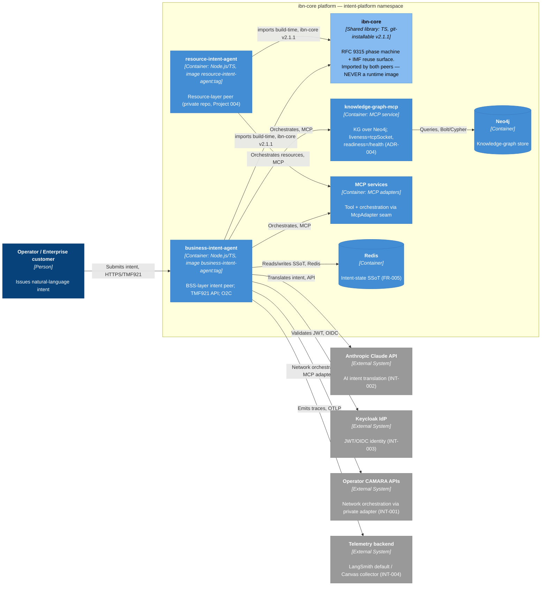

# Architecture Diagram: ibn-core — Two Peers, One Core (C4 Container)

> **Template Origin**: Official | **ArcKit Version**: 5.11.0 | **Command**: `/arckit:diagram`

## Document Control

| Field | Value |
|-------|-------|
| **Document ID** | ARC-001-DIAG-001-v1.0 |
| **Document Type** | Architecture Diagram (C4 Container) |
| **Project** | ibn-core-my (Project 001) |
| **Classification** | PUBLIC |
| **Status** | DRAFT |
| **Version** | 1.0 |
| **Created Date** | 2026-06-20 |
| **Last Modified** | 2026-06-20 |
| **Review Cycle** | Quarterly |
| **Next Review Date** | 2026-09-20 |
| **Owner** | Roland Pfeifer, Lead Architect / CTO (Vpnet Cloud Solutions Sdn. Bhd.) |
| **Reviewed By** | [PENDING] |
| **Approved By** | [PENDING] |
| **Distribution** | ibn-core engineering, Vpnet SI delivery teams, Platform/SRE, resource-intent-agent maintainers (Project 004) |

> **Subject type note**: Generic / commercial document-control header, consistent with the ARC-001 ADR/REQ/RISK/TRAC set. UK GDS / TCoP references below are non-binding comparators (commercial Malaysian subject). This C4 Container view visualises the **"two peers, one core"** model that ADR-005 (naming) and ADR-006 (library packaging) make concrete, with the ADR-004 probe topology annotated on `knowledge-graph-mcp`.

## Revision History

| Version | Date | Author | Changes | Approved By | Approval Date |
|---------|------|--------|---------|-------------|---------------|
| 1.0 | 2026-06-20 | ArcKit AI | Initial creation from `/arckit:diagram` command — C4 Container "two peers, one core" | [PENDING] | [PENDING] |

---

## Diagram

### Mermaid Format

> Rendered as `flowchart LR` with the C4 colour palette (per the ArcKit C4 layout-science reference) for layout control and universal rendering. **Container blue** = deployable peer/service images; **light blue** = the shared `ibn-core` library (imported, *not* a runtime image — ADR-005/006); **grey** = external systems.

**View this diagram**:

- **GitHub**: Renders automatically in markdown preview
- **VS Code**: Install Mermaid Preview extension
- **Online**: <https://mermaid.live> (paste code above)

---

## Component Inventory

| Component | Type | Technology | Responsibility | Evolution Stage | Build/Buy |
|-----------|------|------------|----------------|-----------------|-----------|
| Operator / Enterprise customer | Person | — | Issues natural-language intent | — | — |
| business-intent-agent | Container (peer app) | Node.js / TypeScript; image `business-intent-agent:<tag>` | BSS-layer intent app: TMF921 API, AI translation, O2C orchestration | Custom (0.40) | BUILD |
| resource-intent-agent | Container (peer app) | Node.js / TypeScript; image `resource-intent-agent:<tag>` (private repo) | Resource-layer peer; consumes the shared core | Custom (0.35) | BUILD |
| ibn-core | **Shared library** (not a runtime) | TypeScript, git-installable A-lite @ `v2.1.1` | RFC 9315 phase machine + IMF reuse surface; imported by both peers | Custom (0.42) | BUILD |
| knowledge-graph-mcp | Container (MCP service) | MCP service (Node), Neo4j-backed | Knowledge-graph queries over Neo4j; probe topology per ADR-004 | Custom (0.45) | BUILD |
| MCP services | Container (MCP adapters) | MCP protocol, `McpAdapter` seam | Tool/orchestration adapters (mock public; operator adapters private) | Custom (0.45) | BUILD |
| Redis | Container (datastore) | Redis | Intent-state Single Source of Truth (FR-005) | Commodity (0.90) | USE |
| Neo4j | Container (datastore) | Neo4j | Knowledge-graph store | Product (0.70) | BUY/USE |
| Anthropic Claude API | External System | Anthropic API | AI intent translation (INT-002) | Product (0.70) | USE |
| Keycloak IdP | External System | Keycloak (OIDC) | JWT/OIDC identity (INT-003) | Product (0.72) | USE |
| Operator CAMARA APIs | External System | CAMARA (via private MCP adapter) | Operator network orchestration (INT-001) | Product (0.65) | USE |
| Telemetry backend | External System | OTLP → LangSmith / Canvas collector | Trace/observability sink (INT-004) | Commodity (0.85) | USE |

**Element count**: 12 (1 person + 7 in boundary + 4 external) — within the C4 Container threshold (15).

---

## Architecture Decisions

### Decision 1: "Two peers, one core" — `ibn-core` is the shared library, peers are distinct images

- **Context**: The shared RFC 9315 / IMF surface (`ibn-core`) is consumed by two peer applications (BSS and resource layers). A runtime image had been mislabelled `ibn-core`, conflating the shared library with one app.
- **Decision**: `ibn-core` names the **library/product only** (light-blue node, no deployment); the two deployables ship as `business-intent-agent:<tag>` and `resource-intent-agent:<tag>` (container-blue nodes). See **ADR-005**.
- **Rationale**: Keeps the open-core boundary legible at the artefact layer (PRIN 9) and gives each peer a clean identity.
- **Consequences**: The diagram shows the core as an *imported* dependency (build-time edges from both peers), not a runtime container.

### Decision 2: `ibn-core` consumed as an A-lite git-installable library

- **Context**: Peers need the reuse surface without registry-publish overhead while the surface is still maturing (Project 005 pending).
- **Decision**: A-lite git-install, pinned to immutable tag `v2.1.1`, builds on install, additive. See **ADR-006**.
- **Rationale**: Immediate, drift-free reuse of one core; only the Apache-2.0 public surface is exported.
- **Consequences**: Both peer→core edges are labelled "imports build-time, ibn-core v2.1.1"; a heavy transitive footprint is inherited by consumers (risk **R-019**).

### Decision 3: MCP-service probe topology (annotated on `knowledge-graph-mcp`)

- **Context**: `knowledge-graph-mcp` liveness was coupled to Neo4j health → 151 restarts of churn.
- **Decision**: liveness = `tcpSocket`, readiness = `/health` (dependency-backed). See **ADR-004**.
- **Rationale**: A dependency outage moves the pod to NotReady, never restarts it (PRIN 2).
- **Consequences**: Annotated on the `knowledge-graph-mcp` node; the `KGMCP → Neo4j` edge is the dependency the readiness probe guards.

### Technology Choices

| Technology | Purpose | Rationale | Evolution Stage |
|------------|---------|-----------|-----------------|
| TypeScript / Node.js | Peer apps + shared library | Single language across core and peers; library importable as TS | Commodity (0.85) |
| MCP (`McpAdapter` seam) | Orchestration boundary | Open-core seam; mock public, operator adapters private (PRIN 9) | Custom (0.45) |
| Redis | Intent-state SSoT | Authoritative single record, no bidirectional sync (PRIN 8) | Commodity (0.90) |
| Neo4j | Knowledge graph | Graph-native store for the KG-MCP | Product (0.70) |

---

## Requirements Traceability

| Requirement ID | Description | Component(s) | Coverage Status |
|----------------|-------------|--------------|-----------------|
| BR-002 | AI-native translation & autonomous orchestration (two peers over one core) | business-intent-agent, resource-intent-agent, ibn-core | ✅ |
| BR-003 | Open-core commercial model integrity | ibn-core (public surface), MCP services (private adapters) | ✅ |
| FR-001/002/003 | Ingestion / translation / MCP orchestration | business-intent-agent → Claude, MCP services | ✅ |
| FR-005 | Intent-state SSoT | Redis | ✅ |
| FR-010 | Published MCP adapter seam + mock | MCP services (`McpAdapter`) | ✅ |
| INT-001 | Operator CAMARA via MCP adapter | Operator CAMARA APIs (private adapter) | ✅ |
| INT-002 | Anthropic Claude API | Anthropic Claude API | ✅ |
| INT-003 | Keycloak IdP | Keycloak IdP | ✅ |
| INT-004 | OpenTelemetry backend | Telemetry backend | ✅ |
| NFR-A-003 | Fault tolerance (probe topology) | knowledge-graph-mcp (ADR-004) | ✅ |
| NFR-M-002 | Documentation & agent-readable context | ibn-core library import surface (ADR-006) | ⚠️ |

**Coverage summary**: 11 requirement groups represented; all MUST/CRITICAL flows shown. This is a Container-level view — full requirement coverage lives in `ARC-001-TRAC-v1.0`.

---

## Integration Points

### External Systems

| External System | Interface | Protocol | Responsibility | SLA |
|-----------------|-----------|----------|----------------|-----|
| Anthropic Claude API | AI translation | HTTPS/API | Natural-language → TMF921 Intent (INT-002) | Provider SLA; retry+degrade |
| Keycloak IdP | Identity | OIDC/JWT | Authn/authz incl. agent role (INT-003) | HA/DR pending (R-011) |
| Operator CAMARA APIs | Network orchestration | MCP adapter (private) | Live operator network actions (INT-001) | Per operator contract |
| Telemetry backend | Observability | OTLP/HTTP | Trace sink — LangSmith default / Canvas collector (INT-004) | Non-critical (buffer/drop) |

### Internal interfaces

| Interface | From → To | Protocol | Notes |
|-----------|-----------|----------|-------|
| `ibn-core` import | peers → ibn-core | npm git-install @ v2.1.1 | Build-time dependency (ADR-006), not a runtime call |
| MCP tool call | peers → MCP services | MCP `/mcp/tools/call` `{tool, params}` | `McpAdapter` seam (FR-010) |
| SSoT access | business-intent-agent → Redis | Redis protocol | Authoritative intent state (FR-005) |
| KG query | knowledge-graph-mcp → Neo4j | Bolt/Cypher | The dependency guarded by the ADR-004 readiness probe |

---

## Security Architecture

| Zone | Components | Security Level | Controls |
|------|------------|----------------|----------|
| Public edge | Operator → business-intent-agent | OFFICIAL-equivalent | TLS, JWT (Keycloak) |
| Platform (in-cluster) | peers, ibn-core, MCP services, Redis, Neo4j | Internal | mTLS mesh (Istio), agent-role identity (FR-007), PII masking (FR-009) |
| Private adapter | Operator CAMARA | Confidential | Operator credentials never in public repo (PRIN 9, R-002) |

**Open-core seam (PRIN 9)**: only the Apache-2.0 surface of `ibn-core` is exported as the library; operator adapter implementations and credentials stay in the private estate (shown as the private-adapter edge to CAMARA).

---

## Non-Functional Requirements (selected)

| Requirement | Target | Component(s) | How Achieved |
|-------------|--------|--------------|--------------|
| Fault tolerance (NFR-A-003) | Graceful degradation, no self-inflicted restarts | knowledge-graph-mcp + MCP services | ADR-004 probe decoupling; Istio circuit breakers |
| Availability (NFR-A-001) | ≥ 99.0% alpha / operator SLA | peers + data tier | Probe topology + HPA + multi-AZ (ADR-002) |
| Observability (NFR-M-001) | Spans across intent + MCP path | business-intent-agent → Telemetry backend | OTLP, `rfc9315.phase` tags; restart-noise removed (ADR-004) |

---

## UK Government Compliance (comparator — NOT binding)

| TCoP Point | Compliance | Component(s) | Evidence |
|------------|------------|--------------|----------|
| 3. Open Source | ✅ (comparator) | ibn-core (Apache 2.0) | Public library surface |
| 8. Share & Reuse | ✅ (comparator) | ibn-core consumed by both peers | ADR-006 git-install reuse |

GOV.UK services: **N/A** — commercial Malaysian telco subject. AI Playbook: the AI-native translation path (Claude) is governed by `ARC-001-AIGE`/`ARC-001-AIPB`; HITL gating on high-impact actions tracked under R-001.

---

## Wardley Map Integration

**Related Wardley Map**: none yet for project 001 (`/arckit:wardley` not run). Evolution stages below are indicative, consistent with ADR-002/003/006 reasoning.

| Component | Evolution | Stage | Strategic Action |
|-----------|-----------|-------|------------------|
| business-intent-agent / resource-intent-agent | 0.35–0.40 | Custom | BUILD (the differentiator) |
| ibn-core (shared library) | 0.42 | Custom | BUILD (the reuse core; Project 005 may evolve it) |
| MCP services / KG-MCP | 0.45 | Custom | BUILD (mock public, operator adapters private) |
| Redis / Telemetry backend | 0.85–0.90 | Commodity | USE |
| Neo4j / Claude / Keycloak / CAMARA | 0.65–0.72 | Product | USE/BUY |

**Strategic alignment**: BUILD decisions sit in Custom (peers, core, MCP); USE/BUY decisions sit in Product/Commodity (data stores, external SaaS). No commodity component is being built. ✅

---

## Diagram Quality Gate (Step 5d)

| # | Criterion | Target | Result | Status |
|---|-----------|--------|--------|--------|
| 1 | Edge crossings | < 5 (complex) | ~2–3 (business-intent-agent is the hub; edges to external column may cross) | PASS |
| 2 | Visual hierarchy | Boundary most prominent | `ibn-core platform` subgraph encloses all internal containers | PASS |
| 3 | Grouping | Related elements proximate | Peers, core, MCP, data grouped in the boundary; externals on the right | PASS |
| 4 | Flow direction | Consistent | Left-to-right throughout (`flowchart LR`) | PASS |
| 5 | Relationship traceability | Each line followable | Distinct labelled edges; hub edges fan out | PASS |
| 6 | Abstraction level | One C4 level | Container level only (no components/infra detail) | PASS |
| 7 | Edge label readability | Legible, comma-separated | All edge labels comma-separated, no ` ` | PASS |
| 8 | Node placement | Connected nodes proximate | Core adjacent to both peers; KG-MCP adjacent to Neo4j | PASS |
| 9 | Element count | ≤ 15 | 12 | PASS |

**Accepted trade-off**: `business-intent-agent` is the orchestration hub (10 outbound edges), so 2–3 crossings to the external-systems column are accepted to preserve the left-to-right tier ordering and keep the "two peers → one core" relationship visually central. Splitting the external integrations into a separate Context diagram is the remedy if a crossing-free view is needed.

---

## Linked Artifacts

**Requirements**: `projects/001-ibn-core-my/ARC-001-REQ-v1.0.md`
**Architecture Principles**: `projects/000-global/ARC-000-PRIN-v1.0.md`
**Decisions**: `decisions/ARC-001-ADR-004-v1.0.md` (probes), `ARC-001-ADR-005-v1.0.md` (naming), `ARC-001-ADR-006-v1.0.md` (library), `ARC-001-ADR-002-v1.0.md` (topology)
**Risk Register**: `ARC-001-RISK-v1.0.md` (R-017/018/019)
**Traceability**: `ARC-001-TRAC-v1.0.md`
**HLD**: `ARC-001-HLDR-v1.0.md`
**Wardley Map**: N/A (not yet created)

---

## Change Log

| Version | Date | Author | Changes | Rationale |
|---------|------|--------|---------|-----------|
| v1.0 | 2026-06-20 | ArcKit AI | Initial C4 Container diagram | Visualise the ADR-005/006 "two peers, one core" model + ADR-004 probe annotation |

**Next Review Date**: 2026-09-20

---

## External References

> This section provides traceability from generated content back to source documents.

### Document Register

| Doc ID | Filename | Type | Source Location | Description |
|--------|----------|------|-----------------|-------------|
| ARC-001-ADR-004 | ARC-001-ADR-004-v1.0.md | ADR | projects/001-ibn-core-my/decisions/ | MCP probe decoupling (annotated on KG-MCP) |
| ARC-001-ADR-005 | ARC-001-ADR-005-v1.0.md | ADR | projects/001-ibn-core-my/decisions/ | Product/image naming (peers vs library) |
| ARC-001-ADR-006 | ARC-001-ADR-006-v1.0.md | ADR | projects/001-ibn-core-my/decisions/ | A-lite git-installable library (import edges) |
| ARC-001-REQ | ARC-001-REQ-v1.0.md | Requirements | projects/001-ibn-core-my/ | FR/NFR/INT shown in the diagram |
| ARC-000-PRIN | ARC-000-PRIN-v1.0.md | Principles | projects/000-global/ | PRIN 8/9 (SSoT, open-core seam) |

### Citations

| Citation ID | Doc ID | Page/Section | Category | Quoted Passage |
|-------------|--------|--------------|----------|----------------|
| [ADR5-1] | ARC-001-ADR-005 | Appendix A | Naming | "`ibn-core` is the shared library/product name and MUST NEVER be a runtime container-image name." |
| [ADR6-1] | ARC-001-ADR-006 | Decision | Packaging | "git-installable library (A-lite) — consumers pin to an immutable tag (v2.1.1), the package builds on install." |
| [ADR4-1] | ARC-001-ADR-004 | Appendix A | Probes | "liveness = `tcpSocket`; readiness = `httpGet /health`." |

### Unreferenced Documents

| Filename | Source Location | Reason |
|----------|-----------------|--------|
| — | — | — |

---

**Generated by**: ArcKit `/arckit:diagram` command
**Generated on**: 2026-06-20 21:30 GMT
**ArcKit Version**: 5.11.0
**Project**: ibn-core-my (Project 001)
**AI Model**: claude-opus-4-8[1m]
**Generation Context**: C4 Container "two peers, one core" diagram visualising ADR-005 (naming), ADR-006 (A-lite library packaging), and ADR-004 (probe topology). Rendered as `flowchart LR` with the C4 colour palette per the ArcKit C4 layout-science reference. Sourced from ARC-001-REQ (FR/NFR/INT), ARC-001-ADR-002/004/005/006, and ARC-000-PRIN (8, 9). No external (non-ArcKit) documents.

<!-- arckit-provenance:start -->

## Build Provenance

_Stamped automatically by the ArcKit plugin's `provenance-stamp.mjs` PostToolUse hook. Complements (does not replace) the human-authored footer above. Carries only fields the model can't authoritatively self-report: build context from `.arckit/state.json` and effort levels derived from command frontmatter + the silent-downgrade matrix._

| Field | Value |
|-------|-------|
| Requested Effort | `high` |
| Effective Effort | _unknown — model not parsed from existing footer_ |
| Stamped at | 2026-06-20T21:47:35.159Z |

<!-- arckit-provenance:end -->
