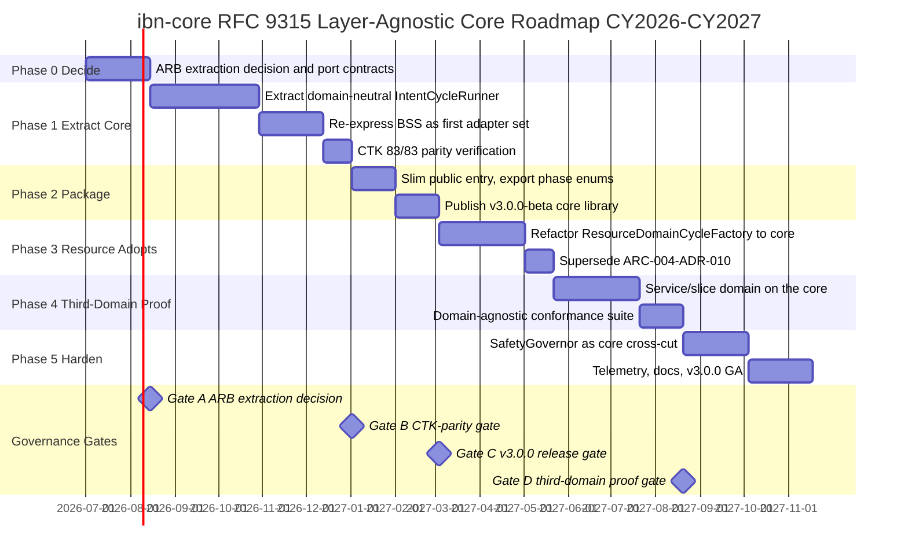
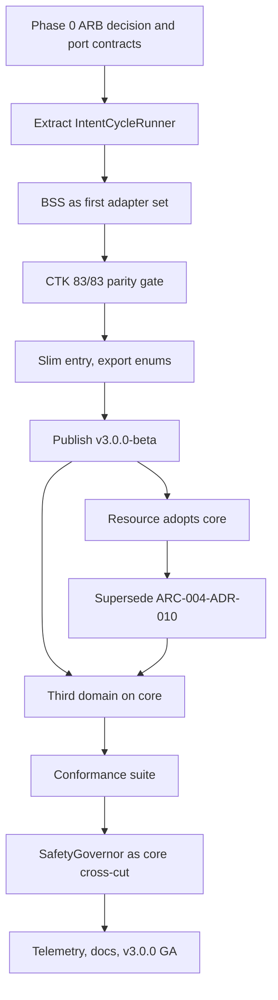

# Architecture Roadmap: ibn-core RFC 9315 Layer-Agnostic Core

> **Template Origin**: Official | **ArcKit Version**: 5.11.0 | **Command**: `/arckit:roadmap`

## Document Control

| Field | Value |
|-------|-------|
| **Document ID** | ARC-005-ROAD-v1.0 |
| **Document Type** | Strategic Architecture Roadmap |
| **Project** | ibn-core-rfc9315-core (Project 005) |
| **Classification** | PUBLIC |
| **Status** | DRAFT |
| **Version** | 1.0 |
| **Created Date** | 2026-06-14 |
| **Last Modified** | 2026-06-14 |
| **Review Cycle** | Quarterly |
| **Review Date** | 2026-07-14 |
| **Owner** | Roland Pfeifer, Lead Architect (Vpnet Cloud Solutions Sdn. Bhd.) |
| **Reviewed By** | [PENDING] |
| **Approved By** | [PENDING] |
| **Distribution** | ibn-core engineering, resource-intent-agent engineering, Vpnet Architecture Review Board |

> **Framing note**: ibn-core is a **commercial open-source** programme (Apache-2.0 public core, Vpnet Cloud Solutions). This roadmap therefore uses **calendar years** and an **engineering-effort / indicative-USD** investment model rather than UK public-sector financial years and £M capital. UK-Gov Service Standard gates (Alpha/Beta/Live), Spending Review alignment, and Cyber Essentials/ISO timelines from the template are **not applicable**; the real gates are the **Vpnet Architecture Review Board (ARB)**, **semver release gates** (v2.x → v3.0.0), a **TMF921 CTK-parity gate**, and a **third-domain proof gate**.
>
> **Scope & IP positioning**: TMF921 CTK and the ODA Canvas are properties of the **instantiated business-intent-agent**, not of the RFC 9315 core (the core's fidelity is to RFC 9315 / D-1…D-4). The business-intent-agent and its TMF921/CTK/ODA conformance are themselves **public open-core** — implementing TM Forum's *open* standards is **not** owning TM Forum IP. Vpnet's only original contribution is **demonstrating that the business-intent and resource-intent agents derive from one common source — the single layer-agnostic core** ("two peers, one core"). Only **operator-specific adapters/credentials** are private.

## Revision History

| Version | Date | Author | Changes | Approved By | Approval Date |
|---------|------|--------|---------|-------------|---------------|
| 1.0 | 2026-06-14 | ArcKit AI | Initial creation from `/arckit:roadmap` command | [PENDING] | [PENDING] |

> **Input gaps**: Project 005 has no `ARC-005-REQ`, `ARC-005-STKE`, `ARC-005-WARD`, or `ARC-005-RISK` yet (this roadmap precedes them). It is grounded in the global principles `ARC-000-PRIN-v1.0`, the Project 005 README thesis, and the as-is constraint from `resource-intent-agent` (`ARC-004-ADR-010`, `ARC-004-REQ` v1.3). Run `/arckit:requirements` and `/arckit:risk` for 005 to close the loop.

## Executive Summary

### Strategic Vision

Today the RFC 9315 intent-handling cycle in ibn-core is welded to the **business/BSS domain**: the phase-machine runner is BSS-concrete (`ARC-004-ADR-010`). When `resource-intent-agent` needed the same cycle for the network-resource domain, it could not reuse the runner — it had to re-implement the RFC 9315 phase pattern as a domain-specific runner (`ResourceDomainCycleFactory`) and reuse only the IMF coordination plane.

This roadmap delivers the **to-be**: extract the RFC 9315 phase machine into a **layer-agnostic core library** with a ports-and-adapters seam, so that **business-intent and resource-intent both instantiate the same core as peer adapters** — the "two peers, one core" thesis. The acid test is dogfooding: the core must host BSS (the original, most-coupled domain) *and* resource; a third domain (service/slice) then proves genuine layer-agnosticism.

### Investment Summary

- **Total Investment**: ~**USD 275k** (~55 engineer-weeks) over ~18 months, small core team (1–2 engineers).
- **Capital vs Operational**: this is internal **engineering effort**, not capital plant — ~90% build (engineer time), ~10% run (CI, release, docs upkeep).
- **Return**: eliminates per-domain runner re-implementation (resource already paid this once; every future domain would pay it again), removes drift risk between two phase-machine implementations, and turns the public surface into a clean, reusable port set — the reuse leverage the open-core model is sold on.
- **Payback**: at the **third** domain. Two consumers justify extraction; the third is where the library stops costing and starts saving.

### Expected Outcomes

1. **One RFC 9315 phase machine**, not two — a single place to fix lifecycle bugs, emit phase-tagged telemetry, and enforce the safety gate.
2. **Both BSS and resource run on the core** (dogfooding proven), with **TMF921 CTK parity maintained (83/83)**.
3. **Resource-intent retires its bespoke runner**, superseding `ARC-004-ADR-010`.
4. **A new domain can be stood up from the library + docs alone**, validated by a third (service/slice) domain.
5. **Slim, well-typed public entry** (phase enums exported; heavy transitive deps no longer forced) — fixing the downstream D4/D6 friction.

### Timeline at a Glance

- **Duration**: CY 2026 Q3 → CY 2027 Q4 (~18 months within a 2-year horizon).
- **Major Phases**: 6 (Decide → Extract Core → Package → Resource Adopts → Third-Domain Proof → Harden).
- **Key Milestones**: 6 (one per phase exit).
- **Governance Gates**: 4 (ARB extraction decision, CTK-parity gate, v3.0.0 release gate, third-domain proof gate).

---

## Strategic Context

### Vision & Strategic Drivers

#### Business Vision

Make the RFC 9315 cycle a genuine **reusable asset** of the open core, so the cost of a new intent domain falls from "re-implement the phase machine" to "supply a phase-strategy adapter set." This is the engine of the open-core commercial model: the public framework gets more reusable, while vendor/operator-specific adapters stay private.

#### Link to Stakeholder Drivers

> No `ARC-005-STKE` yet — interim drivers inferred from the 004 stakeholders and the programme owner.

| Stakeholder Group | Key Driver | Strategic Goal | Roadmap Alignment |
|-------------------|------------|----------------|-------------------|
| Lead Architect / CTO | Reuse leverage of the open core | Layer-agnostic RFC 9315 lib | Themes 1–2 |
| ibn-core engineering | One phase machine to maintain | No drift between BSS & resource runners | Theme 1, Theme 4 |
| resource-intent engineering | Retire the bespoke runner | Resource runs on the shared core | Theme 2 |
| Future-domain teams | Stand up a domain cheaply | Library + docs onboarding | Theme 3, Phase 4 |

#### Architecture Principles Alignment

[Reference: `projects/000-global/ARC-000-PRIN-v1.0.md`]

| Principle | Roadmap Compliance | Timeline for Full Compliance |
|-----------|-------------------|------------------------------|
| 9. Open-Core / Proprietary Seam Integrity | Core is public Apache-2.0; domain/vendor adapters stay private — the seam becomes a clean port set | CY 2027 Q1 (Phase 2) |
| 10. Loose Coupling | Ports-and-adapters seam replaces the welded BSS runner; no domain imports in core | CY 2027 Q1 (Phase 2) |
| 14. Maintainability & Evolvability | One phase machine, conformance-tested, documented | CY 2027 Q4 (Phase 5) |
| 5. Observability | Phase-tagged telemetry becomes a core concern, inherited by every domain | CY 2027 Q4 (Phase 5) |
| 3. Standards Conformance | **Core**: RFC 9315 fidelity (D-1…D-4). **Business-agent (public)**: TMF921 CTK 83/83 parity guarded at BSS re-instantiation (Gate B) | CY 2027 Q1 |

### Current State Assessment

#### Technology Landscape

- **ibn-core (public, Apache-2.0)** — v2.1.x ships the IMF coordination plane as reusable, but the **cycle runner is BSS-concrete** (welded to TMF921 translate, MCP orchestrate, Redis intent SSoT, claude-client). Git-installable as a library from v2.1.1, but with a **heavy transitive footprint** (e.g. `@anthropic-ai/sdk`) and **under-exported phase enums**.
- **resource-intent-agent (private)** — first non-BSS consumer; reuses the coordination plane but runs a **domain-specific runner** (`ResourceDomainCycleFactory`) re-implementing the phase pattern (`ARC-004-REQ` v1.3 FR-014).

#### Capability Maturity Baseline

| Capability Domain | Current Maturity Level | Assessment |
|-------------------|------------------------|------------|
| RFC 9315 core (layer-agnosticism) | L1 (Initial) | Runner is BSS-concrete; no neutral core |
| Phase-strategy port seam | L0 (None) | No formal per-phase port contracts |
| BSS-on-core (dogfooding) | L1 (Initial) | BSS *is* the runner, not a consumer of a core |
| Resource-on-core | L2 (Repeatable) | Works, but via a bespoke re-implementation |
| Multi-domain proof | L0 (None) | Only two domains; neither shares a core runner |
| Safety as a core cross-cut | L2 (Repeatable) | SafetyGovernor exists, but resource-only (004 ADR-011) |
| Packaging / footprint / DX | L2 (Repeatable) | Git-installable but heavy deps; enums under-exported |
| Phase-machine conformance suite | L0 (None) | No domain-agnostic conformance tests |

**Maturity Model**: L1 Initial · L2 Repeatable · L3 Defined · L4 Managed · L5 Optimized.

#### Technical Debt Quantification

- **The core debt**: a duplicated RFC 9315 phase pattern (BSS runner + resource's `ResourceDomainCycleFactory`) — two implementations that will diverge.
- **Entry-point debt (from 004 dashboard)**: D6 — phase enums (`IntentHandlingPhase/Step/IntentPriorityLayer`) under-exported, mirrored locally downstream; D4 — heavy transitive closure forced on all consumers (`@anthropic-ai/sdk` etc.).
- **Impact**: every new domain re-pays the phase-machine cost; drift risk between implementations; consumers drag unused LLM deps.

#### Risk Exposure

> No `ARC-005-RISK` yet — strategic risks summarized here, to be formalized via `/arckit:risk`.

1. **Premature/leaky abstraction** — a core that secretly encodes BSS+resource assumptions and doesn't generalize.
2. **Behaviour drift in BSS** during extraction — regressing the cited CTK 83/83 conformance.
3. **Safety regression** — disturbing the SafetyGovernor (004 ADR-011) while relocating the cycle.

### Future State Vision

#### Target Architecture

A public `@ibn-core/rfc9315-core` exporting: `IntentCycleRunner` (the domain-neutral phase state machine), `PhaseStrategy` ports (one per RFC 9315 phase), the phase/priority enums, the `SafetyGovernor.admit()` cross-cut hook, phase-tagged telemetry, and the IMF coordination plane. BSS and resource each supply their own `PhaseStrategy` adapter set and instantiate the same runner.

#### Capability Maturity Targets

| Capability Domain | Target Maturity Level | Gap to Close |
|-------------------|----------------------|--------------|
| RFC 9315 core (layer-agnosticism) | L4 (Managed) | +3 |
| Phase-strategy port seam | L4 (Managed) | +4 |
| BSS-on-core (dogfooding) | L4 (Managed) | +3 |
| Resource-on-core | L4 (Managed) | +2 |
| Multi-domain proof | L3 (Defined) | +3 |
| Safety as a core cross-cut | L4 (Managed) | +2 |
| Packaging / footprint / DX | L4 (Managed) | +2 |
| Phase-machine conformance suite | L4 (Managed) | +4 |

#### Technology Evolution

> No `ARC-005-WARD` yet. In Wardley terms: the RFC 9315 cycle moves from **Custom-built** (a bespoke BSS runner, re-built per domain) toward **Product** (a packaged, versioned core library consumed by all domains). The coordination plane is already Product-ish; this roadmap brings the runner alongside it.

---

## Roadmap Timeline

### Visual Timeline

### Roadmap Phases

#### Phase 0: Decide (CY 2026 Q3)

**Objectives**: agree the extraction; specify the `PhaseStrategy` port contracts; record the decision.

**Key Deliverables**: ibn-core Phase-0 ADR (`ARC-005-ADR-001`, APPROVED with conditions); **port-contract spec incorporating the ADR-005-001 Appendix D conditions** — **D-1** intent assurance is continuous (monitor/assess feed back, not a terminal "act"); **D-2** ports named for RFC 9315 functions (fulfilment / assurance), each mapped to its §5 sub-section; **D-3** business→resource modelled as RFC 9315 intent refinement via `IntentHierarchy` (not mere code reuse); **D-4** core stays declarative / outcome-oriented (no imperative pipeline); ARB sign-off.

**Investment**: ~3 engineer-weeks (~USD 15k).

---

#### Phase 1: Extract Core (CY 2026 Q3 → CY 2027 Q1)

**Objectives**: lift the phase state machine into a domain-neutral `IntentCycleRunner`; re-express current BSS logic as the **first adapter set** over it — behaviour-preserving.

**Key Deliverables**: `IntentCycleRunner` + `PhaseStrategy` ports; BSS adapter set; **TMF921 CTK 83/83 re-verified** (the guardrail). No feature work mixed in.

**Investment**: ~16 engineer-weeks (~USD 80k) — the largest, highest-risk phase.

---

#### Phase 2: Package (CY 2027 Q1)

**Objectives**: ship the core as a clean, slim, well-typed library.

**Key Deliverables**: public entry exporting runner + ports + coordination plane + **phase enums** (fixes D6); entry slimmed so consumers don't drag `@anthropic-ai/sdk` unless they use the LLM adapter (fixes D4); **v3.0.0-beta** published with a migration note. Cited tags remain immutable (CLAUDE.md).

**Investment**: ~6 engineer-weeks (~USD 30k).

---

#### Phase 3: Resource Adopts Core (CY 2027 Q2)

**Objectives**: make resource-intent a peer consumer; retire the bespoke runner.

**Key Deliverables**: `ResourceDomainCycleFactory` refactored to instantiate the core runner with resource adapters; resource loop tests + `SafetyGovernor.admit` still green; **a new 004 ADR supersedes `ARC-004-ADR-010`**.

**Investment**: ~10 engineer-weeks (~USD 50k).

---

#### Phase 4: Third-Domain Proof (CY 2027 Q3)

**Objectives**: prove genuine layer-agnosticism beyond the two known domains.

**Key Deliverables**: a service/slice (RFC 9543) domain stood up on the **unmodified** core; a **domain-agnostic phase-machine conformance suite** plus per-adapter conformance tests passing for all three domains.

**Investment**: ~10 engineer-weeks (~USD 50k).

---

#### Phase 5: Harden (CY 2027 Q4)

**Objectives**: make safety and observability core concerns; ship GA.

**Key Deliverables**: `SafetyGovernor` available as an injectable core `admit()` cross-cut (every domain inherits the blast-radius gate, not just resource — relates to 004 ADR-011); core-level phase-tagged telemetry; reference adapter + docs sufficient to onboard a domain unaided; **v3.0.0 GA**.

**Investment**: ~10 engineer-weeks (~USD 50k).

---

## Roadmap Themes & Initiatives

### Theme 1: Core Extraction & Port Seam

#### Strategic Objective

Turn the BSS-concrete runner into a domain-neutral `IntentCycleRunner` with a `PhaseStrategy` port per RFC 9315 phase — the structural change everything else depends on.

#### Timeline by Calendar Year

**CY 2026 (Q3–Q4)**:

- Initiative 1.1: ARB extraction decision + port-contract spec (Phase 0).
- Initiative 1.2: Extract `IntentCycleRunner`; enforce a "no domain imports in core" dependency rule (Phase 1).
- **Milestones**: Gate A (ARB decision); core runner compiles domain-free.
- **Investment**: ~USD 60k.

**CY 2027 (Q1)**:

- Initiative 1.3: Finalize port contracts against two real adapter sets.
- **Milestones**: Gate C (v3.0.0-beta).
- **Investment**: ~USD 15k.

#### Success Criteria

- [ ] `IntentCycleRunner` has zero domain (BSS/resource) imports.
- [ ] One `PhaseStrategy` port per RFC 9315 phase, implemented by ≥ 2 domains.
- [ ] Phase enums exported from the public entry (D6 closed).
- [ ] Port contracts honour the ADR-005-001 conditions: continuous assurance (D-1), RFC 9315-named ports mapped to §5 (D-2), intent-refinement hierarchy (D-3), declarative/outcome-oriented core (D-4).

---

### Theme 2: Dual-Domain Adoption ("two peers, one core")

#### Strategic Objective

Both BSS and resource instantiate the same core as peers — BSS first (dogfooding), resource second (retiring its bespoke runner).

#### Timeline by Calendar Year

**CY 2026 (Q4) → CY 2027 (Q1)**:

- Initiative 2.1: Re-express BSS as the first adapter set (Phase 1).
- Initiative 2.2: **CTK 83/83 parity** verification (Gate B).
- **Milestones**: Gate B (CTK-parity); BSS runs on the core.
- **Investment**: ~USD 60k.

**CY 2027 (Q2)**:

- Initiative 2.3: Refactor resource onto the core; supersede 004 ADR-010 (Phase 3).
- **Milestones**: resource loop green on the core.
- **Investment**: ~USD 50k.

#### Success Criteria

- [ ] BSS passes TMF921 CTK 83/83 running on the core (no regression).
- [ ] Resource loop + SafetyGovernor green on the core.
- [ ] `ResourceDomainCycleFactory` bespoke phase code deleted; ADR-010 superseded.

---

### Theme 3: Packaging & Developer Experience

#### Strategic Objective

Ship a slim, well-typed, versioned library a new domain can adopt from docs alone.

#### Timeline by Calendar Year

**CY 2027 (Q1)**:

- Initiative 3.1: Slim the public entry; remove forced `@anthropic-ai/sdk` drag (D4); export enums (D6).
- Initiative 3.2: Publish v3.0.0-beta + migration guide.
- **Milestones**: Gate C (v3.0.0-beta).
- **Investment**: ~USD 30k.

**CY 2027 (Q3–Q4)**:

- Initiative 3.3: Reference adapter + onboarding docs; v3.0.0 GA.
- **Milestones**: a domain stood up from docs alone.
- **Investment**: ~USD 25k.

#### Success Criteria

- [ ] Core entry installs without the LLM SDK unless the LLM adapter is used.
- [ ] v3.0.0 GA published; cited tags untouched.
- [ ] New-domain onboarding documented and validated (Phase 4).

---

### Theme 4: Safety & Conformance as Core Concerns

#### Strategic Objective

Make the blast-radius safety gate and a phase-machine conformance suite properties of the core, inherited by every domain — not re-built per domain.

#### Timeline by Calendar Year

**CY 2027 (Q3)**:

- Initiative 4.1: Domain-agnostic phase-machine conformance suite (Phase 4).
- **Milestones**: Gate D (third-domain proof) — suite green for 3 domains.
- **Investment**: ~USD 30k.

**CY 2027 (Q4)**:

- Initiative 4.2: `SafetyGovernor` as injectable core `admit()` cross-cut; core phase-tagged telemetry (Phase 5).
- **Milestones**: safety + telemetry inherited by all domains.
- **Investment**: ~USD 25k.

#### Success Criteria

- [ ] Conformance suite passes for BSS, resource, and a third domain.
- [ ] SafetyGovernor enforced via the core hook (resource keeps its thresholds; BSS may no-op).
- [ ] Every domain emits `rfc9315.phase`-tagged telemetry from the core.

---

## Capability Delivery Matrix

| Capability Domain | Current | CY 2026 | CY 2027 | Target |
|-------------------|---------|---------|---------|--------|
| RFC 9315 core (layer-agnosticism) | L1 | L2 | L4 | L4 (Managed) |
| Phase-strategy port seam | L0 | L2 | L4 | L4 (Managed) |
| BSS-on-core (dogfooding) | L1 | L2 | L4 | L4 (Managed) |
| Resource-on-core | L2 | L2 | L4 | L4 (Managed) |
| Multi-domain proof | L0 | L0 | L3 | L3 (Defined) |
| Safety as core cross-cut | L2 | L2 | L4 | L4 (Managed) |
| Packaging / footprint / DX | L2 | L2 | L4 | L4 (Managed) |
| Phase-machine conformance suite | L0 | L0 | L4 | L4 (Managed) |

**Capability Evolution**: L1→L2 documented/repeatable · L2→L3 standardized · L3→L4 metrics-driven/managed · L4→L5 continuous optimization.

---

## Dependencies & Sequencing

### Initiative Dependencies

### Critical Path

1. **Phase 0 decision** → 2. **Extract core** → 3. **BSS on core + CTK parity** → 4. **v3.0.0-beta** → 5. **Third-domain proof** → 6. **GA**.

### External Dependencies

| Dependency | Provider | Required By | Risk Level |
|------------|----------|-------------|------------|
| ibn-core repo write access + release pipeline | Vpnet (public repo) | Phase 1–2 | Low |
| resource-intent-agent engineering availability | Vpnet (private repo) | Phase 3 | Medium |
| A third candidate domain (service/slice, RFC 9543) | Vpnet roadmap | Phase 4 | Medium |

---

## Investment & Resource Planning

> Indicative engineering-planning estimates (USD), not procurement quotes. "Capital" ≈ build (engineer time); "Operational" ≈ CI/release/docs upkeep.

### Investment Summary by Calendar Year

| Calendar Year | Build (USD) | Run (USD) | Total (USD) | % of Total |
|---------------|-------------|-----------|-------------|------------|
| CY 2026 (H2) | 85k | 5k | 90k | ~33% |
| CY 2027 | 165k | 20k | 185k | ~67% |
| **Total** | **250k** | **25k** | **275k** | **100%** |

### Resource Requirements

| Calendar Year | FTE | Key Roles | Notes |
|---------------|-----|-----------|-------|
| CY 2026 (H2) | 1–2 | Core/runtime engineer (lead); BSS SME (part-time) | Extraction is the load-bearing work |
| CY 2027 | 1–2 | Core engineer; resource SME; third-domain SME (part-time) | Adoption + proof + harden |

### Investment by Theme

| Theme | CY 2026 | CY 2027 | Total |
|-------|---------|---------|-------|
| 1 — Core extraction & port seam | 60k | 15k | 75k |
| 2 — Dual-domain adoption | 25k | 85k | 110k |
| 3 — Packaging & DX | 0k | 55k | 55k |
| 4 — Safety & conformance | 5k | 30k | 35k |

### Cost Savings & Benefits Realization

| Benefit | CY 2026 | CY 2027 | Cumulative |
|---------|---------|---------|------------|
| Per-domain runner re-implementation avoided | — | 1 domain (3rd) | grows per future domain |
| Drift-defect risk removed (two runners → one) | partial | full | full |
| Consumer dependency-footprint reduced | — | all consumers | all consumers |

---

## Risks, Assumptions & Constraints

### Key Risks

| Risk ID | Risk Description | Impact | Probability | Mitigation Strategy | Timeline | Owner |
|---------|------------------|--------|-------------|---------------------|----------|-------|
| R-001 | Premature/leaky abstraction — core secretly encodes BSS+resource assumptions, doesn't generalize | High | Medium | "No domain imports in core" dependency rule; the Phase-4 third domain is the proof, not the assumption | Phase 4 | Lead Architect |
| R-002 | BSS behaviour drift during extraction regresses CTK 83/83 | High | Medium | Behaviour-preserving refactor; CTK-parity gate (Gate B); no feature work in Phase 1 | Phase 1 | ibn-core Lead |
| R-003 | Safety regression while relocating the cycle | High | Low | Keep SafetyGovernor where 004 ADR-011 put it until Phase 5; move only once core is stable | Phase 5 | Security Architect |
| R-004 | Breaking change (v3.0.0) strands consumers | Medium | Medium | Migration guide; semver; cited tags immutable; beta before GA | Phase 2 | ibn-core Lead |
| R-005 | No genuine third domain available to prove layer-agnosticism | Medium | Medium | Identify the service/slice domain early (Phase 0); a synthetic reference domain as fallback | Phase 4 | Lead Architect |

> Formalize in `ARC-005-RISK` via `/arckit:risk`.

### Critical Assumptions

| ID | Assumption | Validation | Contingency |
|----|------------|-----------|-------------|
| A-001 | The phase *pattern* is genuinely shared across domains (only the phase *bodies* differ) | Phase 0 port-contract review against both domains | If not, narrow the core to coordination plane only and keep domain runners |
| A-002 | BSS can be re-expressed as an adapter set without semantic change | Phase 1 CTK parity | Phase the BSS migration; keep old runner behind a flag during cutover |
| A-003 | Engineering capacity (1–2 FTE) is available across ~18 months | Resourcing confirmation at Gate A | Extend timeline toward the 3-year horizon |

### Constraints

| Constraint | Description | Impact on Roadmap |
|------------|-------------|-------------------|
| Open-core seam (PRIN 9) | Core must be public Apache-2.0; no operator/vendor specifics in it | Domain adapters that are vendor-specific stay private |
| Immutable cited tags | v1.4.x–v2.1.0 tags are cited academically; never rewrite | New work ships as v2.2.0/v3.0.0, never as tag edits |
| CTK conformance | TMF921 83/83 must not regress | Gate B blocks Phase 2 until parity proven |

---

## Governance & Decision Gates

### Governance Structure

- **Vpnet Architecture Review Board (ARB)** — monthly; owns the extraction decision (Gate A), the v3.0.0 release gate (Gate C), and any change to the open-core seam.
- **ibn-core engineering working session** — weekly; delivery, CTK-parity tracking, package/DX.
- **Cross-repo sync (ibn-core ↔ resource-intent-agent)** — at Phase 3 boundary; coordinates the resource adoption and the ADR-010 supersession.

### Review Cycles

| Review | Frequency | Purpose |
|--------|-----------|---------|
| Engineering working session | Weekly | Delivery, blockers, CTK-parity status |
| ARB review | Monthly | Decisions, seam integrity, release gates |
| Quarterly roadmap review | Quarterly | Re-baseline phases, re-confirm the third domain |

### Decision Gates

| Gate | Target | Decision | Go/No-Go Criteria |
|------|--------|----------|-------------------|
| **Gate A — ARB extraction decision** | CY 2026 Q3 | Approve the extraction + port contracts | Port contracts validated against both domains **and incorporating ADR-005-001 conditions D-1…D-4**; Phase-0 ADR accepted (APPROVED with conditions) |
| **Gate B — CTK-parity gate** | CY 2027 Q1 | Allow packaging | BSS on the core passes **TMF921 CTK 83/83**; no behaviour change |
| **Gate C — v3.0.0 release gate** | CY 2027 Q1 | Publish the core library | Slim entry + enums exported; migration guide; beta tested |
| **Gate D — third-domain proof gate** | CY 2027 Q3 | Declare layer-agnostic | A third domain runs on the **unmodified** core; conformance suite green for 3 domains |

> UK-Gov Service Standard Alpha/Beta/Live assessment gates are **not applicable** (commercial open-source subject).

---

## Success Metrics & KPIs

### Strategic KPIs

| KPI | Baseline | CY 2026 Target | CY 2027 Target | Measurement |
|-----|----------|----------------|----------------|-------------|
| RFC 9315 runner implementations | 2 (BSS + resource bespoke) | 2 (core extracted, BSS on it) | **1** (shared core) | Per release |
| Domains running on the shared core | 0 | 1 (BSS) | **3** (BSS + resource + third) | Per phase |
| TMF921 CTK conformance | 83/83 | 83/83 | 83/83 | Per release (Gate B) |
| Forced LLM-SDK dependency on consumers | Yes | Yes | **No** | Package audit |
| Phase enums exported from public entry | No | No | **Yes** | Package audit |

### Capability Maturity Metrics

| Capability | Baseline | CY 2026 | CY 2027 | Target |
|------------|----------|---------|---------|--------|
| RFC 9315 core layer-agnosticism | L1 | L2 | L4 | L4 |
| Phase-machine conformance suite | L0 | L0 | L4 | L4 |
| Safety as core cross-cut | L2 | L2 | L4 | L4 |

### Technical Metrics

| Metric | Current | CY 2026 | CY 2027 | Target |
|--------|---------|---------|---------|--------|
| Domain imports in core package | n/a | 0 | 0 | 0 (enforced) |
| Per-adapter conformance tests passing | 0 domains | 1 | 3 | 3 |
| New-domain onboarding | re-implement runner | — | library + docs | library + docs |

---

## Traceability

### Architecture Principles → Compliance Timeline

[Reference: `ARC-000-PRIN-v1.0.md`]

| Principle | Roadmap Activities | Target Date |
|-----------|--------------------|-------------|
| 9. Open-Core Seam Integrity | Public Apache-2.0 core; private domain adapters | CY 2027 Q1 |
| 10. Loose Coupling | Ports-and-adapters seam; no domain imports in core | CY 2027 Q1 |
| 14. Maintainability | One conformance-tested phase machine | CY 2027 Q4 |
| 5. Observability | Phase-tagged telemetry as a core concern | CY 2027 Q4 |
| 3. Standards Conformance | CTK 83/83 parity through extraction | CY 2027 Q1 |

### Decisions → Roadmap

| Decision | Relationship | Roadmap Phase |
|----------|--------------|---------------|
| `ARC-004-ADR-010` (runner is BSS-concrete) | The as-is constraint this roadmap removes | Phase 3 supersedes it |
| `ARC-004-ADR-011` (SafetyGovernor) | Becomes a core cross-cut | Phase 5 |
| ibn-core Phase-0 ADR (to be written) | The extraction decision | Phase 0 |
| `ARC-004-REQ` v1.3 (FR-014 domain-specific runner) | The consumer requirement that adoption satisfies | Phase 3 |

---

## Appendices

### Appendix A: Capability Maturity Model

- **L1 Initial** — ad-hoc, individual-dependent.
- **L2 Repeatable** — documented, repeatable at project level.
- **L3 Defined** — standardized across the programme.
- **L4 Managed** — metrics-driven, predictable.
- **L5 Optimized** — continuous improvement.

### Appendix B: Technology Radar

- **Adopt**: TypeScript ports-and-adapters; semver; the IMF coordination plane (already reusable).
- **Trial**: domain-agnostic phase-machine conformance harness; injectable `SafetyGovernor.admit()` core hook.
- **Assess**: a third domain (service/slice, RFC 9543) as the layer-agnosticism proof.
- **Hold**: per-domain re-implementation of the phase pattern (the very thing being retired).

### Appendix C: Vendor / Upstream Alignment

| Dependency | Our Use | Alignment | Risk |
|------------|---------|-----------|------|
| `@anthropic-ai/sdk` | LLM adapter only (BSS translate/explain) | Should be optional, not forced on all consumers | Medium → Low after Phase 2 |
| RFC 9315 | The standard the **core** implements | Stable, cited | Low |
| TMF921 v5 / CTK / ODA Canvas | Open TM Forum standards implemented by the **public business-agent**, not the core (not Vpnet-owned IP) | Stable, cited | Low |

### Appendix D: Standards Alignment

| Standard | Current | CY 2026 | CY 2027 |
|----------|---------|---------|---------|
| RFC 9315 phase model | Implemented (BSS-welded) | Extracted to core | Core, multi-domain |
| TMF921 v5 CTK | 83/83 (BSS) | 83/83 (BSS on core) | 83/83 maintained |
| Open-core licensing (Apache-2.0) | Compliant | Compliant | Compliant (clean port surface) |

## External References

> This section provides traceability from generated content back to source material.

### Document Register

| Doc ID | Filename | Type | Source Location | Description |
|--------|----------|------|-----------------|-------------|
| PRIN | ARC-000-PRIN-v1.0.md | Principles | projects/000-global/ | Open-core seam, loose coupling, maintainability, observability, standards conformance |
| RM005 | README.md | Project charter | projects/005-ibn-core-rfc9315-core/ | "Two peers, one core" thesis; scope; planned artifacts |
| ADR010 | ARC-004-ADR-010-v1.0.md | ADR (external repo) | resource-intent-agent/…/decisions/ | As-is: ibn-core runner is BSS-concrete, not layer-agnostic |
| REQ004 | ARC-004-REQ-v1.0.md (content v1.3) | Requirements (external repo) | resource-intent-agent/…/ | FR-014 domain-specific runner; the consumer constraint |

### Citations

| Citation ID | Doc ID | Page/Section | Category | Quoted Passage |
|-------------|--------|--------------|----------|----------------|
| [PRIN-C1] | PRIN | Principle 9 / 10 | Design Decision | Open-core seam as a clean published interface; loose coupling via published interfaces |
| [RM005-C1] | RM005 | Thesis | Design Decision | "Both business-intent and resource-intent MUST instantiate from the same RFC 9315 core as peer adapters." |
| [ADR010-C1] | ADR010 | Title / Decision | Design Decision | Reuse the IMF coordination plane + RFC 9315 phase pattern with a domain-specific runner — the runner is not layer-agnostic |

### Unreferenced Documents

| Filename | Source Location | Reason |
|----------|-----------------|--------|
| — | — | — |

---

**Generated by**: ArcKit `/arckit:roadmap` command
**Generated on**: 2026-06-14 GMT
**ArcKit Version**: 5.11.0
**Project**: ibn-core-rfc9315-core (Project 005)
**AI Model**: claude-opus-4-8 (1M context)
**Generation Context**: Grounded in ARC-000-PRIN-v1.0 (principles), the Project 005 README thesis, and the as-is constraint from resource-intent-agent (ARC-004-ADR-010, ARC-004-REQ v1.3). Adapted from the UK-Gov roadmap template to a commercial open-source engineering programme: calendar years, USD/engineer-effort investment, and project-specific gates (ARB, CTK-parity, semver, third-domain proof) in place of GDS Service Standard gates. No ARC-005-REQ/STKE/WARD/RISK yet — inputs noted as gaps.

<!-- arckit-provenance:start -->

## Build Provenance

_Stamped automatically by the ArcKit plugin's `provenance-stamp.mjs` PostToolUse hook. Complements (does not replace) the human-authored footer above. Carries only fields the model can't authoritatively self-report: build context from `.arckit/state.json` and effort levels derived from command frontmatter + the silent-downgrade matrix._

| Field | Value |
|-------|-------|
| Requested Effort | `high` |
| Effective Effort | _unknown — model not parsed from existing footer_ |
| Stamped at | 2026-06-14T19:30:19.331Z |

<!-- arckit-provenance:end -->
