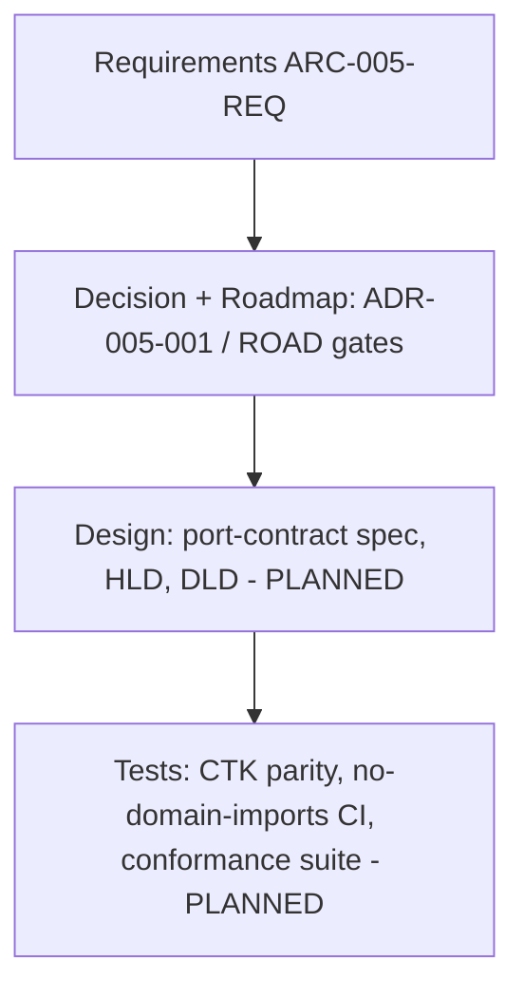

# Requirements Traceability Matrix: ibn-core RFC 9315 Layer-Agnostic Core

> **Template Origin**: Official | **ArcKit Version**: 5.11.0 | **Command**: `/arckit:traceability`

## Document Control

| Field | Value |
|-------|-------|
| **Document ID** | ARC-005-TRAC-v1.0 |
| **Document Type** | Requirements Traceability Matrix |
| **Project** | ibn-core-rfc9315-core (Project 005) |
| **Classification** | PUBLIC |
| **Status** | DRAFT |
| **Version** | 1.0 |
| **Created Date** | 2026-06-14 |
| **Last Modified** | 2026-06-14 |
| **Review Cycle** | Per roadmap gate |
| **Review Date** | 2026-07-14 |
| **Owner** | Roland Pfeifer, Lead Architect (Vpnet Cloud Solutions Sdn. Bhd.) |
| **Reviewed By** | [PENDING] |
| **Approved By** | [PENDING] |
| **Distribution** | Vpnet Architecture Review Board, ibn-core engineering, resource-intent-agent engineering |

> **Phase note**: Project 005 is at **Phase 0** (`ARC-005-ROAD-v1.0`). Requirements therefore trace **fully to the decision and roadmap** (`ARC-005-ADR-001`, ROAD gates), but **HLD/DLD and tests do not exist yet** — they are planned Phase-0/1/4 deliverables, **not blocking gaps**. This matrix is the baseline; design/test columns populate as the roadmap delivers.
>
> **Scope note**: NFR-C-001 (TMF921 CTK) is the **business-intent-agent's** conformance verified at re-instantiation, not a property of the core (per ADR-005-001 Scope & IP note).

## Revision History

| Version | Date | Author | Changes | Approved By | Approval Date |
|---------|------|--------|---------|-------------|---------------|
| 1.0 | 2026-06-14 | ArcKit AI | Initial creation from `/arckit:traceability` command — Phase-0 baseline | [PENDING] | [PENDING] |

## Document Purpose

End-to-end traceability for the RFC 9315 core-extraction: requirements (`ARC-005-REQ-v1.0`) → decision (`ARC-005-ADR-001`) / roadmap (`ARC-005-ROAD-v1.0`) → design (planned) → tests (planned). It anchors every requirement to a decision and a roadmap phase/gate, and tracks the design/test artifacts owed at each phase.

---

## 1. Overview

### 1.1 Purpose

Ensure every Project-005 requirement is anchored to the keystone decision and a roadmap phase/gate, and that the design and test artifacts owed by the roadmap are tracked to closure.

### 1.2 Traceability Scope

### 1.3 Document References

| Document | Version | Status | Link |
|----------|---------|--------|------|
| Requirements | v1.0 | DRAFT | `ARC-005-REQ-v1.0.md` |
| Keystone ADR | v1.0 | APPROVED (w/ conditions) | `decisions/ARC-005-ADR-001-v1.0.md` |
| Roadmap | v1.0 | DRAFT | `ARC-005-ROAD-v1.0.md` |
| Stakeholders | v1.0 | DRAFT | `ARC-005-STKE-v1.0.md` |
| Risk Register | v1.0 | DRAFT | `ARC-005-RISK-v1.0.md` |
| Port-contract spec | — | PLANNED (Phase 0) | — |
| HLD / DLD | — | PLANNED (Phase 1) | — |
| Conformance suite | — | PLANNED (Phase 4) | — |

---

## 2. Traceability Matrix

### 2.1 Forward Traceability: Requirements → Decision/Roadmap → Design → Tests

Status legend: ⏳ Planned (anchored to decision/roadmap; design/test pending by phase) · 🔄 In progress · ✅ Covered (designed + tested) · ❌ Gap (unanchored).

| Req ID | Requirement | Pri | Decision / Roadmap anchor | Design (planned) | Test (planned) | Status |
|--------|-------------|-----|---------------------------|------------------|----------------|--------|
| BR-001 | One layer-agnostic cycle core | MUST | ADR-005-001 (Opt 1); ROAD Theme 1, G-1 | Core architecture (HLD, Ph1) | Conformance suite (Ph4) | ⏳ Planned |
| BR-002 | Two peers, one core (dogfooded) | MUST | ADR-005-001 §6; ROAD Theme 2 | HLD (Ph1) | BSS CTK (Gate B) + resource loop (Ph3) | ⏳ Planned |
| BR-003 | Reuse leverage — adapter-only domains | SHOULD | ADR-005-001 §5; ROAD Theme 1 | Reference adapter (Ph5) | 3rd-domain proof (Gate D) | ⏳ Planned |
| BR-004 | Preserve seam + conformance through extraction | MUST | ADR-005-001 (PRIN 9/3); ROAD Gates B/C | Seam guardrails (Ph1-2) | CTK parity + licence/seam audit | ⏳ Planned |
| FR-001 | Domain-neutral `IntentCycleRunner` | MUST | ADR-005-001; ROAD Phase 1 | DLD runner (Ph1) | no-domain-imports CI (NFR-ARCH-001) | ⏳ Planned |
| FR-002 | `PhaseStrategy` port per RFC 9315 phase | MUST | ADR-005-001; ROAD Phase 0 | Port-contract spec (Ph0) | Per-adapter conformance (Ph4) | ⏳ Planned |
| FR-003 | Both domains instantiate the core | MUST | ADR-005-001 §6; ROAD Themes 1-2 | BSS + resource adapter sets (Ph1/3) | BSS CTK + resource loop | ⏳ Planned |
| FR-004 (D-1) | Continuous intent assurance in core | MUST | ADR-005-001 Appendix D (D-1) | Port-contract spec (Ph0) | Conformance suite — assurance loop (Ph4) | ⏳ Planned |
| FR-005 (D-2) | RFC 9315-named ports mapped to §5 | MUST | ADR-005-001 Appendix D (D-2) | Port-contract spec §5 map (Ph0) | Design review (Ph0) | ⏳ Planned |
| FR-006 (D-3) | Intent refinement via `IntentHierarchy` | SHOULD | ADR-005-001 Appendix D (D-3) | DLD hierarchy linkage (Ph3) | Resource adoption tests (Ph3) | ⏳ Planned |
| FR-007 (D-4) | Declarative, outcome-oriented core | MUST | ADR-005-001 Appendix D (D-4) | Design review (Ph0/1) | Design review gate | ⏳ Planned |
| FR-008 | `SafetyGovernor` injectable core cross-cut | SHOULD | ADR-005-001; ROAD Phase 5; 004 ADR-011 | DLD admit() hook (Ph5) | Safety tests + tabletop (Ph5) | ⏳ Planned |
| FR-009 | Phase-tagged telemetry as core concern | SHOULD | ADR-005-001; ROAD Phase 5 (PRIN 5) | DLD telemetry (Ph5) | Span-attribute test (Ph5) | ⏳ Planned |
| FR-010 | Exported phase enums (D6 closure) | MUST | ADR-005-001; ROAD Phase 2 | Package entry (Ph2) | Package audit (Ph2) | ⏳ Planned |
| NFR-C-001 | TMF921 CTK parity — *business-agent* (Gate B) | CRITICAL | ROAD Gate B | BSS adapter set (Ph1) | TMF921 v5 CTK 83/83 (business-agent) | ⏳ Planned |
| NFR-ARCH-001 | No-domain-imports dependency rule | CRITICAL | ROAD Phase 1 | CI rule (Ph1) | CI dependency check (0 violations) | ⏳ Planned |
| NFR-PKG-001 | Slim public entry (D4 closure) | HIGH | ROAD Phase 2 | Package entry slim (Ph2) | Install/footprint audit (Ph2) | ⏳ Planned |
| NFR-I-001 | Semver v3.0.0 + migration | HIGH | ROAD Phase 2 (Gate C) | Release process (Ph2) | Changelog/migration review | ⏳ Planned |
| NFR-M-001 | Domain-agnostic conformance suite | HIGH | ROAD Phase 4 (Gate D) | Conformance harness (Ph4) | Suite green for 3 domains | ⏳ Planned |
| NFR-LIC-001 | Open-core licence compatibility | CRITICAL | ADR-005-001 (PRIN 9) | Dependency policy (Ph2) | Licence check (Apache-2.0) | ⏳ Planned |

**All 20 requirements are anchored** to the decision and a roadmap phase/gate. **No orphan requirements.**

### 2.2 Backward Traceability: Tests → Design → Requirements

**Not yet applicable** — no design components or test cases exist at Phase 0. This section populates from Phase 1 (the CTK-parity and no-domain-imports tests are the first to land). The planned test→requirement links are the inverse of §2.1's Test column; the key ones:

| Planned Test | Verifies | Phase |
|--------------|----------|-------|
| TMF921 v5 CTK 83/83 (business-agent) | NFR-C-001, BR-002, FR-003 | Gate B (Ph1) |
| No-domain-imports CI rule | NFR-ARCH-001, FR-001, BR-001 | Phase 1 |
| Domain-agnostic conformance suite (3 domains) | NFR-M-001, BR-001/003, FR-002/004 | Gate D (Ph4) |
| Resource loop + SafetyGovernor green | FR-003/006/008, BR-002 | Phase 3/5 |

---

## 3. Coverage Analysis

### 3.1 Requirements Coverage Summary

> Two coverage lenses: **decision/roadmap anchoring** (does every requirement trace to the decision and a phase/gate?) and **design/test realisation** (do HLD/DLD/tests exist yet?). At Phase 0 the first is complete; the second is intentionally 0%.

| Category | Total | Anchored to Decision/Roadmap | Design realised | Test realised |
|----------|-------|------------------------------|-----------------|---------------|
| Business (BR) | 4 | 4 (100%) | 0 (planned) | 0 (planned) |
| Functional (FR) | 10 | 10 (100%) | 0 (planned) | 0 (planned) |
| Non-Functional (NFR) | 6 | 6 (100%) | 0 (planned) | 0 (planned) |
| **Total** | **20** | **20 (100%)** | **0% (Phase 0)** | **0% (Phase 0)** |

**Status**: ON TRACK for Phase 0 — decision/roadmap traceability complete; design/test realisation pending by roadmap phase (expected).

### 3.2 Design Coverage

No HLD/DLD exists yet. The **Phase-0 port-contract spec** is the first design artifact (covers FR-002, FR-004, FR-005, FR-007). HLD/DLD (Phase 1) will cover FR-001/003 and the runner; Phase 5 covers FR-008/009. **No orphan design elements** (no design docs to orphan).

### 3.3 Test Coverage

No tests exist yet. First tests land in Phase 1 (CTK-parity Gate B; no-domain-imports CI). The **domain-agnostic conformance suite** (NFR-M-001, Phase 4) is the principal verification artifact and the Gate D evidence.

---

## 4. Gap Analysis

### 4.1 Requirements Without Design / Tests

All 20 requirements currently lack HLD/DLD and tests — but this is **expected at Phase 0, not a gap to block**. Each is scheduled:

| Owed artifact | Requirements served | Roadmap phase | Owner |
|---------------|---------------------|---------------|-------|
| Port-contract spec | FR-002, FR-004, FR-005, FR-007 | Phase 0 | Lead Architect |
| HLD / DLD | FR-001, FR-003, BR-001/002 | Phase 1 | ibn-core lead |
| CTK-parity test (business-agent) | NFR-C-001, BR-002 | Phase 1 (Gate B) | BSS eng lead |
| No-domain-imports CI | NFR-ARCH-001, FR-001 | Phase 1 | ibn-core lead |
| Conformance suite | NFR-M-001, BR-001/003, FR-002/004 | Phase 4 (Gate D) | Lead Architect |
| SafetyGovernor hook + safety tests | FR-008 | Phase 5 | Security Architect |

### 4.2 Requirements Without Anchor (true gaps)

**None.** Every requirement traces to ADR-005-001 and a roadmap phase/gate.

### 4.3 Design Components Without Requirements (scope creep)

**None** — no design artifacts exist yet. Re-check at each phase: any component in the port-contract spec / HLD without a requirement is scope creep.

---

## 5. Non-Functional Requirements Traceability

| NFR ID | Requirement | Design strategy | Test plan | Phase | Status |
|--------|-------------|-----------------|-----------|-------|--------|
| NFR-C-001 | TMF921 CTK parity (**business-agent**, not core) | BSS adapter set re-instantiated on core | TMF921 v5 CTK 83/83 (Gate B) | Ph1 | ⏳ Planned |
| NFR-ARCH-001 | No domain imports in core | CI dependency rule | CI check (0 violations) | Ph1 | ⏳ Planned |
| NFR-PKG-001 | Slim entry; LLM-SDK optional (D4) | Tightened package entry | Install/footprint audit | Ph2 | ⏳ Planned |
| NFR-I-001 | Semver v3.0.0 + migration | Release discipline; pinnable cited tags | Migration-guide + changelog review | Ph2 | ⏳ Planned |
| NFR-M-001 | Domain-agnostic conformance suite | Conformance harness | Suite green ×3 domains (Gate D) | Ph4 | ⏳ Planned |
| NFR-LIC-001 | Open-core Apache-2.0 compatibility | Dependency licence policy | Licence check | Ph2 | ⏳ Planned |

---

## 7. Metrics and KPIs

| Metric | Current | Target | Status |
|--------|---------|--------|--------|
| Requirements anchored to decision/roadmap | 20/20 (100%) | 100% | ✅ On Track |
| Orphan requirements (no anchor) | 0 | 0 | ✅ |
| Orphan design elements | 0 (no design yet) | 0 | ✅ |
| Requirements with design realised | 0% | grows per phase | ⏳ Phase 0 |
| Requirements with test realised | 0% | 100% MUST by Gate D | ⏳ Phase 0 |

**Overall traceability score**: **Decision-level 100% / Realisation 0% (Phase 0 baseline).** Not a release candidate — this is the entry baseline; realisation accrues through Phases 0–5.

**Recommendation**: **Baseline accepted.** Re-run this matrix at each gate (B, C, D) to populate design/test columns; MUST requirements must reach test-realised before Gate D.

---

## 8. Action Items

| ID | Action | Requirements | Owner | Phase | Status |
|----|--------|--------------|-------|-------|--------|
| GAP-001 | Produce the port-contract spec (incl. D-1…D-4) | FR-002/004/005/007 | Lead Architect | Phase 0 | Open |
| GAP-002 | HLD/DLD for the core runner | FR-001/003, BR-001/002 | ibn-core lead | Phase 1 | Open |
| GAP-003 | Stand up CTK-parity + no-domain-imports tests | NFR-C-001, NFR-ARCH-001 | BSS + ibn-core lead | Phase 1 | Open |
| GAP-004 | Domain-agnostic conformance suite | NFR-M-001 | Lead Architect | Phase 4 | Open |

---

## 9. Review and Approval

### 9.1 Review Checklist

- [x] All requirements traced to a decision (ADR-005-001) and a roadmap phase/gate
- [x] No orphan requirements; no orphan design elements (no design yet)
- [ ] Design components defined (Phase 0/1)
- [ ] Test coverage defined and realised (Phase 1+; MUST by Gate D)
- [x] Phase-appropriate gaps identified with owners and phases

### 9.2 Approval

| Role | Name | Approval | Date |
|------|------|----------|------|
| Lead Architect / Owner | Roland Pfeifer | [ ] | [PENDING] |
| Governance Board | Vpnet ARB | [ ] | [PENDING] |

---

## External References

> Traceability from generated content back to source material.

### Document Register

| Doc ID | Filename | Type | Source Location | Description |
|--------|----------|------|-----------------|-------------|
| REQ | ARC-005-REQ-v1.0.md | Requirements | projects/005-ibn-core-rfc9315-core/ | 20 requirements (BR/FR/NFR); FR-004…007 = D-1…D-4 |
| ADR005 | ARC-005-ADR-001-v1.0.md | ADR | projects/005-ibn-core-rfc9315-core/decisions/ | Keystone decision; Appendix D (D-1…D-4); the design anchor |
| ROAD | ARC-005-ROAD-v1.0.md | Roadmap | projects/005-ibn-core-rfc9315-core/ | Phases 0–5; Gates A–D (the realisation schedule) |
| STKE | ARC-005-STKE-v1.0.md | Stakeholder Analysis | projects/005-ibn-core-rfc9315-core/ | Owners (RACI) |
| RISK | ARC-005-RISK-v1.0.md | Risk Register | projects/005-ibn-core-rfc9315-core/ | R-001…R-009 (gate-dependent controls) |

### Citations

| Citation ID | Doc ID | Section | Category | Quoted/Paraphrased Passage |
|-------------|--------|---------|----------|----------------------------|
| [REQ-C1] | REQ | BR/FR/NFR + Traceability table | Functional Requirement | 20 requirements; FR-004…007 trace to ADR Appendix D conditions |
| [ADR005-C1] | ADR005 | §6 / Appendix D | Design Decision | Decision + D-1…D-4; the design anchor for all requirements |
| [ROAD-C1] | ROAD | Phases 0–5, Gates A–D | Plan | The schedule that realises design/test per requirement |

### Unreferenced Documents

| Filename | Source Location | Reason |
|----------|-----------------|--------|
| — | — | — |

---

**Generated by**: ArcKit `/arckit:traceability` command
**Generated on**: 2026-06-14 GMT
**ArcKit Version**: 5.11.0
**Project**: ibn-core-rfc9315-core (Project 005)
**AI Model**: claude-opus-4-8 (1M context)
**Generation Context**: Built manually (no pre-processor hook data this run) from ARC-005-REQ (20 requirements) traced to ARC-005-ADR-001 and ARC-005-ROAD gates. Phase-0 baseline: decision/roadmap traceability complete; HLD/DLD/tests are planned roadmap deliverables, not gaps. NFR-C-001 (CTK) scoped to the business-agent per the ADR Scope & IP note.

<!-- arckit-provenance:start -->

## Build Provenance

_Stamped automatically by the ArcKit plugin's `provenance-stamp.mjs` PostToolUse hook. Complements (does not replace) the human-authored footer above. Carries only fields the model can't authoritatively self-report: build context from `.arckit/state.json` and effort levels derived from command frontmatter + the silent-downgrade matrix._

| Field | Value |
|-------|-------|
| Requested Effort | `high` |
| Effective Effort | _unknown — model not parsed from existing footer_ |
| Stamped at | 2026-06-14T19:35:03.033Z |

<!-- arckit-provenance:end -->
