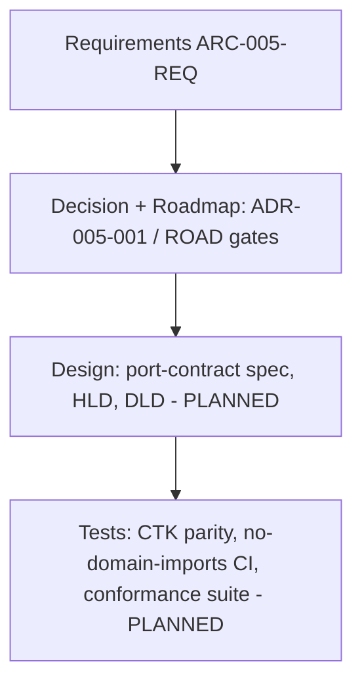

# Requirements Traceability Matrix: ibn-core RFC 9315 Layer-Agnostic Core

> **Template Origin**: Official | **ArcKit Version**: 5.11.0 | **Command**: `/arckit:traceability`

## Document Control

| Field | Value |
|-------|-------|
| **Document ID** | ARC-005-TRAC-v1.0 |
| **Document Type** | Requirements Traceability Matrix |
| **Project** | ibn-core-rfc9315-core (Project 005) |
| **Classification** | PUBLIC |
| **Status** | DRAFT |
| **Version** | 1.0 |
| **Created Date** | 2026-06-14 |
| **Last Modified** | 2026-06-21 |
| **Review Cycle** | Per roadmap gate |
| **Review Date** | 2026-07-14 |
| **Owner** | Roland Pfeifer, Lead Architect (Vpnet Cloud Solutions Sdn. Bhd.) |
| **Reviewed By** | [PENDING] |
| **Approved By** | [PENDING] |
| **Distribution** | Vpnet Architecture Review Board, ibn-core engineering, resource-intent-agent engineering |

> **Phase note (refreshed 2026-06-21)**: Project 005 has moved from Phase 0 baseline to **Phase 1 partially delivered**. The layer-agnostic core is **extracted and merged on `main`** — PR **#52** (`IntentCycleRunner`, `PhaseStrategy`, `no-domain-imports` guard, `BssPhaseStrategy`), PR **#54** (slim `lib` entry, D4), PR **#59** (LLM-agnostic seam, ADR-003). Six requirements are now **✅ Implemented** and seven **🔄 In progress**; the remaining are correctly Planned/gated. The principal outstanding verification is **NFR-C-001 / Gate B** (TMF921 CTK 83/83 re-run after re-instantiation on the core), which also gates the deferred `v3.0.0` tag (NFR-I-001, ADR-005-002).
>
> **Scope note**: NFR-C-001 (TMF921 CTK) is the **business-intent-agent's** conformance verified at re-instantiation, not a property of the core (per ADR-005-001 Scope & IP note).

## Revision History

| Version | Date | Author | Changes | Approved By | Approval Date |
|---------|------|--------|---------|-------------|---------------|
| 1.0 | 2026-06-14 | ArcKit AI | Initial creation from `/arckit:traceability` command — Phase-0 baseline | [PENDING] | [PENDING] |
| 1.0 (amended) | 2026-06-21 | ArcKit AI | Refreshed for Phase-1 delivery: marked FR-001/002/005/010 + NFR-ARCH-001/PKG-001 ✅ Implemented (#52/#54); FR-003/004/008/009 + BR-001/002/004 🔄 In progress; coverage/metrics/action-items reconciled. In-place DRAFT amendment. | [PENDING] | [PENDING] |

## Document Purpose

End-to-end traceability for the RFC 9315 core-extraction: requirements (`ARC-005-REQ-v1.0`) → decision (`ARC-005-ADR-001`) / roadmap (`ARC-005-ROAD-v1.0`) → design (planned) → tests (planned). It anchors every requirement to a decision and a roadmap phase/gate, and tracks the design/test artifacts owed at each phase.

---

## 1. Overview

### 1.1 Purpose

Ensure every Project-005 requirement is anchored to the keystone decision and a roadmap phase/gate, and that the design and test artifacts owed by the roadmap are tracked to closure.

### 1.2 Traceability Scope

### 1.3 Document References

| Document | Version | Status | Link |
|----------|---------|--------|------|
| Requirements | v1.0 | DRAFT | `ARC-005-REQ-v1.0.md` |
| Keystone ADR | v1.0 | APPROVED (w/ conditions) | `decisions/ARC-005-ADR-001-v1.0.md` |
| Roadmap | v1.0 | DRAFT | `ARC-005-ROAD-v1.0.md` |
| Stakeholders | v1.0 | DRAFT | `ARC-005-STKE-v1.0.md` |
| Risk Register | v1.0 | DRAFT | `ARC-005-RISK-v1.0.md` |
| Port-contract spec | v1.0 | DELIVERED (Phase 0) | `phase0-port-contract-spec-v1.0.md` |
| Core implementation | — | DELIVERED (Phase 1) | `src/imf/core/` + `lib/index.ts` (PR #52/#54) |
| HLD / DLD | — | PLANNED (Phase 1) | — |
| Conformance suite | — | PLANNED (Phase 4) | — |

---

## 2. Traceability Matrix

### 2.1 Forward Traceability: Requirements → Decision/Roadmap → Design → Tests

Status legend: ⏳ Planned (anchored to decision/roadmap; design/test pending by phase) · 🔄 In progress (code landed; verification or peer adoption pending) · ✅ Implemented (code + test landed on `main`) · ❌ Gap (unanchored). **Evidence in the Design/Test columns cites the merged PR.**

| Req ID | Requirement | Pri | Decision / Roadmap anchor | Design (evidence) | Test (evidence) | Status |
|--------|-------------|-----|---------------------------|------------------|----------------|--------|
| BR-001 | One layer-agnostic cycle core | MUST | ADR-005-001 (Opt 1); ROAD Theme 1, G-1 | Core extracted — `src/imf/core/` (#52) | Conformance suite (Ph4) | 🔄 In progress |
| BR-002 | Two peers, one core (dogfooded) | MUST | ADR-005-001 §6; ROAD Theme 2 | BSS on core via `BssPhaseStrategy` (#52); resource peer Ph3 | BSS CTK (Gate B) + resource loop (Ph3) | 🔄 In progress |
| BR-003 | Reuse leverage — adapter-only domains | SHOULD | ADR-005-001 §5; ROAD Theme 1 | Reference adapter (Ph5) | 3rd-domain proof (Gate D) | ⏳ Planned |
| BR-004 | Preserve seam + conformance through extraction | MUST | ADR-005-001 (PRIN 9/3); ROAD Gates B/C | Seam preserved — no-domain-imports guard (#52) | CTK parity (Gate B, pending) + licence/seam audit | 🔄 In progress |
| FR-001 | Domain-neutral `IntentCycleRunner` | MUST | ADR-005-001; ROAD Phase 1 | `core/IntentCycleRunner.ts` (#52) | `IntentCycleRunner.test.ts` + no-domain-imports (#52) | ✅ Implemented |
| FR-002 | `PhaseStrategy` port per RFC 9315 phase | MUST | ADR-005-001; ROAD Phase 0/1 | `core/PhaseStrategy.ts` (#52) + Phase-0 port spec | Per-adapter conformance (Ph4) | ✅ Implemented |
| FR-003 | Both domains instantiate the core | MUST | ADR-005-001 §6; ROAD Themes 1-2 | BSS adapter set (#52); resource adapter Ph3 | BSS CTK + resource loop | 🔄 In progress |
| FR-004 (D-1) | Continuous intent assurance in core | MUST | ADR-005-001 Appendix D (D-1) | §5.2.3 corrective-action loop in runner (#52) | Conformance suite — assurance loop (Ph4) | 🔄 In progress |
| FR-005 (D-2) | RFC 9315-named ports mapped to §5 | MUST | ADR-005-001 Appendix D (D-2) | `PhaseStrategy` ports → §5 sub-sections (#52); port spec | Design review (Ph0) | ✅ Implemented |
| FR-006 (D-3) | Intent refinement via `IntentHierarchy` | SHOULD | ADR-005-001 Appendix D (D-3) | DLD hierarchy linkage (Ph3) | Resource adoption tests (Ph3) | ⏳ Planned |
| FR-007 (D-4) | Declarative, outcome-oriented core | MUST | ADR-005-001 Appendix D (D-4) | Design review (Ph0/1) | Design review gate | ⏳ Planned |
| FR-008 | `SafetyGovernor` injectable core cross-cut | SHOULD | ADR-005-001; ROAD Phase 5; 004 ADR-011 | `admit()` hook + permissive default in core (#52); enforcement Ph5 | Safety tests + tabletop (Ph5) | 🔄 In progress |
| FR-009 | Phase-tagged telemetry as core concern | SHOULD | ADR-005-001; ROAD Phase 5 (PRIN 5) | `CycleLogger` hook in core (#52); full telemetry Ph5 | Span-attribute test (Ph5) | 🔄 In progress |
| FR-010 | Exported phase enums (D6 closure) | MUST | ADR-005-001; ROAD Phase 2 | `lib/index.ts` re-exports phase enums (#52/#54) | Package audit (Ph2) | ✅ Implemented |
| NFR-C-001 | TMF921 CTK parity — *business-agent* (Gate B) | CRITICAL | ROAD Gate B | BSS adapter set on core (#52) | TMF921 v5 CTK 83/83 (business-agent) — **pending re-run** | ⏳ Planned |
| NFR-ARCH-001 | No-domain-imports dependency rule | CRITICAL | ROAD Phase 1 | `core/no-domain-imports.test.ts` (#52) | CI dependency check, 0 violations (#52) | ✅ Implemented |
| NFR-PKG-001 | Slim public entry (D4 closure) | HIGH | ROAD Phase 2 | Slim `lib` entry — dropped `@anthropic-ai/sdk` closure (#54) | Install/footprint audit | ✅ Implemented |
| NFR-I-001 | Semver v3.0.0 + migration | HIGH | ROAD Phase 2 (Gate C) | Release process (Ph2) | Changelog/migration review | ⏳ Planned |
| NFR-M-001 | Domain-agnostic conformance suite | HIGH | ROAD Phase 4 (Gate D) | Conformance harness (Ph4) | Suite green for 3 domains | ⏳ Planned |
| NFR-LIC-001 | Open-core licence compatibility | CRITICAL | ADR-005-001 (PRIN 9) | Dependency policy (Ph2); slim entry reduced closure (#54) | Licence check (Apache-2.0) | ⏳ Planned |

**All 20 requirements remain anchored** to the decision and a roadmap phase/gate (no orphan requirements). **Realisation as of 2026-06-21**: ✅ 6 Implemented · 🔄 7 In progress · ⏳ 7 Planned.

### 2.2 Backward Traceability: Tests → Design → Requirements

**Not yet applicable** — no design components or test cases exist at Phase 0. This section populates from Phase 1 (the CTK-parity and no-domain-imports tests are the first to land). The planned test→requirement links are the inverse of §2.1's Test column; the key ones:

| Planned Test | Verifies | Phase |
|--------------|----------|-------|
| TMF921 v5 CTK 83/83 (business-agent) | NFR-C-001, BR-002, FR-003 | Gate B (Ph1) |
| No-domain-imports CI rule | NFR-ARCH-001, FR-001, BR-001 | Phase 1 |
| Domain-agnostic conformance suite (3 domains) | NFR-M-001, BR-001/003, FR-002/004 | Gate D (Ph4) |
| Resource loop + SafetyGovernor green | FR-003/006/008, BR-002 | Phase 3/5 |

---

## 3. Coverage Analysis

### 3.1 Requirements Coverage Summary

> Two coverage lenses: **decision/roadmap anchoring** (does every requirement trace to the decision and a phase/gate?) and **design/test realisation** (do HLD/DLD/tests exist yet?). At Phase 0 the first is complete; the second is intentionally 0%.

| Category | Total | Anchored to Decision/Roadmap | ✅ Implemented | 🔄 In progress | ⏳ Planned |
|----------|-------|------------------------------|----------------|----------------|-----------|
| Business (BR) | 4 | 4 (100%) | 0 | 3 (BR-001/002/004) | 1 (BR-003) |
| Functional (FR) | 10 | 10 (100%) | 4 (FR-001/002/005/010) | 4 (FR-003/004/008/009) | 2 (FR-006/007) |
| Non-Functional (NFR) | 6 | 6 (100%) | 2 (NFR-ARCH-001/PKG-001) | 0 | 4 (C-001/I-001/M-001/LIC-001) |
| **Total** | **20** | **20 (100%)** | **6 (30%)** | **7 (35%)** | **7 (35%)** |

**Status (2026-06-21)**: ON TRACK — Phase-1 implementation has landed on `main` (#52/#54/#59). Decision/roadmap anchoring remains 100%; realisation has moved from 0% (Phase-0 baseline) to **6 Implemented + 7 In progress (65% realised-or-started)**. The remaining ⏳ items are correctly gated to Phases 2–5 / Gates B–D.

### 3.2 Design Coverage

The **Phase-0 port-contract spec** (delivered) and the **Phase-1 core code** (`src/imf/core/` — PR #52) are now the design realisation: `IntentCycleRunner` (FR-001), `PhaseStrategy` ports → RFC §5 (FR-002/005), the `SafetyGovernor`/`CycleLogger` hooks (FR-008/009, hooks only — enforcement Ph5), and the slim `lib/index.ts` entry (FR-010, NFR-PKG-001, #54). A formal **HLD/DLD is still owed (Phase 1)** to document the as-built runner; the code currently stands as its own design evidence. **No orphan design elements** — every shipped component maps to a requirement (re-checked against #52/#54).

### 3.3 Test Coverage

First tests have landed (Phase 1, #52): `core/IntentCycleRunner.test.ts` (runner behaviour) and `core/no-domain-imports.test.ts` (NFR-ARCH-001 fitness function, 0 violations). **Still owed**: the **TMF921 CTK-parity re-run** (NFR-C-001 / Gate B) on the business-agent after re-instantiation on the core, and the **domain-agnostic conformance suite** (NFR-M-001, Phase 4 / Gate D). Gate B is the binding outstanding verification (it also releases the deferred `v3.0.0` tag).

---

## 4. Gap Analysis

### 4.1 Requirements Without Design / Tests

All 20 requirements currently lack HLD/DLD and tests — but this is **expected at Phase 0, not a gap to block**. Each is scheduled:

| Owed artifact | Requirements served | Roadmap phase | Owner |
|---------------|---------------------|---------------|-------|
| Port-contract spec | FR-002, FR-004, FR-005, FR-007 | Phase 0 | Lead Architect |
| HLD / DLD | FR-001, FR-003, BR-001/002 | Phase 1 | ibn-core lead |
| CTK-parity test (business-agent) | NFR-C-001, BR-002 | Phase 1 (Gate B) | BSS eng lead |
| No-domain-imports CI | NFR-ARCH-001, FR-001 | Phase 1 | ibn-core lead |
| Conformance suite | NFR-M-001, BR-001/003, FR-002/004 | Phase 4 (Gate D) | Lead Architect |
| SafetyGovernor hook + safety tests | FR-008 | Phase 5 | Security Architect |

### 4.2 Requirements Without Anchor (true gaps)

**None.** Every requirement traces to ADR-005-001 and a roadmap phase/gate.

### 4.3 Design Components Without Requirements (scope creep)

**None** — no design artifacts exist yet. Re-check at each phase: any component in the port-contract spec / HLD without a requirement is scope creep.

---

## 5. Non-Functional Requirements Traceability

| NFR ID | Requirement | Design strategy | Test plan | Phase | Status |
|--------|-------------|-----------------|-----------|-------|--------|
| NFR-C-001 | TMF921 CTK parity (**business-agent**, not core) | BSS adapter set re-instantiated on core (#52) | TMF921 v5 CTK 83/83 (Gate B) — **pending re-run** | Ph1 | ⏳ Planned |
| NFR-ARCH-001 | No domain imports in core | CI dependency rule (`no-domain-imports.test.ts`, #52) | CI check, 0 violations (#52) | Ph1 | ✅ Implemented |
| NFR-PKG-001 | Slim entry; LLM-SDK optional (D4) | Tightened package entry — dropped `@anthropic-ai/sdk` closure (#54) | Install/footprint audit | Ph2 | ✅ Implemented |
| NFR-I-001 | Semver v3.0.0 + migration | Release discipline; pinnable cited tags | Migration-guide + changelog review | Ph2 | ⏳ Planned (tag deferred to Gate B, ADR-005-002) |
| NFR-M-001 | Domain-agnostic conformance suite | Conformance harness | Suite green ×3 domains (Gate D) | Ph4 | ⏳ Planned |
| NFR-LIC-001 | Open-core Apache-2.0 compatibility | Dependency licence policy | Licence check | Ph2 | ⏳ Planned |

---

## 7. Metrics and KPIs

| Metric | Current | Target | Status |
|--------|---------|--------|--------|
| Requirements anchored to decision/roadmap | 20/20 (100%) | 100% | ✅ On Track |
| Orphan requirements (no anchor) | 0 | 0 | ✅ |
| Orphan design elements | 0 (re-checked vs #52/#54) | 0 | ✅ |
| Requirements ✅ Implemented | 6/20 (30%) | grows per phase | 🔄 Phase 1 |
| Requirements ✅+🔄 (realised or started) | 13/20 (65%) | grows per phase | 🔄 Phase 1 |
| MUST requirements test-realised | 3/8 (FR-001/002/005) | 100% by Gate D | 🔄 In progress |

**Overall traceability score**: **Decision-level 100% / Realisation 30% Implemented (65% realised-or-started) — Phase 1 partially delivered.** Up from the 0% Phase-0 baseline as #52/#54/#59 landed. Not yet a release candidate: `v3.0.0` is gated on **Gate B** (CTK parity), which is the principal outstanding verification.

**Recommendation**: **Phase-1 progress accepted.** Re-run at each gate (B, C, D) to advance the 🔄 rows to ✅. The next binding action is the **Gate-B CTK-parity re-run** (NFR-C-001) on the business-agent now that it runs on the extracted core — it both closes BR-002/BR-004 verification and releases the deferred `v3.0.0` tag (NFR-I-001).

---

## 8. Action Items

| ID | Action | Requirements | Owner | Phase | Status |
|----|--------|--------------|-------|-------|--------|
| GAP-001 | Produce the port-contract spec (incl. D-1…D-4) | FR-002/004/005/007 | Lead Architect | Phase 0 | ✅ Done (`phase0-port-contract-spec-v1.0`) |
| GAP-002 | HLD/DLD for the core runner | FR-001/003, BR-001/002 | ibn-core lead | Phase 1 | Open (code landed #52; formal HLD/DLD still owed) |
| GAP-003 | Stand up CTK-parity + no-domain-imports tests | NFR-C-001, NFR-ARCH-001 | BSS + ibn-core lead | Phase 1 | 🔄 Partial — no-domain-imports ✅ (#52); **CTK-parity re-run (Gate B) outstanding** |
| GAP-004 | Domain-agnostic conformance suite | NFR-M-001 | Lead Architect | Phase 4 | Open |
| GAP-005 | Resource-intent peer instantiates the core (second peer) | FR-003/006, BR-002 | resource-intent lead | Phase 3 | Open |
| GAP-006 | SafetyGovernor enforcement + phase telemetry (beyond hooks) | FR-008/009 | Security Architect | Phase 5 | Open |

---

## 9. Review and Approval

### 9.1 Review Checklist

- [x] All requirements traced to a decision (ADR-005-001) and a roadmap phase/gate
- [x] No orphan requirements; no orphan design elements (re-checked vs #52/#54)
- [x] Design components defined (port-contract spec Ph0 ✅; core code #52 ✅; formal HLD/DLD still owed)
- [ ] Test coverage defined and realised (no-domain-imports + runner tests ✅ #52; CTK parity Gate B + conformance suite Gate D outstanding)
- [x] Phase-appropriate gaps identified with owners and phases

### 9.2 Approval

| Role | Name | Approval | Date |
|------|------|----------|------|
| Lead Architect / Owner | Roland Pfeifer | [ ] | [PENDING] |
| Governance Board | Vpnet ARB | [ ] | [PENDING] |

---

## External References

> Traceability from generated content back to source material.

### Document Register

| Doc ID | Filename | Type | Source Location | Description |
|--------|----------|------|-----------------|-------------|
| REQ | ARC-005-REQ-v1.0.md | Requirements | projects/005-ibn-core-rfc9315-core/ | 20 requirements (BR/FR/NFR); FR-004…007 = D-1…D-4 |
| ADR005 | ARC-005-ADR-001-v1.0.md | ADR | projects/005-ibn-core-rfc9315-core/decisions/ | Keystone decision; Appendix D (D-1…D-4); the design anchor |
| ROAD | ARC-005-ROAD-v1.0.md | Roadmap | projects/005-ibn-core-rfc9315-core/ | Phases 0–5; Gates A–D (the realisation schedule) |
| STKE | ARC-005-STKE-v1.0.md | Stakeholder Analysis | projects/005-ibn-core-rfc9315-core/ | Owners (RACI) |
| RISK | ARC-005-RISK-v1.0.md | Risk Register | projects/005-ibn-core-rfc9315-core/ | R-001…R-009 (gate-dependent controls) |

### Citations

| Citation ID | Doc ID | Section | Category | Quoted/Paraphrased Passage |
|-------------|--------|---------|----------|----------------------------|
| [REQ-C1] | REQ | BR/FR/NFR + Traceability table | Functional Requirement | 20 requirements; FR-004…007 trace to ADR Appendix D conditions |
| [ADR005-C1] | ADR005 | §6 / Appendix D | Design Decision | Decision + D-1…D-4; the design anchor for all requirements |
| [ROAD-C1] | ROAD | Phases 0–5, Gates A–D | Plan | The schedule that realises design/test per requirement |

### Unreferenced Documents

| Filename | Source Location | Reason |
|----------|-----------------|--------|
| — | — | — |

---

**Generated by**: ArcKit `/arckit:traceability` command
**Generated on**: 2026-06-14 GMT
**ArcKit Version**: 5.11.0
**Project**: ibn-core-rfc9315-core (Project 005)
**AI Model**: claude-opus-4-8 (1M context)
**Generation Context**: Built manually (no pre-processor hook data this run) from ARC-005-REQ (20 requirements) traced to ARC-005-ADR-001 and ARC-005-ROAD gates. **2026-06-21 amendment** refreshed the Phase-0 baseline for Phase-1 delivery: PR #52 (core extraction — `IntentCycleRunner`, `PhaseStrategy`, no-domain-imports, `BssPhaseStrategy`), #54 (slim entry / D4), #59 (LLM seam / ADR-003) marked FR-001/002/005/010 + NFR-ARCH-001/PKG-001 ✅ Implemented and FR-003/004/008/009 + BR-001/002/004 🔄 In progress, with merged-PR evidence. Gate-B CTK parity (NFR-C-001) is the outstanding verification and the deferred `v3.0.0` tag's release condition. NFR-C-001 (CTK) scoped to the business-agent per the ADR Scope & IP note.

<!-- arckit-provenance:start -->

## Build Provenance

_Stamped automatically by the ArcKit plugin's `provenance-stamp.mjs` PostToolUse hook. Complements (does not replace) the human-authored footer above. Carries only fields the model can't authoritatively self-report: build context from `.arckit/state.json` and effort levels derived from command frontmatter + the silent-downgrade matrix._

| Field | Value |
|-------|-------|
| Requested Effort | `high` |
| Effective Effort | _unknown — model not parsed from existing footer_ |
| Stamped at | 2026-06-21T11:45:46.951Z |

<!-- arckit-provenance:end -->
