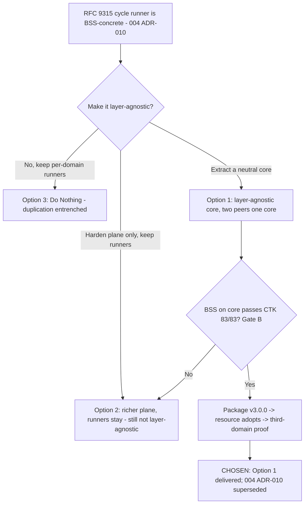

# Architecture Decision Record: Extract the RFC 9315 Phase Machine into a Layer-Agnostic Core Library — Business-Intent and Resource-Intent Instantiate It as Peer Adapters

> **Template Origin**: Official | **ArcKit Version**: 5.11.0 | **Command**: `/arckit:adr`

## Document Control

| Field | Value |
|-------|-------|
| **Document ID** | ARC-005-ADR-001-v1.0 |
| **Document Type** | Architecture Decision Record |
| **Project** | ibn-core-rfc9315-core (Project 005) |
| **Classification** | PUBLIC |
| **Status** | APPROVED |
| **Version** | 1.0 |
| **Created Date** | 2026-06-14 |
| **Last Modified** | 2026-06-14 |
| **Review Date** | 2026-09-14 |
| **Owner** | Roland Pfeifer, Lead Architect (Vpnet Cloud Solutions Sdn. Bhd.) |
| **Reviewed By** | [PENDING] |
| **Approved By** | Vpnet Architecture Review Board |
| **Distribution** | Vpnet Architecture Review Board, ibn-core engineering, resource-intent-agent engineering |

> **Subject type note**: This ADR concerns the **public open core** (`vpnetconsult/ibn-core`, Apache-2.0) and is classified **PUBLIC**, consistent with `ARC-000-PRIN-v1.0` and the Project 005 roadmap. UK GDS / Technology Code of Practice references are retained for template traceability but are **not binding** on this commercial open-source subject; the binding constraint is the open-core seam (PRIN 9).
>
> **Scope & IP positioning**: TMF921 CTK (83/83) and the ODA Canvas (UC006/UC007, ODA-component packaging) are properties of the **instantiated business-intent-agent**, not of this RFC 9315 core — the core is domain-neutral, never CTK-tested, and not an ODA component (its standards fidelity is to **RFC 9315 / D-1…D-4**). The business-intent-agent and its TMF921/CTK/ODA conformance are themselves **public open-core** (Apache-2.0): implementing TM Forum's *open* standards is **not** owning TM Forum IP. Vpnet claims **no ownership of TM Forum or IETF standards**; the only original contribution is the **demonstration that the business-intent and resource-intent agents are derivable from one common source — a single layer-agnostic RFC 9315 core** ("two peers, one core"). Only **operator-specific adapters and credentials** (CAMARA; vendor-embedded resource logic per 004 ADR-006) are private. "CTK-parity (Gate B)" is a regression check on the (public) business-agent instantiation, not a test of the core.

## Revision History

| Version | Date | Author | Changes | Approved By | Approval Date |
|---------|------|--------|---------|-------------|---------------|
| 1.0 | 2026-06-14 | ArcKit AI | Initial creation from `/arckit:adr` command — the Phase-0 keystone decision of `ARC-005-ROAD-v1.0` (Gate A) | [PENDING] | [PENDING] |
| 1.0 | 2026-06-14 | Roland Pfeifer | Status **Proposed → APPROVED** by the Vpnet ARB (Gate A), informed by a **simulated RFC 9315 author-persona standards review** (Appendix D — advisory, AI-generated, not a real endorsement). Approved with 4 conditions carried as Phase-0/1 follow-ups. | Vpnet ARB | 2026-06-14 |
| 1.0 | 2026-06-14 | Roland Pfeifer | Clarified **CTK/ODA scope** (post-approval, non-substantive): TMF921 CTK and the ODA Canvas apply to the **instantiated business-agent only**; the **core's** PRIN-3 conformance is **RFC 9315 fidelity**. No change to the decision. | Vpnet ARB | 2026-06-14 |

## 1. Decision Title

**Extract the RFC 9315 Phase Machine into a Layer-Agnostic Core Library — Both Business-Intent and Resource-Intent Instantiate It as Peer Adapters**

This ADR records the keystone decision of Project 005 (the "to-be" ibn-core): lift the RFC 9315 intent-handling cycle out of its current **BSS-concrete** runner into a **domain-neutral core library** with a ports-and-adapters seam, so every intent domain *instantiates* the same core rather than *re-implementing* the phase pattern. It is **Gate A / Phase 0** of `ARC-005-ROAD-v1.0`.

> **Scope note**: This is the *decision to extract* and the *target seam shape* — it does not itself perform the migration. The phased delivery (extract → package → resource adopts → third-domain proof → harden) is the roadmap. The resource-side adoption will be recorded by a future `resource-intent-agent` ADR superseding `ARC-004-ADR-010`.

---

## 2. Stakeholders

### 2.1 Deciders (RACI: Accountable)

- **Vpnet Architecture Review Board** — accountable for the public open-core architecture, the reuse surface, and the open-core seam (PRIN 9). This is a breaking change to the public framework (v3.0.0) and a programme-wide standard.
- **Roland Pfeifer (Lead Architect / CTO)** — design authority for ibn-core.

### 2.2 Consulted (RACI: Consulted)

- **ibn-core engineering** — owns the phase machine; performs the behaviour-preserving BSS extraction and must hold TMF921 CTK 83/83.
- **resource-intent-agent engineering** — first non-BSS consumer; consumes the core in Phase 3 and retires its bespoke `ResourceDomainCycleFactory`.
- **Security Architect** — owner of the `SafetyGovernor` (004 ADR-011), which becomes a core cross-cut in Phase 5.

### 2.3 Informed (RACI: Informed)

- Future-domain teams (service/slice, RFC 9543) — the eventual third consumer that proves layer-agnosticism.
- Open-source consumers of the public ibn-core library (affected by the v3.0.0 surface change).

### 2.4 UK Government Escalation Context

> **Framing note**: ArcKit's escalation ladder is UK-Government-derived. ibn-core is a commercial open-source subject; the level below maps to its nearest commercial-governance analogue (the Vpnet ARB), not a UK department.

**Decision Level**: **Department** (commercial analogue: programme-wide architecture/standards decision)

**Escalation Rationale**:

- [ ] **Team**: Local implementation choice (frameworks, libraries, testing)
- [ ] **Cross-team**: Integration patterns, shared services, API standards
- [x] **Department**: *Re-architects the public open core, breaks the reuse surface (v3.0.0), and sets the runner standard that every intent domain (BSS, resource, future) must follow. It touches the open-core seam (PRIN 9) and the academically-cited public framework — a programme-wide decision, not a per-PR choice.*
- [ ] **Cross-government**: N/A

**Governance Forum**: Vpnet Architecture Review Board.

**Approval Date**: 2026-06-14 (Status: APPROVED — approved with conditions; see Appendix D)

---

## 3. Context and Problem Statement

### 3.1 Problem Description

ibn-core implements the RFC 9315 intent-handling cycle, but the **cycle runner is welded to the business/BSS domain** (TMF921 translation, MCP orchestration, the Redis intent SSoT, the Claude client). When `resource-intent-agent` needed the same cycle for the network-resource domain, it could not instantiate the runner — `ARC-004-ADR-010` established that the runner is **BSS-concrete, not layer-agnostic**, so resource reused only the IMF coordination plane and **re-implemented** the RFC 9315 phase pattern as a domain-specific runner (`ResourceDomainCycleFactory`).

The result is **two implementations of the same phase pattern** that will drift, and a future cost: every new intent domain must re-pay the runner cost. The phase *sequencing/state machine* is generic; only the phase *bodies* are domain-specific. The coupling is therefore accidental, not essential.

**Problem statement as a question**: Should ibn-core extract the RFC 9315 phase machine into a layer-agnostic core that all domains instantiate, continue with a per-domain runner per the ADR-010 status quo, or take a middle path?

### 3.2 Why This Decision Is Needed

It is the keystone of the Project 005 "to-be": every later phase (package → resource adopts → third-domain proof → harden) depends on this decision and the port-contract shape it fixes. Deferring it freezes the duplication and grows the per-domain tax.

- **Business context**: the open-core commercial model is sold on reuse leverage; a phase machine re-built per domain undercuts it. (No `ARC-005-REQ` yet — see §9.1.)
- **Technical context**: removing accidental BSS coupling; defining `PhaseStrategy` ports; fixing the downstream entry-point friction (D6 under-exported phase enums; D4 forced `@anthropic-ai/sdk` footprint).
- **Regulatory/standards context**: the **core's** standards conformance is **RFC 9315 fidelity** (D-1…D-4); separately, the BSS extraction must not regress the **business-agent's** TMF921 v5 CTK 83/83 (a property of that agent, not the core). Keep the open-core seam clean (PRIN 9). UK GDS/TCoP **not binding** (commercial).

### 3.3 Supporting Links

- **Roadmap**: `ARC-005-ROAD-v1.0` — this ADR is its Phase-0 / Gate A.
- **As-is constraint**: `resource-intent-agent` `ARC-004-ADR-010` (runner is BSS-concrete) and `ARC-004-REQ` v1.3 FR-014 (domain-specific runner).
- **Safety**: `resource-intent-agent` `ARC-004-ADR-011` (SafetyGovernor) — becomes a core cross-cut (Phase 5).
- **Principles**: `projects/000-global/ARC-000-PRIN-v1.0.md`.

---

## 4. Decision Drivers (Forces)

### 4.1 Technical Drivers

- **Eliminate the duplicated phase machine**: one `IntentCycleRunner`, not a BSS runner plus a resource re-implementation. Principle: PRIN 14 (Maintainability).
- **Remove accidental coupling**: the phase sequencing is generic; BSS specifics belong in an adapter, not the runner. Principle: PRIN 10 (Loose Coupling).
- **Clean public port surface**: `PhaseStrategy` ports + exported phase enums (fix D6); slim entry so consumers don't drag the LLM SDK (fix D4). Principle: PRIN 9 (Open-Core Seam).
- **Observability & safety as core concerns**: phase-tagged telemetry and the `SafetyGovernor.admit()` hook inherited by every domain, not re-built per domain. Principles: PRIN 5 (Observability), and 004 ADR-011.
- **Conformance preservation**: the BSS extraction must not regress TMF921 CTK 83/83. Principle: PRIN 3 (Standards Conformance).

### 4.2 Business Drivers

- **Reuse leverage of the open core**: cut the cost of a new domain from "re-implement the runner" to "supply an adapter set" — the core value of the open-core model.
- **Drift-defect avoidance**: two runners diverging is a latent, recurring cost; one runner removes it.
- **Payback at the third domain**: two consumers justify extraction; the third is where the library starts saving.

### 4.3 Regulatory & Compliance Drivers

- **Open-core licensing (binding)**: the core stays public Apache-2.0; vendor/operator-specific adapters stay private (PRIN 9). GPL prohibited in public-core deps.
- **Standards conformance (binding)**: the core retains **RFC 9315** phase semantics/fidelity (D-1…D-4); the **business-agent's** **TMF921 v5 CTK 83/83** must not regress at re-instantiation (the agent's property, not the core's).
- **Immutable cited tags (binding)**: v1.4.x–v2.1.0 tags are academically cited; this ships as a new major (v3.0.0), never a tag rewrite.
- **UK GDS / TCoP**: **not binding** — comparator only (TCoP "Point 8: Reuse" is satisfied in spirit).

### 4.4 Alignment to Architecture Principles (ARC-000-PRIN v1.0)

| Principle | Alignment | Impact |
|-----------|-----------|--------|
| 9. Open-Core / Proprietary Seam Integrity (NON-NEGOTIABLE) | ✅ Supports | Turns the public surface into a clean port set; domain/vendor adapters stay private |
| 10. Loose Coupling | ✅ Supports | Ports-and-adapters seam replaces the welded BSS runner; "no domain imports in core" rule |
| 14. Maintainability & Evolvability | ✅ Supports | One conformance-tested phase machine; new domains via adapters |
| 5. Observability | ✅ Supports | Phase-tagged telemetry becomes a core concern inherited by all domains |
| 3. Standards Conformance (NON-NEGOTIABLE) | ✅ Supports (core) / ⚠️ Conditional (business-agent) | Core conformance = **RFC 9315 fidelity** (D-1…D-4). Separately, the BSS **business-agent** must not regress **TMF921 CTK 83/83** — guarded by Gate B (a check on that agent, not the core) |

No principle is violated. The core honours PRIN 3 via **RFC 9315 fidelity**; the **business-agent's** CTK conformance is protected by the Gate B parity check (CTK is not a core obligation).

---

## 5. Considered Options

**Three options analysed plus a "Do Nothing" baseline.** Costs are indicative engineering estimates (USD), consistent with `ARC-005-ROAD-v1.0`.

### Option 1 (RECOMMENDED): Extract a layer-agnostic RFC 9315 core; both domains instantiate it

**Description**: Lift the phase state machine into a domain-neutral `IntentCycleRunner` exposing a `PhaseStrategy` port per RFC 9315 phase, the phase/priority enums, a `SafetyGovernor.admit()` cross-cut hook, phase-tagged telemetry, and the IMF coordination plane. **Business-intent and resource-intent both instantiate the same runner** as peer adapters. Enforce a "no domain imports in core" dependency rule. Ship as ibn-core v3.0.0.

**Implementation approach**: per the roadmap — extract core (BSS re-expressed as the first adapter set, CTK-parity gate) → package (slim entry, export enums) → resource adopts (supersede 004 ADR-010) → third-domain proof → harden (SafetyGovernor as core cross-cut, GA).

**Wardley Evolution Stage**: Custom-Built → **Product** (the runner becomes a packaged, versioned library consumed by all domains, alongside the already-Product-ish coordination plane).

#### Good (Pros)

- ✅ **One phase machine** — removes the BSS/resource duplication and its drift risk (PRIN 14).
- ✅ **Cheap new domains** — a domain = an adapter set; the per-domain runner tax is paid once, in the core.
- ✅ **Dogfooded layer-agnosticism** — BSS itself runs on the core, so the abstraction is proven, not asserted; the third domain confirms it.
- ✅ **Clean public seam** — port surface + exported enums + slim entry (fixes D4/D6); strengthens PRIN 9.
- ✅ **Safety & observability inherited** — every domain gets the blast-radius gate and phase-tagged traces from the core.

#### Bad (Cons)

- ❌ **Largest upfront cost & risk** — the BSS extraction is the load-bearing, highest-risk work; must hold CTK 83/83.
- ❌ **Breaking change (v3.0.0)** — consumers must migrate; needs a migration guide and beta.
- ❌ **Abstraction risk** — a core that secretly encodes BSS+resource assumptions; mitigated by the no-domain-imports rule and the Phase-4 third-domain proof.

#### Cost Analysis

- **CAPEX**: ~USD 250k (~50 engineer-weeks build across Phases 0–5).
- **OPEX**: ~USD 25k/programme (CI, release, docs upkeep); thereafter low.
- **TCO (≈2-year)**: ~USD 275k; **negative marginal cost per future domain** (adapter-only).

#### GDS / Reuse Impact

| Point | Impact | Notes |
|-------|--------|-------|
| 8. Reuse | Positive | The phase machine becomes a genuine reusable asset. (GDS not binding — comparator.) |
| 4. Open standards | Positive | RFC 9315 / TMF921 semantics preserved in a clean port surface. |

---

### Option 2: Richer coordination plane, but keep domain-specific runners

**Description**: Don't extract the runner. Instead, invest in making the **IMF coordination plane** richer/more reusable (more shared helpers, better-typed `KnowledgeStore`/ConflictArbiter/etc.), while each domain keeps re-implementing the RFC 9315 phase pattern in its own runner (the ADR-010 pattern, but with more shared scaffolding around it).

**Wardley Evolution Stage**: Custom-Built (the runner stays bespoke per domain; only the plane around it matures).

#### Good (Pros)

- ✅ **Lower upfront cost / lower risk** — no breaking change; BSS untouched; no CTK-parity exposure.
- ✅ **Incremental** — improves what 004 already does without a v3.0.0.

#### Bad (Cons)

- ❌ **Duplication persists** — two (then three) runner implementations still drift; the core problem is unsolved.
- ❌ **Per-domain tax remains** — every new domain re-implements the phase machine.
- ❌ **Not layer-agnostic** — fails the project's stated goal; BSS is still the privileged "owner" of the runner.
- ❌ **Telemetry/safety still per-domain** — no single place to enforce the gate or phase-tag traces.

#### Cost Analysis

- **CAPEX**: ~USD 60–90k (coordination-plane hardening).
- **OPEX**: recurring per-domain runner cost continues.
- **TCO (≈2-year)**: lower nominal, but **unbounded tail** — each domain re-pays; drift-defect cost unpriced.

#### GDS / Reuse Impact

| Point | Impact | Notes |
|-------|--------|-------|
| 8. Reuse | Partial | Plane reused; the phase machine is not. |

---

### Option 3: Do Nothing (Baseline) — keep per-domain runners as-is

**Description**: Leave the ADR-010 status quo: BSS keeps its concrete runner; resource keeps `ResourceDomainCycleFactory`; future domains each build their own.

#### Good

- ✅ **No cost, no risk now** — nothing to extract, package, or migrate.
- ✅ **No breaking change** — public surface unchanged.

#### Bad

- ❌ **Duplication entrenched** — two runners diverge; bug fixes must be applied twice.
- ❌ **Per-domain tax compounds** — the third domain re-implements the phase machine again.
- ❌ **Goal abandoned** — the "to-be" (layer-agnostic core) never arrives; Project 005's thesis is dropped.
- ❌ **Safety/telemetry fragmentation** — the SafetyGovernor and phase-tagging stay siloed per domain.

---

## 6. Decision Outcome

### 6.1 Chosen Option

**"Option 1: Extract a layer-agnostic RFC 9315 core; both business-intent and resource-intent instantiate it as peer adapters."**

### 6.2 Y-Statement (Structured Justification)

> **In the context of** an ibn-core where the RFC 9315 cycle runner is BSS-concrete and the resource domain has already had to re-implement the phase pattern (004 ADR-010), with more domains expected,
> **facing** entrenched duplication of the phase machine, a per-domain re-implementation tax, and fragmented safety/telemetry — against the open-core promise of reuse leverage,
> **we decided for** extracting the phase machine into a layer-agnostic core library (ports-and-adapters) that both BSS and resource instantiate as peer adapters,
> **to achieve** a single conformance-tested phase machine, adapter-only onboarding for new domains, a clean public seam, and inherited safety/observability,
> **accepting** the largest upfront cost and risk (the BSS extraction), a breaking change (v3.0.0) requiring a migration, and the abstraction risk — mitigated by a CTK-parity gate, a no-domain-imports rule, and a third-domain proof.

### 6.3 Justification (Why This Option?)

**Key reasons**:

1. **It solves the actual problem.** Options 2 and 3 leave two (then three) runner implementations to drift; only Option 1 yields one phase machine.
2. **The precondition is already met.** Extraction is justified by *two real consumers* (BSS + resource), not speculation — and the Phase-4 third domain is built in to *prove* the abstraction rather than assume it.
3. **It honours the project thesis and the principles** — "two peers, one core" directly serves PRIN 9 (clean seam), 10 (loose coupling), and 14 (maintainability); the dogfooding (BSS on the core) is what makes "layer-agnostic" true rather than claimed.
4. **The dominant risk is bounded.** The one serious exposure — regressing BSS — is gated by CTK 83/83 parity (Gate B), and the breaking change is managed with semver + a migration guide + a beta.

**Why not Option 2?** It is the tempting middle path, but it *preserves* the duplication and the per-domain tax while still not being layer-agnostic — it spends money without reaching the goal. It is, in effect, "ADR-010 forever."

**Why not Do Nothing?** It entrenches the duplication and abandons Project 005's purpose; the per-domain tax compounds at the third domain.

**Stakeholder consensus**: aligns the Lead Architect (reuse leverage, seam), ibn-core engineering (one machine to maintain), and resource engineering (retire the bespoke runner). Security Architect consulted on the Phase-5 SafetyGovernor move. No dissent at proposal stage.

**Risk appetite**: Medium. The accepted upfront cost and breaking change are justified by removing a compounding, recurring cost and a drift-defect class; the alternatives carry either an unbounded duplication tail (2, Do Nothing) or fail the goal outright.

---

## 7. Consequences

### 7.1 Positive Consequences

- ✅ **One RFC 9315 phase machine** — single place for lifecycle fixes, phase-tagged telemetry, and the safety gate.
- ✅ **Adapter-only new domains** — onboarding cost collapses from "re-implement runner" to "supply adapters + docs."
- ✅ **Proven layer-agnosticism** — BSS + resource + a third domain on the unmodified core.
- ✅ **Clean public seam** — port surface, exported enums, slim entry (D4/D6 closed).

**Measurable outcomes**:

- Runner implementations: 2 → **1**.
- Domains on the shared core: 0 → **3** (BSS, resource, third).
- TMF921 CTK: **83/83 maintained** through extraction.
- Forced LLM-SDK dependency on consumers: yes → **no**.

### 7.2 Negative Consequences (Accepted Trade-offs)

- ❌ **Highest-risk phase is the BSS extraction** — behaviour drift would regress CTK.
- ❌ **Breaking change (v3.0.0)** — consumer migration required.
- ❌ **Abstraction risk** — a core that doesn't truly generalize.

**Mitigation strategies**:

- **CTK-parity gate (Gate B)** blocks packaging until BSS-on-core passes 83/83; no feature work mixed into the extraction.
- **Semver v3.0.0 + migration guide + beta**; cited tags immutable.
- **"No domain imports in core" dependency rule**; the Phase-4 third domain is the proof, not an assumption.

### 7.3 Neutral Consequences (Changes Needed)

- 🔄 **ibn-core packaging** — new core entry, exported enums, slimmed transitive deps.
- 🔄 **resource-intent-agent** — Phase-3 refactor onto the core; a new 004 ADR supersedes ADR-010.
- 🔄 **Safety ownership** — `SafetyGovernor` becomes a core cross-cut in Phase 5 (Security Architect).
- 🔄 **Docs** — onboarding guide + reference adapter.

### 7.4 Risks and Mitigations

| Risk | Likelihood | Impact | Mitigation | Owner |
|------|------------|--------|------------|-------|
| BSS behaviour drift regresses CTK 83/83 | M | H | Behaviour-preserving refactor; Gate B parity check; no feature work in extraction | ibn-core Lead |
| Premature/leaky abstraction (core not truly generic) | M | H | No-domain-imports rule; third-domain proof (Gate D) is the test | Lead Architect |
| Breaking change strands consumers | M | M | Semver v3.0.0; migration guide; beta before GA; immutable cited tags | ibn-core Lead |
| Safety regression when relocating the cycle | L | H | Keep SafetyGovernor per 004 ADR-011 until Phase 5; move only once core is stable | Security Architect |
| No genuine third domain available to prove generality | M | M | Identify service/slice domain in Phase 0; synthetic reference domain as fallback | Lead Architect |

**Link to risk register**: no `ARC-005-RISK` yet — run `/arckit:risk`; migrate these rows (they mirror the roadmap R-001…R-005).

---

## 8. Validation & Compliance

### 8.1 How Will Implementation Be Verified?

**Design review**:

- [ ] Port contracts (`PhaseStrategy` per RFC 9315 phase) reviewed against **both** BSS and resource adapter sets (Phase 0).
- [ ] Core package exposes runner + ports + coordination plane + enums; no domain imports.

**Code review**:

- [ ] PR checklist enforces "no domain (BSS/resource) imports in core."
- [ ] BSS re-expressed as an adapter set with no semantic change.

**Testing strategy**:

- [ ] **TMF921 CTK 83/83** re-verified with BSS on the core (Gate B).
- [ ] Resource loop + `SafetyGovernor.admit` green on the core (Phase 3).
- [ ] Domain-agnostic phase-machine conformance suite passes for 3 domains (Gate D).

### 8.2 Monitoring & Observability

**Success metrics**: runner implementations (target 1); domains on the core (target 3); CTK 83/83 maintained; LLM-SDK no longer forced on consumers; phase enums exported.

**Alerts/dashboards**: CI gate on "domain imports in core" (must be 0); CTK conformance status per release.

### 8.3 Compliance Verification

- **Open-core seam (PRIN 9)**: core public Apache-2.0; vendor/operator adapters private — verified at packaging.
- **Standards conformance (PRIN 3)**: CTK 83/83 parity gate; RFC 9315 phase semantics preserved.
- **Licensing**: no GPL in public-core deps; `@anthropic-ai/sdk` made optional (not forced).
- **GDS / TCoP**: not binding (comparator); TCoP Point 8 (Reuse) satisfied in spirit.
- **Data protection**: no PII introduced by this structural change — no DPIA impact.

---

## 9. Links to Supporting Documents

### 9.1 Requirements Traceability

No `ARC-005-REQ` exists yet (**pending** — run `/arckit:requirements`). This decision currently traces to the global principles and the 005 roadmap, plus the consumer requirement it satisfies: `resource-intent-agent` `ARC-004-REQ` v1.3 **FR-014** (domain-specific runner — to be retired onto the core). Revalidate once `ARC-005-REQ` exists (expected requirements: port contracts, no-domain-imports rule, CTK-parity guardrail, slim-entry NFR).

### 9.2 Architecture Artifacts

- **Principles**: `projects/000-global/ARC-000-PRIN-v1.0.md` — 9, 10, 14, 5; conditionally 3.
- **Roadmap**: `projects/005-ibn-core-rfc9315-core/ARC-005-ROAD-v1.0.md` — this ADR is its Phase-0 / Gate A.
- **Project charter**: `projects/005-ibn-core-rfc9315-core/README.md` — "two peers, one core" thesis.
- **Stakeholder drivers**: no `ARC-005-STKE` yet — run `/arckit:stakeholders`.
- **Risk register**: no `ARC-005-RISK` yet — run `/arckit:risk`.
- **Wardley map**: no `ARC-005-WARD` yet — runner moves Custom → Product.

### 9.3 Design Documents

- HLD/DLD for the core: to be produced during Phase 1 (the port-contract spec is the Phase-0 deliverable).

### 9.4 External References

- IETF RFC 9315 (Intent-Based Networking; DOI 10.17487/RFC9315) — the phase model being made layer-agnostic.
- TM Forum TMF921 v5 Intent Management API / CTK — the BSS conformance guardrail.
- `resource-intent-agent` `ARC-004-ADR-010` (runner is BSS-concrete), `ARC-004-ADR-011` (SafetyGovernor), `ARC-004-REQ` v1.3 — the consumer context.

---

## 10. Implementation Plan

### 10.1 Dependencies

- **Prerequisite**: ARB approval of this ADR (Gate A).
- **Infrastructure**: ibn-core public repo + release pipeline; resource-intent-agent engineering availability for Phase 3.
- **Team**: 1–2 core engineers; BSS SME (extraction); resource + third-domain SMEs (adoption/proof).

### 10.2 Implementation Timeline

(Per `ARC-005-ROAD-v1.0`.)

| Phase | Activities | Duration | Owner |
|-------|-----------|----------|-------|
| 0 — Decide | This ADR + port-contract spec | CY2026 Q3 | Lead Architect |
| 1 — Extract core | Domain-neutral runner; BSS adapter set; CTK-parity gate | CY2026 Q3–CY2027 Q1 | ibn-core Lead |
| 2 — Package | Slim entry, export enums, v3.0.0-beta | CY2027 Q1 | ibn-core Lead |
| 3 — Resource adopts | Refactor onto core; supersede 004 ADR-010 | CY2027 Q2 | resource eng |
| 4 — Third-domain proof | Service/slice on core; conformance suite | CY2027 Q3 | Lead Architect |
| 5 — Harden | SafetyGovernor cross-cut; telemetry; v3.0.0 GA | CY2027 Q4 | Security Architect |

### 10.3 Rollback Plan

- **Trigger**: BSS-on-core cannot hold CTK 83/83, or the abstraction proves leaky at the third domain.
- **Procedure**: keep the legacy BSS runner behind a feature flag during cutover; if extraction fails, **fall back to Option 2** (retain per-domain runners, harden the coordination plane only) — the no-fork rule still holds. Never roll forward to GA without Gate B and Gate D green.
- **Owner**: ibn-core Lead (with ARB sign-off).

---

## 11. Review and Updates

### 11.1 Review Schedule

- **Initial review**: 2026-09-14 (end of Phase 0, at Gate A outcome).
- **Periodic**: at each roadmap gate (B, C, D) and quarterly.

### 11.2 Trigger Events for Review

- [ ] Gate B (CTK-parity) fails or is at risk.
- [ ] Third-domain proof (Gate D) reveals the core is not genuinely layer-agnostic.
- [ ] A change to the open-core seam policy (PRIN 9) or the cited-tag policy.
- [ ] resource-intent-agent declines/defers adoption (changes the two-consumer premise).

---

## 12. Related Decisions

### 12.1 Decisions This ADR Depends On

- None upstream in Project 005 (this is ADR-001). It consumes the as-is established by `resource-intent-agent` `ARC-004-ADR-010`.

### 12.2 Decisions That Depend On This ADR

- A future `resource-intent-agent` ADR superseding `ARC-004-ADR-010` (Phase 3, when resource adopts the core).
- A Phase-5 decision (or this ADR's extension) relocating the `SafetyGovernor` (004 ADR-011) into the core.
- Project 005 requirements/risk artifacts.

### 12.3 Conflicting Decisions

- **`ARC-004-ADR-010`** — *not* a conflict but the **as-is** this supersedes-in-effect once delivered. ADR-010 remains correct for today (the runner *is* BSS-concrete); it is superseded only when the core actually ships layer-agnostic and resource adopts it.

---

## 13. Appendices

### Appendix A: Options Analysis Summary

| Criterion | Opt 1: Extract layer-agnostic core | Opt 2: Richer plane, keep runners | Opt 3: Do Nothing |
|-----------|-----------------------------------|-----------------------------------|-------------------|
| One phase machine (no drift) | ✅ | ❌ | ❌ |
| Adapter-only new domains | ✅ | ❌ | ❌ |
| Layer-agnostic (goal met) | ✅ | ❌ | ❌ |
| Upfront cost / risk | High | Medium | None |
| Breaking change | Yes (v3.0.0) | No | No |
| Safety/telemetry inherited | ✅ | ❌ | ❌ |
| TCO tail (per future domain) | Low (adapter only) | Unbounded | Unbounded |

### Appendix B: Stakeholder Consultation Log

| Date | Stakeholder | Feedback | Action Taken |
|------|-------------|----------|--------------|
| 2026-06-14 | (Proposal stage) | Drafted from the 005 roadmap + thesis and the 004 as-is; no consultation-log entries yet | Pending ARB review (Gate A) |

### Appendix C: Decision Flow

### Appendix D: Standards Review — RFC 9315 Author Persona (Simulated, Advisory)

> **Integrity label**: This is an **AI-generated expert-persona review** that reasons from the standpoint of an RFC 9315 author (the RFC's authors are A. Clemm, L. Ciavaglia, L. Granville, J. Tantsura). It is an **advisory stress-test**, **not** a statement, review, or endorsement by Alexander Clemm or any real person. It informs — it does not constitute — the Vpnet ARB approval.

**Lens**: faithfulness of this decision to RFC 9315 *Intent-Based Networking — Concepts and Definitions* (intent as declarative, outcome-oriented goals; the distinction between intent, policy, and configuration; intent fulfilment and intent assurance as a continuous closed loop; intent existing and being refined across abstraction layers).

**Assessment against the decision's core claims**:

1. **"Layer-agnostic core" vs RFC 9315 layering** — *Sound, and well-aligned.* RFC 9315 treats intent as recurring across abstraction layers, with higher-layer intent **refined/decomposed** into lower-layer intent. A single cycle machine instantiated per layer (the *cycle* recurs; the *content* differs) is a faithful reading — provided business→resource is modelled as genuine **hierarchical intent refinement**, not merely shared code.
2. **Phase decomposition vs §5** — *Acceptable, with a caution.* The translate/resolve/orchestrate steps map to intent **fulfilment**; monitor/assess map to intent **assurance**. The risk is presenting the cycle as a linear pipeline ending in "act," which would understate that **assurance is continuous and feeds back** — the defining property of IBN over one-shot orchestration.
3. **Terminology fidelity** — *Good intent, watch the port names.* The programme already guards against non-WG vocabulary (CLAUDE.md). Keep that discipline at the new public port boundary.

**Conditions of approval** (carried as Phase-0/1 follow-ups):

- **D-1** — Keep **intent assurance first-class and continuous** in the core: monitor/assess must feed back into the loop, not terminate at "act." The closed loop (and room for recognition/learning over time) is the IBN differentiator.
- **D-2** — Name the `PhaseStrategy` ports for **RFC 9315 functions** (intent fulfilment / intent assurance), and map each port to its RFC 9315 §5 sub-section in the port-contract spec — not to domain or vendor terms.
- **D-3** — Model business→resource via the `IntentHierarchy` as **intent refinement/decomposition** (RFC 9315 recursion), so "two peers, one core" reflects a real intent hierarchy, not just code reuse.
- **D-4** — Keep the core **declarative and outcome-oriented**; the phase machine must not harden into an imperative pipeline that loses intent's declarative nature.

**Verdict (persona, advisory)**: **Approve with conditions.** The extraction is faithful to RFC 9315 and arguably *more* faithful than the status quo (it makes the recurring intent cycle explicit and shared). Conditions D-1…D-4 protect the declarative, continuously-assured, layered character of intent as the core is built.

---

## Document Approval

| Role | Name | Signature | Date |
|------|------|-----------|------|
| **Technical Architect** | Roland Pfeifer | | [PENDING] |
| **Senior Responsible Owner** | Roland Pfeifer (Lead Architect / CTO) | ✓ | 2026-06-14 |
| **Governance Board** | Vpnet Architecture Review Board | ✓ | 2026-06-14 |
| **Standards Review (simulated — RFC 9315 author persona)** | AI-generated advisory (Appendix D) — *not* a real endorsement | ✓ advisory | 2026-06-14 |

---

*This ADR follows the MADR v4.0 format enhanced with UK Government requirements and ArcKit governance standards. UK GDS / TCoP references are retained for template traceability but are NOT binding on this commercial open-source subject; the binding constraints are the open-core seam (PRIN 9) and RFC 9315 fidelity (PRIN 3). TMF921 CTK and the ODA Canvas are properties of the instantiated business-agent, not the core.*

## External References

> This section provides traceability from generated content back to source material.

### Document Register

| Doc ID | Filename | Type | Source Location | Description |
|--------|----------|------|-----------------|-------------|
| PRIN | ARC-000-PRIN-v1.0.md | Principles | projects/000-global/ | Open-core seam, loose coupling, maintainability, observability, standards conformance |
| ROAD | ARC-005-ROAD-v1.0.md | Roadmap | projects/005-ibn-core-rfc9315-core/ | Phased extraction plan; this ADR is its Phase-0 / Gate A |
| RM005 | README.md | Project charter | projects/005-ibn-core-rfc9315-core/ | "Two peers, one core" thesis |
| ADR010 | ARC-004-ADR-010-v1.0.md | ADR (external repo) | resource-intent-agent/…/decisions/ | As-is: runner is BSS-concrete, not layer-agnostic |
| ADR011 | ARC-004-ADR-011-v1.0.md | ADR (external repo) | resource-intent-agent/…/decisions/ | SafetyGovernor — becomes a core cross-cut in Phase 5 |
| REQ004 | ARC-004-REQ-v1.0.md (content v1.3) | Requirements (external repo) | resource-intent-agent/…/ | FR-014 domain-specific runner — the consumer requirement |

### Citations

| Citation ID | Doc ID | Section | Category | Quoted/Paraphrased Passage |
|-------------|--------|---------|----------|----------------------------|
| [PRIN-C1] | PRIN | Principle 9 / 10 | Design Decision | Open-core seam as a clean published interface; integrate via published interfaces, not shared internals |
| [ROAD-C1] | ROAD | Executive Summary / Gates | Design Decision | Extract the RFC 9315 phase machine into a layer-agnostic core; both BSS and resource instantiate it; gated by CTK-parity and third-domain proof |
| [ADR010-C1] | ADR010 | Title / Decision | Design Decision | The ibn-core runner is BSS-concrete; reuse = IMF coordination plane + RFC 9315 phase pattern with a domain-specific runner |

### Unreferenced Documents

| Filename | Source Location | Reason |
|----------|-----------------|--------|
| — | — | — |

---

**Generated by**: ArcKit `/arckit:adr` command
**Generated on**: 2026-06-14 GMT
**ArcKit Version**: 5.11.0
**Project**: ibn-core-rfc9315-core (Project 005)
**AI Model**: claude-opus-4-8 (1M context)
**Generation Context**: The Phase-0 keystone decision of ARC-005-ROAD-v1.0. Grounded in ARC-000-PRIN-v1.0 (principles), the Project 005 README thesis and roadmap, and the as-is constraint from resource-intent-agent (ARC-004-ADR-010/011, ARC-004-REQ v1.3). Commercial open-source framing (PUBLIC, Apache-2.0); UK GDS/TCoP treated as non-binding comparators. No ARC-005-REQ/STKE/RISK/WARD yet — noted as gaps.

<!-- arckit-provenance:start -->

## Build Provenance

_Stamped automatically by the ArcKit plugin's `provenance-stamp.mjs` PostToolUse hook. Complements (does not replace) the human-authored footer above. Carries only fields the model can't authoritatively self-report: build context from `.arckit/state.json` and effort levels derived from command frontmatter + the silent-downgrade matrix._

| Field | Value |
|-------|-------|
| Requested Effort | `high` |
| Effective Effort | _unknown — model not parsed from existing footer_ |
| Stamped at | 2026-06-14T19:30:01.554Z |

<!-- arckit-provenance:end -->
