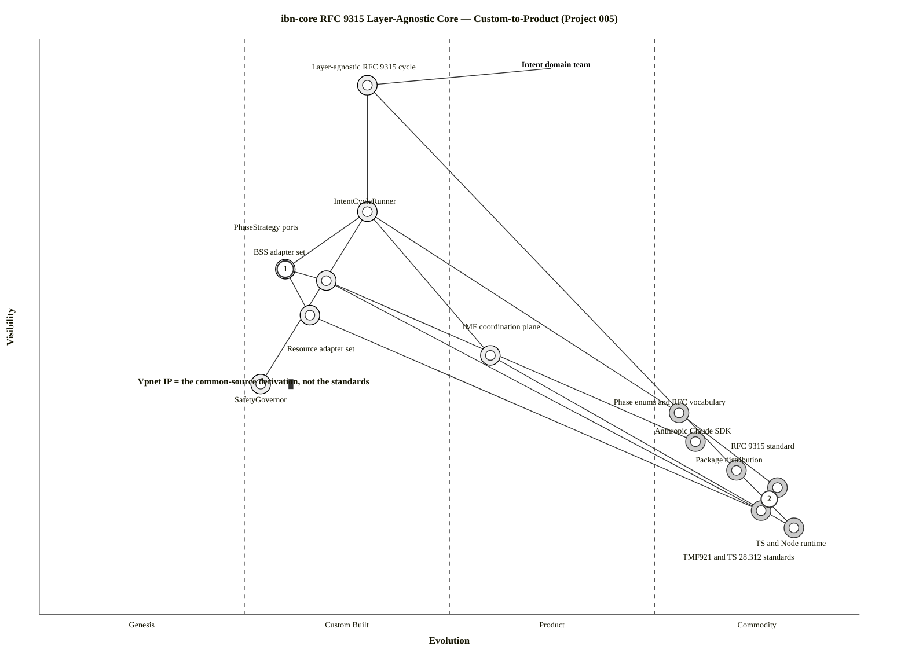
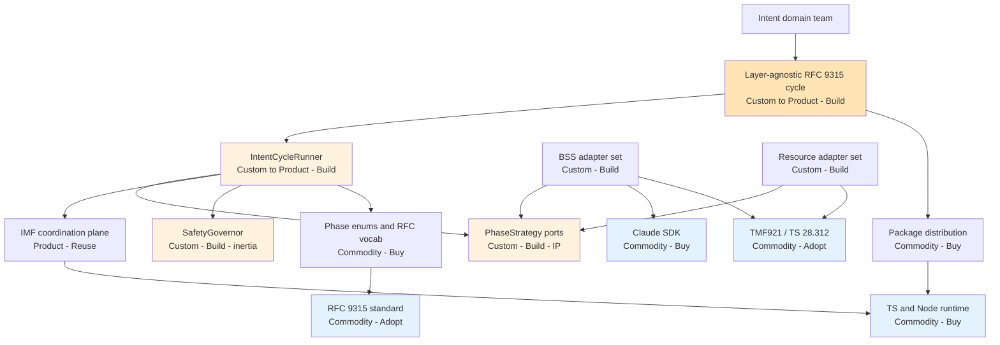

# Wardley Map: ibn-core RFC 9315 Layer-Agnostic Core — Custom→Product

> **Template Origin**: Official | **ArcKit Version**: 5.11.0 | **Command**: `/arckit:wardley`

## Document Control

| Field | Value |
|-------|-------|
| **Document ID** | ARC-005-WARD-001-v1.0 |
| **Document Type** | Wardley Map |
| **Project** | ibn-core-rfc9315-core (Project 005) |
| **Classification** | PUBLIC |
| **Status** | DRAFT |
| **Version** | 1.0 |
| **Created Date** | 2026-06-14 |
| **Last Modified** | 2026-06-14 |
| **Review Cycle** | Quarterly |
| **Review Date** | 2026-09-14 |
| **Owner** | Roland Pfeifer, Lead Architect (Vpnet Cloud Solutions Sdn. Bhd.) |
| **Reviewed By** | [PENDING] |
| **Approved By** | [PENDING] |
| **Distribution** | Vpnet Architecture Review Board, ibn-core engineering, resource-intent-agent engineering |

> **Strategic question**: should the RFC 9315 cycle runner stay Custom-built (re-implemented per domain) or be **productized** into a layer-agnostic core that domains rent? This map (Mode B — future/target state) shows the **Custom→Product** shift that is Project 005's thesis. Commercial open-source subject — UK-Gov sections (GOV.UK / Digital Marketplace / TCoP / AI Playbook) are **not applicable**.

## Revision History

| Version | Date | Author | Changes | Approved By | Approval Date |
|---------|------|--------|---------|-------------|---------------|
| 1.0 | 2026-06-14 | ArcKit AI | Initial creation from `/arckit:wardley` command | [PENDING] | [PENDING] |

---

## Map Visualization

**View this map**: Paste the code below into [https://create.wardleymaps.ai](https://create.wardleymaps.ai)

```wardley
title ibn-core RFC 9315 Layer-Agnostic Core — Custom-to-Product (Project 005)
anchor Intent domain team [0.95, 0.63]

component Layer-agnostic RFC 9315 cycle [0.92, 0.40]
component IntentCycleRunner [0.70, 0.40]
component PhaseStrategy ports [0.60, 0.30]
component IMF coordination plane [0.45, 0.55]
component BSS adapter set [0.58, 0.35]
component Resource adapter set [0.52, 0.33]
component SafetyGovernor [0.40, 0.27] inertia
component Phase enums and RFC vocabulary [0.35, 0.78]
component Anthropic Claude SDK [0.30, 0.80]
component Package distribution [0.25, 0.85]
component TS and Node runtime [0.15, 0.92]
component RFC 9315 standard [0.22, 0.90]
component TMF921 and TS 28.312 standards [0.18, 0.88]

Intent domain team -> Layer-agnostic RFC 9315 cycle
Layer-agnostic RFC 9315 cycle -> IntentCycleRunner
Layer-agnostic RFC 9315 cycle -> Package distribution
IntentCycleRunner -> PhaseStrategy ports
IntentCycleRunner -> IMF coordination plane
IntentCycleRunner -> SafetyGovernor
IntentCycleRunner -> Phase enums and RFC vocabulary
BSS adapter set -> PhaseStrategy ports
Resource adapter set -> PhaseStrategy ports
BSS adapter set -> Anthropic Claude SDK
BSS adapter set -> TMF921 and TS 28.312 standards
Resource adapter set -> TMF921 and TS 28.312 standards
Phase enums and RFC vocabulary -> RFC 9315 standard
Package distribution -> TS and Node runtime
IMF coordination plane -> TS and Node runtime

evolve IntentCycleRunner 0.62 label Extract to product (v3.0.0)
evolve Layer-agnostic RFC 9315 cycle 0.60 label Productized core
evolve PhaseStrategy ports 0.52 label Stabilise across 3 domains

annotation 1 [0.60, 0.30] Novel seam — the only original IP (ports + common-source derivation)
annotation 2 [0.20, 0.89] Open standards — adopted, NOT Vpnet-owned IP
note Vpnet IP = the common-source derivation, not the standards [0.40, 0.12]

style wardley
```

<details>
<summary>Mermaid Wardley Map (renders in GitHub, VS Code, and other Mermaid-enabled viewers)</summary>

> **Note**: `wardley-beta` is supported from Mermaid 11.14.0. The `evolve` arrows are expressed in the canonical OWM block above (the converter omits them from this view).



</details>

---

## Component Inventory

| Component | Vis | Evo | Stage | Sourcing | Strategic note |
|-----------|-----|-----|-------|----------|----------------|
| Layer-agnostic RFC 9315 cycle | 0.92 | 0.40 | Custom→Product | Build | The capability being productized (BR-001). |
| IntentCycleRunner | 0.70 | 0.40 | Custom→Product | Build | The component that moves; BSS-concrete today (ADR-010), extracted in Phase 1. |
| PhaseStrategy ports | 0.60 | 0.30 | Custom | Build | The novel seam — the original IP, with the derivation. |
| BSS adapter set | 0.58 | 0.35 | Custom | Build (public) | Business-agent domain logic; public open-core. |
| Resource adapter set | 0.52 | 0.33 | Custom | Build (private) | Resource-agent domain logic; private (operator-embedded). |
| IMF coordination plane | 0.45 | 0.55 | Product | Reuse (in-house) | Already reusable from v2.1.x (ConflictArbiter/SharedStatePlane/IntentHierarchy/SemanticToolRegistry/KnowledgeStore). |
| SafetyGovernor | 0.40 | 0.27 | Custom | Build (inertia) | Bespoke blast-radius IP (004 ADR-011); core enforcement deferred to Phase 5. |
| Phase enums & RFC vocabulary | 0.35 | 0.78 | Commodity | Buy/adopt | Standardised RFC 9315 vocabulary; export from core (FR-010). |
| Anthropic Claude SDK | 0.30 | 0.80 | Commodity | Buy | Used by the BSS adapter only; make optional in the entry (D4 / NFR-PKG-001). |
| Package distribution (git/npm) | 0.25 | 0.85 | Commodity | Buy | git-installable lib; semver v3.0.0. |
| TS & Node runtime | 0.15 | 0.92 | Commodity | Buy | Utility runtime. |
| RFC 9315 standard | 0.22 | 0.90 | Commodity | Adopt | IETF open standard — adopted, **not owned**. |
| TMF921 & TS 28.312 standards | 0.18 | 0.88 | Commodity | Adopt | TM Forum / 3GPP open standards — the adapters implement them; **not Vpnet IP**. |

---

## Mathematical Strategic Metrics

> D = visibility × (1−evolution) (differentiation pressure → **Build** when high). K = (1−visibility) × evolution (commodity leverage → **Buy** when high). Thresholds: > 0.40.

| Component | D | K | Signal | Strategy | Consistent? |
|-----------|---|---|--------|----------|-------------|
| Layer-agnostic RFC 9315 cycle | **0.55** | 0.03 | High D | Build | ✅ |
| IntentCycleRunner | **0.42** | 0.12 | High D | Build | ✅ |
| PhaseStrategy ports | **0.42** | 0.12 | High D | Build | ✅ |
| BSS adapter set | 0.38 | 0.15 | Mid D | Build (domain IP) | ✅ |
| Resource adapter set | 0.35 | 0.16 | Mid D | Build (domain IP) | ✅ |
| SafetyGovernor | 0.29 | 0.16 | Low/mid | Build (bespoke safety) | ✅ |
| IMF coordination plane | 0.20 | 0.30 | Mid K | Reuse (built) | ✅ |
| Phase enums & RFC vocabulary | 0.08 | **0.51** | High K | Buy/adopt | ✅ |
| Anthropic Claude SDK | 0.06 | **0.56** | High K | Buy | ✅ |
| Package distribution | 0.04 | **0.64** | High K | Buy | ✅ |
| TS & Node runtime | 0.01 | **0.78** | High K | Buy | ✅ |
| RFC 9315 standard | 0.02 | **0.70** | High K | Adopt | ✅ |
| TMF921 & TS 28.312 standards | 0.02 | **0.72** | High K | Adopt | ✅ |

**Validation passes**: every high-D component is Build; every high-K component is Buy/adopt. No positioning/strategy contradictions. The three high-D components (cycle, runner, ports) are exactly the "two peers, one core" IP; everything below the IMF plane is commodity Vpnet does not own — the literal expression of the scope/IP positioning.

---

## Evolution Analysis

- **Custom (0.25–0.50)** — `IntentCycleRunner` (0.40), `PhaseStrategy ports` (0.30), `BSS/Resource adapter sets` (0.35/0.33), `SafetyGovernor` (0.27). This is where the project's value and its risk concentrate. *Build* — these are differentiators.
- **Product (0.50–0.75)** — `IMF coordination plane` (0.55). Already reusable; consume as-is, don't rebuild.
- **Commodity (0.75–1.00)** — enums/vocabulary, Claude SDK, packaging, runtime, RFC 9315 / TMF921 / TS 28.312 standards. *Buy/adopt*; never build.
- **No Genesis components** — nothing here is truly novel R&D; the ports are emerging-Custom, not Genesis.

**The headline movement**: `IntentCycleRunner` and the `Layer-agnostic RFC 9315 cycle` capability move **Custom → Product** (0.40 → ~0.62) as Project 005 extracts and packages them (v3.0.0). The `PhaseStrategy ports` firm up (0.30 → ~0.52) once validated across a third domain (Gate D).

---

## Build vs Buy Analysis

**Build (the IP):** `IntentCycleRunner`, `PhaseStrategy ports`, the `Layer-agnostic RFC 9315 cycle`, the `BSS`/`Resource` adapter sets, `SafetyGovernor`. Justified by high differentiation pressure and the "two peers, one core" thesis.

**Reuse (in-house, already built):** `IMF coordination plane` — from v2.1.x; do not re-implement.

**Buy / adopt (commodity, not owned):** Claude SDK, packaging, TS/Node runtime, and the **open standards** (RFC 9315, TMF921, TS 28.312). Adopting open standards is not owning their IP — Vpnet's only original contribution is the common-source derivation.

---

## Inertia & Barriers

| Component | Inertia | Barrier | Mitigation |
|-----------|---------|---------|------------|
| SafetyGovernor | **High** | Safety-critical (NCII, 004 ADR-011); cannot be casually relocated into the core | Keep it where ADR-011 placed it; wire the core `admit()` hook only at Phase 5 (R-005). |
| BSS runner → adapter | Medium | The BSS team bears extraction risk to a conformant service for others' benefit (STKE C-1, R-003) | CTK-parity gate (B) as an enforced guarantee; pairing; behaviour-preserving move (done in Phase 1 / PR #52). |
| OSS consumers on v2.x | Medium | A v3.0.0 surface change can strand consumers (R-006) | semver + migration guide + beta; pinnable cited tags. |

---

## Movement & Predictions

| Component | Now | ~12m | Velocity | Implication |
|-----------|-----|------|----------|-------------|
| IntentCycleRunner | 0.40 | 0.62 | Fast | The extraction itself (Phases 1–2); v3.0.0. |
| Layer-agnostic cycle | 0.40 | 0.60 | Fast | Productized; domains rent not rebuild. |
| PhaseStrategy ports | 0.30 | 0.52 | Medium | Stabilise once a 3rd domain validates (Gate D). |
| Claude SDK dependence | forced | optional | — | Make optional in the entry (D4); not an evolution, a packaging fix. |

---

## Dependencies & Value Chain



**Critical path**: domain team → cycle → runner → ports. The whole value chain hinges on the runner becoming reusable and the ports being genuinely domain-neutral.

---

## Risk Analysis (dependency-risk metric R = vis(a)×(1−evo(b)))

| Dependency | R | Risk | Maps to |
|------------|---|------|---------|
| Cycle (0.92) → IntentCycleRunner (0.40) | **0.55** | The user-facing capability rests on a still-Custom runner | The rationale for Project 005 (productize it) |
| IntentCycleRunner (0.70) → PhaseStrategy ports (0.30) | **0.49** | Runner depends on a novel, unproven seam | **R-001** (leaky abstraction) → Gate D third-domain proof |
| IntentCycleRunner (0.70) → SafetyGovernor (0.27) | **0.51** | Loop depends on a bespoke safety control mid-relocation | **R-005** → defer enforcement to Phase 5 |
| BSS adapter (0.58) → Claude SDK (0.80) | 0.12 | Mature dependency | Low — make optional anyway (D4) |

The three HIGH dependency risks are precisely the ones the roadmap gates address — the map and the risk register agree.

---

## Strategic Gameplay, Doctrine & Climate (brief)

- **Gameplay — open-core platform / "ecosystem" play**: productize the cycle (the core), let domains build adapters on top. Build the differentiating seam (ports + derivation); rent everything commodity. **Anti-pattern avoided: the "legacy trap"** — keeping the BSS-concrete runner means every domain re-pays the build.
- **Climate — "everything evolves" + "co-evolution"**: the runner is *naturally* moving Custom→Product; building it bespoke per domain fights that gradient. Adapter-based domains co-evolve with the productized core. "Efficiency enables innovation" — a reusable core lowers the cost of the next domain.
- **Doctrine — "use appropriate methods / don't build what's commodity"**: the map's discipline is that Vpnet builds only the high-D seam and adopts all high-K standards/runtime; the IP claim is scoped to the derivation, nothing TM Forum/IETF owns.

---

## UK Government Context

**Not applicable** — commercial open-source subject. No GOV.UK services, Digital Marketplace procurement, TCoP, or AI-Playbook mapping. (The standards row plays the analogous "reuse, don't build" role that GOV.UK services would in a public-sector map.)

---

## Recommendations

**Immediate (0–3m)** — land the runner extraction (Phase 1, PR #52) and pass **Gate B (CTK-parity)**; make the Claude SDK optional in the entry (D4 / NFR-PKG-001).
**Short-term (3–12m)** — package v3.0.0 (Gate C); have **both** BSS and resource instantiate the core; firm up the `PhaseStrategy ports`.
**Long-term (12–24m)** — prove layer-agnosticism with a **third domain** (Gate D), retiring R-001; relocate `SafetyGovernor` into the core hook (Phase 5).

---

## Traceability

| Source | Link |
|--------|------|
| Requirements | BR-001/002/003 (one core, two peers, reuse leverage); FR-001/002 (runner, ports); NFR-PKG-001 (slim entry / Claude optional) — `ARC-005-REQ` |
| Decision | `ARC-005-ADR-001` (Custom→Product extraction; D-1…D-4) |
| Roadmap | `ARC-005-ROAD` Technology Evolution ("runner Custom→Product"); Gates A–D |
| Risk | R-001 (ports immaturity), R-005 (safety relocation), R-006 (breaking change) — `ARC-005-RISK` |
| Principles | PRIN 9 (open-core seam), 10 (loose coupling), 14 (maintainability) — `ARC-000-PRIN` |

---

## External References

### Document Register

| Doc ID | Filename | Type | Source Location | Description |
|--------|----------|------|-----------------|-------------|
| ADR005 | ARC-005-ADR-001-v1.0.md | ADR | projects/005-…/decisions/ | Custom→Product decision; D-1…D-4 |
| ROAD | ARC-005-ROAD-v1.0.md | Roadmap | projects/005-…/ | Technology evolution + gates |
| REQ | ARC-005-REQ-v1.0.md | Requirements | projects/005-…/ | BR/FR/NFR |
| RISK | ARC-005-RISK-v1.0.md | Risk Register | projects/005-…/ | R-001/005/006 |
| PRIN | ARC-000-PRIN-v1.0.md | Principles | projects/000-global/ | Seam, coupling, maintainability |

### Citations

| Citation ID | Doc ID | Section | Category | Quoted/Paraphrased |
|-------------|--------|---------|----------|---------------------|
| [ROAD-C1] | ROAD | Technology Evolution | Design Decision | "the runner moves Custom → Product (alongside the already-Product-ish coordination plane)" |
| [ADR005-C1] | ADR005 | §5 Wardley stage | Design Decision | Option 1 evolution stage: Custom-Built → Product |
| [RISK-C1] | RISK | R-001 / R-005 | Risk Factor | Leaky-abstraction and safety-relocation risks (the high dependency-risk edges) |

### Unreferenced Documents

| Filename | Source Location | Reason |
|----------|-----------------|--------|
| — | — | — |

---

**Generated by**: ArcKit `/arckit:wardley` command
**Generated on**: 2026-06-14 GMT
**ArcKit Version**: 5.11.0
**Project**: ibn-core-rfc9315-core (Project 005)
**AI Model**: claude-opus-4-8 (1M context)
**Generation Context**: Mode B (target-state) map of the Custom→Product shift for the RFC 9315 core. Grounded in ARC-005-ADR-001 (Wardley stage), ARC-005-ROAD (Technology Evolution), ARC-005-REQ/RISK, ARC-000-PRIN. Mermaid block produced by the owm-to-mermaid converter (verbatim). Commercial open-source — UK-Gov mapping N/A.
