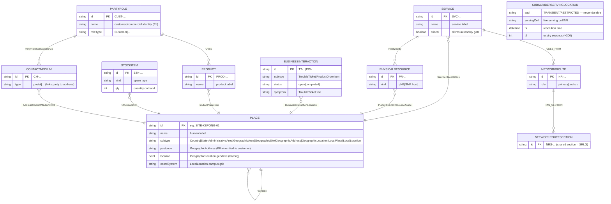

# Data Model: location-assurance-twin

> **Template Origin**: Official | **ArcKit Version**: 5.11.0 | **Command**: `/arckit:data-model`

## Document Control

| Field | Value |
|-------|-------|
| **Document ID** | ARC-006-DATA-v1.0 |
| **Document Type** | Data Model (Entity Catalogue + Governance) |
| **Project** | location-assurance-twin (Project 006) |
| **Classification** | PUBLIC |
| **Status** | DRAFT |
| **Version** | 1.0 |
| **Created Date** | 2026-06-18 |
| **Last Modified** | 2026-06-18 |
| **Review Date** | 2026-07-18 |
| **Owner** | Roland Pfeifer (Lead Architect, Vpnet Cloud Solutions Sdn. Bhd.) |
| **Reviewed By** | [PENDING] |
| **Approved By** | [PENDING] |
| **Distribution** | Project Team, Architecture Team, Data Protection Officer, Standards/Research Reviewer |

## Revision History

| Version | Date | Author | Changes | Approved By | Approval Date |
|---------|------|--------|---------|-------------|---------------|
| 1.0 | 2026-06-18 | ArcKit AI | Initial creation from `/arckit:data-model`; modelled from the L1 seed `external/location_twin_v24.cypher` + REQ DR-001..006 | [PENDING] | [PENDING] |

---

## Executive Summary

### Overview

This data model captures the **operational correlation graph (L1)** of location-assurance-twin — the live SID/GB922 v24.0 Location foundation that is the deterministic join for the closed loop (fault → place → impacted services/customers → blast radius). It is modelled directly from the build seed `external/location_twin_v24.cypher` (Neo4j 5 labelled property graph) and the data requirements DR-001…006.

Per the **mastership split** (DR-003, ADR-001): **instances** live in the L1 Neo4j LPG (this model); the **schema/ontology + intent** (RDF/OWL + SHACL) are mastered in the L2 Apache Jena Fuseki store and bridged uni-directionally by Neosemantics (n10s, INT-002). No fact is mastered twice. A deliberate **transient identity-spine** (E-011) sits outside durable mastership: live per-subscriber serving location is resolved on demand with a TTL and never persisted (DR-004, NFR-C-001, ADR-002).

Every relationship carries a `prov` provenance tag — `[SID v24]` (a named GB922 v24.0 association) or `[MODEL]` (modelling-convenience hierarchy) — satisfying DR-005 / NFR-C-003.

### Model Statistics

- **Total Entities**: 11 (E-001 … E-011), of which E-011 is **transient (non-durable)**
- **Total Relationships**: 14 typed edges (8 `[SID v24]` named associations, including the six cross-domain joints; 3 `[MODEL]` hierarchy/path; 3 other `[SID v24]` arcs)
- **Total Attributes**: ~40 across all entities
- **Data Classification**:
  - 🟢 Public: 0
  - 🟡 Internal: 6 entities (Place topology, Service, PhysicalResource, StockItem, NetworkRoute, NetworkRouteSection)
  - 🟠 Confidential: 4 entities (PartyRole/Customer, ContactMedium, GeographicAddress subtype of Place, BusinessInteraction) — contain PII / commercial identity
  - 🔴 Restricted: 1 entity (E-011 transient SubscriberServingLocation — SUPI + live location, never durable)

### Compliance Summary

- **GDPR / Malaysia PDPA Status**: NEEDS_DPIA (PII present: commercial customer identity, service address, and transient subscriber location/SUPI)
- **PII Entities**: 4 durable (Customer, ContactMedium, GeographicAddress, BusinessInteraction) + 1 transient (SubscriberServingLocation)
- **DPIA**: REQUIRED before any operator deployment (high-risk processing of location data) — recommended now, owned by DPO
- **Data Retention**: durable static service-location retained for service lifetime; **transient subscriber location TTL ≈ 300 s** (never archived)
- **Cross-Border Transfers**: none in the rig (single-region); operator deployment must honour PDPA residency

### Key Data Governance Stakeholders

- **Data Owner (Business)**: Assurance / Governance Architect (operational graph) + Standards Reviewer (model fidelity)
- **Data Steward**: Standards / Research Reviewer (provenance + GB922 v24.0 conformance)
- **Data Custodian (Technical)**: Project Team (Neo4j L1 + Fuseki L2)
- **Data Protection Officer**: Accountable for the transient boundary (E-011) and PII handling

---

## Visual Entity-Relationship Diagram (ERD)

**Diagram Notes**:

- `PLACE` is a single supertype entity in this ERD; in the LPG it is multi-label (`:Place` + a v24 subtype label). The civic pyramid (Country → State → AdministrativeArea → GeographicArea → GeographicSite) plus GeographicAddress/GeographicLocation/LocalPlace/LocalLocation are subtypes via the `subtype` discriminator.
- `SUBSCRIBERSERVINGLOCATION` (E-011) is shown **detached** — it is **transient**, resolved on demand with a TTL and **never** linked into durable master data (DR-004 / ADR-002). It is not a persisted edge of the graph.
- Cardinality: `||` exactly one, `o{` zero-or-more. The six cross-domain joints are the `…→ PLACE` edges (ServicePlaceDetails, PlacePhysicalResourceAssoc, BusinessInteractionLocation, ProductPlaceRole, StockLocation, + Party→Place indirect via ContactMedium/AddressContactMediumRole).

---

## Entity Catalog

### Entity E-001: Place (SID Location ABE supertype)

**Description**: The location foundation — the civic/geodetic Place tree and indoor LocalPlace, multi-labelled by v24 subtype. The deterministic join for all correlation/reach/dispatch queries.
**Source Requirements**: DR-001 (location foundation), DR-002 (joints attach here), DR-005 (provenance), DR-006 (OWL scope).
**Business Context**: Fault → place → impacted services/customers traversal; area-event exposure; dispatch addressing.
**Data Ownership**: Business — Assurance Architect; Technical — Project Team (Neo4j); Steward — Standards Reviewer (GB922 fidelity).
**Data Classification**: INTERNAL (topology) — except the **GeographicAddress** subtype, which is CONFIDENTIAL when bound to a customer (service address = PII).
**Volume Estimates**: rig ~10 nodes; production 10⁴–10⁶ places. **Retention**: service/asset lifetime (static); no automatic deletion.

#### Attributes

| Attribute | Type | Required | PII | Description | Validation | Source Req |
|-----------|------|----------|-----|-------------|------------|------------|
| id | String | Yes | No | Unique place id | UNIQUE constraint | DR-001 |
| name | String | No | No | Human label | — | DR-001 |
| subtype | Enum(label) | Yes | No | v24 subtype (Country…LocalLocation) | one of v24 labels | DR-001 |
| level | String | No | No | AdministrativeArea level (e.g. city) | — | DR-001 |
| kind | String | No | No | GeographicSite kind (campus/warehouse) | — | DR-001 |
| streetName, postcode, stateOrProvince | String | No | Yes¹ | GeographicAddress fields | postcode format | DR-001 |
| location | Point | No | No | GeographicLocation geodetic (lat/long); POINT index | WGS84 | DR-001 |
| accuracyM | Number | No | No | Geodetic accuracy (m) | ≥ 0 | DR-001 |
| x, y, z, coordSystem | Number/String | No | No | LocalLocation indoor grid | — | DR-001 |
| coveragePolygon | String(WKT) | No | No | GeographicArea coverage (interim; formal = OpenGisSFS geometry node) | WKT | DR-001 |

¹ GeographicAddress fields are PII **only** when associated with a customer via AddressContactMediumRole.

**Relationships**: self `WITHIN` `[MODEL]` (civic hierarchy); target of all six joints; `GeographicAddressLocatedAt` `[SID v24]` (Address→Location); `SiteDefinesLocalPlace` `[SID v24]` (Site→LocalPlace).
**Indexes**: `place_id` UNIQUE on `id`; `geo_pt` POINT index on `GeographicLocation.location`.
**Privacy**: GeographicAddress tied to a customer is PII — handled under E-006/E-007 legal basis; covered by the transient boundary only for *live* subscriber location (E-011), not static service-location.

---

### Entity E-002: Service

**Description**: A network service (e.g. VoNR voice) anchored to a Place; `critical` drives the autonomy gate.
**Source Requirements**: DR-002 (ServicePlaceDetails joint); supports BR-002/BR-003.
**Classification**: INTERNAL. **Owner**: Assurance Architect. **Retention**: service lifetime.

#### Attributes

| Attribute | Type | Required | PII | Description | Validation | Source Req |
|-----------|------|----------|-----|-------------|------------|------------|
| id | String | Yes | No | Service id | UNIQUE | DR-002 |
| name | String | No | No | Service label | — | DR-002 |
| critical | Boolean | Yes | No | Critical-service flag (Optus invariant; Q-BLAST input) | true/false | DR-002 |

**Relationships**: `ServicePlaceDetails` → Place `[SID v24]`; `RealizedBy` → PhysicalResource `[SID v24]`; `USES_PATH` → NetworkRoute `[MODEL]`.
**Indexes**: `svc_id` UNIQUE on `id`.

---

### Entity E-003: PhysicalResource

**Description**: A physical network element (gNB, SMF host) located at a Place; the alarm source for Q-CORRELATE / Q-BLAST.
**Source Requirements**: DR-002 (PlacePhysicalResourceAssoc). **Classification**: INTERNAL. **Owner**: Assurance Architect.

#### Attributes

| Attribute | Type | Required | PII | Description | Validation | Source Req |
|-----------|------|----------|-----|-------------|------------|------------|
| id | String | Yes | No | Resource id | UNIQUE | DR-002 |
| kind | String | Yes | No | Resource kind (gNB / SMF host) | — | DR-002 |

**Relationships**: `PlacePhysicalResourceAssoc` → Place `[SID v24]` (corrected from DTDL `PlaceLocatesResource`); target of `RealizedBy`.
**Indexes**: `pr_id` UNIQUE on `id`.

---

### Entity E-004: Product

**Description**: A commercial product (e.g. mobile plan with VoNR) with a place role (service-address).
**Source Requirements**: DR-002 (ProductPlaceRole). **Classification**: INTERNAL (the product); the linked address is CONFIDENTIAL. **Owner**: Assurance Architect.

#### Attributes

| Attribute | Type | Required | PII | Description | Validation | Source Req |
|-----------|------|----------|-----|-------------|------------|------------|
| id | String | Yes | No | Product id | UNIQUE | DR-002 |
| name | String | No | No | Product label | — | DR-002 |

**Relationships**: `ProductPlaceRole` → Place(GeographicAddress) `[SID v24]` (placeRole=service-address); target of `Owns` (Customer→Product).
**Indexes**: `prod_id` UNIQUE on `id`.

---

### Entity E-005: BusinessInteraction (TroubleTicket / ProductOrderItem)

**Description**: Supertype for trouble tickets (TMF621) and product order items, bound to a Place with a `locationRole`. TroubleTicket carries the customer symptom.
**Source Requirements**: DR-002 (BusinessInteractionLocation, ProductOrderItemPlaceRole). **Classification**: CONFIDENTIAL (a ticket symptom may carry customer context). **Owner**: NOC / Assurance Architect.

#### Attributes

| Attribute | Type | Required | PII | Description | Validation | Source Req |
|-----------|------|----------|-----|-------------|------------|------------|
| id | String | Yes | No | Interaction id | UNIQUE | DR-002 |
| subtype | Enum(label) | Yes | No | TroubleTicket / ProductOrderItem | one of | DR-002 |
| status | String | Yes | No | open / completed / … | — | DR-002 |
| symptom | String | No | Yes² | Reported symptom (TroubleTicket) | — | DR-002 |

² Free-text symptom may incidentally contain personal data → treat as CONFIDENTIAL; minimise.

**Relationships**: `BusinessInteractionLocation` → Place `[SID v24]` (locationRole, e.g. fault-site); `ProductOrderItemPlaceRole` → Place(Address) `[SID v24]` (install-address).
**Indexes**: `bi_id` UNIQUE on `id`.

---

### Entity E-006: PartyRole (Customer)

**Description**: A commercial customer/party role; reached to Place only **indirectly** (no direct v24 Party→Place association).
**Source Requirements**: DR-002 (Party→Place indirect); BR-002 (impacted-customer correlation). **Classification**: CONFIDENTIAL (commercial identity / PII). **Owner**: DPO (privacy) + Assurance Architect.

#### Attributes

| Attribute | Type | Required | PII | Description | Validation | Source Req |
|-----------|------|----------|-----|-------------|------------|------------|
| id | String | Yes | No | Party role id | UNIQUE | DR-002 |
| name | String | No | Yes | Customer/commercial name | — | DR-002 |
| roleType | Enum(label) | Yes | No | Customer / … | one of | DR-002 |

**Relationships**: `PartyRoleContactableVia` → ContactMedium `[SID v24]`; `Owns` → Product `[SID v24]`.
**Indexes**: `party_id` UNIQUE on `id`.
**Privacy**: PII — legal basis Contract (service) + Legitimate Interest (assurance); subject rights via the operator's CRM (system of record for full party master); this graph holds the role + linkage, minimised.

---

### Entity E-007: ContactMedium

**Description**: The indirection that links a PartyRole to a GeographicAddress (the only v24-valid Party→Place path).
**Source Requirements**: DR-002. **Classification**: CONFIDENTIAL (links identity to address). **Owner**: DPO.

#### Attributes

| Attribute | Type | Required | PII | Description | Validation | Source Req |
|-----------|------|----------|-----|-------------|------------|------------|
| id | String | Yes | No | Contact medium id | — | DR-002 |
| type | String | Yes | Yes³ | Medium type (postal/…) | — | DR-002 |

³ The medium itself + its linked address is PII in aggregate.

**Relationships**: target of `PartyRoleContactableVia`; `AddressContactMediumRole` → Place(GeographicAddress) `[SID v24]`.

---

### Entity E-008: StockItem

**Description**: Spare/stock for truck-roll dispatch (Q-DISPATCH), located at a warehouse Place.
**Source Requirements**: DR-002 (StockLocation). **Classification**: INTERNAL. **Owner**: Assurance Architect / Logistics.

#### Attributes

| Attribute | Type | Required | PII | Description | Validation | Source Req |
|-----------|------|----------|-----|-------------|------------|------------|
| id | String | Yes | No | Stock item id | — | DR-002 |
| kind | String | Yes | No | Spare kind (gNB radio unit) | — | DR-002 |
| qty | Integer | No | No | Quantity on hand | ≥ 0 | DR-002 |

**Relationships**: `StockLocation` → Place(GeographicSite/warehouse) `[SID v24]`.

---

### Entity E-009: NetworkRoute

**Description**: A primary/backup path for a critical service; the SRLG geo-diversity check operates over its sections.
**Source Requirements**: supports FR-008 (Q-SRLG), FR-012 (geo-diversity SHACL). **Classification**: INTERNAL. **Owner**: Assurance Architect.

#### Attributes

| Attribute | Type | Required | PII | Description | Validation | Source Req |
|-----------|------|----------|-----|-------------|------------|------------|
| id | String | Yes | No | Route id | — | FR-008 |
| role | Enum | Yes | No | primary / backup | one of | FR-008 |

**Relationships**: target of `USES_PATH` `[MODEL]`; `HAS_SECTION` → NetworkRouteSection `[SID v24]`.

---

### Entity E-010: NetworkRouteSection

**Description**: A route segment; a section shared between primary and backup is the **shared-risk (SRLG) violation** the geo-diversity invariant must catch.
**Source Requirements**: FR-008, FR-012. **Classification**: INTERNAL. **Owner**: Assurance Architect.

#### Attributes

| Attribute | Type | Required | PII | Description | Validation | Source Req |
|-----------|------|----------|-----|-------------|------------|------------|
| id | String | Yes | No | Section id (e.g. NRS-SHARED) | UNIQUE | FR-008 |

**Relationships**: target of `HAS_SECTION` `[SID v24]` from one or more NetworkRoutes (shared = SRLG).
**Indexes**: `nrs_id` UNIQUE on `id`.

---

### Entity E-011: SubscriberServingLocation (TRANSIENT — non-durable)

**Description**: Live per-subscriber serving location (SUPI/IMSI → serving cell/TAI), resolved **on demand** (Nudm_UECM → serving AMF; Namf_EventExposure → TAI) and projected with a TTL by a short-lived job. **Never master data; never persisted.** This is the privacy boundary (DR-004 / NFR-C-001 / ADR-002).
**Source Requirements**: DR-004 (transient boundary), NFR-C-001 (minimisation), FR-014 (on-demand resolution). **Classification**: 🔴 RESTRICTED. **Owner**: DPO (Accountable).
**Volume**: ephemeral only. **Retention**: TTL ≈ 300 s, then expired/purged; **never archived**.

#### Attributes

| Attribute | Type | Required | PII | Description | Validation | Source Req |
|-----------|------|----------|-----|-------------|------------|------------|
| supi | String | Yes | Yes (RESTRICTED) | Subscriber identity (IMSI/SUPI) | — | DR-004 |
| servingCell | String | Yes | Yes | Live serving cell / TAI | — | DR-004 |
| ts | DateTime | Yes | No | Resolution timestamp | — | DR-004 |
| ttl | Integer | Yes | No | Expiry seconds (~300) | > 0 | DR-004 |

**Relationships**: a transient `CAMPED_ON` projection to a Cell — created by the projection job, never linked into durable master data, expired after TTL.
**Privacy**: schema-and-code enforcement — the durable L1 schema has **no** node/edge type that persists this; a store-inspection test asserts none exists (ADR-002 control; mitigates RISK R-7). Legal basis: Legitimate Interest (assurance) bounded by minimisation; DPIA required.

---

## Data Governance Matrix

| Entity | Business Owner | Data Steward | Technical Custodian | Sensitivity | Compliance | Quality SLA | Access Control |
|--------|----------------|--------------|---------------------|-------------|------------|-------------|----------------|
| E-001 Place | Assurance Architect | Standards Reviewer | Project Team (Neo4j) | INTERNAL (Addr=CONF) | GB922 v24.0; PDPA (addr) | Joint names match v24 100% | Read: controller/queries; Write: feed/load |
| E-002 Service | Assurance Architect | Standards Reviewer | Project Team | INTERNAL | — | `critical` flag accurate | Read: all; Write: load |
| E-003 PhysicalResource | Assurance Architect | Standards Reviewer | Project Team | INTERNAL | — | location bound 100% | Read: all; Write: feed |
| E-004 Product | Assurance Architect | Standards Reviewer | Project Team | INTERNAL | PDPA (addr link) | place binding present | Read: all; Write: load |
| E-005 BusinessInteraction | NOC | Assurance Architect | Project Team | CONFIDENTIAL | PDPA/GDPR | symptom minimised | Read: NOC/controller; Write: TMF621 feed |
| E-006 PartyRole/Customer | DPO | DPO | Project Team | CONFIDENTIAL | PDPA/GDPR | linkage valid | Read: controller (correlation); Write: CRM sync |
| E-007 ContactMedium | DPO | DPO | Project Team | CONFIDENTIAL | PDPA/GDPR | address link valid | Read: controller; Write: CRM sync |
| E-008 StockItem | Logistics | Assurance Architect | Project Team | INTERNAL | — | qty current | Read: Q-DISPATCH; Write: stock feed |
| E-009 NetworkRoute | Assurance Architect | Standards Reviewer | Project Team | INTERNAL | — | path completeness | Read: Q-SRLG; Write: topology load |
| E-010 NetworkRouteSection | Assurance Architect | Standards Reviewer | Project Team | INTERNAL | — | shared-section detectable | Read: Q-SRLG; Write: topology load |
| E-011 SubscriberServingLocation | **DPO** | **DPO** | Project Team (TTL job) | 🔴 RESTRICTED | PDPA/GDPR minimisation | TTL ≤ 300 s; zero durable | Read: Q-DISPATCH/Q-CORRELATE on demand; Write: TTL job only |

---

## CRUD Matrix

| Entity | L0 Feed (YANG-Push) | TMF621/CRM sync | Topology Load (seed) | L4 Controller / Queries | n10s Bridge | TTL Projection Job |
|--------|---------------------|-----------------|----------------------|--------------------------|-------------|--------------------|
| E-001 Place | --U- | ---- | CRU- | -R-- | -R-- (export to L2) | ---- |
| E-002 Service | --U- | ---- | CRU- | -R-- | -R-- | ---- |
| E-003 PhysicalResource | -RU- | ---- | CRU- | -R-- | -R-- | ---- |
| E-004 Product | ---- | CRU- | CRU- | -R-- | -R-- | ---- |
| E-005 BusinessInteraction | ---- | CRU- | -R-- | -R-- | -R-- | ---- |
| E-006 PartyRole/Customer | ---- | CRU- | -R-- | -R-- | -R-- | ---- |
| E-007 ContactMedium | ---- | CRU- | -R-- | -R-- | -R-- | ---- |
| E-008 StockItem | -RU- | ---- | CRU- | -R-- | ---- | ---- |
| E-009 NetworkRoute | ---- | ---- | CRU- | -R-- | -R-- | ---- |
| E-010 NetworkRouteSection | ---- | ---- | CRU- | -R-- | -R-- | ---- |
| E-011 SubscriberServingLocation | ---- | ---- | ---- | -R-- (on demand) | ---- | CR-D (TTL expiry) |

**Legend**: C=Create, R=Read, U=Update, D=Delete, -=no access. **Note**: only the TTL job may write E-011, and it auto-deletes on TTL; **no component persists it durably** (ADR-002).

---

## Data Integration Mapping

### Upstream (sources)

- **INT-001 — Device YANG-Push → broker → L1** (ADR-004): updates PhysicalResource/Place observed state; via the message-key feed (NMOP). MDM: the **device** is the source of truth for live resource state; L1 holds the correlation projection.
- **TMF621 / CRM sync**: trouble tickets (E-005), party/customer (E-006), contact medium (E-007), products/orders (E-004). MDM: the **operator CRM/BSS** is the source of truth for full party master; L1 holds the minimised role + place linkage.
- **Topology load (seed)**: `location_twin_v24.cypher` loads the Place tree, joints, routes, sections (rig). Production: provisioning/inventory system.

### Downstream (consumers)

- **L2 Fuseki (RDF/SHACL)** via n10s (INT-002): L1 serialises an impacted subgraph to L2 for SHACL validation; L2 → L1 imports the ontology (labels = GB922 classes). **Uni-directional, no shared mastership.**
- **L4 Controller / query set**: reads L1 for Q-CORRELATE/Q-SRLG/Q-BLAST/Q-PROACTIVE/Q-DISPATCH.

### Master Data Management (source of truth)

| Concern | System of Record |
|---------|------------------|
| Location schema/ontology + intent (SHACL) | L2 Fuseki (RDF/OWL) — DR-003 |
| Operational instances (places, services, resources, topology, joints) | L1 Neo4j LPG — DR-003 |
| Live device/resource state | the device (via L0 feed) |
| Full party/customer master | operator CRM/BSS |
| Live subscriber serving location | **none durable** — transient TTL projection only (E-011) |

---

## Privacy & Compliance

### PII Inventory

- **E-006 PartyRole/Customer**: name (commercial identity).
- **E-007 ContactMedium** + **E-001 GeographicAddress subtype**: service address linked to a party.
- **E-005 BusinessInteraction**: free-text symptom (incidental PII).
- **E-011 SubscriberServingLocation**: SUPI + live serving cell — 🔴 RESTRICTED, **transient only**.

### Legal Basis

| Entity | Purpose | Legal Basis |
|--------|---------|-------------|
| E-006/E-007/Address | Impacted-customer correlation, dispatch | Contract (service) + Legitimate Interest (assurance), PDPA |
| E-011 transient | On-demand live-location for dispatch/correlation | Legitimate Interest, strictly minimised + TTL-bounded |

### Data Subject Rights

Full party master and subject-rights fulfilment sit in the operator CRM/BSS (system of record). This graph holds **minimised** role + linkage; erasure propagates by removing the party-role node + its linkage. E-011 needs no erasure path — it self-expires (TTL) and is never persisted.

### Retention

| Entity | Retention | Deletion |
|--------|-----------|----------|
| E-001…E-010 (static) | Service/asset lifetime | Removed when the underlying asset/service is decommissioned |
| E-011 (transient) | TTL ≈ 300 s | Auto-expire; **never archived** |

### DPIA

**REQUIRED.** Triggers: processing of location data at scale + per-subscriber live location (high-risk). Key risk: durable subscriber-location leakage (RISK R-7) — **mitigated** by schema+code enforcement of the transient boundary (ADR-002) and a store-inspection test. Residual risk: LOW after controls. DPO to complete the DPIA before any operator deployment.

### Sector / jurisdiction

- **Malaysia PDPA 2010** (subscriber/customer data) + **GDPR** lens; data residency per operator contract (out of scope for the rig).
- No PCI-DSS / HIPAA. No special-category (Article 9) data.

---

## Data Quality Framework

| Dimension | Target | Entity/Attribute | Method |
|-----------|--------|------------------|--------|
| Accuracy | Joint names match GB922 v24.0 100% | relationships `prov=[SID v24]` | Deviation report (FR-015) |
| Completeness | Every Service has a place binding (provisioning-correctness SHACL) | E-002 → Place | SHACL shape (FR-012) |
| Consistency | No fact mastered twice; uni-directional bridge | DR-003 | Design review + n10s direction check |
| Validity | `id` unique per entity; `location` valid WGS84 point | constraints + POINT index | Neo4j constraints |
| Provenance | Every edge tagged `[SID v24]` / `[MODEL]`, carried to RDF | all relationships | DR-005 audit |
| Privacy integrity | Zero durable per-subscriber location | E-011 | Store-inspection test (ADR-002) |

---

## Requirements Traceability

| Requirement | Description | Entity / Element | Status | Notes |
|-------------|-------------|------------------|--------|-------|
| DR-001 | Location foundation (SID GB922 v24.0) | E-001 Place tree | ✅ Modelled | Civic + geodetic + indoor subtypes |
| DR-002 | Six v24 cross-domain joints | Relationships (ServicePlaceDetails, PlacePhysicalResourceAssoc, BusinessInteractionLocation, ProductPlaceRole, ProductOrderItemPlaceRole, StockLocation) + Party→Place indirect | ✅ Modelled | Corrected names per ADR-003 |
| DR-003 | Mastership split | L1 LPG (this model) vs L2 RDF/SHACL; n10s bridge | ✅ Modelled | No fact mastered twice |
| DR-004 | Transient privacy boundary | E-011 (transient, TTL, non-durable) | ✅ Modelled | ADR-002; RISK R-7 control |
| DR-005 | Provenance tagging | `prov` on every relationship | ✅ Modelled | `[SID v24]` / `[MODEL]` |
| DR-006 | OWL scope (minimal vs full) | L2 ontology subset (~15 classes in use) | 🟡 Partial | Scope stated; promote `[MODEL]` edges before publication (R-2/R-3) |
| NFR-C-001 | Privacy minimisation | E-011 transient + minimised E-006/E-007 | ✅ Modelled | Schema+code enforcement |
| NFR-D-001 | Single source of truth | MDM table (mastership) | ✅ Modelled | — |
| INT-002 | Neo4j↔Fuseki bridge | n10s integration mapping | ✅ Modelled | Uni-directional |

**Coverage**: 6/6 DR requirements modelled (DR-006 partial — scope-stated, promotion pending); plus NFR-C-001, NFR-D-001, INT-002. **No DR gaps.**

---

## Implementation Guidance

### Database Technology (per ADR-001)

- **L1 — Neo4j 5 LPG** (+ APOC, + n10s): the operational correlation graph; native multi-hop traversal for Q-CORRELATE/Q-BLAST/Q-PROACTIVE/Q-DISPATCH. Constraints: uniqueness on each entity `id`; POINT index on `GeographicLocation.location`.
- **L2 — Apache Jena Fuseki (TDB2, RDF/OWL + SHACL)**: schema/ontology + intent shapes (system of record for model + intent).
- **Bridge — Neosemantics (n10s)**, uni-directional (INT-002).

### Schema / migration

- LPG schema is constraint-driven (no DDL migrations in the rig); seed via `location_twin_v24.cypher`. OWL/SHACL versioned in Fuseki, stamped GB922 v24.0 (ADR-003). Evolve via additive labels/properties.

### Backup / archival

- Rig: ephemeral (docker-compose). Production: standard Neo4j/Fuseki backup; **E-011 is never backed up** (transient). RPO/RTO defined at operator deployment (out of scope here).

### Test data

- Use the seeded fictional data (`CUST-44120` "Acme Logistics", `imsi-…` placeholders) — **no real subscriber data** in dev/test. The transient E-011 must be stubbed, never seeded with real SUPIs.

---

## Appendix

### Glossary

| Term | Definition |
|------|------------|
| SID / GB922 | TM Forum Shared Information/Data model; v24.0 baseline |
| ABE | Aggregate Business Entity (SID grouping) — here the Location ABE |
| LPG | Labelled Property Graph (Neo4j) |
| Joint | A named GB922 v24.0 cross-domain association connecting an entity to Place |
| SRLG | Shared-Risk Link Group — primary+backup sharing a NetworkRouteSection |
| SUPI / IMSI | Subscription Permanent Identifier / subscriber identity (5G) |
| `[SID v24]` / `[MODEL]` | Provenance: authoritative association vs modelling-convenience edge |
| TTL | Time-to-live (transient subscriber location ≈ 300 s) |

### References

- Source seed: `external/location_twin_v24.cypher`
- HLD §4.2/§4.3 (Location ABE + joints), §4.4 (transient boundary)
- ADR-001 (two stores), ADR-002 (no durable subscriber location), ADR-003 (GB922 v24.0 baseline + provenance)
- Requirements: `ARC-006-REQ-v1.0.md` (DR-001…006)
- ICO / Malaysia PDPA 2010 guidance

---

## External References

### Document Register

| Doc ID | Filename | Type | Source Location | Description |
|--------|----------|------|-----------------|-------------|
| LTC | location_twin_v24.cypher | Graph seed (Cypher) | 006-location-assurance-twin/external/ | The authoritative L1 schema modelled here |
| LATH | location_assurance_twin_HLD.md | High-Level Design | 006-location-assurance-twin/external/ | §4.2/§4.3/§4.4 data architecture |
| REQ006 | ARC-006-REQ-v1.0.md | Requirements | 006-location-assurance-twin/ | DR-001…006, NFR-C-001, NFR-D-001 |
| ADR006-1/2/3 | ARC-006-ADR-001/002/003 | ADR | 006-location-assurance-twin/decisions/ | Two-store; transient boundary; GB922 baseline |
| STKE006 | ARC-006-STKE-v1.0.md | Stakeholder Analysis | 006-location-assurance-twin/ | Data owners (DPO, Assurance, Standards) |

### Citations

| Citation ID | Doc ID | Page/Section | Category | Quoted Passage |
|-------------|--------|--------------|----------|----------------|
| LTC-C1 | LTC | §1 Location foundation | Data Requirement | "Multi-label: every node is :Place plus its v24 subtype label." |
| LTC-C2 | LTC | §2 six joints | Data Requirement | "THE SIX v24 CROSS-DOMAIN JOINTS … Relationship name == the GB922 v24.0 association entity name." |
| LTC-C3 | LTC | §0 / header | Design Decision | "[SID v24] = a named association in GB922 v24.0; [MODEL] = modelling-convenience containment" |
| LTC-C4 | LTC | transient identity-spine | Data Requirement | "NOT durable: live per-UE serving cell/TAI. Resolved on demand … projected with TTL … never master data" |
| LTC-C5 | LTC | SRLG seed | Data Requirement | "two paths for the critical service that WRONGLY share a section … both use NRS-SHARED" |
| LATH-C1 | LATH | §4.3 | Data Requirement | "PlacePhysicalResourceAssoc (was DTDL `PlaceLocatesResource`) … Party → Place indirect via `AddressContactMediumRole`" |

### Unreferenced Documents

| Filename | Source Location | Reason |
|----------|-----------------|--------|
| LOCATION_RESOURCE_SERVICE_PART_INTERACTION.pdf | 006-location-assurance-twin/external/ | Reference graphic; entities sourced from the cypher seed |
| tmf_pyramid_digital_twin.svg | 006-location-assurance-twin/external/ | Positioning graphic |

---

**Generated by**: ArcKit `/arckit:data-model` command
**Generated on**: 2026-06-18
**ArcKit Version**: 5.11.0
**Project**: location-assurance-twin (Project 006)
**Model**: Claude Opus 4.8 (1M context)
**Generation Context**: Modelled from the L1 seed `location_twin_v24.cypher` + REQ DR-001…006 + ADR-001/002/003 + STKE. Two-store mastership split (L1 Neo4j LPG instances / L2 Fuseki RDF schema+intent); transient subscriber-location boundary (E-011) per ADR-002.

<!-- arckit-provenance:start -->

## Build Provenance

_Stamped automatically by the ArcKit plugin's `provenance-stamp.mjs` PostToolUse hook. Complements (does not replace) the human-authored footer above. Carries only fields the model can't authoritatively self-report: build context from `.arckit/state.json` and effort levels derived from command frontmatter + the silent-downgrade matrix._

| Field | Value |
|-------|-------|
| Requested Effort | `high` |
| Effective Effort | _unknown — model not parsed from existing footer_ |
| Stamped at | 2026-06-18T13:43:48.677Z |

<!-- arckit-provenance:end -->
