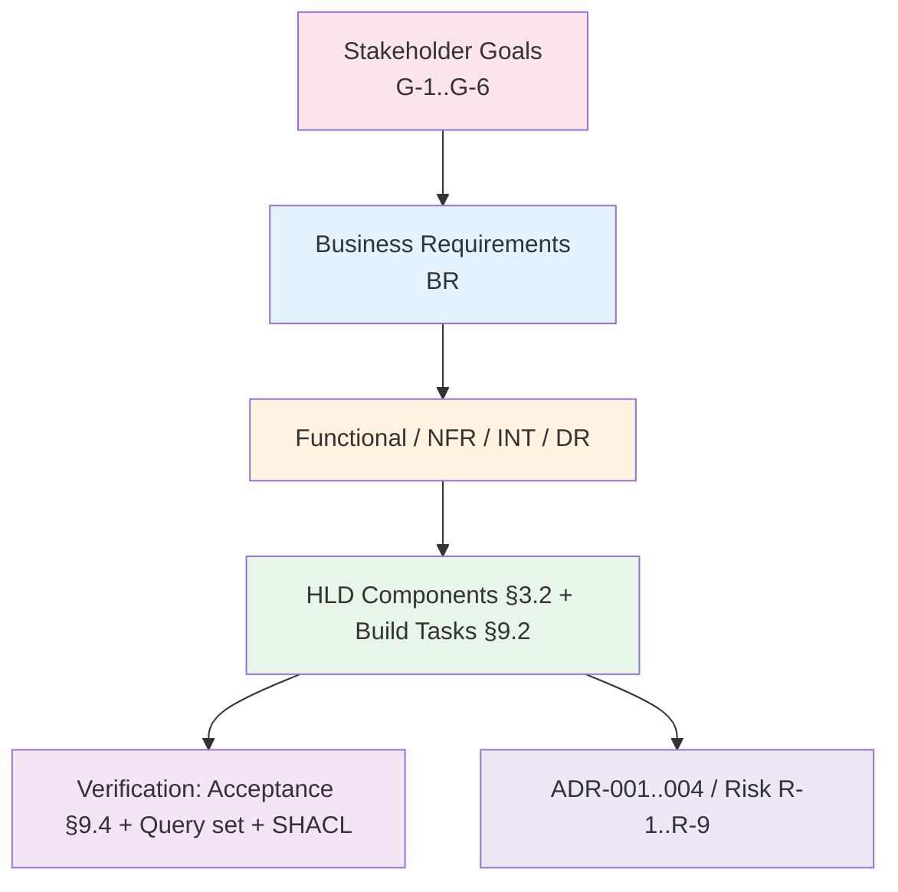

# Requirements Traceability Matrix: location-assurance-twin

> **Template Origin**: Official | **ArcKit Version**: 5.11.0 | **Command**: `/arckit:traceability`

## Document Control

| Field | Value |
|-------|-------|
| **Document ID** | ARC-006-TRAC-v1.1 |
| **Document Type** | Requirements Traceability Matrix |
| **Project** | location-assurance-twin (Project 006) |
| **Classification** | PUBLIC |
| **Status** | DRAFT |
| **Version** | 1.1 |
| **Created Date** | 2026-06-17 |
| **Last Modified** | 2026-06-18 |
| **Review Date** | 2026-07-18 |
| **Owner** | Roland Pfeifer (Lead Architect, Vpnet Cloud Solutions Sdn. Bhd.) |
| **Reviewed By** | [PENDING] |
| **Approved By** | [PENDING] |
| **Distribution** | Project Team, Architecture Team, Standards/Research Reviewer |

## Revision History

| Version | Date | Author | Changes | Approved By | Approval Date |
|---------|------|--------|---------|-------------|---------------|
| 1.0 | 2026-06-17 | ArcKit AI | Initial design-phase matrix over REQ/ADR-001/RISK/HLD | [PENDING] | [PENDING] |
| 1.1 | 2026-06-18 | ArcKit AI | Folded in ADR-002/003/004 (closes GAP-002 decision coverage) and STKE goal links (closes GAP-003 backward stakeholder traceability); score 72 → 82 | [PENDING] | [PENDING] |

## Document Purpose

End-to-end traceability for location-assurance-twin at **design phase**: requirements (`ARC-006-REQ-v1.0`) traced forward to the four architecture decisions (`ARC-006-ADR-001..004`), the risk register (`ARC-006-RISK-v1.0`), stakeholder goals (`ARC-006-STKE-v1.0`), the HLD design surface (components §3.2, build tasks §9.2), and the planned verification surface (acceptance criteria §9.4, the deterministic query set, and SHACL shapes). No source code exists yet (the rig is unbuilt), so "implementation" is uniformly *not started* and verification is *defined-but-not-executed*.

> **v1.1 change:** All four HLD decisions are now formal ADRs and the stakeholder analysis exists, so the v1.0 gaps GAP-002 (3 planned ADRs) and GAP-003 (partial backward stakeholder links) are **CLOSED**. The remaining open gap is GAP-001 (define explicit verification for the design-only requirements) — a build-phase activity.

---

## 1. Overview

### 1.1 Purpose

Ensure every requirement is addressed in the design, governed by a decision/risk and traceable to a stakeholder goal where material, and has a defined verification path before the rig is built — and surface remaining gaps early.

### 1.2 Traceability Scope

### 1.3 Document References

| Document | Version | Date | Link |
|----------|---------|------|------|
| Requirements (REQ) | 1.0 | 2026-06-17 | `ARC-006-REQ-v1.0.md` |
| Stakeholder Analysis (STKE) | 1.0 | 2026-06-17 | `ARC-006-STKE-v1.0.md` |
| ADR-001 — Two-store decision | 1.0 | 2026-06-17 | `decisions/ARC-006-ADR-001-v1.0.md` |
| ADR-002 — No durable subscriber location | 1.0 | 2026-06-17 | `decisions/ARC-006-ADR-002-v1.0.md` |
| ADR-003 — GB922 v24.0 baseline + provenance | 1.0 | 2026-06-17 | `decisions/ARC-006-ADR-003-v1.0.md` |
| ADR-004 — Semantic YANG-Push feed | 1.0 | 2026-06-17 | `decisions/ARC-006-ADR-004-v1.0.md` |
| Risk Register (RISK) | 1.0 | 2026-06-17 | `ARC-006-RISK-v1.0.md` |
| High-Level Design (HLD) | 0.1 | 2026-06-17 | `external/location_assurance_twin_HLD.md` |
| Detailed Design (DLD) | — | — | Not yet produced |

---

## 2. Traceability Matrix

### 2.1 Forward Traceability: Requirement → Design → Verification → Governance → Stakeholder Goal

**Status legend:** ✅ design mapped **and** verification defined · ⚠️ design mapped, verification not yet defined or out-of-scope this iteration · ❌ no design mapping (none present). Implementation column omitted — uniformly *not started* (design phase).

| Req ID | Requirement (short) | Priority | Design (HLD / build task) | Verification (planned) | ADR / Risk | Goal | Status |
|--------|---------------------|----------|----------------------------|------------------------|-----------|------|--------|
| BR-001 | Prevent cross-plane invisible-consequence outage | MUST | L5 gate, §7 / task 7 | Acceptance: consequence surfaced pre-commit | R-4 | G-2 | ✅ |
| BR-002 | Symptom→cause causal observability | MUST | L1 / tasks 2,7 | Q-CORRELATE returns impacted set | ADR-001 | G-1 | ✅ |
| BR-003 | Governed pre-change reach gate | MUST | L4/L5 / task 7 | Q-BLAST autonomy recommendation | ADR-001 | G-3 | ✅ |
| BR-004 | Open, reproducible rig | MUST | §9.1/§9.3 / task 1 | Acceptance: `docker compose up` healthy | — | G-6 | ✅ |
| BR-005 | Standards & provenance discipline | MUST | §8 / tasks 3,8 | Deviation report (FR-015) | ADR-003, R-2 | G-5 | ✅ |
| BR-006 | Privacy-by-default | MUST | §4.4 | Acceptance: no per-subscriber location persisted | ADR-002, R-7 | G-4 | ✅ |
| FR-001 | L0 semantic feed | MUST | L0 / task 6 | Scoped-slice consume (build task) | ADR-004, R-6 | G-6 | ⚠️ |
| FR-002 | L1 operational correlation graph | MUST | L1 / task 2 | Acceptance: zero-X queries return rows | ADR-001 | G-1 | ✅ |
| FR-003 | L2 model/intent store (RDF/OWL+SHACL) | MUST | L2 / tasks 3,4 | Acceptance: SHACL validate verdict | ADR-001, ADR-003 | G-5 | ✅ |
| FR-004 | L3 n10s bridge (uni-directional) | MUST | L3 / task 5 | Acceptance: labels resolve to `sid:` | ADR-001, R-9 | G-1 | ✅ |
| FR-005 | L4 closed-loop controller (MAPE-K) | MUST | L4 / task 7 | Acceptance: one controller pass output | — | G-1,G-3 | ✅ |
| FR-006 | L5 governance/security gate | MUST | L5 / task 7 | Audit + plane-routing test (to define) | R-7,R-8 | G-3 | ⚠️ |
| FR-007 | Q-CORRELATE | MUST | L1 / tasks 2,7 | Query returns impacted services/customers | ADR-001 | G-1 | ✅ |
| FR-008 | Q-SRLG (geo-diversity shared-risk) | MUST | L1 | Seeded shared-section detected | — | G-2 | ✅ |
| FR-009 | Q-BLAST (reach→autonomy) | MUST | L1 | Autonomy recommendation produced | — | G-3 | ✅ |
| FR-010 | Q-PROACTIVE | SHOULD | L1 | Query (not in §9.4 acceptance) | — | G-1 | ⚠️ |
| FR-011 | Q-DISPATCH | SHOULD | L1 | Query (not in §9.4 acceptance) | ADR-002 | G-1 | ⚠️ |
| FR-012 | SHACL intent shapes | MUST | L2 / task 4 | Geo-diversity shape MUST FAIL on seed | ADR-001, ADR-003 | G-2 | ✅ |
| FR-013 | Autonomy modes (auto vs supervised) | MUST | L4/L5 / task 7 | Mode-by-reach test (to define) | R-4 | G-3 | ⚠️ |
| FR-014 | On-demand transient subscriber-location | MUST | §4.4 | Acceptance: nothing per-subscriber persisted | ADR-002, R-7 | G-4 | ✅ |
| FR-015 | Deviation report | SHOULD | task 8 | Report exists at build completion | ADR-003, R-2,R-3 | G-5 | ✅ |
| NFR-P-001 | Correlation traversal latency | HIGH | L1 | Latency timing on seed (to define) | ADR-001 | G-1 | ⚠️ |
| NFR-P-002 | Causal (not black-box) signal | HIGH | L0 | Feed carries data-plane signal (to define) | ADR-004, R-8 | G-1 | ⚠️ |
| NFR-A-001 | Observability redundancy (1-of-4) | HIGH | §6 | Detection with one vantage disabled (to define) | R-8 | G-1 | ⚠️ |
| NFR-A-002 | Subscription-health precondition | HIGH | L4 | Killed subscription blocks ACTING | ADR-004, R-8 | G-3 | ✅ |
| NFR-S-001 | Feed partitioning / scoped consume | MEDIUM | L0 / task 6 | Mechanism only; carrier-scale out of scope | ADR-004, R-6 | G-6 | ⚠️ |
| NFR-SEC-001 | Plane separation + pre-commit disclosure | CRITICAL | L5/§7 | Plane classification + disclosure (to define) | R-4 | G-3 | ⚠️ |
| NFR-SEC-002 | Autonomy gating by reach | CRITICAL | L5 | Tied to Q-BLAST recommendation | — | G-3 | ✅ |
| NFR-SEC-003 | Trust gradient (external = governed only) | CRITICAL | §7 | External request cannot author config (to define) | — | G-3 | ⚠️ |
| NFR-SEC-004 | Controller authors no raw config; OAuth | CRITICAL | L4 | No-config assertion (execution out of scope) | ADR-004 | G-3 | ⚠️ |
| NFR-SEC-005 | Secrets hygiene (.env gitignored) | CRITICAL | §9.1 | Repo scan: no secrets committed | — | G-6 | ✅ |
| NFR-C-001 | Privacy minimisation (P4 boundary) | CRITICAL | §4.4 | Store-inspection: no durable subscriber location | ADR-002, R-7 | G-4 | ✅ |
| NFR-C-002 | Immutable, correlated audit | CRITICAL | L5 | Correlation-id audit per action (to define) | — | G-3 | ⚠️ |
| NFR-C-003 | Standards provenance traceability | HIGH | §8 | Provenance tags carried to RDF (deviation report) | ADR-003, R-2 | G-5 | ✅ |
| NFR-M-001 | Reproducibility | HIGH | §9.3 | `docker compose up` healthy | — | G-6 | ✅ |
| NFR-M-002 | Correlation-id across layers | HIGH | all layers | End-to-end correlation-id trace (to define) | — | G-1 | ⚠️ |
| NFR-D-001 | Single source of truth | CRITICAL | §4.1 | Design review: no fact mastered twice | ADR-001, R-9 | G-5 | ✅ |
| INT-001 | Device YANG-Push feed → broker | CRITICAL | L0 / task 6 | Consume typed records (build task) | ADR-004, R-6 | G-6 | ⚠️ |
| INT-002 | Neo4j↔Fuseki bridge (n10s) | CRITICAL | L3 / task 5 | Labels resolve to `sid:` | ADR-001, R-9 | G-1 | ✅ |
| INT-003 | ibn-core / RFC 9315 lineage | MEDIUM | conceptual | No runtime test (conceptual lineage) | — | G-6 | ⚠️ |
| INT-004 | SIMAP alignment | COULD | modelling | No runtime test (modelling alignment) | — | G-6 | ⚠️ |
| INT-005 | Control/management-plane routing interface | SHOULD | L5 | Interface only; execution out of scope | R-8 | G-3 | ⚠️ |
| DR-001 | Location foundation (SID GB922 v24.0) | MUST | L1 / task 2 | Zero-X queries return rows | ADR-003 | G-5 | ✅ |
| DR-002 | Six v24 cross-domain joints | MUST | L1 / task 2 | Joints present + traversable | ADR-003 | G-5 | ✅ |
| DR-003 | Mastership split | CRITICAL | §4.1 | No fact mastered twice (design review) | ADR-001 | G-5 | ✅ |
| DR-004 | Transient privacy boundary | CRITICAL | §4.4 | No durable subscriber location | ADR-002, R-7 | G-4 | ✅ |
| DR-005 | Provenance tagging [SID v24] vs [MODEL] | HIGH | §8 / task 3 | Provenance tags to RDF | ADR-003, R-2 | G-5 | ✅ |
| DR-006 | OWL scope (minimal vs full) | MEDIUM | §4 / task 3 | Scope documented; confirm pre-publication | ADR-003, R-3 | G-5 | ✅ |

### 2.2 Backward Traceability: Verification → Requirement, and Stakeholder Goal → Requirement

**Verification → Requirement:**

| Verification artefact | Verifies (Req IDs) | Design component | Status |
|-----------------------|--------------------|------------------|--------|
| Acceptance: `docker compose up` healthy | BR-004, NFR-M-001 | Rig (task 1) | ✅ Traced |
| Acceptance: L1 loads, zero-X queries return rows | FR-002, FR-007, DR-001, DR-002 | L1 | ✅ Traced |
| Acceptance: n10s import, labels resolve to `sid:` | FR-004, INT-002, NFR-D-001 | L3 | ✅ Traced |
| Acceptance: geo-diversity SHACL FAILS on seeded shared-section | FR-008, FR-012, BR-001 | L2 | ✅ Traced |
| Acceptance: Q-BLAST autonomy recommendation | FR-009, BR-003, NFR-SEC-002 | L1/L4 | ✅ Traced |
| Acceptance: no per-subscriber location persisted | BR-006, FR-014, NFR-C-001, DR-004 | §4.4 / L1 | ✅ Traced |
| Deviation report (task 8) | BR-005, FR-015, NFR-C-003, DR-005, DR-006 | §8 | ✅ Traced |
| Subscription-health test (R-8 action) | NFR-A-002, FR-006 | L4 | ✅ Traced |

**Stakeholder Goal → Requirement (backward, now complete via STKE):**

| Goal | Goal summary | Requirements satisfying it |
|------|--------------|----------------------------|
| G-1 | Deterministic symptom→cause + impact | BR-002, FR-002/004/005/007, INT-002, NFR-P-001 |
| G-2 | Geo-diversity SHACL catch | BR-001, FR-008, FR-012 |
| G-3 | Reach-graded autonomy | BR-003, FR-009/013, NFR-SEC-001/002/003/004, NFR-C-002 |
| G-4 | Zero durable subscriber location | BR-006, FR-014, NFR-C-001, DR-004 |
| G-5 | Standards-defensible design | BR-005, FR-003/015, NFR-C-003, NFR-D-001, DR-001/002/003/005/006 |
| G-6 | Reproducible open rig | BR-004, FR-001, NFR-M-001, NFR-S-001, INT-001/003/004 |

**No orphan tests** — every defined verification traces to ≥ 1 requirement. **No orphan goals** — every STKE goal maps to ≥ 1 requirement.

---

## 3. Coverage Analysis

### 3.1 Requirements Coverage Summary

| Category | Total | ✅ Verification-defined | ⚠️ Design-only | ❌ Gap | % Design-mapped | % Verification-defined |
|----------|-------|------------------------|----------------|--------|-----------------|------------------------|
| Business (BR) | 6 | 6 | 0 | 0 | 100% | 100% |
| Functional (FR) | 15 | 10 | 5 | 0 | 100% | 67% |
| Non-Functional (NFR) | 16 | 7 | 9 | 0 | 100% | 44% |
| Integration (INT) | 5 | 1 | 4 | 0 | 100% | 20% |
| Data (DR) | 6 | 6 | 0 | 0 | 100% | 100% |
| **TOTAL** | **48** | **30** | **18** | **0** | **100%** | **62.5%** |

**New in v1.1:** **ADR coverage 4/4 decisions formalised** (was 1/4); **backward stakeholder-goal coverage 100%** (every requirement carries a Goal; was partial). Verification-defined unchanged at 62.5% (GAP-001 is build-phase work).

### 3.2 Design Coverage (by HLD layer) + governing ADR

| Layer / Component | Requirements | Governing ADR(s) |
|-------------------|--------------|------------------|
| L0 Semantic Feed | FR-001, NFR-P-002, NFR-S-001, INT-001 | ADR-004 |
| L1 Operational Graph | FR-002, FR-007–011, NFR-P-001, DR-001, DR-002 | ADR-001, ADR-003 |
| L2 Model/Intent Store | FR-003, FR-012, DR-005, DR-006 | ADR-001, ADR-003 |
| L3 Bridge (n10s) | FR-004, INT-002, NFR-D-001, DR-003 | ADR-001 |
| L4 Controller | FR-005, FR-013, NFR-A-002, NFR-SEC-004 | ADR-004 (feed health) |
| L5 Governance/Security | BR-001/003, FR-006, NFR-SEC-001/002/003, NFR-C-002, INT-005 | — (gate design; future ADR if needed) |
| Cross-cutting (§4.4/§8/§9) | BR-004/005/006, FR-014/015, NFR-C-001/003, NFR-M-001/002, NFR-SEC-005, DR-004 | ADR-002 (privacy), ADR-003 (provenance) |

**Orphan Components**: None.

### 3.3 Test Coverage

Unchanged from v1.0: acceptance criteria (§9.4) + query set + SHACL define verification for the MUST functional core and the privacy/SSoT properties; unit/integration/performance/security suites are authored during build. **Implementation coverage: 0%** (rig unbuilt).

---

## 4. Gap Analysis

### 4.1 Requirements Without Design

None — 100% design coverage.

### 4.2 Requirements Without Defined Verification (GAP-001 — open, build-phase)

Unchanged from v1.0 — 12 mostly-NFR requirements are design-mapped but need explicit tests before build sign-off: FR-006, FR-013, FR-010/011, NFR-P-001, NFR-P-002, NFR-A-001, NFR-SEC-001, NFR-SEC-003, NFR-SEC-004, NFR-C-002, NFR-M-002, INT-001. (See v1.0 §4.2 for the per-item actions.)

### 4.3 Decision (ADR) Coverage — CLOSED ✅ (was GAP-002)

All four HLD decisions are now formal ADRs:

| ADR | Decision | Governs |
|-----|----------|---------|
| ADR-001 | Two-store split (Neo4j + Fuseki + n10s) | FR-002/003/004/012, NFR-P-001, NFR-D-001, DR-003, INT-002, BR-002/003 |
| ADR-002 | No durable per-subscriber location | BR-006, FR-014, NFR-C-001, DR-004 |
| ADR-003 | GB922 v24.0 baseline + provenance | BR-005, DR-001/002/005/006, NFR-C-003, FR-003/012 |
| ADR-004 | Semantic YANG-Push feed → broker | FR-001, INT-001, NFR-S-001, NFR-P-002, NFR-A-002, NFR-SEC-004 |

No further ADRs are required for the current HLD scope. (A gate/audit-design ADR for L5 may be warranted if FR-006/NFR-C-002 verification reveals a material design fork.)

### 4.4 Design Components Without Requirements

None — no scope creep.

### 4.5 Backward Stakeholder Traceability — CLOSED ✅ (was GAP-003)

`ARC-006-STKE-v1.0` exists; every requirement now carries a stakeholder Goal (G-1..G-6, §2.1 Goal column), and every Goal maps to ≥ 1 requirement (§2.2). Backward Stakeholder → Driver → Goal → Requirement chains are complete.

---

## 5. NFR Traceability (summary)

| NFR | Target | Design strategy | Verification | ADR | Status |
|-----|--------|-----------------|--------------|-----|--------|
| NFR-P-001 | Interactive traversal latency (rig) | Neo4j LPG | Timing on seed (to define) | ADR-001 | ⚠️ |
| NFR-A-002 | Dead subscription ≠ conformance | Health precondition for ACTING | Killed-subscription blocks acting | ADR-004 | ✅ |
| NFR-SEC-002 | Reach-graded autonomy | Q-BLAST → autonomy level | Recommendation produced | — | ✅ |
| NFR-C-001 | No durable subscriber location | P4 boundary in schema+code | Store-inspection test | ADR-002 | ✅ |
| NFR-C-003 | Provenance to RDF | `[SID v24]`/`[MODEL]` tags | Deviation report | ADR-003 | ✅ |
| NFR-D-001 | Single source of truth | Mastership split | Design review | ADR-001 | ✅ |

---

## 6. Change Impact Analysis

| Change ID | Date | Req/Artifact | Change | Impact |
|-----------|------|--------------|--------|--------|
| CHG-001 | 2026-06-18 | ADR-002/003/004 + STKE added | Closed GAP-002 (decisions) + GAP-003 (stakeholder backward links) | LOW (additive governance; no requirement change) |

---

## 7. Metrics and KPIs

| Metric | v1.0 | v1.1 | Target | Status |
|--------|------|------|--------|--------|
| Requirements with design coverage | 100% | 100% | 100% | ✅ |
| Requirements with verification defined | 62.5% | 62.5% | 100% (MUST) before build | ⚠️ |
| Decisions formalised as ADRs | 1 of 4 | **4 of 4** | 4 | ✅ |
| Backward stakeholder-goal coverage | partial | **100%** | 100% | ✅ |
| Orphan components / tests / goals | 0 | 0 | 0 | ✅ |
| Implementation coverage | 0% | 0% | n/a at design phase | ⏳ |

**Overall design-phase traceability score: 82/100** (was 72) — design coverage 100%, decisions fully formalised, backward stakeholder traceability complete, no orphans. The remaining deduction is verification definition (62.5%, GAP-001). **Recommendation: APPROVED AS DESIGN BASELINE** — proceed to build, closing GAP-001 (define verification for the 12 ⚠️ requirements) as the first build activity.

---

## 8. Action Items

| ID | Gap | Owner | Priority | Status |
|----|-----|-------|----------|--------|
| GAP-001 | Define verification for the 12 ⚠️ requirements (§4.2) | Project Team | HIGH | Open (build-phase) |
| GAP-002 | Author the 3 planned ADRs | Lead Architect / Standards Reviewer | — | **Closed** (ADR-002/003/004) |
| GAP-003 | Produce STKE for backward traceability | Lead Architect | — | **Closed** (`ARC-006-STKE-v1.0`) |
| GAP-004 | Add Q-PROACTIVE / Q-DISPATCH to §9.4 acceptance | Project Team | LOW | Open |

No orphan components or tests.

---

## 9. Review and Approval

### 9.1 Review Checklist

- [x] All business requirements have design coverage
- [x] All functional requirements traced to design components
- [x] No orphan design components
- [ ] All MUST requirements have defined verification (62.5% — GAP-001, build-phase)
- [x] Gaps identified with action plan
- [x] All material decisions captured as ADRs (4 of 4)
- [x] Backward stakeholder-goal traceability complete (STKE present)

### 9.2 Approval

| Role | Name | Approval | Date |
|------|------|----------|------|
| Lead Architect | Roland Pfeifer | [ ] Approve [ ] Reject | [PENDING] |
| Standards/Research Reviewer | [PENDING] | [ ] Approve [ ] Reject | [PENDING] |
| QA / Verification | [PENDING] | [ ] Approve [ ] Reject | [PENDING] |

---

## 10. Appendices

### Appendix A: Full Requirements List

`projects/006-location-assurance-twin/ARC-006-REQ-v1.0.md`

### Appendix B: Governance Artifacts

ADR-001..004 (`decisions/`); RISK (`ARC-006-RISK-v1.0`); STKE (`ARC-006-STKE-v1.0`); HLD (`external/location_assurance_twin_HLD.md`).

### Appendix C: Verification Surface

HLD §9.4 acceptance criteria; query set (Q-CORRELATE/Q-SRLG/Q-BLAST/Q-PROACTIVE/Q-DISPATCH); SHACL shapes (geo-diversity, critical-service reachability, provisioning).

---

## External References

> Traceability from generated content back to source documents.

### Document Register

| Doc ID | Filename | Type | Source Location | Description |
|--------|----------|------|-----------------|-------------|
| REQ006 | ARC-006-REQ-v1.0.md | Requirements | 006-location-assurance-twin/ | 48 requirements traced |
| STKE006 | ARC-006-STKE-v1.0.md | Stakeholder Analysis | 006-location-assurance-twin/ | Goals G-1..G-6 (backward links) |
| ADR006-1 | ARC-006-ADR-001-v1.0.md | ADR | 006-location-assurance-twin/decisions/ | Two-store decision |
| ADR006-2 | ARC-006-ADR-002-v1.0.md | ADR | 006-location-assurance-twin/decisions/ | No durable subscriber location |
| ADR006-3 | ARC-006-ADR-003-v1.0.md | ADR | 006-location-assurance-twin/decisions/ | GB922 v24.0 baseline + provenance |
| ADR006-4 | ARC-006-ADR-004-v1.0.md | ADR | 006-location-assurance-twin/decisions/ | Semantic YANG-Push feed |
| RISK006 | ARC-006-RISK-v1.0.md | Risk Register | 006-location-assurance-twin/ | R-1..R-9 linkage |
| LATH | location_assurance_twin_HLD.md | High-Level Design | 006-location-assurance-twin/external/ | §3.2 components, §9.2 build tasks, §9.4 acceptance |

### Citations

| Citation ID | Doc ID | Page/Section | Category | Quoted Passage |
|-------------|--------|--------------|----------|----------------|
| LATH-C1 | LATH | §9.2 | Functional Requirement | "Build tasks (each maps to a building block): 1 rig … 2 L1 … 3 L2 ontology … 4 L2 shapes … 5 L3 bridge … 6 L0 feed … 7 L4 controller … 8 deviation report" |
| LATH-C2 | LATH | §9.4 | Functional Requirement | "controller run returns impacted-service list and a geo-diversity SHACL violation on the seeded shared-section case and a Q-BLAST autonomy recommendation; no per-subscriber location persisted anywhere." |

### Unreferenced Documents

| Filename | Source Location | Reason |
|----------|-----------------|--------|
| location_twin_v24.cypher | 006-location-assurance-twin/external/ | Build seed; traced via FR-002/DR-001 design |
| LOCATION_RESOURCE_SERVICE_PART_INTERACTION.pdf | 006-location-assurance-twin/external/ | Reference graphic |
| tmf_pyramid_digital_twin.svg | 006-location-assurance-twin/external/ | Positioning graphic |

---

**Generated by**: ArcKit `/arckit:traceability` command
**Generated on**: 2026-06-18
**ArcKit Version**: 5.11.0
**Project**: location-assurance-twin (Project 006)
**Model**: Claude Opus 4.8 (1M context)
**Generation Context**: v1.1 refresh folding in ADR-002/003/004 (GAP-002 closed) and STKE goals (GAP-003 closed). Built from ARC-006-REQ-v1.0, ARC-006-ADR-001..004, ARC-006-RISK-v1.0, ARC-006-STKE-v1.0, HLD v0.1. Design-phase; GAP-001 (verification definition) remains for build.

<!-- arckit-provenance:start -->

## Build Provenance

_Stamped automatically by the ArcKit plugin's `provenance-stamp.mjs` PostToolUse hook. Complements (does not replace) the human-authored footer above. Carries only fields the model can't authoritatively self-report: build context from `.arckit/state.json` and effort levels derived from command frontmatter + the silent-downgrade matrix._

| Field | Value |
|-------|-------|
| Requested Effort | `high` |
| Effective Effort | _unknown — model not parsed from existing footer_ |
| Stamped at | 2026-06-17T22:23:21.494Z |

<!-- arckit-provenance:end -->
