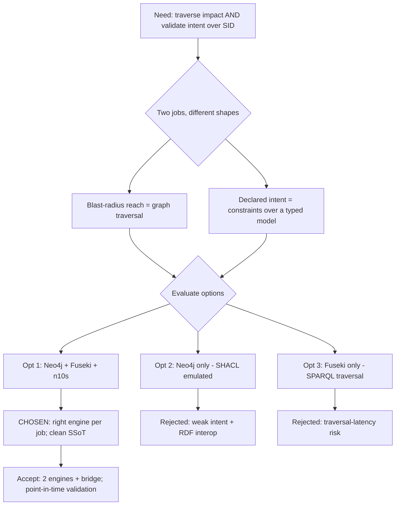

# Architecture Decision Record: Two Stores Split by Concern — Neo4j (LPG) for Correlation + Apache Jena Fuseki (RDF/SHACL) for Model/Intent

> **Template Origin**: Official | **ArcKit Version**: 5.11.0 | **Command**: `/arckit:adr`

## Document Control

| Field | Value |
|-------|-------|
| **Document ID** | ARC-006-ADR-001-v1.0 |
| **Document Type** | Architecture Decision Record |
| **Project** | location-assurance-twin (Project 006) |
| **Classification** | PUBLIC |
| **Status** | ACCEPTED |
| **Version** | 1.0 |
| **Created Date** | 2026-06-17 |
| **Last Modified** | 2026-06-17 |
| **Review Date** | 2026-09-17 |
| **Owner** | Roland Pfeifer (Lead Architect, Vpnet Cloud Solutions Sdn. Bhd.) |
| **Reviewed By** | [PENDING] |
| **Approved By** | [PENDING] |
| **Distribution** | Project Team, Architecture Team, Standards/Research Reviewer |

## Revision History

| Version | Date | Author | Changes | Approved By | Approval Date |
|---------|------|--------|---------|-------------|---------------|
| 1.0 | 2026-06-17 | ArcKit AI | Initial creation from `/arckit:adr` command; records HLD §10 D1/D3/D4/D6 (two-store split) | [PENDING] | [PENDING] |

## 1. Decision Title

**Use two stores split by concern — Neo4j (labelled property graph) for the operational correlation graph and blast-radius traversal, and Apache Jena Fuseki (RDF/OWL + SHACL) for the model/intent store — bridged uni-directionally by Neosemantics (n10s) with no shared mastership.**

---

## 2. Stakeholders

### 2.1 Deciders (RACI: Accountable)

- **Roland Pfeifer (Lead Architect, Vpnet Cloud Solutions)** — Accountable for the cross-cutting data-architecture standard and its review defensibility.

### 2.2 Consulted (RACI: Consulted)

- **Standards/Research Reviewer (IETF NMOP / TM Forum / academic)** — RDF/SHACL fidelity, SID GB922 v24.0 provenance, publication credibility.
- **Assurance / Governance Architect** — intent-as-SHACL and blast-radius traversal fit.
- **Security & Governance Lead** — mastership integrity, privacy-boundary enforcement in the chosen stores.

### 2.3 Informed (RACI: Informed)

- **NOC / Second-line Support** — correlation queries run against the L1 store.
- **Project Team** — implementation and rig operation.

### 2.4 UK Government Escalation Context

**Decision Level**: Department

**Escalation Rationale**:

- [ ] **Team**: Local implementation choice (frameworks, libraries, testing)
- [ ] **Cross-team**: Integration patterns, shared services, API standards
- [x] **Department**: Technology standards, data-store selection, architecture pattern (cross-cutting, contested — Risk R-1)
- [ ] **Cross-government**: National infrastructure, cross-department interoperability

**Governance Forum**: Architecture Review Board (Vpnet Cloud Solutions Enterprise Architecture).

**Approval Date**: [PENDING]

---

## 3. Context and Problem Statement

### 3.1 Problem Description

location-assurance-twin must do two structurally different jobs over network/place data: (a) **traverse** relationships fast — fault → place → impacted services → customers → blast radius — and (b) **validate** the network against declared **intent** expressed as design invariants, while interoperating with the authoritative TM Forum SID (RDF) vocabulary [LATH-C1]. A single data technology serves one job well and the other poorly. The system must also honour a single-source-of-truth discipline: no fact mastered twice [LATH-C2].

**Problem statement as a question**: Which data-store topology lets us run deterministic blast-radius traversal *and* SHACL-as-intent validation against a standards-grounded model, without mastering the same fact in two places?

### 3.2 Why This Decision Is Needed

- **Business context**: BR-002 (symptom→cause correlation), BR-003 (blast-radius gate), BR-005 (standards/provenance discipline).
- **Technical context**: FR-002 (L1 traversal), FR-003 (L2 RDF/OWL + SHACL), FR-004 (the bridge), FR-012 (SHACL intent shapes), NFR-P-001 (interactive traversal latency), NFR-D-001 (single source of truth), DR-003 (mastership split).
- **Regulatory context**: Privacy-by-default boundary (NFR-C-001) must be enforceable in whatever store holds operational instances; provenance (NFR-C-003) must be carryable through to RDF.

### 3.3 Supporting Links

- **Requirements**: BR-002, BR-003, BR-005; FR-002, FR-003, FR-004, FR-012; NFR-P-001, NFR-D-001, NFR-C-003; DR-003; Conflict C-1.
- **Source HLD**: `external/location_assurance_twin_HLD.md` §3.1 (ABB/SBB), §3.2 (component responsibilities), §4.1 (mastership split), §10 (decisions D1/D3/D4/D6).
- **Risk**: R-1 (two-store justification challenged).
- **Related ADRs**: none yet (this is ADR-001). Future: ADR for GB922 v24.0 baseline + provenance (D2/D5), ADR for the YANG-Push-to-broker feed (D9), ADR for the no-durable-subscriber-location boundary (D7).

---

## 4. Decision Drivers (Forces)

### 4.1 Technical Drivers

- **Right engine per rule type**: blast-radius reach is a multi-hop graph traversal (Cypher excels); declared intent is a constraint over a typed model (SHACL excels) [LATH-C3]. Requirements: FR-008/FR-009 (traversal), FR-012 (SHACL); NFR-P-001.
- **Standards interoperability**: the authoritative location model is TM Forum SID (expressible as RDF/OWL); SHACL operates natively on RDF [LATH-C4]. Principle: PRIN 3 (Standards Conformance).
- **Single source of truth**: no fact mastered twice; bridge must be uni-directional to avoid split-brain [LATH-C2]. Principle: PRIN 8 (Single Source of Truth); NFR-D-001.
- **Loose coupling**: stores communicate through a published bridge, each owning its lifecycle. Principle: PRIN 10 (Loose Coupling).

### 4.2 Business Drivers

- **Review/publication defensibility** (BR-005): RDF + SHACL give standards-grounded, citable intent validation an architecture panel will accept.
- **Reproducibility / open** (BR-004): both engines are open-source with no licence cost.
- **Risk reduction**: explicit mastership split removes a whole class of consistency defects in a system that gates network change.

### 4.3 Regulatory & Compliance Drivers

- **Data Protection (GDPR / Malaysia PDPA)**: the operational store (Neo4j) must enforce the transient subscriber-location boundary (NFR-C-001); schema-level enforcement is feasible in an LPG.
- **GDS Service Standard** (applied as good practice, this being a non-UK-Gov open project): Point 4 (open standards) — RDF/OWL/SHACL/SID are open; Point 12 (make new source code open) — Apache-2.0 rig.
- **Technology Code of Practice** (good-practice lens): Point 3 (open source), Point 8 (share/reuse) — both stores and the bridge are reusable open components.

### 4.4 Alignment to Architecture Principles

| Principle | Alignment | Impact |
|-----------|-----------|--------|
| PRIN 8 — Single Source of Truth | ✅ Supports | Mastership split by concern; uni-directional bridge; no fact mastered twice (DR-003) |
| PRIN 10 — Loose Coupling | ✅ Supports | Two stores integrate via a published bridge, not a shared schema |
| PRIN 3 — Standards Conformance | ✅ Supports | RDF/OWL carries SID GB922 v24.0; SHACL is the W3C intent-validation standard |
| PRIN 5 — Observability | ✅ Supports | Correlation-id threading is store-agnostic; both stores instrumentable |
| PRIN 14 — Maintainability | ⚠️ Partial | Two engines + a bridge increase moving parts (accepted trade-off; see §7.2) |
| PRIN 1 — Scalability | ⚠️ Partial | Rig-scale only; carrier-scale write/throughput is out of scope this iteration |

---

## 5. Considered Options

### Option 1: Two stores split by concern (Neo4j LPG + Fuseki RDF/SHACL, n10s bridge) — CHOSEN

**Description**: Operational instances + topology in Neo4j (LPG); ontology + YANG-derived model + SHACL intent shapes in Apache Jena Fuseki (RDF). Neosemantics (n10s) bridges uni-directionally: Fuseki → Neo4j (import ontology so labels are GB922 class names), Neo4j → Fuseki (serialise impacted subgraph for SHACL validation). No shared mastership [LATH-C3][LATH-C5].

**Implementation approach**: docker-compose rig: Neo4j 5 (+ n10s + APOC), Fuseki (SHACL enabled), broker; seed L1 from `location_twin_v24.cypher`; minimal OWL + SHACL shapes in Fuseki; controller orchestrates Cypher reach + SHACL validate.

**Wardley Evolution Stage**: Product / Commodity (both are mature open-source products; the *pattern* of pairing them is Custom-Built).

#### Good (Pros)

- ✅ **Right engine per rule type**: Cypher for blast-radius reach (FR-008/FR-009/NFR-P-001); SHACL for intent (FR-012) [LATH-C3].
- ✅ **Standards interoperability**: RDF/OWL hosts SID GB922 v24.0 natively; provenance carryable to RDF (BR-005/NFR-C-003) [LATH-C4].
- ✅ **Clean SSoT**: mastership split is explicit; uni-directional bridge prevents split-brain (NFR-D-001, PRIN 8).
- ✅ **Open & reproducible**: both engines + n10s are open-source, no licence cost (BR-004).

#### Bad (Cons)

- ❌ **Two engines + a bridge**: more moving parts to deploy, learn, and operate (PRIN 14 partial).
- ❌ **Bridge correctness burden**: the n10s serialisation/import must be kept faithful; a stale import shows wrong labels.
- ❌ **Eventual consistency window**: the impacted-subgraph snapshot validated in Fuseki is point-in-time relative to live Neo4j state.

#### Cost Analysis

- **CAPEX**: ~£0 software (Neo4j Community, Fuseki Apache-2.0, n10s, Kafka/Redpanda OSS). Engineering: bridge + dual-store setup (build tasks 1–5).
- **OPEX**: two container services to run/monitor on the rig; negligible at rig scale.
- **TCO (3-year)**: dominated by engineering/maintenance effort, not licences; carrier-scale costs out of scope.

#### GDS Service Standard Impact

| Point | Impact | Notes |
|-------|--------|-------|
| 4. Open standards | Positive | RDF/OWL/SHACL/SID are open standards |
| 5. Security | Neutral | Privacy boundary enforced in the LPG store (NFR-C-001) |
| 9/12. Technology / open code | Positive | Open-source stores; Apache-2.0 rig |

---

### Option 2: Neo4j-only (single LPG; SHACL emulated in Cypher)

**Description**: One store. Model the SID location structure as LPG; express "intent" as Cypher constraint queries instead of SHACL; skip RDF entirely.

**Implementation approach**: All instances, model, and invariant checks in Neo4j; intent invariants written as Cypher queries asserting expected shape.

**Wardley Evolution Stage**: Product.

#### Good (Pros)

- ✅ **Simplest topology**: one engine, no bridge (PRIN 14 best).
- ✅ **Fast traversal**: native for blast-radius reach.
- ✅ **Lower operational surface**.

#### Bad (Cons)

- ❌ **Loses SHACL-as-intent**: invariants become bespoke Cypher, not a declarative W3C standard — weaker for review/publication (BR-005) and harder to maintain as intent grows.
- ❌ **No RDF interoperability**: SID GB922 vocabulary not natively carried; provenance to a standards graph is awkward (NFR-C-003 weakened).
- ❌ **Intent ≠ data co-located cleanly**: mixing the rulebook and the instances in one store blurs the mastership line (PRIN 8 risk).

#### Cost Analysis

- **CAPEX**: lowest (one store). **OPEX**: lowest. **TCO**: lowest monetary, but higher *intent-maintenance* cost and lower review defensibility.

#### GDS Service Standard Impact

| Point | Impact | Notes |
|-------|--------|-------|
| 4. Open standards | Negative | Bespoke Cypher invariants instead of W3C SHACL |
| 5. Security | Neutral | — |

---

### Option 3: RDF triplestore-only (Fuseki; traversal in SPARQL)

**Description**: One store. Everything in RDF; blast-radius reach computed via SPARQL property paths; SHACL native.

**Wardley Evolution Stage**: Product.

#### Good (Pros)

- ✅ **Native SHACL + SID/RDF**: best standards fidelity (BR-005).
- ✅ **One store, no bridge**.

#### Bad (Cons)

- ❌ **Traversal performance**: deep, variable-length multi-hop reach over SPARQL property paths is materially harder to keep within interactive latency than LPG traversal (NFR-P-001 at risk).
- ❌ **Operational graph ergonomics**: live topology mutation + path queries are less ergonomic in a triplestore than an LPG.

#### Cost Analysis

- **CAPEX/OPEX**: one store. **TCO**: lowest monetary, but performance risk on the core correlation use case (BR-002/BR-003).

#### GDS Service Standard Impact

| Point | Impact | Notes |
|-------|--------|-------|
| 4. Open standards | Positive | Full RDF/SHACL |
| 9. Technology | Negative | Traversal-latency risk on the anchor use case |

---

### Option 4: Do Nothing (Baseline)

**Description**: No purpose-built store topology; rely on existing assurance tooling / ad-hoc queries.

#### Good

- ✅ **No immediate cost**; no implementation risk.

#### Bad

- ❌ **The problem persists**: cross-plane consequence stays invisible; symptom→cause correlation stays manual (BR-001/BR-002 unmet).
- ❌ **No intent validation**: design invariants (geo-diversity, critical-service reachability) remain unenforced (FR-012 unmet).
- ❌ **Opportunity cost**: the reference pattern (Paper 2/3) is not demonstrated.

---

## 6. Decision Outcome

### 6.1 Chosen Option

**"Option 1: Two stores split by concern (Neo4j LPG + Fuseki RDF/SHACL, n10s bridge)."**

### 6.2 Y-Statement (Structured Justification)

> **In the context of** a location-anchored closed-loop assurance system that must both traverse impact (blast radius) and validate the network against standards-grounded declared intent,
> **facing** the fact that no single store serves fast multi-hop traversal *and* SHACL-as-intent over SID/RDF well, plus a single-source-of-truth obligation,
> **we decided for** two stores split by concern — Neo4j (LPG) for correlation/reach and Apache Jena Fuseki (RDF/OWL + SHACL) for the model/intent rulebook, bridged uni-directionally by n10s,
> **to achieve** the right engine per rule type, native standards interoperability, and a clean mastership split with no fact mastered twice,
> **accepting** the added operational surface of two engines plus a bridge, and a point-in-time validation window on the serialised impacted subgraph.

### 6.3 Justification (Why This Option?)

1. **Engine fit is decisive**: the two jobs (reach vs intent) have different computational shapes; pairing the best engine for each beats compromising on one (Option 2 weak on intent; Option 3 weak on traversal) [LATH-C3].
2. **Standards defensibility (BR-005)**: SHACL-as-intent on RDF carrying SID GB922 v24.0 is what makes the design citable at an architecture panel / in publication — a primary objective.
3. **Mastership integrity (NFR-D-001, PRIN 8)**: the split is explicit and the bridge is uni-directional, removing split-brain risk in a system that gates network change.
4. **Cost is not the discriminator**: all three single/dual options are open-source with ~£0 licence cost; the discriminator is fit and review defensibility.

**Stakeholder consensus**: Lead Architect + Standards Reviewer favour the two-store fit; the operational-simplicity objection (Risk R-1) is acknowledged and answered with a documented fallback.

**Risk appetite**: The programme accepts modest operational complexity in exchange for correctness and standards defensibility; this matches the open, review-oriented posture.

---

## 7. Consequences

### 7.1 Positive Consequences

- ✅ **Blast-radius reach stays fast** at rig scale (Cypher) — supports BR-003/NFR-P-001.
- ✅ **Intent is declarative and standard** (SHACL) — supports FR-012/BR-005; the seeded geo-diversity violation is catchable.
- ✅ **SID GB922 v24.0 vocabulary is native** in RDF, with provenance carryable (NFR-C-003).
- ✅ **Clean SSoT** — no fact mastered twice (NFR-D-001).

**Measurable outcomes**:

- Correlation/blast-radius queries: return within interactive latency on the seed graph (NFR-P-001).
- Intent validation: geo-diversity SHACL shape FAILS on the seeded shared-route-section case (acceptance criterion).

### 7.2 Negative Consequences (Accepted Trade-offs)

- ❌ **Two engines + a bridge**: more to deploy/operate/learn (PRIN 14 partial).
- ❌ **Bridge faithfulness**: a stale ontology import shows wrong labels — must be re-run on ontology change.
- ❌ **Validation window**: the impacted subgraph validated in Fuseki is point-in-time vs live Neo4j.

**Mitigation strategies**:

- **Operational surface**: docker-compose one-command bring-up; both engines are mature products; rig scope bounds the burden.
- **Bridge faithfulness**: n10s import is part of the build/init step (build task 5) and re-run on ontology change; deviation report (FR-015) tracks scope.
- **Validation window**: snapshot is taken per controller pass with a correlation id; acceptable for the recommend-and-gate loop (no live execution this iteration).

### 7.3 Neutral Consequences (Changes Needed)

- 🔄 **Skills**: team needs both Cypher and SPARQL/SHACL familiarity.
- 🔄 **Infrastructure**: two container services + broker in the rig.
- 🔄 **Process**: ontology changes trigger a bridge re-init; provenance tags maintained through to RDF.

### 7.4 Risks and Mitigations

| Risk | Likelihood | Impact | Mitigation | Owner |
|------|------------|--------|------------|-------|
| Two-store justification challenged (R-1) | M | M | This ADR's engine-fit + defensibility argument; documented fallback to single store if review rejects it | Lead Architect |
| Bridge import stale → wrong labels | M | M | Re-run n10s init on ontology change; validate labels resolve to `sid:` (acceptance) | Project Team |
| SPARQL/SHACL skills gap | M | L | Minimal OWL scope (DR-006) for the rig; pair on shape authoring | Standards Reviewer |
| Validation-window staleness misread as truth | L | M | Correlation-id-stamped snapshot per pass; subscription-health precondition (NFR-A-002) | Assurance Architect |

**Link to risk register**: `ARC-006-RISK-v1.0` (R-1) — pending creation via `/arckit:risk`.

---

## 8. Validation & Compliance

### 8.1 How Will Implementation Be Verified?

**Design review**:

- [x] Recorded in HLD §3.1/§3.2/§4.1/§10.
- [ ] Reflected in any future DLD and deployment diagram.

**Code review**:

- [ ] PR checklist: no fact mastered in both stores; bridge uni-directional.
- [ ] Ontology changes accompanied by an n10s re-init step.

**Testing strategy**:

- [ ] L1 loads; zero-X queries return rows (FR-002).
- [ ] n10s import succeeds; labels resolve to `sid:` classes (FR-004).
- [ ] Geo-diversity SHACL shape FAILS on the seeded shared-section case (FR-012).
- [ ] `Q-BLAST` returns an autonomy recommendation (FR-009).

### 8.2 Monitoring & Observability

**Success metrics**:

- Correlation/blast-radius query latency on seed graph (interactive).
- SHACL validation verdict produced per controller pass, correlation-id-linked.

**Alerts and dashboards**: rig-level container health; bridge-init success/failure.

### 8.3 Compliance Verification

**Open standards**: RDF/OWL, SHACL (W3C), SID GB922 v24.0 — Point 4 / TCoP Point 3 satisfied.
**Security**: privacy boundary (NFR-C-001) enforced in the LPG store; no secrets in code (NFR-SEC-005).
**Data protection**: no durable per-subscriber location in either store (DR-004); DPIA recommended if the pattern progresses toward deployment.

---

## 9. Links to Supporting Documents

### 9.1 Requirements Traceability

**Business**: BR-002 (correlation), BR-003 (blast-radius gate), BR-004 (open/reproducible), BR-005 (standards/provenance).
**Functional**: FR-002 (L1 traversal), FR-003 (L2 RDF/SHACL), FR-004 (bridge), FR-008/FR-009 (Q-SRLG/Q-BLAST), FR-012 (SHACL shapes).
**Non-Functional**: NFR-P-001 (traversal latency), NFR-D-001 (SSoT), NFR-C-003 (provenance), NFR-C-001 (privacy boundary).
**Data**: DR-001 (location foundation), DR-002 (joints), DR-003 (mastership split).

### 9.2 Architecture Artifacts

**Architecture principles**: `projects/000-global/ARC-000-PRIN-v1.0.md` — PRIN 8, 10, 3, 5, 14, 1.
**Requirements**: `projects/006-location-assurance-twin/ARC-006-REQ-v1.0.md` (Conflict C-1).
**Risk register**: `ARC-006-RISK-v1.0` (R-1) — pending.

### 9.3 Design Documents

**High-Level Design**: `external/location_assurance_twin_HLD.md` §3.1, §3.2, §4.1, §10.

### 9.4 External References

**Standards**: W3C RDF 1.1, W3C SHACL, TM Forum SID GB922 v24.0, IETF RFC 9315 (lineage).
**Tools**: Neo4j, Neosemantics (n10s), Apache Jena Fuseki.

---

## 10. Implementation Plan

### 10.1 Dependencies

**Prerequisite decisions**: none (ADR-001). **Downstream**: ADR for GB922 v24.0 baseline + provenance (D2/D5) will refine the L2 content; ADR for the feed (D9) feeds L1.
**Infrastructure**: docker, Neo4j 5 (+ n10s + APOC), Fuseki (SHACL), broker.
**Team**: Cypher + SPARQL/SHACL skills.

### 10.2 Implementation Timeline

| Phase | Activities | Duration | Owner |
|-------|-----------|----------|-------|
| Phase 1: Rig | docker-compose: Neo4j+n10s+APOC, Fuseki, broker | Build task 1 | Project Team |
| Phase 2: L1 | Load `location_twin_v24.cypher`; zero-X queries | Build task 2 | Project Team |
| Phase 3: L2 + bridge | OWL + SHACL in Fuseki; n10s init | Build tasks 3–5 | Standards Reviewer / Project Team |
| Phase 4: Controller | Cypher reach + SHACL validate, one pass | Build task 7 | Project Team |

### 10.3 Rollback Plan

**Rollback trigger**: architecture review rejects the two-store justification (R-1), or bridge complexity proves unmanageable at rig scale.
**Rollback procedure**: collapse to a single store (Option 2, Neo4j-only) — move SHACL intents to Cypher constraint queries; drop Fuseki + n10s; record the change as ADR-001 v2.0 (superseding).
**Rollback owner**: Lead Architect.

---

## 11. Review and Updates

### 11.1 Review Schedule

**Initial review**: 2026-09-17 (3 months) or at first architecture-panel exposure.
**Periodic review**: at each publication/panel milestone.
**Review criteria**: Is the two-store fit holding? Is the bridge maintainable? Has carrier-scale entered scope (which would re-open the store choice)?

### 11.2 Trigger Events for Review

- [ ] Carrier-scale / production HA enters scope (was out of scope this iteration).
- [ ] Bridge maintenance cost exceeds expectation.
- [ ] A single engine gains credible parity on both traversal and SHACL.
- [ ] Review-panel rejection of the two-store rationale.

---

## 12. Related Decisions

### 12.1 Decisions This ADR Depends On

- None (first ADR).

### 12.2 Decisions That Depend On This ADR

- **ADR (planned) — GB922 v24.0 baseline + provenance** (HLD D2/D5): defines the L2 ontology content this topology hosts.
- **ADR (planned) — Semantic YANG-Push feed to broker** (HLD D9): feeds L1.
- **ADR (planned) — No durable per-subscriber location** (HLD D7): constrains the L1 store schema.

### 12.3 Conflicting Decisions

- None. Resolves REQ Conflict C-1 in favour of fit over single-store simplicity, with a documented fallback.

---

## 13. Appendices

### Appendix A: Options Analysis Summary

| Criterion | Opt 1: Two stores (chosen) | Opt 2: Neo4j-only | Opt 3: RDF-only |
|-----------|----------------------------|-------------------|-----------------|
| Blast-radius traversal | ✅ Native (Cypher) | ✅ Native | ⚠️ SPARQL paths (slower) |
| Intent as SHACL | ✅ Native | ❌ Cypher emulation | ✅ Native |
| SID/RDF interoperability | ✅ | ❌ | ✅ |
| Single source of truth | ✅ Explicit split | ⚠️ Blurred | ✅ |
| Operational simplicity | ⚠️ Two engines + bridge | ✅ Simplest | ✅ One engine |
| Review/publication defensibility | ✅ High | ❌ Lower | ✅ High |

### Appendix B: Stakeholder Consultation Log

| Date | Stakeholder | Feedback | Action Taken |
|------|-------------|----------|--------------|
| 2026-06-17 | Standards Reviewer | SHACL-on-RDF essential for defensibility | Chosen option retains Fuseki |
| 2026-06-17 | Operational (R-1) | Question two stores vs one | Documented fallback to single store |

### Appendix C: Decision Flow Diagram

---

## Document Approval

| Role | Name | Signature | Date |
|------|------|-----------|------|
| **Technical Architect** | Roland Pfeifer | | [PENDING] |
| **Senior Responsible Owner** | [PENDING] | | [PENDING] |
| **Standards/Research Reviewer** | [PENDING] | | [PENDING] |
| **Governance Board** | Architecture Review Board | | [PENDING] |

---

*This ADR follows the MADR v4.0 format enhanced with UK Government requirements and ArcKit governance standards.*

## External References

> Traceability from generated content back to source documents.

### Document Register

| Doc ID | Filename | Type | Source Location | Description |
|--------|----------|------|-----------------|-------------|
| LATH | location_assurance_twin_HLD.md | High-Level Design | 006-location-assurance-twin/external/ | Source HLD v0.1 — §3.1/§3.2/§4.1/§10 inform this decision |
| REQ006 | ARC-006-REQ-v1.0.md | Requirements | 006-location-assurance-twin/ | Requirements baseline (Conflict C-1, NFR-D-001, DR-003) |
| PRIN000 | ARC-000-PRIN-v1.0.md | Principles | 000-global/ | Enterprise principles (PRIN 3/5/8/10/14) |

### Citations

| Citation ID | Doc ID | Page/Section | Category | Quoted Passage |
|-------------|--------|--------------|----------|----------------|
| LATH-C1 | LATH | §1.1 / §3.2 | Design Decision | "maintains a live operational graph of *what is where*, validates the network against declared intent, and computes the *reach* of any fault or proposed change before action is taken" |
| LATH-C2 | LATH | §4.1 / §2 P1 | Design Decision | "Single source of truth — no fact mastered twice | instances in one store, schema/intent in the other" |
| LATH-C3 | LATH | §10 D3/D6 | Design Decision | "Two stores, split by concern | SHACL intent + RDF interop vs traversal speed … SHACL = intent, Cypher = blast radius | right engine per rule type" |
| LATH-C4 | LATH | §3.1 | Design Decision | "Model / Intent Graph | Apache Jena Fuseki + SHACL | GB922 v24.0 (RDF lift); YANG→RDF; W3C SHACL" |
| LATH-C5 | LATH | §3.2 L3 / D5 | Design Decision | "n10s bridge, uni-directional | shared vocabulary without shared mastership" |

### Unreferenced Documents

| Filename | Source Location | Reason |
|----------|-----------------|--------|
| location_twin_v24.cypher | 006-location-assurance-twin/external/ | Build seed; not a decision source for this ADR |
| LOCATION_RESOURCE_SERVICE_PART_INTERACTION.pdf | 006-location-assurance-twin/external/ | Reference graphic; not cited for this decision |
| tmf_pyramid_digital_twin.svg | 006-location-assurance-twin/external/ | Positioning graphic; not cited |

---

**Generated by**: ArcKit `/arckit:adr` command
**Generated on**: 2026-06-17
**ArcKit Version**: 5.11.0
**Project**: location-assurance-twin (Project 006)
**Model**: Claude Opus 4.8 (1M context)
**Generation Context**: HLD v0.1 §3.1/§3.2/§4.1/§10 (D1/D3/D4/D6) and ARC-006-REQ-v1.0 (Conflict C-1); global principles ARC-000-PRIN-v1.0.

<!-- arckit-provenance:start -->

## Build Provenance

_Stamped automatically by the ArcKit plugin's `provenance-stamp.mjs` PostToolUse hook. Complements (does not replace) the human-authored footer above. Carries only fields the model can't authoritatively self-report: build context from `.arckit/state.json` and effort levels derived from command frontmatter + the silent-downgrade matrix._

| Field | Value |
|-------|-------|
| Requested Effort | `high` |
| Effective Effort | _unknown — model not parsed from existing footer_ |
| Stamped at | 2026-06-17T15:01:50.221Z |

<!-- arckit-provenance:end -->
