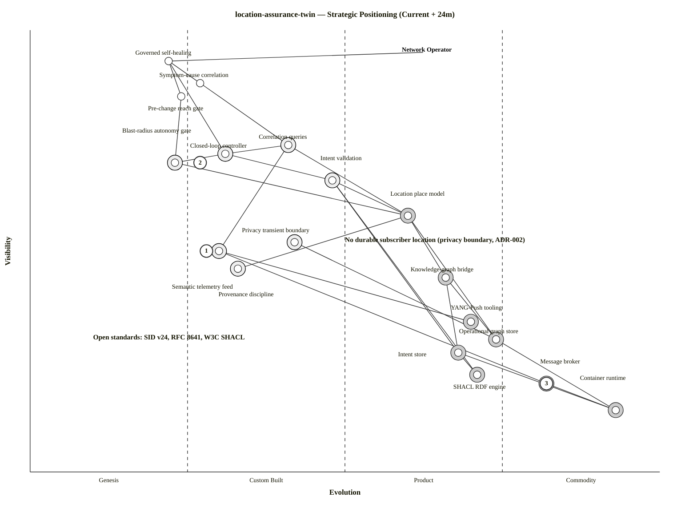

# Wardley Map: location-assurance-twin — Strategic Positioning

> **Template Origin**: Official | **ArcKit Version**: 5.11.0 | **Command**: `/arckit:wardley`

## Document Control

| Field | Value |
|-------|-------|
| **Document ID** | ARC-006-WARD-001-v1.0 |
| **Document Type** | Wardley Map |
| **Project** | location-assurance-twin (Project 006) |
| **Classification** | PUBLIC |
| **Status** | DRAFT |
| **Version** | 1.0 |
| **Created Date** | 2026-06-18 |
| **Last Modified** | 2026-06-18 |
| **Review Date** | 2026-07-18 |
| **Owner** | Roland Pfeifer (Lead Architect, Vpnet Cloud Solutions Sdn. Bhd.) |
| **Reviewed By** | [PENDING] |
| **Approved By** | [PENDING] |
| **Distribution** | Project Team, Architecture Team, Standards/Research Reviewer |

## Revision History

| Version | Date | Author | Changes | Approved By | Approval Date |
|---------|------|--------|---------|-------------|---------------|
| 1.0 | 2026-06-18 | ArcKit AI | Initial creation from `/arckit:wardley`; current + 24-month strategic positioning | [PENDING] | [PENDING] |

> **Strategic question:** Where should Vpnet *build* (differentiate) vs *buy/rent* (commodity) across the location-assurance-twin stack, and what is the principal strategic risk? **Not a UK Government project** — GOV.UK services / Digital Marketplace / G-Cloud routes are **N/A**; "reuse" here means open standards (SID v24, IETF RFCs, W3C SHACL) and open-source products. Governance lens: Vpnet enterprise architecture (`ARC-000-PRIN`) + Malaysia PDPA.

---

## Map Visualization

**View this map**: Paste the code below into [https://create.wardleymaps.ai](https://create.wardleymaps.ai)

```wardley
title location-assurance-twin — Strategic Positioning (Current + 24m)
anchor Network Operator [0.95, 0.63]

component Governed self-healing [0.93, 0.22]
component Symptom-cause correlation [0.88, 0.27]
component Pre-change reach gate [0.85, 0.24]
component Closed-loop controller [0.72, 0.31]
component Blast-radius autonomy gate [0.70, 0.23]
component Correlation queries [0.74, 0.41]
component Intent validation [0.66, 0.48]
component Location place model [0.58, 0.60]
component Privacy transient boundary [0.52, 0.42]
component Semantic telemetry feed [0.50, 0.30]
component Provenance discipline [0.46, 0.33]
component Knowledge-graph bridge [0.44, 0.66]
component YANG-Push tooling [0.34, 0.70]
component Operational graph store [0.30, 0.74]
component Intent store [0.27, 0.68]
component SHACL RDF engine [0.22, 0.71]
component Message broker [0.20, 0.82]
component Container runtime [0.14, 0.93]

Network Operator -> Governed self-healing
Governed self-healing -> Symptom-cause correlation
Governed self-healing -> Pre-change reach gate
Governed self-healing -> Closed-loop controller
Closed-loop controller -> Blast-radius autonomy gate
Closed-loop controller -> Correlation queries
Closed-loop controller -> Intent validation
Symptom-cause correlation -> Correlation queries
Pre-change reach gate -> Blast-radius autonomy gate
Correlation queries -> Location place model
Intent validation -> Location place model
Blast-radius autonomy gate -> Location place model
Correlation queries -> Semantic telemetry feed
Location place model -> Operational graph store
Location place model -> Knowledge-graph bridge
Location place model -> Provenance discipline
Intent validation -> Intent store
Intent validation -> SHACL RDF engine
Privacy transient boundary -> Operational graph store
Knowledge-graph bridge -> Operational graph store
Knowledge-graph bridge -> Intent store
Semantic telemetry feed -> YANG-Push tooling
Semantic telemetry feed -> Message broker
Intent store -> SHACL RDF engine
Operational graph store -> Container runtime
Intent store -> Container runtime
Message broker -> Container runtime

build Closed-loop controller
build Blast-radius autonomy gate
build Correlation queries
build Intent validation
build Semantic telemetry feed
build Provenance discipline
build Privacy transient boundary
buy Location place model
buy Knowledge-graph bridge
buy YANG-Push tooling
buy Operational graph store
buy Intent store
buy SHACL RDF engine
buy Message broker
buy Container runtime

evolve Semantic telemetry feed 0.58 label NMOP message-key draft to RFC
evolve Blast-radius autonomy gate 0.45 label Productise (TMF autonomy levels)
evolve Location place model 0.70 label SID tooling matures

annotation 1 [0.50, 0.28] High-risk: high-visibility capability on an immature NMOP feed draft (R-6)
annotation 2 [0.70, 0.27] Vpnet differentiation (IP) — build
annotation 3 [0.20, 0.82] Commodity — use off-the-shelf
note No durable subscriber location (privacy boundary, ADR-002) [0.52, 0.50]
note Open standards: SID v24, RFC 8641, W3C SHACL [0.30, 0.10]

style wardley
```

<details>
<summary>Mermaid Wardley Map (renders in GitHub, VS Code, and other Mermaid-enabled viewers)</summary>

> **Note**: `wardley-beta` is supported from Mermaid 11.14.0; ArcKit pages use 11.15.0. Generated by the bundled converter from the OWM block above.



**Decorator Guide**: `(build)` Genesis/Custom built in-house · `(buy)` Product/Commodity procured · `(inertia)` resistance to change.

</details>

---

## Component Inventory

### User Needs (high visibility)

| Component | Vis | Evo | Stage | Description | Strategic Notes |
|-----------|-----|-----|-------|-------------|-----------------|
| Governed self-healing | 0.93 | 0.22 | Genesis | The headline outcome: detect→correlate→validate→gate→act→verify | The reason to exist; novel, differentiating (BR-001/BR-003) |
| Symptom-cause correlation | 0.88 | 0.27 | Custom | NOC moves from symptom to causing event | BR-002; deterministic place-join replaces ML guesswork |
| Pre-change reach gate | 0.85 | 0.24 | Genesis | Surface cross-plane consequence before commit | BR-001; the Optus failure-mode answer |

### Supporting Capabilities (mid visibility)

| Component | Vis | Evo | Stage | Description | Strategic Notes |
|-----------|-----|-----|-------|-------------|-----------------|
| Correlation queries | 0.74 | 0.41 | Custom | Q-CORRELATE / Q-SRLG / Q-PROACTIVE / Q-DISPATCH | Build — the deterministic query IP (FR-007..011) |
| Closed-loop controller | 0.72 | 0.31 | Custom | MAPE-K orchestration | Build — bespoke loop (FR-005) |
| Blast-radius autonomy gate | 0.70 | 0.23 | Genesis | Q-BLAST → reach-graded autonomy | Build — core IP; productise toward TMF autonomy levels (FR-009/013) |
| Intent validation | 0.66 | 0.48 | Custom | SHACL invariants (geo-diversity, reachability, provisioning) | Build the *shapes*; buy the engine (FR-012, ADR-003) |
| Location place model | 0.58 | 0.60 | Product | SID GB922 v24.0 Place tree + six joints | Adopt the standard; the *application* is custom (DR-001/002, ADR-003) |
| Privacy transient boundary | 0.52 | 0.42 | Custom | No durable subscriber location; TTL projection | Build — bespoke privacy discipline (ADR-002, DR-004) |
| Semantic telemetry feed | 0.50 | 0.30 | Custom/Genesis | YANG-Push → broker, NMOP message-key | Build on bought tooling; **draft-dependent** (ADR-004, R-6) |
| Provenance discipline | 0.46 | 0.33 | Custom | `[SID v24]`/`[MODEL]` tags to RDF | Build — fidelity/credibility IP (DR-005) |
| Knowledge-graph bridge | 0.44 | 0.66 | Product | Neosemantics (n10s), uni-directional | Buy — mature library (INT-002) |

### Infrastructure (low visibility)

| Component | Vis | Evo | Stage | Description | Strategic Notes |
|-----------|-----|-----|-------|-------------|-----------------|
| YANG-Push tooling | 0.34 | 0.70 | Product | RFC 8639/8641 subscriptions + NETCONF | Buy/adopt the standard tooling |
| Operational graph store | 0.30 | 0.74 | Product | Neo4j 5 LPG | Buy — never build (ADR-001) |
| Intent store | 0.27 | 0.68 | Product | Apache Jena Fuseki (RDF/SHACL) | Buy (ADR-001) |
| SHACL RDF engine | 0.22 | 0.71 | Product | W3C SHACL processor (in Fuseki) | Buy — open standard |
| Message broker | 0.20 | 0.82 | Commodity | Kafka / Redpanda | Buy/rent — commodity |
| Container runtime | 0.14 | 0.93 | Commodity | docker-compose (rig) | Commodity utility |

---

## Strategic Metrics (Differentiation / Commodity-leverage / Dependency-risk)

D(v)=visibility×(1−evolution) · K(v)=(1−visibility)×evolution · thresholds 0.4.

| Component | D (differentiation) | K (commodity leverage) | Signal |
|-----------|---------------------|------------------------|--------|
| Governed self-healing | **0.73** | 0.02 | BUILD (high D) |
| Pre-change reach gate | **0.65** | 0.04 | BUILD |
| Symptom-cause correlation | **0.64** | 0.03 | BUILD |
| Blast-radius autonomy gate | **0.54** | 0.07 | BUILD (the IP) |
| Closed-loop controller | **0.50** | 0.09 | BUILD |
| Correlation queries | **0.44** | 0.11 | BUILD |
| Semantic telemetry feed | 0.35 | 0.15 | Build (custom, on bought tooling) |
| Intent validation | 0.34 | 0.16 | Build shapes / buy engine |
| Provenance discipline | 0.31 | 0.18 | Build (fidelity IP) |
| Privacy transient boundary | 0.30 | 0.20 | Build (bespoke privacy) |
| Location place model | 0.23 | 0.25 | Adopt standard (buy model, custom app) |
| Knowledge-graph bridge | 0.15 | 0.37 | BUY |
| YANG-Push tooling | 0.10 | **0.46** | BUY |
| Intent store | 0.09 | **0.50** | BUY |
| Operational graph store | 0.08 | **0.52** | BUY |
| SHACL RDF engine | 0.06 | **0.55** | BUY |
| Message broker | 0.04 | **0.66** | BUY/RENT |
| Container runtime | 0.01 | **0.80** | COMMODITY |

**Consistency check**: every high-D (> 0.4) component is `build`; every high-K (> 0.4) component is `buy` — no positioning/strategy conflicts. The Custom-stage middle band (Intent validation, Location model, Privacy, Feed, Provenance) is where the judgement lives: build the *application/discipline*, buy the *engine/standard*.

**Dependency Risk** R(a,b)=visibility(a)×(1−evolution(b)):

| Edge | R | Note |
|------|---|------|
| Correlation queries → Semantic telemetry feed | **0.52** | **The one external risk**: a high-visibility capability on the immature NMOP feed draft (R-6) |
| Governed self-healing → Closed-loop controller | 0.64 | Intra-IP (our own early-stage build) — expected, acceptable |
| Closed-loop controller → Blast-radius gate | 0.55 | Intra-IP — expected |
| Correlation queries → Location place model | 0.30 | Medium; SID model maturing |

---

## Build vs Buy Analysis

### Build (Vpnet IP — the differentiator)

| Component | Stage | Rationale |
|-----------|-------|-----------|
| Closed-loop controller, Blast-radius autonomy gate, Correlation queries | Genesis/Custom | The location-anchored closed loop is the only Vpnet IP — the demonstration that *place* deterministically joins detection→impact→blast-radius. High D. |
| Intent validation (SHACL shapes), Provenance discipline | Custom | The intent invariants + standards-fidelity discipline are differentiating and review-defining (SD-2/G-5). |
| Privacy transient boundary | Custom | Bespoke privacy pattern (ADR-002) — competitive/regulatory differentiator. |
| Semantic telemetry feed (application) | Custom | Built on bought YANG-Push tooling; the message-key application is ours. |

### Buy / Adopt (Product — open standards & OSS)

| Component | Stage | Source |
|-----------|-------|--------|
| Location place model | Product | TM Forum SID GB922 v24.0 (adopt the standard, not invent) |
| Knowledge-graph bridge | Product | Neosemantics (n10s) |
| Operational graph store / Intent store | Product | Neo4j 5 / Apache Jena Fuseki (ADR-001) |
| SHACL RDF engine | Product | W3C SHACL processor |
| YANG-Push tooling | Product | RFC 8639/8641 implementations (netopeer2/sysrepo in rig) |

### Rent / Commodity

| Component | Stage | Source |
|-----------|-------|--------|
| Message broker | Commodity | Kafka / Redpanda |
| Container runtime | Commodity | docker / compose (rig); K8s at scale |

**Anti-pattern correctly avoided**: building a custom graph/triple store (high-K → always buy). ADR-001 already chose Neo4j + Fuseki.

---

## Climatic Pattern Analysis

- **Everything evolves**: the **semantic feed** is the fastest mover — NMOP message-key/SIMAP drafts → RFC will push it Genesis→Product over ~24m (de-risks R-6). SID tooling matures (Location model → 0.70). Stores/broker are already commodity (stable).
- **Co-evolution of practice**: *intent-as-SHACL* and *location-anchored assurance* are emerging practices; being early is the opportunity (and the publication thesis, Paper 2/3).
- **Efficiency enables innovation**: commodity stores/broker/runtime free Vpnet to invest only in the loop + gate (the differentiator).
- **Inertia**: RDF/SHACL/SID skills ramp (R-3) and two-store operational complexity (R-1) are the internal inertia points; mitigated by ADR-001's documented rationale and the minimal-OWL scope.

## Applicable Gameplay Patterns

- **Open-source / standards play (accelerator)**: contribute to IETF NMOP (shape the message-key/SIMAP feed standard). This simultaneously **de-risks R-6** (we influence the draft we depend on) and builds ecosystem credibility.
- **Tower & moat**: the closed loop + blast-radius gate is the moat; keep it proprietary-by-effort while riding commodity stores. Don't let it leak into "just another graph query tool."
- **Exploiting inertia**: incumbents lean on ML-correlation guesswork; the deterministic place-join is faster and explainable — exploit their inertia with the SRLG "redundancy-that-isn't" demo.
- **Anti-pattern (avoid)**: *premature productisation* of the autonomy gate before the loop is proven on real gear; and *legacy trap* of bespoke storage (avoided).

## Doctrine Assessment (summary)

| Doctrine | Status | Note |
|----------|--------|------|
| Focus on user need | 🟢 Strong | Operator/NOC need is the anchor (STKE) |
| Use a common language | 🟢 Strong | This map + the ArcKit pack |
| Use appropriate methods (build/buy) | 🟢 Strong | Build IP, buy commodity (this analysis, ADR-001) |
| Challenge assumptions | 🟢 Strong | DTDL → SID v24 correction (ADR-003) |
| Know your users | 🟡 Improving | STKE retro-fitted; validate with named stakeholders |
| Measure / manage inertia | 🟡 Weak (build-phase) | No telemetry yet; RDF/SHACL skills ramp open (R-3) |

---

## Movement and Evolution Predictions

| Component | Current | 12m | 24m | Velocity | Implication |
|-----------|---------|-----|-----|----------|-------------|
| Semantic telemetry feed | 0.30 | 0.45 | 0.58 | Fast | NMOP draft → RFC; re-pin behind feed adapter (R-6 shrinks) |
| Blast-radius autonomy gate | 0.23 | 0.35 | 0.45 | Medium | Productise toward TMF autonomy levels; keep as moat |
| Location place model | 0.60 | 0.66 | 0.70 | Medium | SID tooling matures; promote `[MODEL]` edges (R-2) |
| Stores / broker / runtime | 0.68–0.93 | — | — | Slow | Already commodity; no action |

---

## UK Government Context

**Not applicable.** This is a commercial/open (Apache-2.0) project under Vpnet enterprise architecture + Malaysia PDPA — not a UK Government service. GOV.UK services, Digital Marketplace (G-Cloud/DOS), and TCoP routing do **not** apply. The equivalent "reuse" lever here is **open standards + open-source**: SID GB922 v24.0, IETF RFC 8639/8641 (+ NMOP drafts), W3C RDF/SHACL, Neo4j/Fuseki/n10s/Redpanda — all already adopted (buy/adopt column).

---

## Risk Analysis

| Risk | Component(s) | Likelihood | Impact | Mitigation |
|------|--------------|------------|--------|------------|
| Immature feed dependency (R-6) | Semantic telemetry feed (high-vis capability depends on it, R=0.52) | M | M | Pin NMOP draft revisions; isolate behind feed adapter; contribute to NMOP (standards play) — ADR-004 |
| Standards-credibility (R-2) | Location place model / Provenance | H | M | Promote `[MODEL]` → named v24 relationships before publication — ADR-003 |
| Skills/operational inertia (R-1/R-3) | Two stores + RDF/SHACL | M | L | ADR-001 rationale + single-store fallback; minimal OWL scope |
| Privacy leakage (R-7) | Privacy transient boundary | L (after controls) | H | Schema+code enforcement; store-inspection test — ADR-002 |

**Opportunities**: lead the NMOP feed-standard conversation (turn a dependency into influence); the deterministic place-join is a demonstrable cost/explainability win over ML-correlation incumbents.

---

## Traceability

| Requirement | Components | Stage | Build/Buy |
|-------------|-----------|-------|-----------|
| BR-001/BR-003 | Governed self-healing, Pre-change reach gate, Blast-radius autonomy gate | Genesis/Custom | Build |
| BR-002 | Symptom-cause correlation, Correlation queries | Custom | Build |
| FR-012 / DR-001/002 | Intent validation, Location place model | Custom/Product | Build shapes / adopt SID |
| BR-006 / DR-004 / NFR-C-001 | Privacy transient boundary | Custom | Build (ADR-002) |
| FR-001 / INT-001 / NFR-S-001 | Semantic telemetry feed, YANG-Push tooling, Message broker | Custom→Commodity | Build app / buy tooling (ADR-004) |
| NFR-D-001 / DR-003 | Operational graph store, Intent store, Knowledge-graph bridge | Product | Buy (ADR-001) |

**Principle alignment**: PRIN 1 (Scalability — broker), PRIN 3 (Standards — SID/RFC/SHACL adopt), PRIN 6 (Data Sovereignty — privacy boundary), PRIN 8 (SSoT — mastership split), PRIN 10 (Loose Coupling — uni-directional bridge), PRIN 14 (Maintainability — buy commodity).

---

## Recommendations

### Immediate (0–3 months)

1. **Protect the moat** — keep the closed-loop controller + blast-radius gate + correlation queries in-house; they are the only differentiating IP (D > 0.4). Owner: Lead Architect.
2. **De-risk the feed dependency** — pin NMOP draft revisions and isolate the message-key scheme behind the feed adapter (R-6, ADR-004). Owner: L0 Feed Owner.

### Short-term (3–12 months)

3. **Promote `[MODEL]` edges** to named SID v24 relationships before any publication (R-2, ADR-003). Owner: Standards Reviewer.
4. **Standards play** — engage IETF NMOP on the message-key/SIMAP drafts to influence the standard the feed depends on. Owner: L0 Feed Owner / Lead Architect.

### Long-term (12–24 months)

5. **Productise the autonomy gate** toward recognised TMF autonomy levels — without commoditising it away (keep the moat). Owner: Assurance Architect.
6. **Re-validate on real gear** as the feed and SID tooling mature; revisit the two-store decision only if a single engine reaches parity (ADR-001 trigger). Owner: Lead Architect.

---

## External References

### Document Register

| Doc ID | Filename | Type | Source Location | Description |
|--------|----------|------|-----------------|-------------|
| REQ006 | ARC-006-REQ-v1.0.md | Requirements | 006-location-assurance-twin/ | BR/FR/NFR/DR positioning |
| STKE006 | ARC-006-STKE-v1.0.md | Stakeholder Analysis | 006-location-assurance-twin/ | Drivers/goals behind differentiation |
| DATA006 | ARC-006-DATA-v1.0.md | Data Model | 006-location-assurance-twin/ | Store components (Neo4j/Fuseki) |
| ADR006 | ARC-006-ADR-001..004 | ADR | 006-location-assurance-twin/decisions/ | Two-store, privacy, GB922, feed |
| RISK006 | ARC-006-RISK-v1.0.md | Risk Register | 006-location-assurance-twin/ | R-1/R-2/R-3/R-6/R-7 |
| LATH | location_assurance_twin_HLD.md | High-Level Design | 006-location-assurance-twin/external/ | Component source |

### Citations

| Citation ID | Doc ID | Page/Section | Category | Quoted Passage |
|-------------|--------|--------------|----------|----------------|
| LATH-C1 | LATH | §3.1 | Design Decision | "Model / Intent Graph | Apache Jena Fuseki + SHACL … Operational Knowledge Graph | Neo4j 5 (LPG)" |
| LATH-C2 | LATH | §3.2 L0 / D9 | Design Decision | "semantic YANG-Push → broker, addressable (NMOP message-key) … observability is the upstream precondition" |
| LATH-C3 | LATH | §12 R6 | Risk Factor | "Feed draft is work-in-progress | message-key/SIMAP drafts may change; pin draft revisions" |

### Unreferenced Documents

| Filename | Source Location | Reason |
|----------|-----------------|--------|
| location_twin_v24.cypher | 006-location-assurance-twin/external/ | Modelled in DATA; not a positioning source |
| LOCATION_RESOURCE_SERVICE_PART_INTERACTION.pdf | 006-location-assurance-twin/external/ | Reference graphic |
| tmf_pyramid_digital_twin.svg | 006-location-assurance-twin/external/ | Positioning graphic |

---

**Generated by**: ArcKit `/arckit:wardley` command
**Generated on**: 2026-06-18
**ArcKit Version**: 5.11.0
**Project**: location-assurance-twin (Project 006)
**Model**: Claude Opus 4.8 (1M context)
**Generation Context**: Built from ARC-006 REQ/STKE/DATA/ADR-001..004/RISK + HLD v0.1. OWM → Mermaid via the bundled converter. Non-UK-Gov (open/Malaysia) — GOV.UK/G-Cloud N/A.
